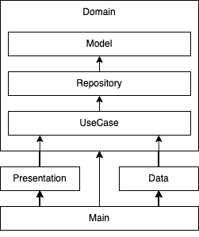
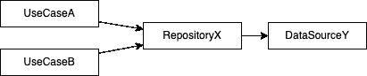
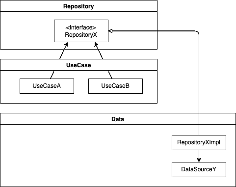
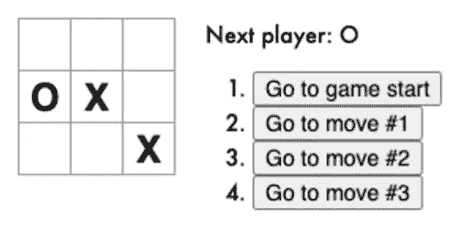
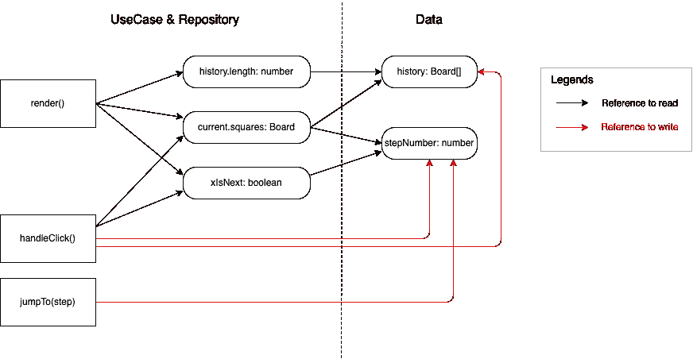
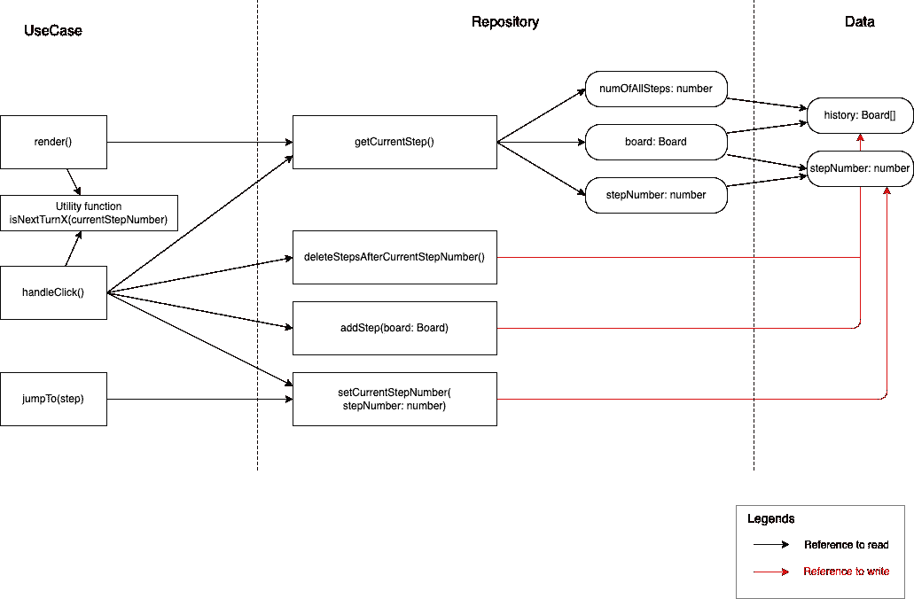
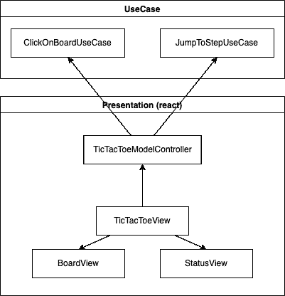
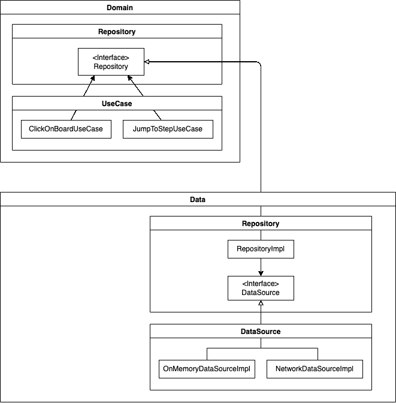
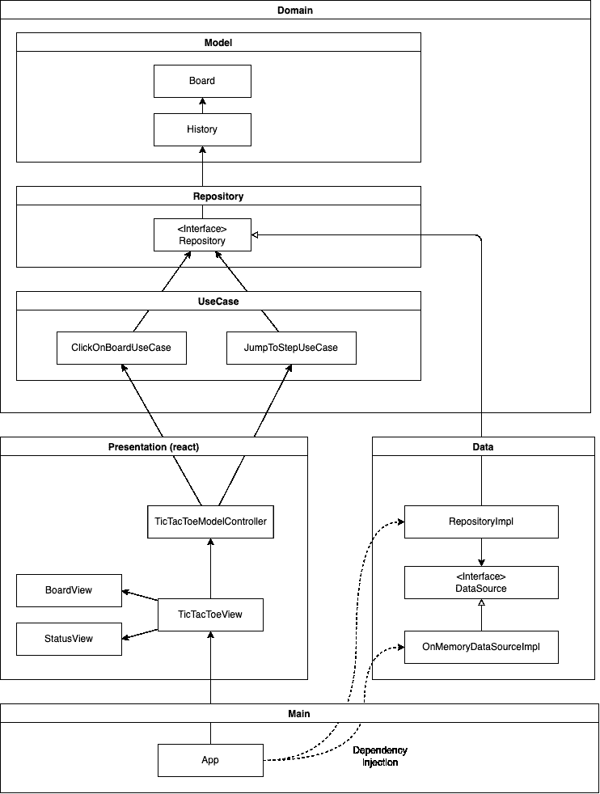

# 使用 React 清洁架构

> 原文：<https://betterprogramming.pub/clean-architecture-with-react-cc097a08b105>

## 干净的架构使您的应用程序易于维护和扩展。但是我们的代码往往会受到各种框架驱动的编码风格的影响。在本文中，我想展示如何将基于 react 的代码转换(转化)成干净的架构。


[i̇ltun·胡塞恩利](https://unsplash.com/@therealslimshadyiltun?utm_source=medium&utm_medium=referral)在 [Unsplash](https://unsplash.com?utm_source=medium&utm_medium=referral) 上的照片

[干净的架构](https://blog.cleancoder.com/uncle-bob/2012/08/13/the-clean-architecture.html)定义了垂直堆叠的几层，每一层代表软件的不同领域。上层代表应用程序的基本策略，而下层代表机制。



使这个架构工作的首要规则是*依赖规则*。这条规则说*源代码依赖*只能指向上。有了层和依赖规则，您可以设计耦合性非常低的应用程序，并且独立于技术实现细节，例如数据库和框架。

我使用了本文中[定义的层，定义如下:](https://paulallies.medium.com/clean-architecture-typescript-and-react-8e509098abfe)

**域**层描述了您的项目或应用程序做什么。领域层的代码应该独立于平台和框架。

*   **模型**代表与问题相关的现实世界对象。
*   **储存库**提供访问模型的接口。
*   **用例**包括应用程序的所有业务逻辑。

**表示层**描述了你的应用程序如何与外界交互。

数据层描述了你的应用如何管理数据。

主层(最底层)提供引导代码，负责将其他层中的所有软件组件编织成一个应用程序。

但是在实际应用中，控制流并不总是向上的。比如`UseCase`层的业务逻辑使用了存储库层的一个接口，存储库(上层)需要访问数据层(下层)管理的数据。见下图。



为了解决这种违反依赖规则的情况，我们通常使用[依赖倒置原则。](https://en.wikipedia.org/wiki/Dependency_inversion_principle)我们安排接口(例如 RepositoryX)和它的实现(例如`RepositoryImpl`)之间的关系，使得源代码依赖指向上。使用这种技术，上层可以调用下层定义的实现。



# 将 React 应用程序转变为干净的架构

当您从 react 应用程序的模板中启动您的应用程序代码时(例如由 [create-react-app](https://create-react-app.dev/) 创建的框架)，所有代码首先都包含在表示层中。这是因为 react(以及所有 UI 框架)关注的是如何向用户呈现数据。在本节中，我们将转换基于 react 的应用程序代码，并使其符合干净的架构。

下面是[官方 react 教程](https://reactjs.org/tutorial/tutorial.html)中使用的 TicTacToe 的原代码。

```
function Square(props) {
  return (
    <button className="square" onClick={props.onClick}>
      {props.value}
    </button>
  );
}

class Board extends React.Component {
  renderSquare(i) {
    return (
      <Square
        value={this.props.squares[i]}
        onClick={() => this.props.onClick(i)}
      />
    );
  }

  render() {
    return (
      <div>
        <div className="board-row">
          {this.renderSquare(0)}
          {this.renderSquare(1)}
          {this.renderSquare(2)}
        </div>
        <div className="board-row">
          {this.renderSquare(3)}
          {this.renderSquare(4)}
          {this.renderSquare(5)}
        </div>
        <div className="board-row">
          {this.renderSquare(6)}
          {this.renderSquare(7)}
          {this.renderSquare(8)}
        </div>
      </div>
    );
  }
}

class Game extends React.Component {
  constructor(props) {
    super(props);
    this.state = {
      history: [
        {
          squares: Array(9).fill(null)
        }
      ],
      stepNumber: 0,
      xIsNext: true
    };
  }

  handleClick(i) {
    const history = this.state.history.slice(0, this.state.stepNumber + 1);
    const current = history[history.length - 1];
    const squares = current.squares.slice();
    if (calculateWinner(squares) || squares[i]) {
      return;
    }
    squares[i] = this.state.xIsNext ? "X" : "O";
    this.setState({
      history: history.concat([
        {
          squares: squares
        }
      ]),
      stepNumber: history.length,
      xIsNext: !this.state.xIsNext
    });
  }

  jumpTo(step) {
    this.setState({
      stepNumber: step,
      xIsNext: (step % 2) === 0
    });
  }

  render() {
    const history = this.state.history;
    const current = history[this.state.stepNumber];
    const winner = calculateWinner(current.squares);

    const moves = history.map((step, move) => {
      const desc = move ?
        'Go to move #' + move :
        'Go to game start';
      return (
        <li key={move}>
          <button onClick={() => this.jumpTo(move)}>{desc}</button>
        </li>
      );
    });

    let status;
    if (winner) {
      status = "Winner: " + winner;
    } else {
      status = "Next player: " + (this.state.xIsNext ? "X" : "O");
    }

    return (
      <div className="game">
        <div className="game-board">
          <Board
            squares={current.squares}
            onClick={i => this.handleClick(i)}
          />
        </div>
        <div className="game-info">
          <div>{status}</div>
          <ol>{moves}</ol>
        </div>
      </div>
    );
  }
}

// ========================================

const root = ReactDOM.createRoot(document.getElementById("root"));
root.render(<Game />);

function calculateWinner(squares) {
  const lines = [
    [0, 1, 2],
    [3, 4, 5],
    [6, 7, 8],
    [0, 3, 6],
    [1, 4, 7],
    [2, 5, 8],
    [0, 4, 8],
    [2, 4, 6]
  ];
  for (let i = 0; i < lines.length; i++) {
    const [a, b, c] = lines[i];
    if (squares[a] && squares[a] === squares[b] && squares[a] === squares[c]) {
      return squares[a];
    }
  }
  return null;
}
```

而这里是 TicTacToe 的截图。



# 设计模型层

首先，让我们在模型层提取数据模型。根据定义，这里定义的模型应该是平台无关的和框架无关的，并且它们应该完全专注于业务规则。

即使原始代码没有明确的类型定义，您也应该明确定义那些类型，以利用 TypeScript 的类型推理机制，并让它在开发时支持您。

```
export type Square = null | "X" | "O";

export type Board = Square[];

type HistoryStep = {
  board: Board;
};

export type History = HistoryStep[];
```

# 设计用例层和存储库层

下一步是提取用例。一个用例可以被形式化为“当 X 发生时，做 Y”。

在 React 应用程序中，用例通常实现为(1)React 框架调用的渲染功能，(2)用户输入的事件处理程序，或(3)自主效果。在`TicTacToe`的例子中，我们有三个用例。

*   `render()`:当有数据更新时，调用该函数。
*   `handleClick(i)`:当你按下棋盘上的一个方块时，这个功能被调用。
*   `jumpTo(step)`:当您按下“Go to move #x”按钮时，此功能被调用。

但是您注意到最初的用例功能(`render()`、`handleClick()`、`jumpTo()`)包括来自多个层的代码(用例、存储库、数据、表示(react))。我们需要以某种方式解开这个意大利面条，并将代码分配到适当的层。

我通常通过分析变量之间的依赖关系来开始这种理清。然后，我找到了无法从任何其他变量推导出的原始数据来源。在`TicTacToe`示例中，您可以很容易地检测到两个数据源`history`和`stepNumber`，如下图所示。那些原始数据需要存储在持久数据存储中，我们把它们放在数据层。



设计`UseCase`层和`Repository`层之间的边界是主观的，部分取决于你。存储库层被定义为保存所有特定于模型的操作的中心位置。除此之外，我有自己的策略来定义存储层中的操作，如下所示:

*   存储库操作应该最小化。公开主数据源的所有原始 setter/getter 函数并不是一个好主意，因为这很容易导致无效/不一致的数据。
*   存储库操作应该是中立的，并且独立于`UseCase`层中定义的业务逻辑。
*   每个存储库操作应该只在需要一次改变多个数据源时才访问它们(作为原子操作),以保持数据源之间的一致性。

基于这个策略，我将`UseCase`层和`Repository`层解耦如下:



我们来定义一下`Repository`接口。实现在后面。

```
export type Step = {
  board: Board;
  stepNumber: number;
  numOfAllSteps: number;
};

/**
 * Repository managing the history of TicTacToe steps.
 * Each step consists of a board.
 */
export interface Repository {
  getCurrentStep(): Promise<Step>;
  setCurrentStepNumber(stepNumber: number): Promise<void>;
  deleteStepsAfterCurrentStepNumber(): Promise<void>;
  addStep(board: Board): Promise<void>;
}
```

然后你可以定义`UseCase`函数。现在你可以更清楚地理解业务逻辑了。

```
export async function clickOnBoard(
  indexOnBoard: number,
  repository: Repository
) {
  const { board, stepNumber } = await repository.getCurrentStep();
  const newBoard = board.slice();
  if (calculateWinnerOnBoard(newBoard) || newBoard[indexOnBoard]) {
    return;
  }
  newBoard[indexOnBoard] = isNextTurnX(stepNumber) ? "X" : "O";
  await repository.deleteStepsAfterCurrentStepNumber();
  await repository.addStep(newBoard);
  await repository.setCurrentStepNumber(stepNumber + 1);
}

export async function jumpToStep(
  stepNumber: number,
  repository: Repository
): Promise<void> {
  return repository.setCurrentStepNumber(stepNumber);
}
```

# 设计表示层

在表示层，最重要的提示是形成 [MVC(模型-视图-控制器)](https://en.wikipedia.org/wiki/Model%E2%80%93view%E2%80%93controller)。在 react 应用程序中，我们通常将“模型”和“控制器”合并在一个对象中，作为表示层和用例层之间的桥梁。

参见下图中的`TicTacToeModelController`。React 组件在 MVC 中作为“视图”工作，用自定义钩子引用“模型-控制器”。这样，我们可以将纯渲染代码(“视图”)与任何数据处理代码(“模型”和“控制器”)解耦。



这里是`TicTacToeModelController`的代码。

```
export function useTicTacToeModelController(repository: Repository) {
  const [currentStep, setCurrentStep] = useState<Step | null>(null);

  useEffect(() => {
    async function init() {
      const initialStep = await repository.getCurrentStep();
      setCurrentStep(initialStep);
    }
    init();
  }, []);

  const handleClickOnBoard = async (indexOnBoard: number) => {
    await clickOnBoard(indexOnBoard, repository);
    const newStep = await repository.getCurrentStep();
    setCurrentStep(newStep);
  };

  const handleJumpToStep = async (stepNumber: number) => {
    await jumpToStep(stepNumber, repository);
    const newStep = await repository.getCurrentStep();
    setCurrentStep(newStep);
  };

  return {
    currentStep,
    handleClickOnBoard,
    handleJumpToStep,
  };
}
```

而这里是`TicTacToeView`。

```
type TicTacToeViewProps = {
  repository: Repository;
};

export function TicTacToeView({ repository }: TicTacToeViewProps) {
  const { currentStep, handleClickOnBoard, handleJumpToStep } =
    useTicTacToeModelController(repository);

  if (!currentStep) {
    return null;
  }

  const winner = calculateWinnerOnBoard(currentStep.board);
  const xIsNext = isNextTurnX(currentStep.stepNumber);
  return (
    <div className="game">
      <div className="game-board">
        <BoardView board={currentStep.board} onClick={handleClickOnBoard} />
      </div>
      <div className="game-info">
        <StatusView winner={winner} xIsNext={xIsNext} />
        <JumpToStepButtons
          numOfAllSteps={currentStep.numOfAllSteps}
          onClick={handleJumpToStep}
        />
      </div>
    </div>
  );
}
```

# 设计数据层

数据层有两个子层。`Data:Repository`层是实现`Domain:Repository`层中定义的行为的层。`Data:DataSource`层实现实际的数据存储，如内存存储或网络存储。

如下图所示，我们在`Domain:Repository`层(上层)和`Data:Repository`层(下层)之间应用了依赖反转原理。控制流是向下的(例如，域使用数据)，而源代码依赖是向上的。



这里是`RepositoryImpl`:

```
export class RepositoryImpl implements Repository {
  dataSource: DataSource;

  constructor(dataSource: DataSource) {
    this.dataSource = dataSource;
  }

  async getCurrentStep(): Promise<Step> {
    const [history, stepNumber] = await Promise.all([
      this.dataSource.getHistory(),
      this.dataSource.getStepNumber(),
    ]);
    const board = history[stepNumber].board;
    const numOfAllSteps = history.length;

    return { board, stepNumber, numOfAllSteps };
  }

  async setCurrentStepNumber(stepNumber: number): Promise<void> {
    const history = await this.dataSource.getHistory();
    if (stepNumber < history.length) {
      await this.dataSource.setStepNumber(stepNumber);
    } else {
      throw Error(
        `Step number ${stepNumber} should be smaller than the history size (${history.length})`
      );
    }
  }

  async deleteStepsAfterCurrentStepNumber(): Promise<void> {
    const [history, stepNumber] = await Promise.all([
      this.dataSource.getHistory(),
      this.dataSource.getStepNumber(),
    ]);
    const trimmedHistory = history.slice(0, stepNumber + 1);
    await this.dataSource.setHistory(trimmedHistory);
  }

  async addStep(board: Board): Promise<void> {
    const history = await this.dataSource.getHistory();
    history.push({ board });
    await this.dataSource.setHistory(history);
  }
}
```

# 设计主层

最后，我们在主层的引导代码中将几层中的所有组件编织成一个应用程序。

在这段引导代码中，我们创建了一个存储库实现，并将其传递给`TicTacToeView`。然后仓库通过`TicTacToeModelController`传递到`UseCase`层。

```
// Dependency injection
const dataSource = new OnMemoryDataSourceImpl();
const repository = new RepositoryImpl(dataSource);

export function App() {
  return <TicTacToeView repository={repository} />;
}
```

这是一种叫做[依赖注入(DI)](https://en.wikipedia.org/wiki/Dependency_injection) 的技术。如下图所示，`UseCase`层使用(依赖于)`Repository`层，但是`UseCase`层中的代码不应该在`Repository`层中创建依赖于下层(数据层)的实际对象。

通过将对象创建(在`Main`层)和对象使用(在`UseCase`层)解耦，我们可以避免违反依赖规则(所有引用箭头都应该向上:下层到上层)。



就是这样！你可以在这里看到最终的源代码。

# 结论

我展示了如何将您的 react 应用程序代码转换成干净的架构。一旦你熟悉了干净的架构，你就可以从一开始就设计出符合干净架构的代码。但是即使在这种情况下，我希望本文描述的设计过程能够为您的重构提供良好的指导。