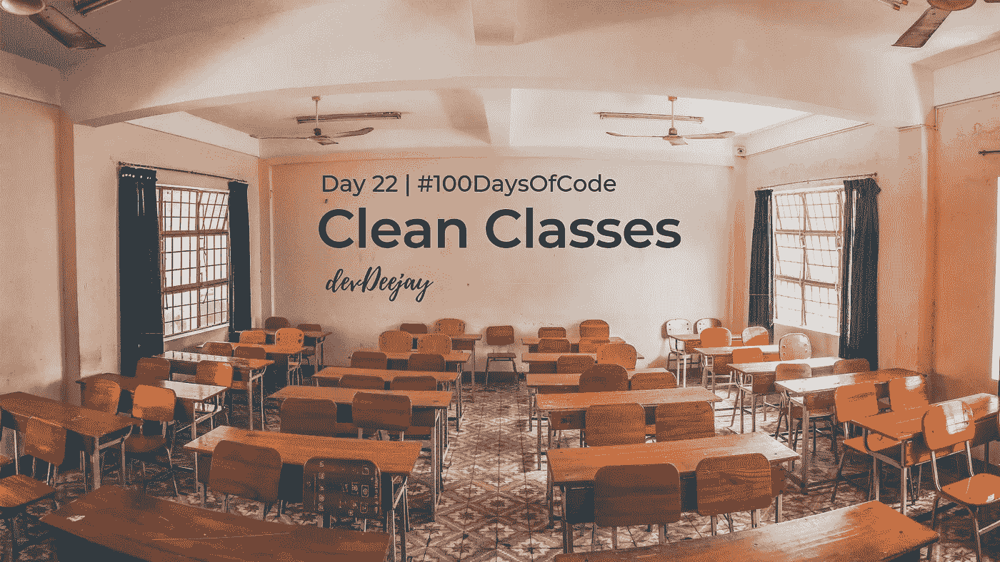

# 干净的班级

> 原文：<https://betterprogramming.pub/clean-classes-43b46da37f39>

## # 100 日代码的第 22 天

## 应该和哎呀一起教的东西



Clean Code 系列进展非常顺利！我们已经了解了如何编写代码行和代码块，如何编写函数，以及如何实现模块化。

所有这些代码块组合在一起形成了更高级别的代码组织，我们称之为**类**。

```
// Structuring a Standard Java Classpublic class ClassName {

  // Static constants // Static variables // Private constants // Private instance variables // Public functions() // Private utilities functions()}
```

我们希望尽可能保持我们的功能“私密”，但是*并不意味着每次都这样！我们有时希望我们的功能可以通过测试来访问。我们使用这些访问修饰符来实现封装。为了让测试可以访问你的函数而放弃封装应该是最后的选择。*

## **写作课的两条规则**

1.班级要小
2。班级应该比那个小！

在编写类时，较小是主要的规则，而在函数中，我们追求“多小？”

我们通过 ***行数*** 来衡量功能，而我们通过 ***职责数*** 来衡量 ***类*** 。

我们还应该能够用 25 个字左右的篇幅写一篇关于这门课的简短描述，不要使用“如果”“但是”之类的词语。

让我们看一个例子:

```
public class GodClass extends JFrame implements MetaDataUser{

    public Component getLastFocusedComponent()

    public void setLastFocused(Component lastFocused)

    public int getMajorVersionNumber()

    public int getMinorVersionNumber()

    public int getBuildNumber()}
```

这个班级看起来很小，但是有不同的职责:管理焦点和获得构建号。

## **还记得 SRP——单一责任原则吗？**

类或模块应该只有一个责任——一个改变的理由。SRP 是面向对象设计中比较重要的概念之一。这也是理解和坚持的更简单的概念之一。

然而奇怪的是，SRP 经常是最被滥用的类设计原则，因为*让软件工作和让软件干净是两个非常不同的活动。*

不管怎样，让我们把这个类分成两个独立的类:

```
public class Version {

    public int getMajorVersionNumber()

    public int getMinorVersionNumber()

    public int getBuildNumber()}
```

另一个…

```
public class FocusedComponent {public Component getLastFocusedComponent()public void setLastFocused(Component lastFocused)

}
```

那里！看起来又干净又小巧！

问题在于，当程序运行时，我们中有太多的人认为我们已经完成了。我们没有转移到另一个关注点:组织和清洁。

我们继续处理下一个问题，而不是回到过去，把过多的类分解成具有单一职责的独立单元。

***你想把你的工具整理到有很多小抽屉的工具箱里，每个抽屉里都装着定义明确、标签明确的组件吗？还是想要几个抽屉，把所有东西都放进去？***

# 内聚力


我们的类中会有实例变量，也会有函数来操作这些实例变量。一个方法处理的变量越多，这个方法对类的凝聚力就越强。

一个每个实例变量都被每个方法操作的类是*最大内聚的。*因此，内聚性只是变量和方法在逻辑上相互关联程度的一种度量。

当内聚性很高时，意味着类的方法和变量是相互依赖的，并且作为一个逻辑整体挂在一起。

*衔接越好，程序设计越好。*

```
public class Stack {

    private int topOfStack = 0; List<Integer> elements = new LinkedList<Integer>();

    public int size() { 
        return topOfStack;
    }

    public void push(int element) { 
        topOfStack++; 
        elements.add(element);
    }

    public int pop() throws PoppedWhenEmpty { if (topOfStack == 0)
        throw new PoppedWhenEmpty();
        int element = elements.get(--topOfStack); 
        elements.remove(topOfStack);
        return element;
    }}
```

在这个例子中，`push()`和`pop()`都在变异两个实例变量元素和`topOfStack`。因此它很有凝聚力。

保持内聚性需要将你的类分成许多更小的原子类。每当班级失去凝聚力时，那就是你分裂他们的暗示。

衔接有多种类型。

*   **伴随内聚**——无计划的、随机的，这是代码模块化的结果。因为它是无计划的，所以它是不可接受的，因为它会让程序员感到困惑。
*   **逻辑衔接** —当你在一个模块中计划和放置逻辑相关的语句和指令。
*   **过程内聚** —当一个模块的元素被放在一起执行一个任务时。
*   **通信内聚** —当元素被分组在一起时，这些元素被顺序执行并对相同的数据进行操作。
*   **时态衔接** —当元素被构造成在相似的时间点被处理时，它被称为时态衔接。
*   **顺序衔接**——当一个元素的输出作为下一个元素的输入，它们被组织在一起，这被称为顺序衔接。
*   **功能内聚**——当元素有助于形成一个单一的明确定义的功能。

有兴趣了解更多关于干净代码的知识吗？请务必查看之前撰写的关于干净代码的文章。

[](https://medium.com/swlh/what-is-clean-code-463d25fa6e0b) [## 什么是干净代码？

### 编程课上没人教的东西

medium.com](https://medium.com/swlh/what-is-clean-code-463d25fa6e0b) [](https://medium.com/@devDeeJay/clean-code-give-meaning-to-your-code-to-exist-f966b3f00848) [## 表达清晰的代码

### 用美丽的节目讲美丽的故事

medium.com](https://medium.com/@devDeeJay/clean-code-give-meaning-to-your-code-to-exist-f966b3f00848) [](https://medium.com/@devDeeJay/dont-comment-your-code-rewrite-it-a145d655f87b) [## 不要评论你的代码，重写它！

### 不要花时间写注释，花时间清理你的代码

medium.com](https://medium.com/@devDeeJay/dont-comment-your-code-rewrite-it-a145d655f87b) [](https://medium.com/@devDeeJay/writing-clean-code-to-avoid-pain-3217f89d81c6) [## 编写干净的代码以避免痛苦

### 如何格式化你的代码和处理错误？

medium.com](https://medium.com/@devDeeJay/writing-clean-code-to-avoid-pain-3217f89d81c6) [](https://medium.com/@devDeeJay/tests-are-your-silver-bullet-for-clean-production-code-60f339183713) [## 测试是你清洁生产代码的银弹

### TDD 很酷，但是要知道如何专业地编写测试用例

medium.com](https://medium.com/@devDeeJay/tests-are-your-silver-bullet-for-clean-production-code-60f339183713) 

***那是#100DaysOfCode*** 的第 22 天

***记住，如果你想让这次学习物有所值:***

*   勇往直前，运用你的知识，做点好事吧！
*   ***把这个教给别人，然后再去学这个！***
*   ***把这篇文章分享给一个你认为应该学习更多干净代码的朋友***

*感谢您的阅读，您一如既往地令人敬畏！*