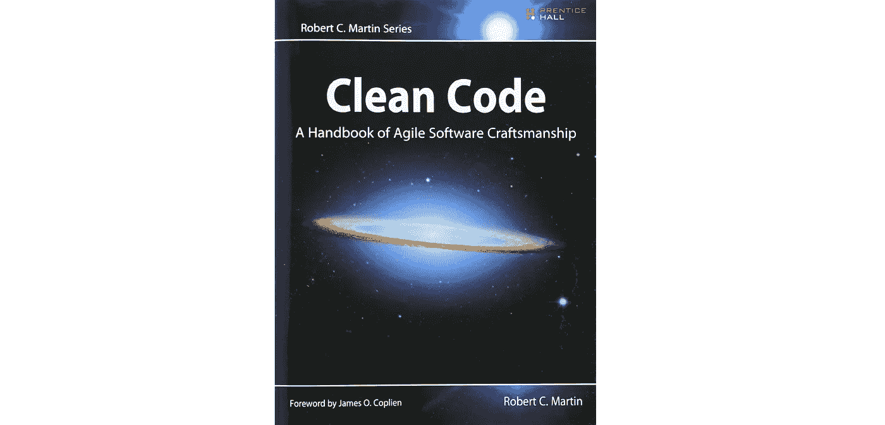
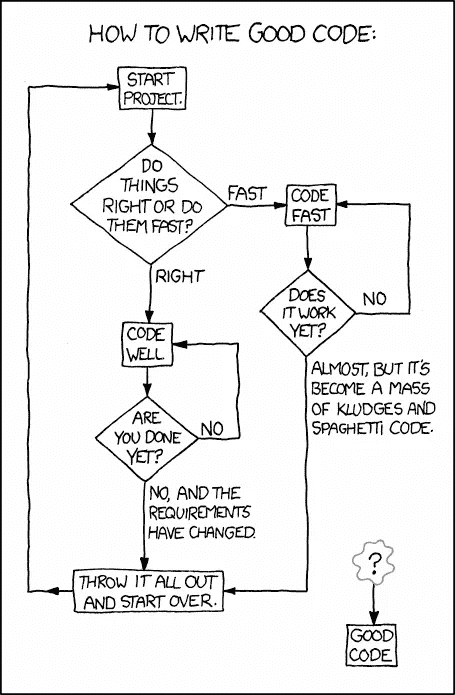
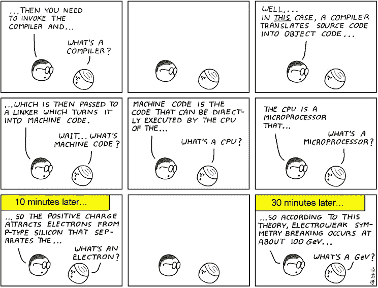

# 干净的代码:5 个基本要点

> 原文：<https://betterprogramming.pub/clean-code-5-essential-takeaways-2a0b17ccd05c>

## 程序员必读书籍的要点



我最近写了关于“ [5 本改变了我编码方式](https://medium.com/better-programming/5-books-that-changed-the-way-i-code-73caffec6f0b)的书。”在评论中，几位读者推荐了罗伯特·c·马丁的《干净的代码》。因此，我现在读了这本书，发现它值得深入研究。

# 关于这本书

《干净的代码》于 2008 年出版，最近几年，它一直是 T2 最畅销的五本书之一。这位被亲切地称为“鲍勃叔叔”的作者是[敏捷宣言](https://agilemanifesto.org)的原始作者之一，并且有一些严肃的资历。这本书在 Goodreads 上的平均评分为 4.4 分，超过 13，000 分。可以说，这是每个程序员都应该读的书之一。

在这篇评论中，我将把这本书浓缩成五个要点。

# 1.编程是一门手艺

我经常认为架构和构造不是编程的好比喻。我们不会创建一个完整的设计，然后从头开始构建基础，稳步推进到完成的建筑。

相反，我们从草图开始，反复添加细节。我们修改、提炼和扩展——在不同的抽象层次上工作，直到软件达到我们的要求。软件永远不会真正完成。

这是“干净代码”的精髓在整本书中，作者传达了软件是一门艺术并且“很像绘画”的思想本质上，他认为编程是一门*手艺。*



[xkcd](https://xkcd.com/844/) 的“好代码”

但是我们如何从简单地写代码发展到制作代码呢？

根据 Martin 的说法，我们拥有的主要工具是持续重构和测试驱动开发(TDD)。这些就像一枚硬币的两面一样一起工作。以下是一些定义:

*重构* 是在不改变现有计算机代码外部行为的情况下，对其进行重构的过程。

*测试驱动开发*是将需求转化为具体测试用例，然后添加代码以通过测试的过程。

因此，制作软件的过程可能看起来像这样:

1.  编写失败的测试，验证所需但未实现的行为。
2.  写一些(可能是坏的)代码，使这些测试通过。
3.  增量地重构代码，随着测试的继续通过，每一次开发迭代都变得更加清晰。

> “我们可以一次就把系统做好，这是一个神话。”相反，我们应该只实现今天的故事，然后重构和扩展系统以实现明天的新故事。这是迭代和增量敏捷的本质。"
> 
> 罗伯特·马丁

因此，Martin 提出的一个中心思想是，干净的代码是通过开发的过程和实践出现的，而不是简单地在一遍中创建的。

# 2.保持简短！

> “函数的第一条规则是它们应该很小。函数的第二个规则是它们应该比那个小。”罗伯特·马丁

根据马丁的说法，这意味着两件事:

*   函数体应该很短——很少超过 20 行，大多数少于 10 行
*   函数应该采用尽可能少的参数，最好是没有参数

函数简洁使得代码更容易阅读。它还将我们引向一种情况，即函数只做一件事，而且做得很好。

关于阶级，他提出了类似的观点。对于类，他建议用职责而不是代码行来衡量大小。这个想法是一个类应该只负责一件事。这就是所谓的[单一责任原则](https://en.wikipedia.org/wiki/Single_responsibility_principle) (SRP)。

保持实体简短是使代码更干净的分治策略。如果我们有一个包含大量冗长复杂代码的大文件，我们可以将文件分成模块，将模块分成功能，将功能分成子功能，直到逻辑和意图清晰为止。

# 3.使代码自文档化

> “注释很少的清晰而富有表现力的代码远远优于注释很多的混乱而复杂的代码。”罗伯特·马丁

在关于注释、有意义的名称和格式的章节中，Martin 为代码自文档化提供了一个强有力的例子。这方面的一个例子如下:

```
// Check to see if the employee is eligible for full benefits
if ((employee.flags & HOURLY_FLAG) &&
    (employee.age > 65))
```

这被重构为:

```
if (employee.isEligibleForFullBenefits())
```

**注:**

*   该注释被删除
*   条件逻辑被封装到一个方法中
*   因为使用的是方法而不是独立的函数，所以可以使用实例变量，从而创建一个零参数的方法调用
*   该方法被赋予了一个描述性的名称，使得它的职责非常清楚

“干净代码”包括一整章关于命名的内容，本质上是对 Tim Ottinger 的规则的阐述。其中包括:

*   使用透露意图的名字——例如`int elapsedTimeInDays`，而不是`int days`
*   使用容易发音的名字，例如`Customer`，而不是`DtaRcrd102`
*   避免编码——不要对成员使用前缀`m_`,不要使用匈牙利符号
*   为每个概念选择一个词——不要用`fetch`、`retrieve`、`get`来描述同一个概念

# 4.尊重抽象



抽象。来源:[奥鹅](https://abstrusegoose.com/98)

根据“干净代码”，如果我们想确保我们的函数只做一件事，我们需要确保每个函数中的语句都在同一抽象级别。

Martin 用下面来自 [FitNesse](https://github.com/unclebob/fitnesse) 的例子说明了这一点:

这至少混合了两个层次的抽象。第一个是呈现给定大小的`hr`标签的高级概念，第二个是处理实际构造标签的低级语法细节。为了说明这一点，对代码进行了更清晰的重构，如下所示:

**备注:**

*   `render()`函数现在只负责构造一个`hr`标签
*   构建标签的底层细节现在委托给了`HtmlTag`模块
*   大小格式化被抽象成一个独立的函数

根据马丁的说法:

> “分离抽象层次是重构最重要的功能之一，也是最难做好的功能之一。”

这肯定是我在以后的代码中会更多考虑的事情。

# 5.干净的代码是关于原则和努力的

我不希望这篇评论仅仅是一系列要点和格言，形成我们可以用来获得干净代码的规则。这样做将是对这本书的一种伤害——因为它与这种教条式的方法本身相去甚远。

相反，我得到的印象是，Martin 在哄骗我们培养强烈的个人原则意识，并不断说明将代码从脏变干净所需的努力和责任心。这本书称之为*代码感，*需要“通过辛苦获得的清洁感，有纪律地使用无数小技巧。”

> “干净的代码不是按照一套规则编写的。通过学习一系列启发法，你不会成为一名软件工匠。专业精神和工匠精神来自推动学科发展的价值观。”罗伯特·马丁

就我个人而言，作为一个缺乏自信的人，我非常欢迎这种强调。很高兴知道即使鲍勃叔叔也坚信编码很难，需要认真的工作和纪律。要真正擅长编写干净的代码，我们需要迭代我们作为程序员的个人发展，以及我们代码的发展。

# 结论

并非“干净代码”中的每个想法都是由 Bob 叔叔提出的，他在书中的不同地方公开承认了这一点。如果有什么不同的话，这是使这本书如此成功的原因之一——它是来自编程社区各个部分的智慧的升华，用实际的例子来充实。

如果我有一个小小的批评，那就是关于细节的章节之间的平衡与关于更高层次的概念的章节相比稍微有点偏离。系统章节只有 13 页，几乎是评论空间的一半。然而，我怀疑不那么强调系统的原因是为了把这个讨论留到他后来的书“ [Clean Architecture](https://www.amazon.co.uk/Clean-Architecture-Craftsmans-Software-Structure/dp/0134494164) ”中，这本书将在我 2021 年的阅读清单上。除此之外，这是最好的编程书籍之一。