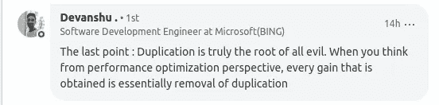

# 编写干净的代码和编程实践

> 原文：<https://betterprogramming.pub/clean-code-and-the-practice-of-programming-for-newcomers-2dfaeb0e31c3>

## 新手通常忽略的更好编程的简单规则

由 [Toa Heftiba](https://unsplash.com/@heftiba?utm_source=unsplash&utm_medium=referral&utm_content=creditCopyText) 在 [Unsplash](https://unsplash.com/s/photos/artist?utm_source=unsplash&utm_medium=referral&utm_content=creditCopyText) 上拍摄的照片

> “风格的目的是让代码对自己和他人来说易于阅读，好的风格对好的编程至关重要。”
> 
> —布莱恩·w·柯宁汉，“编程的实践”

当你自学时，很容易染上坏习惯或坏风格，因为没有人检查你的工作。你没有很多干净代码的参考点，因为没有多少书/课程直接涉及这些。

在这篇文章中，我想给你一些可行的建议，让你写出干净漂亮的代码。

# 5 个简单可行的良好编程实践:

## 1.仔细考虑选择变量的名字

> “我是应该描述，还是可以偷懒？”

这是我们在创建新变量时都会遇到的难题。

我发现 Brian W. Kernighan 的建议(在上面提到的书中)在这里非常有用:

*   全局函数、类和结构应该有描述性的名字来暗示它们在程序中的角色
*   相比之下，对于局部变量，较短的名称就足够了；在一个函数中，`n`可能就足够了，`npoints`就可以了，`numberofPoints`就有点过了
*   以常规方式使用的局部变量可以有非常短的名字。对循环索引使用`i`和`j`，对指针使用`p`和`q`，对字符串使用`s`和`t`是如此频繁，以至于在更长的名字中几乎没有收益，甚至可能有些损失。

无论如何，我们已经比 Brian 在 90 年代写这本书的时候做得好得多了——比如 ide 可以自动完成我们的变量名。

所以你现在还能为自己的懒惰辩解吗？

## 2.必要时创建新功能

> 用自己喜欢的语言编写函数的语法很容易理解。但是学习何时将代码分解成函数需要实践和一些设计意识。

一个目标是设计函数，以便在将程序扩展到新的情况时可以重用它们。

还有什么？做出这样的设计选择是编程的乐趣所在。

下面是鲍伯·马丁的书《干净的代码》中的三个启发，可以指导你做出这样的选择:

*   **功能要小。**有多小？不超过一屏或 20 行。
*   **功能应该有描述性的名字**。函数越小越集中，就越容易选择一个描述性的名字。不要害怕让名字变长。一个长的描述性的名字比一个短的神秘的名字更好。一个长的描述性名称比一个长的描述性注释更好。
*   **函数应该只做一件事**并且没有副作用”——从它的名字就可以清楚地看出它的意图。

当你第一次写一个函数时，它可能会变得又长又复杂，并且不遵循上面的任何规则。这没关系。您可以在以后改进和重新格式化您的代码。我不认为任何人可以从编写遵循上述所有规则的函数开始。

记住它们是你需要努力实现的功能建设目标。不要让他们麻痹你。

## 3.记录您的代码，并编写有用的注释

> 您的代码应该始终包含注释，作为函数和模块的文档。

每个函数定义都应该有一个注释，包括:

1.  用一两句话简短描述该函数的功能。
2.  后面是该函数接受的每个参数的单行描述(如果它们存在)。
3.  后面是函数返回变量的一行描述(如果存在的话)。

> 除此之外，你应该包括注释来描述你的代码中难以理解的部分。

请记住:

*   注释是为了帮助程序的读者。他们不会说代码已经说得很清楚的事情，不会反驳代码，也不会用复杂的印刷展示来分散读者的注意力。
*   **尽可能多写容易理解的代码**；你做得越好，你需要的评论就越少。好代码比坏代码需要更少的注释。评论充其量是一种必要的罪恶。
*   **不要抵触代码**。大多数注释在编写时都与代码一致，但是随着错误的修复和程序的发展，注释通常会保持原来的形式，导致与代码不一致。

## 4.保持一致

为什么？

> 因为一致的编码风格才是好的编码风格。

这使得某些人(包括你自己)很容易在将来阅读你的代码。

**记住:**

*   尽可能遵循标准实践。搜索“< insert programming language>风格指南”,在你的代码中遵循可靠的来源。下面是 Python 自己推荐的 [Python PEP8 风格指南](https://www.python.org/dev/peps/pep-0008/)。
*   如果你不确定标准是什么或者需要打破它，确保你有一个理由，并且在你的代码中始终如一地这样做。
*   在命名变量的方式、缩进代码的方式、记录函数的方式以及使用`++i`还是`i++`的方式上保持一致。

## 5.如果它坏了，假设(可能)是你的错

并学会拥有它。

> 你很可能会花大部分的编码时间在破碎的代码上。

在那些时刻，你不可避免地会试图将责任转移到你的 IDE、编译器、环境或你的机器上——尤其是在你开始程序员之旅的时候。

你必须学会控制这种挫败感，并记住:不是电脑的问题，而是你自己的问题。

只有当你这样做时，你才能诊断并抓住问题的核心(即使是机器的一些问题)。

**如何调试你的代码:**

1.  **向朋友解释代码或使用橡皮鸭技巧**

*   选一个朋友(或者一只橡皮鸭)
*   打开有问题的代码，一行一行慢慢耐心的给他(/她/它)解释
*   在没有朋友(或鸭子)帮助的情况下，发现问题就在你面前——就像变魔术一样！

**2。添加打印报表**

你是知道的...这些打印报表。

尽管添加这样的打印语句不是调试的正确方法，但我发现它们有时非常有效。尤其是当我使用像 VIM 这样的文本编辑器，而不是在有调试器的成熟 IDE 上工作时(或者当你懒得学习如何使用调试器时)。

但是我不得不说，一旦你学会了如何使用 IDE 调试器，就没有回头路了。

**3。使用 IDE 调试器**

调试器非常有用。然而，我愚蠢地忽略了学习 IDE 的这一部分。我建议你尽快学会如何在你最喜欢的 IDE 中使用调试器。相信我，痛苦是完全值得的。

个人建议:我使用 IDE 调试器是因为 Python 在标准库模块— `pdb —`中提供了调试器，我不会推荐使用它。

# 指导原则

最后，请记住，编程风格的原则是基于由经验引导的常识，而不是基于任意的规则和规定。

以下是我为保持代码整洁而遵循的 4 条指导原则:

1.  不要满足于"*嗯，它运行。*
2.  为可读性而写——代码被阅读的次数比它被编写的次数多。
3.  显性比隐性好。
4.  复制可能是软件中所有罪恶的根源。

[与专业人士达成一致](https://www.linkedin.com/feed/update/urn:li:activity:6607643278261215233?commentUrn=urn%3Ali%3Acomment%3A%28activity%3A6607643278261215233%2C6607652482422267904%29)

当你忘记任何规则或在现实世界中遇到这些简明规则没有涵盖的新情况时，这些应该会帮助你。

# 那么你如何采用这些并改进你自己的编码风格呢？

这里有两本书，我用它们来告诉我自己关于好的编码风格的直觉:

1.  鲍伯·马丁的书[干净的代码](https://www.goodreads.com/book/show/3735293-clean-code)
2.  Brian W. Kerninghan 的书— [编程的实践](https://www.goodreads.com/book/show/1032758.The_Practice_of_Programming)

但是请注意，仅仅阅读关于这种做法是不够的。

这些是很难抓住的直觉，发展你自己直觉的最好方法是通过实践。

我在之前写过[通过小程序教学方法的问题是它没有](https://medium.com/free-code-camp/learn-how-to-be-a-better-programmer-by-automating-the-boring-stuff-74a67a568c50)

*   发展你的直觉——比如如何将你的代码模块化
*   说明如何编写函数，以便在将程序扩展到新的用例时可以重用它们
*   谈论编写可读代码和紧凑代码之间的权衡，并强调对良好和一致的编程风格的需求

总的来说，小程序无法教会人们在创建大型项目时需要做出的核心设计选择。

所以你发展这些直觉的方法是通过做项目。

如果你陷入了为一个有趣的项目寻找想法的阶段，我写了一篇文章来帮助你:

 [## 奇妙的编程项目想法以及在哪里可以找到它们(适合初学者)

### 数据科学、机器学习应用程序开发和 web 开发的 20 个酷项目创意

medium.com](https://medium.com/better-programming/https-medium-com-nityeshagarwal-fantastic-programming-project-ideas-and-where-to-find-them-d529c98f6965) 

如果构建自己的项目的想法仍然令人望而生畏，我写了一个指南，带您完成上面文章中的一个项目:

 [## 通过构建 WhatsApp 聊天分析器来提高您的 Python 技能

### 这是一个指导性的项目，可以帮助你创建一些很酷的东西，并学习有用的编程概念

medium.com](https://medium.com/better-programming/https-medium-com-nityeshagarwal-whatsapp-chat-analyser-a-guided-project-7d21e033109d) 

我热爱教学。我会努力继续写这样的文章，以同理心来解决我自己面临的问题。订阅 [Build To Learn 简讯](https://buildtolearn.substack.com/)以便在我撰写此类指南和文章时获得更新。

你可以通过 [Twitter](https://twitter.com/nityeshaga) 或 [LinkedIn](https://www.linkedin.com/in/nityeshaga/) 或普通的旧电子邮件— `nityeshagarwal[at]gmail[dot]com`联系我。

*原载于* [***建学*** *博客*](https://www.buildtolearn.club/post/clean-code-and-the-practice-of-programming-for-newcomers) *。*