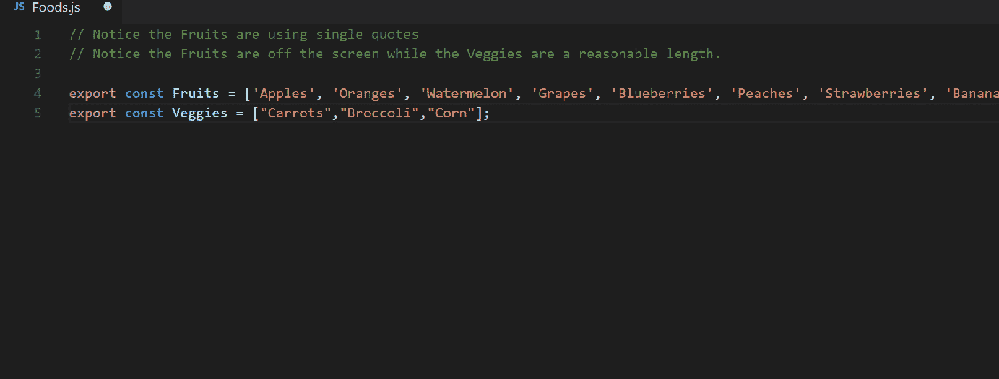

# 应用于 JavaScript 的干净代码(第 1 部分)

> 原文：<https://betterprogramming.pub/clean-code-applied-to-javascript-part-1-9f3badd5715>

## 关于编写和维护干净代码的惊人好处的系列文章


罗曼·博日科在 [Unsplash](https://unsplash.com/s/photos/clean?utm_source=unsplash&utm_medium=referral&utm_content=creditCopyText) 上拍摄的照片

本文是一系列文章中的第一篇，这些文章将深入探讨众所周知的主题*干净代码*，但将把它应用于 JavaScript。

在本系列中，我们将讨论每个程序员都应该知道的关于干净代码的经典技巧，并将它们应用于特定的 JavaScript/TypeScript 语言。

*   [第 1 部分:开始之前](https://medium.com/better-programming/clean-code-applied-to-javascript-part-1-9f3badd5715)
*   [第二部分:变量](https://medium.com/better-programming/clean-code-applied-to-javascript-part-ii-variables-8302f01e539c)
*   [第 3 部分:功能](https://medium.com/@ccaballero/clean-code-applied-to-javascript-part-3-functions-f9f26b221736)
*   [第 4 部分:注释](https://medium.com/better-programming/clean-code-applied-to-javascript-part-4-3f6db21ee4e5)
*   [第 5 部分:例外情况](https://medium.com/better-programming/clean-code-applied-to-javascript-part-5-exceptions-d46e07691c19)
*   [第 6 部分:避免条件复杂性](https://medium.com/better-programming/clean-code-applied-to-javascript-part-6-avoid-conditional-complexity-5ee9cbb1b26a)

# 介绍

要做的第一件事是回顾干净代码的核心概念:

## **1。代码气味和重构**

> "代码气味是一种表面迹象，通常对应于系统中更深层次的问题."—马丁·福勒
> 
> "糟糕的代码气味可能是导致技术债务的因素的指示器."罗伯特·马丁

在我看来，Martin Fowler 和 Robert C. Martin 的定义是兼容的，因为 Fowler 的定义指出了软件问题的线索，而 Martin 的定义指的是代码味道引起的副作用。

## **2。另一个有趣的术语是技术债务**

根据[维基百科](https://en.wikipedia.org/wiki/Technical_debt):

> “技术债务是软件开发中的一个概念，它反映了由于现在选择一个简单的解决方案而不是使用一个需要更长时间的更好的方法所导致的额外返工的隐含成本。”

因此，就像生活本身一样，最理想的是不欠债。但为此，我们必须有一个健康的经济(经验丰富的程序员和基础设施，允许开发没有负面后果)。

然而，就像在现实生活中一样，有时我们需要贷款来上大学或者买我们的第一辆车。希望我们能控制住债务，并一点一点付利息。

在软件上，应该是一模一样的。我们必须减少以后可以偿还的债务。我们中没有人会想到在没有存款和没有工作的情况下买一栋几百万的房子——这些是导致我们软件失败的债务。

所以*代码重构*就是在不改变其外部行为的情况下，对现有的计算机代码进行重构的过程。

*   重构改进了软件的非功能属性
*   优点包括提高代码可读性和降低复杂性
*   这些可以提高源代码的可维护性
*   创建更具表现力的内部架构，以提高可扩展性

# 开始之前

在开始查看 JavaScript 中的 clean code 示例之前，考虑一些对团队合作至关重要的建议非常重要。

## 人类可读

代码必须是人类可读的。不要考虑它将如何被计算机处理，因为将会有许多工具转换我们的代码(transpilers)。因此，最重要的事情是代码将是人类可读的，因为当你开发代码时，你工作的最大部分将是读代码而不是写代码。

下面是同一组用户的三个例子。三个例子中哪一个可读性更强？阅读时哪一个需要你较少的智力努力？嗯，这就是你构建代码的方式。

```
const users = [{ id: 1, name: “Carlos Caballero”, memberSince: “1997–04–20”, favoriteLanguageProgramming: [“JavaScript”, “C”, “Java”] }, { id: 2, name: “Antonio Villena”, memberSince: “2014–08–15”, favoriteLanguageProgramming: [“Go”, “Python”, “JavaScript”] }, { id: 3, name: “Jesús Segado”, memberSice: “2015–03–15”, favoriteLanguageProgramming: [“PHP”, “JAVA”, “JavaScript”] } ];/***********************/const users = [
{ id: 1, name: “Carlos Caballero”, memberSince: “1997–04–20”, favoriteLanguageProgramming: [“JavaScript”, “C”, “Java”] },
{ id: 2, name: “Antonio Villena”, memberSince: “2014–08–15”, favoriteLanguageProgramming: [“Go”, “Python”, “JavaScript”] },
{ id: 3, name: “Jesús Segado”, memberSice: “2015–03–15”, favoriteLanguageProgramming: [“PHP”, “JAVA”, “JavaScript”] },
]; /***********************/const users = [{
 id: 1,
 name: “Carlos Caballero”,
 memberSince: “1997–04–20”,
 favoriteLanguageProgramming: [“JavaScript”, “C”, “Java”],
},
{
 id: 2,
 name: “Antonio Villena”,
 memberSince: “2014–08–15”,
 favoriteLanguageProgramming: [“Go”, “Python”, “JavaScript”],
},
{
 id: 3,
 name: “Jesús Segado”,
 memberSince: “2015–03–15”,
 favoriteLanguageProgramming: [“PHP”, “JAVA”, “JavaScript”],
}];
```

## 用英语发展

我不会说英语。事实上，我在这个行业的最大问题是，与我的母语相比，我几乎不能用英语进行精彩有趣的对话。然而，在课堂上，我告诉我的学生，他们必须用英语编写代码，因此，我所有的代码都是用英语开发的。

使用糟糕的英语比使用你的母语要好，除非你很幸运能说英语。这是因为英语在世界范围内被用于商业。你可能喜欢或不喜欢，但世界上每个人都知道英语是与另一个国家互动时使用的语言，正如我之前告诉你的，你的大部分时间都将用于阅读代码。想象一下，用一种你不知道变量或函数名称的语言阅读代码——所有的代码都会为你加密。

因此，你必须用英语发展，即使它不是你的母语。我们将边工作边学习英语。无论如何，想想我。我不是本地人，但我每天都读和写英语。当然，这是有错误的，但我们都必须相互理解，因为使用一种语言时最重要的是把我们的意思表达出来。

试着推断下面的代码片段是做什么的，这在你的语言中是非常基本的。也就是说，下面的代码片段是不同语言和英语的(显然，如果示例语言之一是您的母语，您就会明白)。无论如何，如果你是一个通晓多种语言的人，去谷歌翻译，把代码放到另一种你不懂的语言里，试着推断出代码是做什么的。

```
const benutzer = {
 id: 1,
 name: “John Smith”,
 mitgliedVon: “1997–04–20”,
};Gehaltserhöhung(benutzer, 1000); /***********************/const użytkownik = {
 id: 1,
 imię: “John Smith”,
 członekZ: “1997–04–20”,
};
wzrostWynagrodzeń(użytkownik, 1000);/***********************/const user = {
 id: 1,
 name: “John Smith”,
 memberSince: “1997–04–20”,
};
increaseSalary(user, 1000);
```

## 协力

从前，有一个程序员在开发一个软件项目……多么美好的故事啊！我们都是这样学习开发软件的:独自一人。我们面对的是一台输入代码和解决问题的计算机，但是今天没有人独自开发软件。

因此，我们必须考虑在团队中工作。初级程序员之间永恒的讨论包括:

*   使用空格或制表符制表
*   打开功能名称旁边的键或下一行
*   在句末加上分号

那些论点听起来像是“对不起，那些讨论是荒谬的吗？”但是它们很重要，因为这些决定是所有团队成员一致同意的，然后使用修改代码并使其对每个人都正常化的开发工具。

当一个程序员打开一个项目文件并开始读取代码时，一个开发人员团队就被整合了，而他无法推断出这些代码是由他还是由他的队友编写的。这是完美的团队发展点——我们已经成为一起工作的一个伟大的程序员。我提醒你:如果我们必须知道谁写了一些代码，我们有强大的工具，如 Git。

因此，为了直接在团队中工作，我们需要:

没有义务使用特定的 IDE。为此，有标准的 EditorConfig，允许我们在每个团队成员喜欢的 IDE 中与他们一起工作。

每个人都是一个世界，并不是每个人都应该使用 WebStorm、VSCode 或 Eclipse，因为当存在允许我们配置基本结构化元素的标准(如 EditorConfig 标准)时，有人决定使用它们。

EditorConfig 帮助开发者在不同编辑器和 ide 之间定义和维护一致的编码风格。

```
root = true[*]
end_of_line = lf
insert_final_newline = true[*.{js,py}]
charset = utf-8[*.py]
indent_style = space
indent_size = 4[Makefile]
indent_style = tab[*.js]
indent_style = space
indent_size = 2[{package.json,.travis.yml}]
indent_style = space
indent_size = 2
```

Lint 允许我们根据我们建立的一些规则发现代码格式中的错误，每种语言都有自己的 Lint。看看你的开发语言，你必须在所有的语言中配置它并使用它们。

协议是相同的——有时会有项目中的代码没有按照您喜欢的方式完成，但至少您可以继续以这种方式键入代码，并将负责更改代码的人委派给 IDE，这样就不会对您生成代码的时间造成问题。

```
 {
 “globals”: {
 “myModule”: true
 },
 “env”: {
 “browser”: true
 },
 “rules”: {
 “no-unused-vars”: “error”,
 “quotes”: [“warning”, “double”]
 }
}const a = ‘a’;
const b = a;
const c = b;
```

有一个在业界广泛使用的工具叫做 Prettier，它允许你根据 linter 的规则实时改变代码的格式(ide 的插件)。

这使我们能够专注于我们必须解决的问题，此外，我们通过作为一个团结的团队来生成干净的代码。



# 结论

在本文中，我们在尝试解决干净代码实践和建议之前总结了几个基本点。我们讨论的原则对任何开发人员都是通用的:

*   为人类而不是机器编写可读的代码。大部分时间你都在阅读代码，包括你和你搭档的代码。
*   **用英文写**。今天，它是国际语言，我们必须国际化，因为这样我们就可以与世界上的任何人共享代码。
*   **在团队中工作**。创建通用规则，并依靠允许您为每个人统一生成代码的工具。你必须明白，整个项目似乎是由一个人编写的，而不是看到开发团队不同成员的不同习惯。