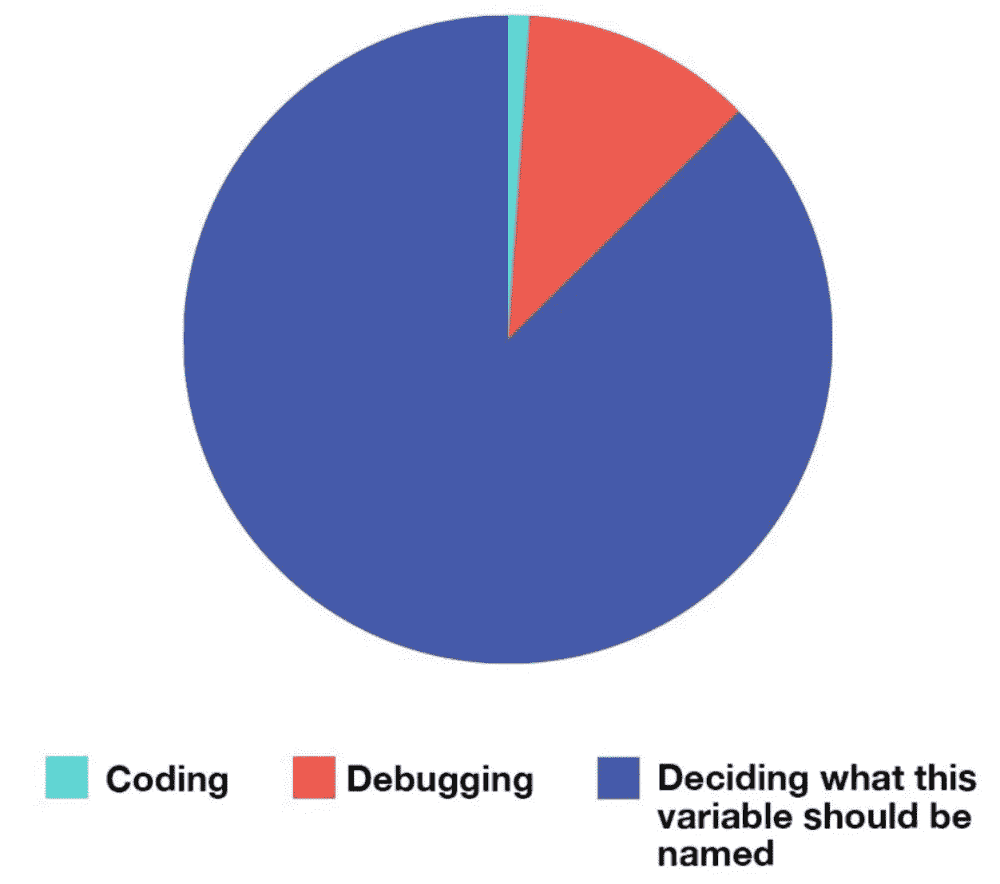
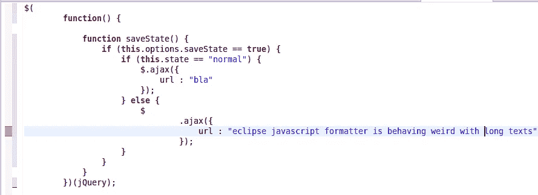

# 表达清晰的代码

> 原文：<https://betterprogramming.pub/clean-code-give-meaning-to-your-code-to-exist-f966b3f00848>

## 第 17 天| # 100 天代码

## 用美丽的节目讲美丽的故事


德米特里·拜尔在 [Unsplash](https://unsplash.com/s/photos/bubbles?utm_source=unsplash&utm_medium=referral&utm_content=creditCopyText) 上的照片

一个好的讲故事的人对他/她的语言有很强的控制力，并且知道在什么地方使用什么结构来正确优美地讲述任何故事。

类似地，你必须知道名词和动词(至少一开始是这样),才能写出清晰的表达程序，向任何阅读它们的人讲述一个美丽的故事。

名词是变量和类，动词是函数。今天，我们将学习如何正确地创建和使用它们。

不要低估有意义地命名变量、函数和类所面临的困难。不是有机化学，但还是很难。

好了，我们开始吧。

# 清除变量名



事实

不要花太多时间去考虑正确的名称——只需在编写代码时考虑不同的变量名，然后看看哪一个最符合您编写的代码。

一个你可以一直坚持的简单而可靠的规则是:变量名应该向阅读你的代码的人揭示三个问题。

1.  为什么会存在这种情况？
2.  它是做什么的？
3.  如何使用？

以下是一些需要记住的额外要点:

*   区分两个变量不会花太多时间。例如，这两个变量需要花费太多不必要的努力来区分。

```
***var XYZControllerForEfficientHandlingOfStrings 
var XYZControllerForEfficientStorageOfStrings***
```

*   使用像`1`(一)和`l`(小写 L)或`O`(大写 O)和`0`(零)这样的字符时要小心。
*   永远不要仅仅为了满足编译器而给名字。当编译器对相同范围内的重复名称提出错误时，不要只是将变量名改成类似`variable2`或其他随机名称。如果你的变量是不同的，它们的名字应该说明它们不同的存在理由。
*   使用容易发音的名称，以便在与他人讨论您的代码时更容易发音。
*   使用可搜索的名称。ide 可以帮助我们搜索代码，甚至给出直观的建议。但是只有给变量/函数起名字，你才能利用这种能力。这将帮助您从代码的任何部分引用它们，而不必回来检查您给它们取了什么名字。
*   命名时不要使用幽默或双关语。说你的意思，说话算数。

# 编写干净的函数

当你工作在干净的代码上时，你会知道每个函数都是你所期望的。

1.  职能要做一件事，而且要做好。
2.  函数应该只有一个改变的理由。他们必须遵循单一责任原则。
3.  当有新的需求时，功能不应该改变。它们必须遵循开闭原则。

(如果你没有听说过上面提到的两个原则，[在这里阅读它们](https://medium.com/@devDeeJay/the-solid-principles-for-good-software-design-14b4ec6d7607)。)

一个函数包括一个主体和一个参数列表，两者对编写干净的函数都有同等的贡献。

让我们来看看两者的一些要点:

## 1.函数体:

*   一个函数应该做一些事情或者返回一些东西，但是不能两者都做。要么它应该修改对象的状态，要么它应该返回一些关于对象的信息。双管齐下，只会导致未来的混乱。
*   函数应该很小，这意味着它们永远不应该超过 20 行代码(但是尽量让它们小于 20 行)。
*   与父行相比，函数的缩进级别不应大于一或二。当然，这使得函数更容易阅读和理解。

下面是一个错误代码缩进的例子:



信用:[堆栈溢出](https://stackoverflow.com/questions/15157504/eclipse-javascript-formatter-crazy-i-e-too-much-padding)

*   `if`语句、`else`语句、`while`语句等等中的块应该是一行长。如果它是一个长的条件语句，将它重构为返回`true`或`false`的函数。
*   函数的一个长的描述性名称比一个短的神秘名称要好。

## 2.函数参数

**理想数量:**一个函数应该拥有的理想参数数量为零。之后，不超过一个、两个或最多三个是可取的(尽管应避免后者)。只有在非常特殊的情况下才允许三个以上的参数。

**为什么？从测试的角度来看，多重论证更加困难。想象一下编写所有测试用例以确保所有不同的参数组合正常工作的难度。**

**问题:**如果没有参数，这是微不足道的。如果有一个论点，也不是太难。有了两个论点，问题变得更具挑战性。如果有两个以上的参数，测试每个适当值的组合就变得令人生畏。您可以通过编写参数数量最少的函数来避免这种情况。

**从不传递标志参数:**将标志(真/假)作为参数传递确实是一种可怕的做法。它会立即使您的函数违反 SRP——因为当参数为真时，您的函数会以某种方式运行，而当参数为假时，函数会以另一种方式运行。

**你该怎么办？使用参数对象:**在一个类中包装多个参数看起来像是欺骗，但实际上不是。当涉及到需要发送给函数的多个参数时，它们可能以某种方式相互关联。将这些字段封装到一个类中，并给这个类起一个有意义的名字，这确实是一个很好的做法。

许多语言为你提供了编写内嵌函数的平台。例如，要求您编写一个函数，该函数将一个报表作为输入，并在该报表后添加一个页脚。

**方法 1:** 创建一个函数，该函数将报表作为输入，并向其附加一个页脚。这个函数有一个参数。可以改进。

```
public void appendFooter(StringBuffer report) {...}
```

**方法 2:** 创建一个内嵌函数，它没有参数，但实际上直接处理报表实例。

```
report.appendFooter()
```

# 如何处理错误/异常？

处理错误的函数必须只处理错误，不应该做任何其他事情。

更喜欢抛出异常而不是返回错误代码。当您返回错误代码时，您强制调用者函数立即处理它。这意味着更多的样板代码。

让我们看一个例子。我们正在做一些联网工作，用食物列表更新我们的用户界面。

**联网类:**

```
// Inside some function
// Getting list from somewhereval listOfFoodItems = getFoodItemsList()**// If list is null, means something went wrong**
if (listOfFoodItems.isNull()) {
    callback(FoodOrder.Error)
}
**// If all goes well, we send back list of food items**
else {
    callback(FoodOrder.FoodMenu(listOfFoodItems))
}
```

**用户界面类:**

```
// Getting list from somewhere
var status = getReturningStatus()if (status == ERROR) {
    // Handle errors
} else if (status == FoodItemList) {
    // Do something with food list
}
```

如果我们使用异常，我们的代码会变得更加紧凑。

**改进的网络类:**

```
val listOfFoodItems = getFoodItemsList()if (listOfFoodItems.isNull()) {
    throw some custom Exception
}
else {
    callback(FoodOrder.FoodMenu(listOfFoodItems))
}
```

**改进的 UI 类:**

```
try {
  var listOfFoodItems = getAllFoodItems()
} catch (your exception type) {
  // Act accordingly
}
```

即使您的错误用例数量增加，您也只需从 networking 类中抛出异常，并在 UI 类中添加更多 catch 块。

对了，这段代码也是遵循开闭原则的。

**提示:**如果你在你的 try/catch 块中做多件事情，提取出不合适的函数，使你的代码看起来干净易读。不要留下嵌套的、难看的 try-catch 块。

# 结论

编程大师认为系统是要讲的故事，而不是要写的程序。

他们选择编程语言的结构来表达他们用代码写的故事。函数是语言的动词，类是名词。编程的艺术在于如何使用语言提供的工具来讲述最好的故事。

在接下来的几天里，我会和你们分享更多的东西。感谢你的阅读，一如既往，你太棒了！