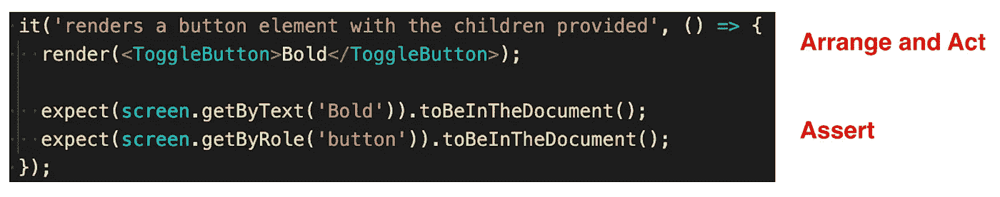
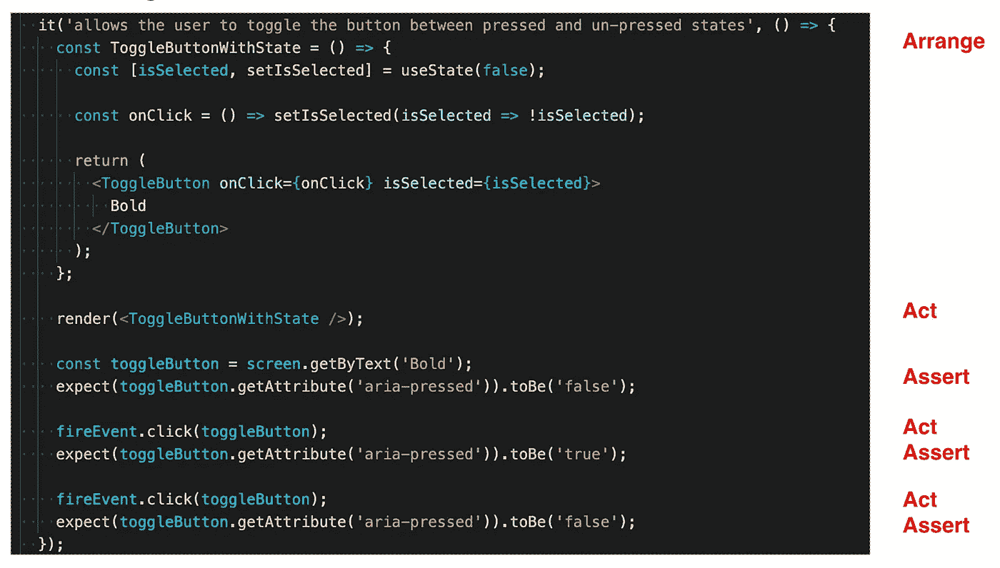
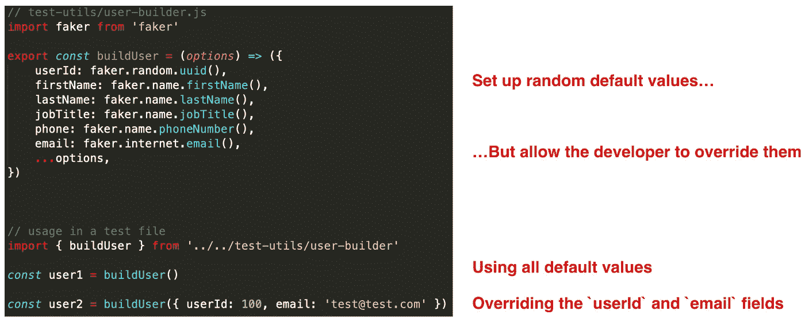
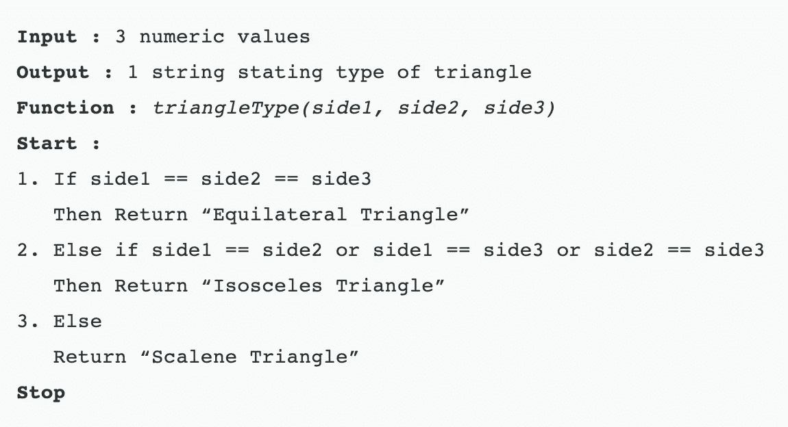

# 用单元测试清理代码

> 原文：<https://betterprogramming.pub/clean-code-with-unit-tests-5f28020828a5>

## 保持测试套件干净的提示和技巧

莎拉·多维勒在 [Unsplash](https://unsplash.com?utm_source=medium&utm_medium=referral) 上的照片。

单元测试很重要。当您重构代码时，它们可以防止回归，作为文档，并节省您没有花费在冗长的手工测试上的时间。简而言之，测试促成了改变。

但是我们对测试的清洁度给予了多少关注呢？我们重构应用程序的生产代码，给变量起描述性的名字，提取可重复功能的方法，并使我们的代码易于推理。但是我们的测试也是这样吗？

想想罗伯特·马丁的这句话:

> **“测试代码和生产代码一样重要。**不是二等公民。它需要思考、设计和细心。它必须像生产代码一样保持整洁。”

那么，我们如何保持测试代码的整洁呢？下面我们来考虑一些想法。

# 结构化测试

测试应该根据排列-动作-断言模式来构建。这种模式有许多名称，有时被称为构建-操作-检查、设置-练习-验证或给定-何时-然后模式。

我更喜欢安排-行动-断言这种吸引人的头韵。无论您如何称呼它，模式看起来都是这样的:

*   **安排**:设置您将使用的测试夹具、对象或组件。
*   动作:执行一些操作，可能是通过调用一个函数或者点击一个按钮。
*   **断言**:断言预期的行为或输出发生。

在 React 世界中，在测试一个简单的切换按钮组件时应用这种模式可能如下所示:

单元测试切换按钮组件的呈现内容时的 Arrange-Act-Assert 模式

我们通过呈现`ToggleButton`组件，在同一行中安排我们的代码并对其进行操作。然后，我们在输出中断言，它向 DOM 呈现了一个按钮，并且按钮的文本在屏幕上可见。

一个更复杂的例子可能如下所示:

单元测试切换按钮组件交互行为时的 Arrange-Act-Assert 模式

这里，我们通过创建一个有状态的组件来安排我们的代码，该组件允许切换按钮被打开和关闭。我们通过渲染组件来行动。然后，我们断言按钮最初是关闭的。接下来，我们再次单击按钮，然后再次断言按钮已经打开。为了更好的测量，我们通过再次点击来再次动作，并且我们通过验证按钮回到被关闭状态来再次断言。

这里需要注意的是，你通常应该只在每个测试开始的时候为排列阶段编写代码。之后，可以在 Act 和 Assert 的迭代之间循环。但是如果你在测试的后期发现自己回到了安排阶段，这可能是一个好的迹象，表明你正在测试第二个概念，应该把它移到一个单独的测试中。稍后将详细介绍。

# 测试对象构建器

测试对象构建器是允许您创建通常需要的对象的方法、类或构造函数。例如，您可能经常使用一个包含任何给定用户的各种数据的`User`对象。这可能包括名字、姓氏、电子邮件地址、电话号码、邮寄地址、职位、应用程序权限等等。

在您的每个测试中创建一个新的`User`对象很容易需要几行代码，导致一个数百行长的庞大的测试文件。相反，我们可以通过创建一个助手测试对象构建器方法来为我们返回一个新的`User`对象，从而使我们的测试代码保持干燥。更好的是，当我们需要更具体地了解对象中使用的属性时，我们可以允许覆盖默认值。

我发现一个特别有用的库是 [faker.js](https://www.npmjs.com/package/faker) npm 包。我们可以使用这个包为各种不同的字段生成模拟数据，比如`firstName`、`jobTitle`、`phoneNumber`等等。

考虑这个`User`测试对象构建器的例子:

借助 faker.js 创建用户测试对象构建器

我们的`buildUser`方法返回一个代表用户的普通对象。然后，我们可以在测试文件中使用这个`buildUser`方法来创建默认情况下具有随机值的用户(`user1`用户)或者具有我们指定的特定值的用户(`user2`用户)。

# 每次测试评估一个概念

每个测试应该只验证一件事。不要试图在同一个测试中测试几个东西。例如，一个日期选取器组件的糟糕测试可能会显示类似“以各种状态呈现”这样的内容，然后呈现八个不同的日期选取器来说明差异。像这样的测试做得太多了。

一个更好的测试应该更加具体——类似于“当用户点击文本输入时呈现日期选择器”

# 测试应该很快

运行缓慢的测试套件很痛苦。更糟糕的是，当慢速测试套件是可选的或者不是强制作为 CI 管道的一部分时，开发人员倾向于选择不运行这些测试套件。没有人喜欢等待。

另一方面，快速测试套件可以在您编写生产代码时连续运行。这个简短的反馈循环能让你更快更自信地发展。快速测试套件也有助于像测试驱动开发这样的编程范例。

在 JavaScript 世界中，在开发时以`watch`模式运行 Jest 测试是一个游戏改变者。

# 测试应该是独立的

测试应该能够以任何顺序运行。换句话说，任何给定的测试都不应该依赖于之前的测试。如果您不小心在测试文件中的测试之间进行适当的拆卸或清理，您可能会在一个测试中修改全局变量，然后影响后续的测试。这可能会导致意想不到的行为和头痛。当一个测试单独运行时通过了，但作为测试套件的一部分运行时却失败了，这总是一个有趣的调试冒险。

如果你使用 Jest，安装和拆卸通常在`beforeEach`和`afterEach`代码块中完成。记住每个测试文件都有自己的`JSDOM`实例也很有帮助，但是同一个文件中的测试共享同一个`JSDOM`实例。

# 测试应该是可重复的

测试应该能够在任何环境下运行。如果测试套件在我的机器上通过，它也应该在你的机器上通过。这也意味着它应该在 CI 管道中通过。当测试是可重复的时，测试在一个环境中通过而在另一个环境中失败就不足为奇了。像这样的剥落会降低你对测试的信心。

# 测试应该是自我验证的

测试应该返回一个布尔值。测试要么通过，要么失败。你不应该需要一个人来解释测试的结果。这是快照测试糟糕并且应该避免的众多原因之一。

快照测试不会告诉您正确的输出应该是什么。他们只是告诉你*有些东西*是不同的。作为开发人员，您可以决定是有意更改快照，还是这是一个需要解决的错误。然而，经常发生的是，开发人员盲目地接受对快照的更改，并假设新的快照是正确的。

# 应该及时地编写测试

测试应该与生产代码同时编写。如果你是测试驱动开发的倡导者，那么你认为测试应该在生产代码之前编写。如果你不那么严格，那么你可能在产品代码之后不久就写测试。这两种方法中的任何一种都比几个月后编写测试来增加存储库的代码覆盖率要好得多。

# 确保测试在应该失败的时候失败

你有没有遇到过一个测试并不测试它所说的？测试可能会通过，但它肯定不会测试任何有意义的东西或它声称的东西。诸如此类的测试制造了一种虚假的自信感。毕竟，您的测试套件*正在通过*！

想想马丁·福勒的这段话:

> "当我写测试的时候，我喜欢看到它至少失败一次."

那些是明智的话！通过对测试代码或生产代码进行轻微的修改，将输出更改为故意不正确的内容，可以很容易地验证您的测试正在完成它的工作。如果你的测试失败了，太好了！

当然，不要忘记在完成这个健全性检查之后，将您的测试改回来，让它再次通过。

# 记得测试你的边缘案例

只考幸福路是菜鸟的错误。除了确保正常的行为起作用，试着考虑事情可能出错的方式。如果有人给你的函数提供了无效的参数怎么办？或者意外的数据类型？

考虑一下[这个示例场景](https://www.geeksforgeeks.org/dont-forget-edge-cases/):您正在编写一个函数，它根据三角形三条边的长度值返回该三角形的类型。

我们将调用函数`triangleType`，它将有三个参数，因此函数签名如下:`triangleType(side1, side2, side3)`。

你会在什么情况下测试这样的函数？

triangleType 函数的伪代码。来源: [GeeksforGeeks](https://www.geeksforgeeks.org/dont-forget-edge-cases/) 。

显而易见的测试用例可能是检查它能否正确识别有效的等边三角形、等腰三角形和不等边三角形。您的测试用例可能如下所示:

1.  `triangleType(4, 4, 4) // Equilateral Triangle`
2.  `triangleType(6, 7, 6) // Isosceles Triangle`
3.  `triangleType(6, 7, 8) // Scalene Triangle`

非常有趣的是，测试这三种情况会根据函数的当前实现给出 100%的代码覆盖率。但是仅仅这三项测试是不够的。

例如，如果向函数提供全零会怎样？那不是三角形。这是一个要点。但是该函数会将其识别为等边三角形，因为所有边都是相等的。

如果向函数提供负数会怎样？三角形的长度不能为负。那没有任何意义。

或者如果其中两条边比第三条边短得多呢？那么边就不会连接起来，我们就不会有三角形了。

这三个额外的测试用例可能如下所示:

1.  `triangleType(0, 0, 0) // Not a triangle`
2.  `triangleType(-6, -7, -8) // Not a triangle`
3.  `triangleType(5, 3, 100) // Not a triangle`

正如你所看到的，在你的代码中测试更多的快乐路径是很重要的。

# 测试你最担心会出错的事情

我喜欢追求 100%的测试覆盖率，但是重要的是不要对这个数字教条化。有一个收益递减规律，每增加一项测试增加的价值越来越少。如果您有 95%的代码覆盖率，那么获得最后 5%的代码覆盖率可能是不值得的。并非所有东西都值得测试。

重要的是测试应用程序的关键部分。你最担心代码的哪些部分出错了？首先关注为核心功能准备好良好的测试。然后编写额外的测试来覆盖不太关键的路径。但是当你这样做的时候，记住把你的测试集中在特定的行为和产品需求上——而不仅仅是覆盖最后一条难以触及的线。

# 摘要

你成功了！如果您需要快速复习一下我们在本文中讨论的所有内容，这里有我的单元测试技巧和窍门，可以让您获得干净的代码:

1.  使用**安排-行动-断言**模式构建你的测试。
2.  使用**测试对象生成器**来简化常用对象的测试设置。
3.  每次测试评估一个**单一概念**。
4.  **F.I.R.S.T.** —测试应该是**快速**、**独立**、**可重复**、**自确认**、**及时**。
5.  确保测试在应该失败的时候失败。
6.  记住你的**边界**和**边缘情况**。
7.  测试你最担心出错的**事情。**

感谢您的阅读，祝您编码愉快！