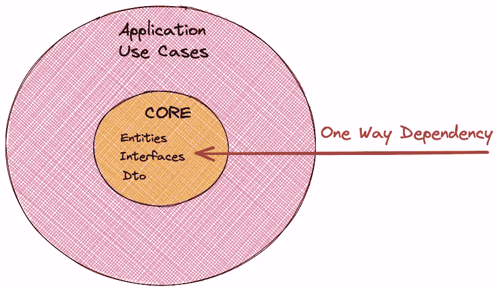
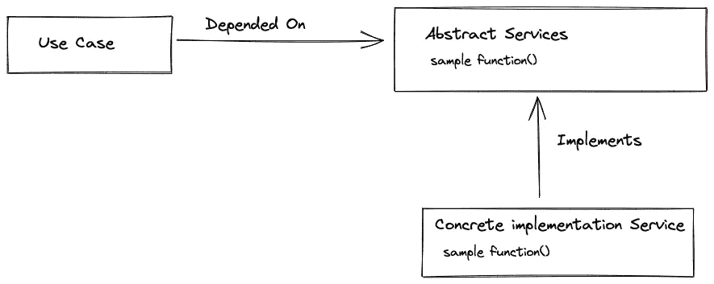
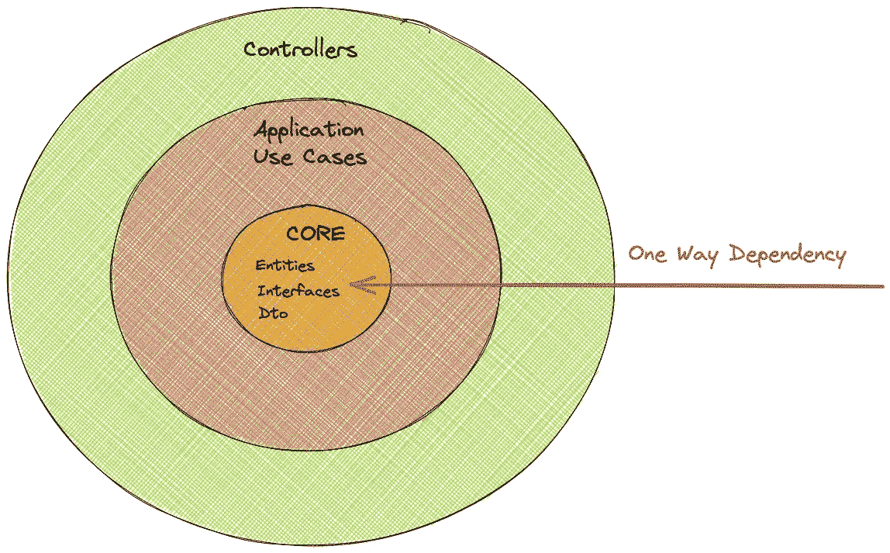
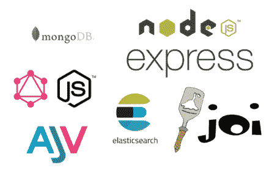

# 使用 NestJs 和 TypeScript 清理 Node.js 架构

> 原文：<https://betterprogramming.pub/clean-node-js-architecture-with-nestjs-and-typescript-34b9398d790f>

## “你的架构应该告诉读者关于系统的信息，而不是你在系统中使用的框架。”——罗伯特·c·马丁

萨曼莎·加德斯在 [Unsplash](https://unsplash.com?utm_source=medium&utm_medium=referral) 上的照片

距离我上一篇关于如何在 Node.js 应用程序上[实现干净架构的文章](/node-clean-architecture-deep-dive-ab68e523554b)已经有一段时间了。在与 NestJs 和 TypeScript 合作之后，我认为回来就这个主题写一篇新文章是个好主意。这一次，我们将利用 typescript 的强大功能和 NestJs 的方法和工具，并利用它们为我们带来好处。

在这篇文章中，我将从头开始解释干净的架构，所以如果你读了前一篇文章，请随意跳到实现部分。

你也可以在 Node TLV 2022 大会上查看我关于这个主题的讲座

# 那么什么是清洁建筑呢？

> 你的架构应该告诉读者关于系统，而不是你在系统中使用的框架

该建筑试图将一些领先的现代建筑，如[六边形建筑](https://en.wikipedia.org/wiki/Hexagonal_architecture_(software))、[洋葱建筑](http://jeffreypalermo.com/blog/the-onion-architecture-part-1/)和[尖叫建筑](http://blog.cleancoder.com/uncle-bob/2011/09/30/Screaming-Architecture.html)整合成一个主建筑。

节点清洁架构图，图片由 Robert C. Martin 提供

这张图表摘自罗伯特·c·马丁的官方文章。我建议在深入研究节点实现之前阅读他的文章。这是关于该架构的最佳来源知识。

关于这个图以及如何阅读它的一些话(如果您还不理解它，请不要担心，我们将在本文中深入研究每一层):

*   层:每个环代表应用程序中的一个隔离层。
*   依赖:依赖方向是由外向内。这意味着实体层是独立的，而框架层(web、UI 等)是独立的。)取决于所有其他层。
*   实体:包含构建我们的应用程序的所有业务实体。
*   用例:这是我们集中逻辑的地方。每个用例为一个特定的业务用例编排所有的逻辑(例如向系统添加新的客户)。
*   控制器和表示器:我们的控制器、表示器和网关是中间层。您可以将它们视为用例的入口和出口。
*   框架:这一层有所有的具体实现。数据库、web 框架、错误处理框架等。Robert C. Martin 描述了这一层:“*这一层是所有细节的所在。网络是一个细节。数据库是一个细节。我们把这些东西放在外面，让它们伤害很小。”*

此时，您可能会对自己说:“数据库在外层，数据库是一个细节？”数据库应该是我的核心层。

我喜欢这个建筑，因为它背后有一个聪明的动机:

这种架构关注的不是框架和工具，而是应用程序的业务逻辑。它是独立于框架的(尽可能独立)。

这意味着无论您使用哪个数据库、开发框架、UI 或外部服务，应用程序的实体和业务逻辑都将保持不变。

我们可以在不改变逻辑的情况下改变以上所有内容。这使得测试用这种架构构建的应用程序变得如此容易。如果您还不理解这一点，请不要担心，我们将一步一步地探索它。

在本文中，我们将通过一个示例应用程序的例子来慢慢解开架构的不同层。

像任何其他架构一样，有许多不同的方法来实现它，每种方法都有自己的考虑和权衡。

在本文中，我将解释如何用 NestJs 在 Node 中实现这种架构。我将试着解释在这个过程中不同的实现考虑。

让我们仔细看看这个示例应用程序。

# 示例应用程序

我们的示例应用程序将代表一个简单的微服务，它支持图书存储库上的 CRUD 操作。

在本文中，我们将逐层实现服务 API。你可以在 [GitHub repo](https://github.com/royib/clean-architecture-nestJS) 中找到所有代码。本文包含了部分代码，但是最好的方法(在我看来)是在阅读本文的同时探索代码。

在我们的实现中，我们将使用 [NetsJS](https://nestjs.com/) 。

> Nest 是一个用于构建高效、可伸缩的 Node.js 服务器端应用程序的框架。它使用现代 JavaScript，用 TypeScript 构建(保持与纯 JavaScript 的兼容性)，并结合了 OOP(面向对象编程)、FP(函数式编程)和 FRP(函数式反应编程)的元素。— [Nest 官方 npm 回购](https://www.npmjs.com/package/@nestjs/core)

基本上 Node.js 也允许你以任何你想要的方式构建服务器端应用程序，这在某些情况下是一件好事，但也可能是一个问题，因为每个团队都以不同的方式构建自己的应用程序，每个人都有自己的观点。你的项目没有统一性，如果你不知道自己在做什么，事情会很快变得一团糟。NestJs 是一个固执己见的 Node.js 框架，它提供了如下工具:

*   依赖注入
*   代码与模块的分离
*   控制器
*   中间件
*   过滤
*   护卫队

虽然这不是一篇 NestJs 文章，但我将在本文中尝试解释一些基本原则。

# 实体和用例层

> 这一层中的代码包含特定于应用程序的业务规则。它封装并实现了系统的所有用例。这些用例编排了实体之间的数据流，并指导这些实体使用它们企业范围的业务规则来实现用例的目标。— *罗伯特·c·马丁*

在应用程序的核心，我们有两层:

*   实体层:包含构建我们的应用程序的所有业务实体。
*   用例层:包含我们的应用程序支持的所有业务场景。

核心层

我们将从内到外，或者从依赖规则的相反方向，遍历架构。

在内部，我们有独立的核心层。这些层包含业务实体和业务逻辑。框架在这些领域是罕见的生物，这些层应该是变化的，主要是由于业务的变化。

当我们进入外层时，我们会发现更多的框架和更多的代码由于技术或效率的原因而随时间改变。

实体是一个独立的层，用例只依赖于它们。

# 实体

我们应用程序中的业务实体包括:

## 作者

*   身份
*   西方人名的第一个字
*   姓

## 类型

*   名字

## 书

*   身份
*   标题
*   作者
*   类型
*   出版日期

这一层是独立的，这意味着您将从不同的层导入模块。

这一层不会受到服务、路由或控制器等外部变化的影响

您可以在我们的示例应用程序中的 [src/core/entities](https://github.com/royib/clean-architecture-nestJS/tree/main/src/core/entities) 文件夹下找到所有的实体代码

# 用例

这是我们集中逻辑的地方。每个用例为一个特定的业务用例编排所有的逻辑。我们的应用程序 API 需要支持这些用例(我选择了其中的一个例子):

*   获取所有书籍的列表。
*   获取单本详细信息。
*   添加新书。
*   添加新作者。

## 添加图书用例

让我们检查并深入“添加新书”用例。用例的主要职责是:

*   业务规则验证。
*   检查 DB 中是否不存在该书。
*   创建新的 book 对象。
*   将我们的新书保存在数据库中。
*   更新图书馆 CRM 系统。

通过查看用例的职责，我们可以看到用例有两个依赖项:

*   数据库服务:用例需要持久化图书细节，并检查它在系统中是否不存在。例如，这个功能可以实现为一个调用 SQL 或 MongoDB 的类。
*   CRM 服务:用例需要通知图书馆 CRM 应用程序关于新书的信息。该功能可以作为调用外部系统(可以是任何系统)的服务来实现。

一种选择是在用例本身中要求数据库和 CRM 服务的具体实现(例如，直接调用 SQL SDK)。该选项将使我们的数据库和 CRM 服务的具体实现与我们的用例紧密耦合。

数据库/CRM 服务的任何变化(如 SDK 的变化)都会导致我们用例的变化。这个选项将打破我们清晰的架构假设，即用例表达业务流程，框架(如数据库和外部服务)对它们是不可见的。

我们的用例只知道实体和业务逻辑。此外，测试用例逻辑将变得更加困难。

好的，让我们假设用例不知道任何关于具体数据库的事情，比如 SQL 或者 [MongoDB](https://www.mongodb.com/) 。它仍然需要与它们进行交互来执行任务(比如在数据库中保存一本书)，但是如果它不知道它们，它怎么能做到这一点呢？

解决方案是在用例与外部世界之间建立一个网关。

这就是抽象和依赖注入的救援之处。我们不是创建对特定数据库或特定财务系统的依赖，而是创建对抽象的依赖。但是，抽象到底是什么？

抽象是创建服务蓝图而不实现它们的方式。我们只定义我们需要的服务功能。

抽象依赖

通过抽象，我们将定义用例与框架之间的契约。基本上，契约是所需服务的功能签名。例如，CRM 服务需要提供一个“notify”函数，该函数获取一个 Book 对象作为参数，并返回一个带有布尔值的承诺。

## 用例依赖

让我们定义我们的抽象，我们需要:

*   数据服务抽象
*   CRM 服务抽象

我们的数据服务抽象需要公开 3 个存储库:

*   图书仓库
*   作者知识库
*   流派知识库

这些仓库中的每一个都需要为我们提供 CRUD 功能，比如:查找、findById、插入、更新、删除等等

用例抽象

## 主要抽象

您可以在 [src/core/abstracts](https://github.com/royib/clean-architecture-nestJS/tree/main/src/core/abstracts) 找到我们示例应用程序中的所有抽象。

首先，让我们看看我们的数据服务抽象:

你可以在我写的一篇关于这个主题的文章中读到更多的内容— [使用 NestJS 实现通用存储库模式](/implementing-a-generic-repository-pattern-using-nestjs-fb4db1b61cce)

*   **通用知识库** —每个实体知识库都需要支持基本的 crud 操作。我已经创建了一个通用存储库，它将作为所有实体存储库的抽象类，如果我们需要每个存储库的不同功能，您可以单独定义它们。我只选择了基本的存储库功能，在您的实际应用程序中，您可以为所有/每个存储库定义您需要的功能。
*   **数据服务** — 公开所有的实体库。

我们的 CRM 服务抽象如下:

## 用例代码

*   我们的 add book 用例只依赖于抽象。在构造函数中，我们只注入 IDataServices 和 ICrmServices。
*   我们使用我们的服务，却不知道它们的真正实现是什么。
*   外部服务实现的变化不会影响我们的用例业务逻辑。

谁将这些服务的具体实现注入到我们的用例构造器中？请继续关注，您将很快在框架部分找到答案

# 控制器和演示者

> *"* 这一层的软件是一组适配器，将数据从对用例及实体最方便的格式转换成对某些外部机构(如数据库或 web)最方便的格式。例如，正是这一层将完全包含 GUI 的 MVC 架构。演示者、视图和控制器都属于这里”——罗伯特·c·马丁

在上一节中，我们讨论了我们的核心业务层，以及它们如何只依赖于它们定义的抽象。现在我们将讨论适配器，因此您在这里不会看到任何业务逻辑或框架。

控制器

我们的控制器、演示者和网关是中间层。你可以把它们想象成一个适配器，把我们的用例与外部世界粘合起来，反之亦然。

外界是谁？

如果你来自 MVC 世界，你可能听说过控制器。在经典的 MVC 中，你有某种指向不同控制器的路由机制。控制器的工作是响应用户输入，验证它，做一些业务逻辑的事情，并且通常改变应用程序的状态。

另一方面，表示器从某种存储库中接收数据，并为视图/api 层格式化数据。

# 控制器

在干净的架构中，控制器的工作是:

*   接收用户输入——某种类型的 [DTO](https://en.wikipedia.org/wiki/Data_transfer_object) 。
*   验证用户输入-净化。
*   将用户输入转换成用例期望的模型。例如，做日期格式和字符串到整数的转换。
*   调用用例，并传递给它新的模型。

控制器是一个适配器，我们不需要任何业务逻辑，只需要数据格式化逻辑。

# 提出者

演示者将从应用程序存储库中获取数据，然后为客户机构建一个格式化的响应。其主要职责包括:

*   格式化字符串和日期。
*   添加演示数据，如标志。
*   准备要在 UI 中显示的数据。

在我们的节点实现中，我们将一起实现控制器和表示器，就像我们在 MVC 项目中所做的一样。我们将使用 NestJs 功能来实现我们的[控制器](https://docs.nestjs.com/controllers)。我们将使用[验证管道](https://docs.nestjs.com/techniques/validation)验证我们的用户输入，并使用[转换管道](https://docs.nestjs.com/pipes)将我们的 DTO 转换为业务对象。

首先让我们创建我们的 [DTO 图书对象](https://github.com/royib/clean-architecture-nestJS/blob/main/src/core/dtos/book.dto.ts)。我们将从我们的 api 消费者那里接收这个对象。

[NestsJS 在幕后使用了类验证器](https://docs.nestjs.com/techniques/validation)，所以我们可以使用[类验证器装饰器](https://github.com/typestack/class-validator)来验证我们的 DTO 对象。我们还可以添加自定义验证器，例如，我们可以添加一个自定义验证器来检查这本书是否已经存在。

这是将返回给我们的消费者的响应对象:

图书控制器代码如下所示:

*   验证是由 NestJs 在 bookDto 对象上进行的
*   我们使用`bookFactoryService`将我们的 DTO 转换成一个商业书籍对象
*   致电我们的用例服务
*   创建对消费者的响应

# 结构

节点清洁架构—框架

> “这一层是所有细节的所在。网络是一个细节。数据库是一个细节。我们把这些东西放在外面，让它们伤害很小”——罗伯特·c·马丁

在上一节中，我们讨论了适配器层，以及它们如何作为用例的入口和出口。

现在，我们将讨论框架层，这一层包括我们所有的具体实现，如数据库、监控、计费、错误处理等。

到目前为止，我们只讨论了实体、业务逻辑、适配器，并且除了我们的构建模块框架 NestJs 之外，我们没有使用任何框架。你可以说我们写了一个“纯”代码。

在我们的示例项目中，框架被实现为:

*   web 应用框架是由 NestJs 实现的(构建于 express 之上)。
*   数据库服务使用[mongose](https://mongoosejs.com/)实现。
*   CRM 服务是一个简单的模拟服务。

## 数据服务实现

Mongo 通用存储库的代码如下所示:

*   存储库使用 mongoose 实现我们的抽象`IGenericRepository`类
*   `T`代表一个 db 实体，每个实体都具有所有期望的功能

Mongo 数据服务代码如下所示:

*   `MongoDataServices`实现了`IDataServices`抽象类
*   它根据需要公开 3 个存储库，每个实体一个
*   您可以查阅 [NestJs 文档](https://docs.nestjs.com/techniques/mongodb)来更好地理解 mongo 实现，这超出了本文的范围。

CRM 服务:

# 依赖注入

正如我们之前讨论的，我们的用例依赖于契约而不是实现。这些契约需要在运行时通过依赖注入来满足。

如果您不熟悉依赖注入的概念，我鼓励您看一看 Fun Fun Fun Function 博客上的两个很好的视频，它们完美地解释了这个主题:

*   [依赖注入基础知识](https://www.youtube.com/watch?v=0X1Ns2NRfks)
*   [控制反转](https://www.youtube.com/watch?v=-kpEP4JeEdc)

幸运的是，NestJs 有一个内置的[依赖注入](https://docs.nestjs.com/fundamentals/custom-providers)功能。我们所要做的就是将我们的依赖注入到我们的服务构造函数中，在运行时 NestJs 会负责注入一个实例。

请注意，我们将注入抽象服务，在运行时，DI 引擎将创建正确实现的实例。

在[模块声明](https://github.com/royib/clean-architecture-nestJS/blob/main/src/frameworks/data-services/mongo/mongo-data-services.module.ts)中，我们告诉 NestJs 我们想要每个抽象的哪个实现。例如，当我们请求`DataServices`时，我们实际上想要得到`MongoDataServices`的一个实例。

美妙之处在于，我们的服务对`MongoDataServices`一无所知，并且仍然在运行时使用它。

数据服务模块的代码如下所示:

每当有人请求`IDataServices`时，NestJs 将注入`MongoDataServices`实例

例如，如果我们想用 sql 替换 mongo，我们需要做的就是:

*   创建使用 sql 的新数据服务类和存储库，并遵循数据服务抽象。
*   在模块文件中，告诉 Nest.js 使用我们新的 sql 数据服务

# 摘要

在本文中，我们展示了如何构建一个健壮的结构，一层一层地将我们的核心业务逻辑从框架中分离出来。

我们可以轻松地用 Sql 替换我们的数据库，或者迁移到一个新的 CRM 系统，所有这些都不涉及我们的业务逻辑。

我们还可以通过只接触框架层来对我们的一个框架中的 SDK 变化做出反应。由于各层的松散耦合架构，测试也变得很容易。

在复杂的项目中，保持所有层的整洁是困难的，有时甚至是乏味的。它总是关于架构中的权衡，并且我们不时需要妥协和打破我们的界限以获得另一个好处。

我相信，如果我们努力遵守这些规则，我们将在未来获得巨大的利益。