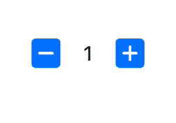

# 使用带有属性包装器的 MVVM 的写清洁器 Swift

> 原文：<https://betterprogramming.pub/cleaner-swift-mvvm-with-property-wrapper-bf38e2e5f298>

## 我如何制作`@VMState`属性包装器


[David Clode](https://unsplash.com/@davidclode?utm_source=medium&utm_medium=referral) 在 [Unsplash](https://unsplash.com?utm_source=medium&utm_medium=referral) 上拍摄的照片

我见过很多构建在模型-视图-视图模型 **(MVVM)** 设计模式之上的 iOS 代码。虽然具体实现可能会有所不同，但是有一个子模式是每个人都遵循的，这是 MVVM 的一个事实原则:

> ***状态绑定；*** 它是关于从**视图模型**状态到**视图的绑定。**

让我们来看一个`QuantifierView`的例子:



量化视图

将视图投影到视图模型表示中将产生以下功能和状态:

**功能:**

1.  *增加*
2.  *减少*

**状态**:

1.  *数量*
2.  *错误*

现在让我们关注状态实现。

使用 vanilla Swift 实现这一点的最直接的方法是在我们的 ViewModel 中为每个状态创建两个属性。

第一个是状态本身，另一个是一个观察器，它监听状态的变化，从而得到一个闭包。

QuantifierViewModel

然后把`QuantifierViewModel`和`QuantifierView`这样绑定:

QuantifierView 中的绑定部分

这项工作的方式相当简单，每次`QuantifierView`从按钮上调用`increase`和`decrease` 函数时，它会变异`QuantifierViewModel`中的`quantity`和`error` 状态，然后调用观察者来更新视图标签。

注意`QuantifierViewModel` 是如何花费大量代码来定义一个状态及其观察者的。定义非常重复。如果 Swift 确实有某种机制来包装这种重复行为，并在我们的视图模型中的所有状态中重用它，这不是很好吗？

> 嗯，是的，它是！

幸运的是，从 Swift 5.1 开始，有一个称为属性包装器的特性，可以用来抽象出可爱的`**@**`符号背后的属性的额外行为。结合泛型的强大功能，我们可以将状态的公共行为封装在名为`@VMState`的新属性包装器中:

请注意，我显然只是将视图模型中的状态定义复制粘贴到 VMState 中。

在我们新的属性包装器中，有两个主要部分需要让每个人都知道，以便理解这个想法。

第一个是`wrappedValue`，它基本上是属性(或状态)，另一个是`projectedValue`，它是包装我们的状态行为的包装器。

它们一起成为属性包装器。

为了访问`projectedValue`(或包装器),我们可以在我们的属性前使用`$`符号。

```
@VMState var myState: Int // definition// invocation
print(type(of: myState)) // Int
print(type(of: $myState)) // VMState<Int>
```

有了它，我们可以在我们的`QuantifierViewModel` 中利用它来清除我们的状态定义中的重复代码:

然后我们可以访问`projectedValue`来为我们的`QuantifierView`中的状态(绑定)分配观察者。

虽然我们的`@VMState`很有魅力，但它仍然只是冰山一角。我们还可以做很多改进，比如给状态分配多个观察器，删除特定的观察器(就像`NotificationCenter`中的`removeObserver` )，忽略重复值的观察器调用，等等。

此外，请注意，Apple 已经有一个内置的类似方法，这是 SwiftUI 模块的[状态](https://developer.apple.com/documentation/swiftui/state/)。如果您一直在对 SwiftUI 代码进行切片或使用 Combine 的功能，您可能会发现 VMState 非常熟悉。

# **参考文献**

1.  [https://medium . com/@ abhi lash . mathur 1891/mvvm-in-IOs-swift-aa 1448 a 66 FB 4](https://medium.com/@abhilash.mathur1891/mvvm-in-ios-swift-aa1448a66fb4)
2.  [https://nshipster.com/propertywrapper](https://nshipster.com/propertywrapper)
3.  [https://www . swiftbysundell . com/articles/property-wrappers-in-swift](https://www.swiftbysundell.com/articles/property-wrappers-in-swift)