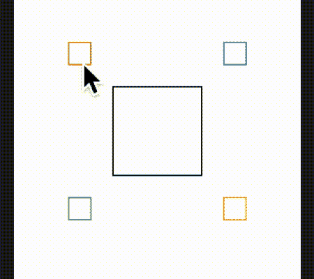

# 清理代码，在 SwiftUI 中重构

> 原文：<https://betterprogramming.pub/cleaning-code-refactoring-in-swiftui-6e288a05bc2d>

## 通过一个代码重构的例子

[詹姆斯哈里森](https://unsplash.com/@jstrippa?utm_source=medium&utm_medium=referral)在 [Unsplash](https://unsplash.com?utm_source=medium&utm_medium=referral) 上拍照。

让我们在开发一个虚构的客户简报时，尝试使用一些更好的编码实践。

*注意:我使用的是运行 SwiftUI 2.0 的 Xcode 测试版。如果你想浏览这些例子，你也需要同样的东西。*

# 案情摘要

我将使这变得简单明了，因为这是一个教程。这份简报需要五个盒子——一个大的在中间，四个小的在边缘。点击时，所有五个框都应该向其中一个较小的框的方向移动，如下所示:

客户的简报

# 解决方案

这看起来很容易。这是我们完成这项工作的代码初稿。一个快速简单的实现。注意，主循环的主体大约有 45 行。这是我们重构时需要解决的问题:

好吧，那我们是怎么做到的？嗯，我们简单地在一些`ZStacks`中创建了五个矩形，并添加了一些`onTapGestures`来在它们被点击时移动这些框。现在让我们试着让这段代码变得更好。

我们可以做的第一件事是确保我们没有使用幻数(即文字数字)。我们可以在代码中用常量替换它们:

这个看起来更好。没有所有数字的点缀，代码可读性要高得多。此外，您现在可以更好地理解这些数字所代表的含义。

接下来呢？浏览代码，有很多内容在重复。我们可以排除重新绘制方框的因素，并引入一个结构来激活手势:

这个看起来更好。正文现在减少到 25 行。我们能做得更多吗？嗯，我真的不喜欢用那些数学来移动那些`@State`变量的盒子。我想要一些稍微明显的东西，所以我创建了一个 enum 并将代码放入方法本身。使用枚举可以让事情变得更加明显。

我还在 principle 结构的范围内移动了绘制框的方法，因为我最初是在顶层声明它们的:

这个稍微好一点，但是我们没有在主循环上节省太多。接下来呢？我们需要微调封装，因为它的正式名称是。我添加了`public`和`private`，让它变得非常明显。

我还考虑了对齐的方向，因为我想在流程中引入一个循环，并减少传递给它的参数数量。对齐可以直接映射到方向，所以这正是我所做的:

# 结论

这就把我带到了结尾。虽然我们从 55 行开始，到 110 行结束，但是几乎所有的初始行都在主循环中——这个循环占用了不止一个屏幕。相比之下，我们的主循环现在只包含 11 行代码，它的逻辑使得理解正在发生的事情更加容易。

最后说一句:我确实试图将角点`var`和`align`构造成私有的。然而，我当时无法编译它，因为预览抱怨保护水平。我注释掉了预览，并能够采取这最后一步。遗憾的是，这个问题说明预览版确实存在一些弊端。

保持冷静，继续编码。