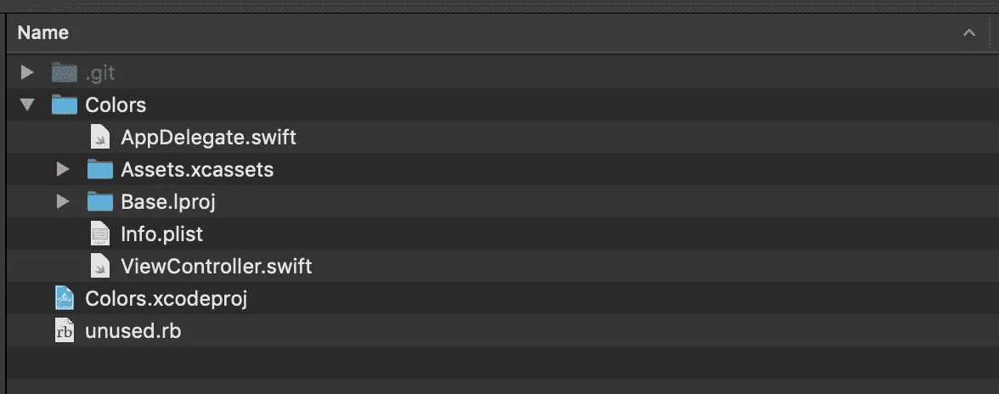
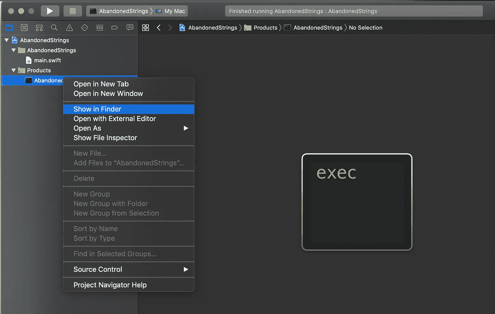

# 如何清理 iOS 项目中的资源

> 原文：<https://betterprogramming.pub/cleaning-up-the-resources-in-ios-project-1dad7e50bec1>

## 运行 Ruby 脚本来清理未使用的代码


[潘晓珍](https://unsplash.com/@zhenhappy?utm_source=unsplash&utm_medium=referral&utm_content=creditCopyText)在 [Unsplash](https://unsplash.com/s/photos/cleaning?utm_source=unsplash&utm_medium=referral&utm_content=creditCopyText) 上拍照

编写代码是一个迭代的过程。你编写了一个特定的功能，几个月后，需求可能会改变，你必须删除它。然后引入另一个新特征，该新特征可以再次被认为是不必要的。但这就是程序的生命:它需要随着时间的变化而变化，并更新以满足当前的需求。但是随着开发时间的推移，随着功能的增加和删除，我们经常会有未使用的资源，如`classes`、`variables`、`methods`、`image assets`和 `localized strings`，甚至`[**dead code**](https://en.wikipedia.org/wiki/Dead_code)**.**`、**、**，这只会增加我们的计算时间和内存。这也使得我们的代码难以维护。因此，偶尔清理代码并寻找那些案例总是好的。

是的，我们必须清理我们的代码，一年是一段很长的时间。

但这并没有听起来那么难。这并不是说我们必须深入每一行代码，找到那些未使用的文件和资源。有一些工具可以帮助我们做到这一点。今天，我将在这篇文章中列出几个我用在这方面的例子。如果你使用任何其他工具，请在下面的评论区告诉我，这样我也可以去尝试一下。

首先，让我们列出本文将要讨论的资源/文件。

1.  未使用的 swift 函数和变量。
2.  未使用的本地化字符串。
3.  未使用的图像资源。
4.  可视化项目中的依赖关系图。

所以让我们开始吧。

# 未使用的 Swift 功能和变量

为此我使用了一个 Ruby 脚本，你可以在这里找到。该脚本在指定路径搜索未使用的 swift 函数和变量。

转到[链接](https://github.com/PaulTaykalo/swift-scripts)并克隆存储库或下载 [unused.rb](https://github.com/PaulTaykalo/swift-scripts/blob/master/unused.rb) 文件，并将其放在项目的根目录下。



出于演示的目的，我制作了这个示例应用程序`Colors`，并在`**ViewController.swift**`中添加了一个方法`setUpCameraView()`，这个方法没有被任何地方调用过。

```
import UIKitclass ViewController: UIViewController {

    override func viewDidLoad() {
        super.viewDidLoad()
    } func setUpCameraView() { }}
```

现在打开终端，导航到项目目录，输入命令。

```
ruby unused.rb
```

上面的输出是:

```
Total items to be checked 6
Total unique items to be checked 6
Starting searching globally it can take a while
Item< func setUpCameraView [] from: Colors/ViewController.swift:22:0>
Item< class AppDelegate [] from: Colors/AppDelegate.swift:12:0>
Item< var window [] from: Colors/AppDelegate.swift:14:0>
```

因此，我们看到`setUpCameraView()`没有在应用程序中的任何地方被调用，并且可以安全地删除。

注意:如果该方法是私有方法，它就不会显示在结果列表中。不过，我们应该对此保持谨慎。

如果您希望未使用的`private`方法也显示在结果中，我们需要更新 ***unused.rb*** 文件。只需在文件第 11 行的行匹配列表中添加`**private func**` 。

```
if match = line.match(/(func|let|var|class|enum|struct|protocol|private func)\s+(\w+)/)
```

这样，我们就可以列出项目中所有没有使用过的`functions`、`constants`、`variables`、`class`、`enum`、`struct`、`protocols`。

你可以把它集成到 Xcode 中，也可以用*自定义构建阶段/运行脚本，*细节在回购本身中有解释。

# 未使用的本地化字符串

迭代后代码库中另一个未使用的东西是本地化的字符串。我们经常以它们结束，尽管它们在项目中的任何地方都没有被使用。为了去掉这些，我用 [***废弃字符串***](https://github.com/ijoshsmith/abandoned-strings)*by*[ijoshsmith](https://github.com/ijoshsmith)。该程序将从所有*中查找未使用的本地化字符串。给定路径中的字符串文件。

这个命令行程序的问题是，它仍然在 swift 3 中，但 [***空白***](https://github.com/blanksblanks) ***，*** 已经将它迁移到了这里的`swift 5`[](https://github.com/blanksblanks/abandoned-strings)*。*

*使用该命令行程序的步骤如下:*

1.  *首先克隆 [***项目***](https://github.com/blanksblanks/abandoned-strings) 然后运行它。*
2.  *产品文件夹中会生成一个可执行文件，通过在 Finder 中单击" S **how 导航到生成可执行文件的文件夹。***

**

*3.现在打开终端，将该可执行文件的路径作为终端的基本路径:*

```
*Ashwins-MacBook-Pro:~ ashwin$ cd /Users/ashwin/Library/Developer/Xcode/DerivedData/AbandonedStrings-gnlgdvyltxanfeeyscyegpweluex/Build/Products/DebugAshwins-MacBook-Pro:Debug ashwin$*
```

*4.之后，输入下面的命令列出项目中所有未使用的本地化字符串。*

```
*Ashwins-MacBook-Pro:Debug ashwin$ ./AbandonedStrings /Users/ashwin/Desktop/Personal/Colors/Colors*
```

*出于演示的目的，我添加了两个本地化的字符串，但是我没有在任何地方使用它。*

```
*"ViewController_title" = "Hello";
"ViewController_subtitle" = "Adios Amigo";*
```

*这给了我们结果:*

```
*Ashwins-MacBook-Pro:Debug ashwin$ ./AbandonedStrings /Users/ashwin/Desktop/Personal/Colors/Colors
Searching for abandoned resource strings…
Abandoned resource strings were detected:
/Users/ashwin/Desktop/Personal/Colors/Colors/Localizable.strings
ViewController_subtitle
ViewController_titleAshwins-MacBook-Pro:Debug ashwin$*
```

*因此，通过这种方式，我们可以列出项目中未使用的所有本地化字符串并删除它们。*

*注意:确保用于分析的子路径是您项目的文件夹，并且它不包括 Pods 文件夹，因为这样它也会试图在 Pods 中找到未使用的本地化字符串，这是我们不希望的。*

# *未使用的图像资源*

*为了列出/删除我的项目中未使用的图像资产，我使用了这个强大的命令行工具 [FengNiao](https://github.com/onevcat/FengNiao) 。你需要做的就是:*

```
*> git clone [https://github.com/onevcat/FengNiao.git](https://github.com/onevcat/FengNiao.git)
> cd FengNiao
> ./install.sh*
```

*注意:您需要在 macOS 中安装 Swift Package Manager(以及 Swift compiler)。*

*现在，只需导航到您的项目文件夹，然后输入命令:*

```
*Ashwins-MacBook-Pro:Colors ashwin$ fengniao*
```

*我们在整篇文章中使用的示例应用程序的输出，因为我们还没有添加图像:*

```
*Searching unused file. This may take a while...**😎 Hu, you have no unused resources in path: /Users/ashwin/Desktop/Personal/Colors.***
```

*现在让我们在`Assets.xcassets`中添加一个图像，然后再次点击该命令(但是我们没有在任何地方使用该图像):*

```
*Searching unused file. This may take a while...
**1 unused files are found. Total Size: 316.22 KB
What do you want to do with them? (l)ist|(d)elete|(i)gnore***
```

*可以→删除，列出，忽略。*

*当我想删除结果时，得到的回应是:*

```
***What do you want to do with them? (l)ist|(d)elete|(i)gnore** d
**Deleting unused files...⚙
1 unused files are deleted.
Now Deleting unused Reference in project.pbxproj...⚙
Unused Reference deleted successfully.***
```

*或者您也可以列出它们:*

```
***What do you want to do with them? (l)ist|(d)elete|(i)gnore** l
316.22 KB /Users/ashwin/Desktop/Personal/Colors/Colors/Assets.xcassets/sampleImage.imageset
**1 unused files are found. Total Size: 316.22 KB***
```

*这个命令有几个选项，我鼓励你去看看那些在回购的[**readme . MD**](https://github.com/onevcat/FengNiao/blob/master/README.md)**。**但是，我想指出的是，我们可以排除`Pods`和`Carthage`中的资产搜索。*

*我已经在列表中的项目中添加了*可视化依赖图，但我认为这篇文章已经足够长，可以在同一篇文章中解释依赖图可视化。要了解依赖图可视化，请查看这篇文章。**

*如果你有任何问题或建议，欢迎在评论区发表。*

*另外，如果你有其他的库或者工具，请在下面的评论区分享。*

*感谢阅读。*

*快乐编码🙂*