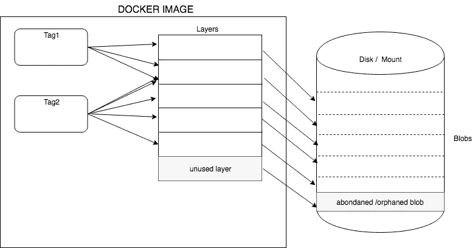

# 清理你的 Docker 注册表

> 原文：<https://betterprogramming.pub/cleanup-your-docker-registry-ef0527673e3a>

## 删除 docker 图像的未使用摘要，节省空间


清理 docker 注册表

如果您正在使用 docker 注册表推送持续更新，您可能已经注意到注册表的磁盘安装空间正在逐渐增长。

看起来是时候清理注册表了。下面是怎么做的。

# 首先，让我们熟悉一下行话

一个 docker *图像*可以有多个*标签*。每个图像都有一个*摘要*，这是一个唯一的值。当您对注册表中的同一个映像进行连续推送(包含更新的内容)时，注册表中的映像最终会有多个摘要。

一个*标签*由几个*层*组成。该特定摘要的层列表被称为*清单*。每一层都有相应的*斑点*。也可以有没有被任何标签使用的层-那些被称为*废弃的*或*未使用的*层。那些相应的斑点也没有被使用。我们可以删除它们来获得一些磁盘空间。



图像、标签、图层和斑点

如您所见，这些层在清单(标签)之间共享，每个清单都维护一个对该层的引用。只要一个层被一个清单引用，它就不能被垃圾收集。

在 *docker inspect* 命令之后，可以在 RepoDigests 下找到 docker repo 的摘要。

码头工人视察 my.docker.registry.com:5000/ubuntu:latest

```
"RepoDigests": ["my.docker.registry.com:5000/ubuntu@sha256:74a1b5f5c5d771cf3570fa0f050e0c827538b7fe1873bc88b85d56818df3f2bc"],
```

# 垃圾收集工

垃圾收集器是实际删除未使用的/被放弃的/孤立的 blobs 的人。

> 垃圾收集是从文件系统中删除不再被清单引用的 blobs 的过程。Blobs 可以包括层和清单。

[](https://docs.docker.com/registry/garbage-collection/) [## 碎片帐集

### 从 v2.4.0 开始，注册表二进制文件中包含了垃圾收集器命令。本文档描述了这是什么…

docs.docker.com](https://docs.docker.com/registry/garbage-collection/) 

为了让垃圾收集器删除 blob，我们需要使这些 blob 成为孤儿。我们可以通过两种方法实现这一点。

1.  使用 v2 注册表 REST API
2.  使用“rm”命令在文件系统中手动删除。

## 方法 01:使用注册表 REST API

为此，您需要知道 docker 图像名称和您想要删除的摘要。

**调用 rest API**

[](https://docs.docker.com/registry/spec/api/#deleting-an-image) [## HTTP API V2

### Docker Registry HTTP API V2 简介 Docker Registry HTTP API 是一个协议，用于促进

docs.docker.com](https://docs.docker.com/registry/spec/api/#deleting-an-image) 

```
curl -v -X DELETE http://registryhost:reigstryport/v2/${docker_image_name}/manifests/${digest}
```

*eg:curl-vk-X DELETE*[*https://my . docker . registry . com:5000/v2/mytestdockerrepo/manifests/sha 256:66675d 81 b 9 BD 5 eafc 105832 b 78 abb 91 cab 975 bbcf 028 ca 4 BC E4 AFE 73 f 66914 ee*](https://my.docker.registry.com:5000//v2/wso2is-analytics/manifests/sha256:66675d81b9bd5eafc105832b78abb91cab975bbcf028ca4bce4afe73f66914ee)

如果调用成功，应该会收到 202。

**然后运行垃圾收集器**

```
docker exec **registry** bin/registry garbage-collect --dry-run /etc/docker/registry/config.yml
```

**注册表** —注册表容器名。

## 方法 02:在文件系统中删除

你需要删除两个目录。

```
*rm -r <root>/v2/repositories/${name}/_manifests/tags/${tag}/index/sha256/${hash}**rm -r <root>/v2/repositories/${name}/_manifests/revisions/sha256/${hash}*
```

这里的<root>指的是这个注册表容器存储文件系统中所有数据的注册表挂载位置。</root>

例如:/var/lib/registry/docker/registry

如果您已经将它挂载到主机中的一个磁盘上，您可以从那里删除。否则，您必须使用 *docker attach* 命令连接到注册表容器并删除目录。

**然后运行垃圾收集器:**

```
docker exec **registry** bin/registry garbage-collect --dry-run /etc/docker/registry/config.yml
```

请注意，当使用方法 01 时，注册表容器应该有

*注册表存储删除启用=真*

当启动容器或在 docker 文件中时，您也可以使用-e 标记将它作为环境变量传递。

如果您使用方法 02，在删除这些目录时，docker 注册表应该处于只读模式。任何人都不应该去注册。