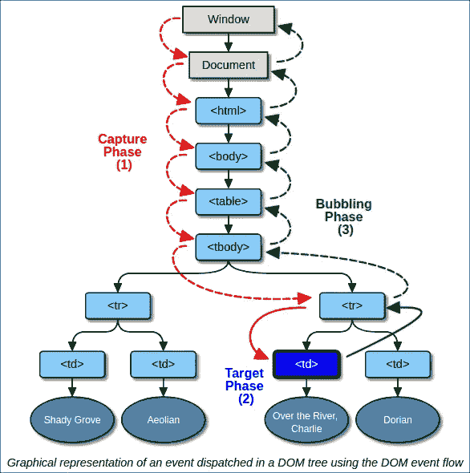
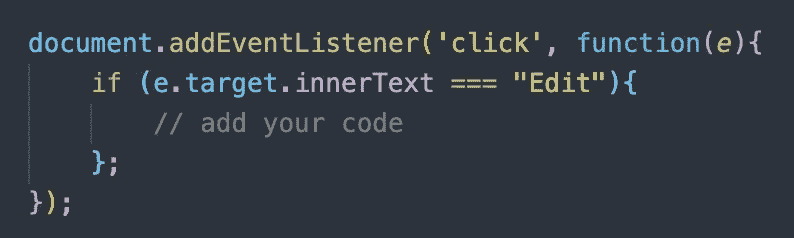
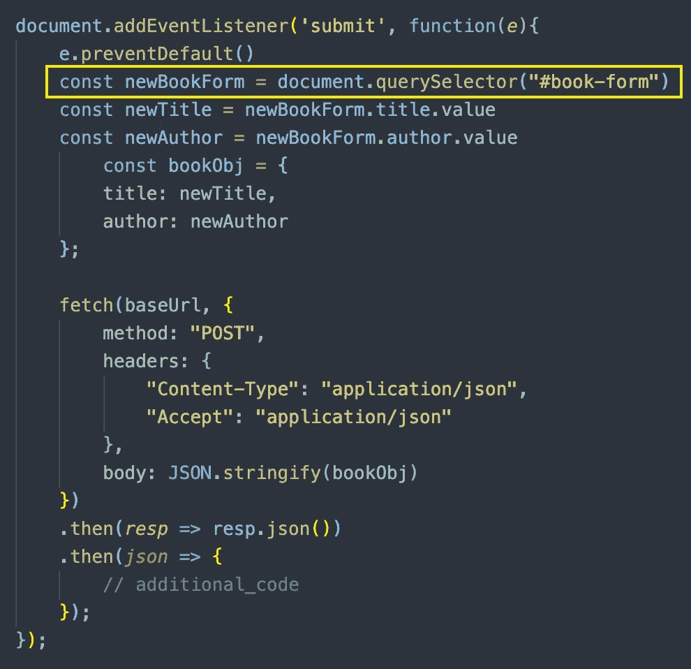
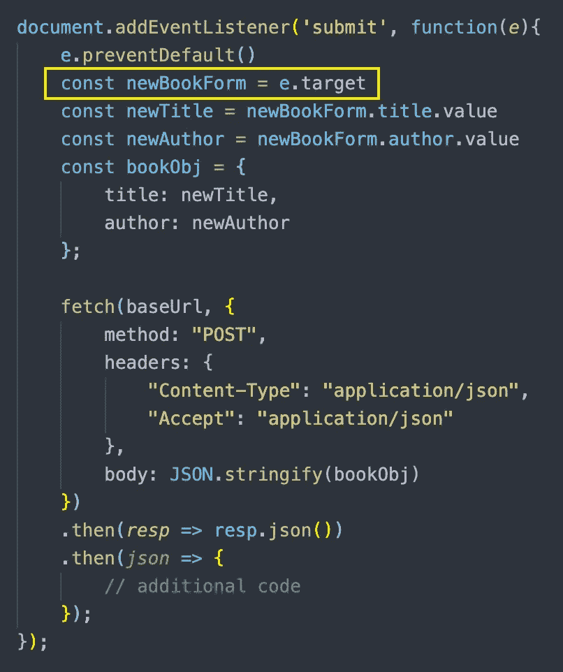

# 单击与提交事件侦听器

> 原文：<https://betterprogramming.pub/click-vs-submit-eventlisteners-536b62be9359>

## 何时以及为何使用每一种


由 [Roman Synkevych](https://unsplash.com/@synkevych?utm_source=unsplash&utm_medium=referral&utm_content=creditCopyText) 在 [Unsplash](/s/photos/mouse-click?utm_source=unsplash&utm_medium=referral&utm_content=creditCopyText) 上拍摄的照片

当我第一次开始学习 JavaScript 时，我接触到了`EventListener` s。这个概念很简单，但我最初很难完全理解何时以及如何正确使用它们。

当事件发生时，我们会识别。事件包括用户点击一个按钮，按下键盘上的一个键，提交一个表单，等等。这些`EventListener`对于使用 JavaScript 创建的任何应用程序都是有用且重要的。您用下面一行代码添加一个`EventListener`:

```
element.addEventListener(event, function, useCapture);
```

分解上面的代码:

*   `element`:这是你加`EventListener`的地方。
*   `addEventListener`:将事件处理程序添加到指定元素的方法。
*   `*event*`:事件的类型(即:“点击”、“提交”、“鼠标按下”)。
*   `*function*`:事件发生时我们想要唤起的功能。
*   `*useCapture*`:可选参数，给出一个布尔值，表示事件是通过事件捕获还是事件冒泡来执行。默认值是`false`，正在冒泡(由最里面的元素处理事件)。`True`正在捕获(最外层元素的事件处理)。



来源:[https://stack overflow . com/questions/1687296/what-is-DOM-event-delegation](https://stackoverflow.com/questions/1687296/what-is-dom-event-delegation)

# **点击事件监听器**

点击`EventListener`当你需要用户点击一个元素来访问额外的信息，进入一个表格，等等。例如，如果你想让用户点击“下一页”按钮进入下一页，你可以添加一个点击按钮`EventListener`。为此，您需要在 HTML 中找到适当的元素，添加`EventListener`，并让它调用一个将用户导向下一页的函数。

关键是找到与您希望用户点击的位置相对应的 HTML。你可以通过`innerText`、`tag`、`className`、`id`等找到它。但是，单击必须在您希望发生单击的元素上。例如，如果我想点击一个写着“编辑按钮”的按钮，我会使用下面几行代码:



单击事件侦听器

# **提交事件监听器**

提交`EventListener`用于用户将要提交的表单。因此，`EventListener`并不附属于提交按钮，而是附属于表单本身。最初，我一直试图将它附加到提交按钮，我的代码会变得不必要的长。

您所需要做的就是将`EventListener`添加到表单中，然后您就可以访问表单提交的任何信息。一旦有了数据，您就可以进行适当的修补或发布请求。如果有多个表格，那么你将需要在`EventListener`中指定。在下面的例子中，我使用了一个`querySelector`来查找合适的表单。



如果只有一个表单，那么您不需要使用`querySelector`，因为它将默认为当前唯一的提交表单。



`e.preventDefault()`是阻止提交`EventListener`的默认设置。

总的来说，确保`click` `EventListener`被附加到用户期望点击的元素上。`submit` `EventListener`应该附加到用户提交的表单元素上。

编码快乐！