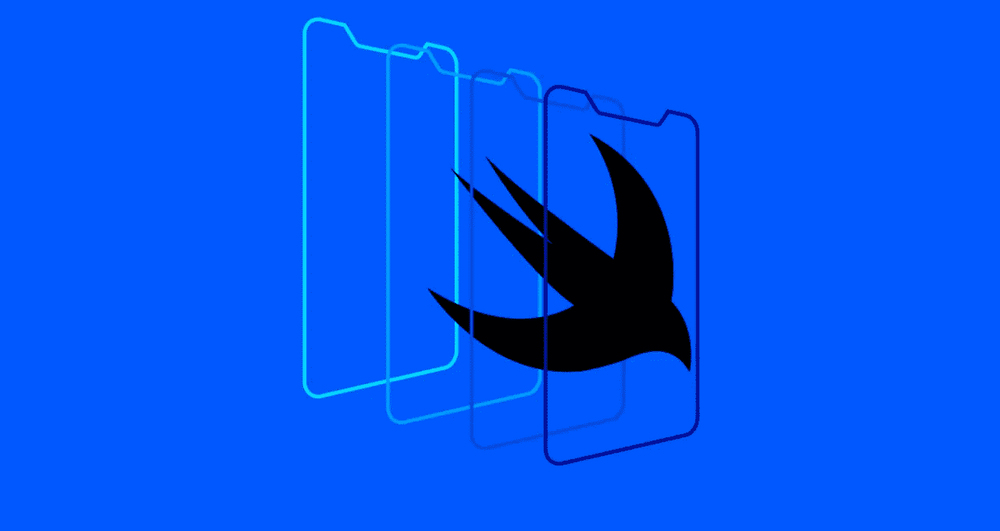
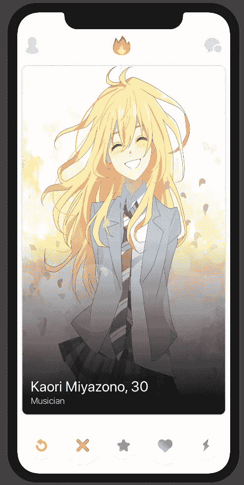
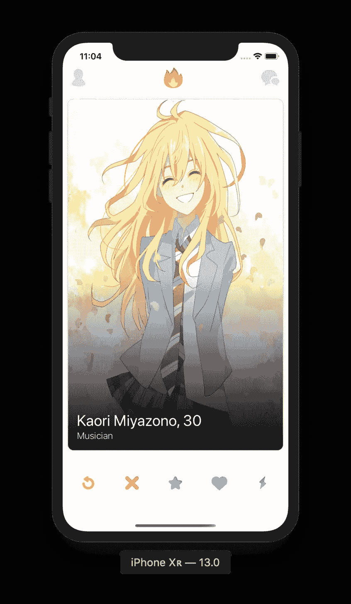

# 用 SwiftUI 克隆 Tinder

> 原文：<https://betterprogramming.pub/cloning-tinder-swiftui-29faed752be6>

## 了解如何使用 SwiftUI 创建真实世界的布局

你听说过苹果在 WWDC 2019 上发布的新 UI 框架吗？它叫做 **SwiftUI** ，感觉像魔术一样。

Mac，iOS，iPad，WatchOS，tvOS 开发者被炒作！

原因如下:

*   SwiftUI 兼容所有苹果平台
*   SwiftUI 是声明性的
*   SwiftUI 不仅仅是 UIKit 的一个包装器，它是新的并且是使用 Swift 构建的！
*   SwiftUI 不是基于故事板的！你好，代码评审:)
*   SwiftUI 取代了 AutoLayout——现在一切都基于堆栈视图

这已经很多了，而且由于整个社区已经在创建大量 SwiftUI 内容，甚至正在写书，我想重点介绍一个如何使用这个可爱的框架复制 Tinder UI 的实际例子。你准备好了吗？

# 重要的事情先来

当您使用 XCode 11 创建一个新项目并选中 **SwiftUI** 框时，它会附带一个内容视图文件:

这里有两件重要的事情需要澄清:

*   第一个结构是您编写视图/布局代码的地方。
*   第二个结构是您声明要预览的内容的地方。最后，我们有实时预览！

我们将构建一些组件，当你想检查它们的外观时，只需通过你想预览的组件来改变`ContentView()`内部预览变量。

## 这是我们今天想要实现的布局:

## 酷吧？这是一个垂直布局，由 3 个重要部分组成:

*   顶部组件包含三个水平对齐的按钮。
*   中间组件是用户图像和信息。
*   底部组件包含五个水平对齐的按钮。

## 顶部控件

我们准备好创建我们的第一个组件了！由于我们的界面有许多按钮，我们将从编写一个助手函数开始，该函数基于图像资产名称创建一个按钮。

酷！这将有助于我们，因为我们的第一个视图需要三个不同的按钮水平排列。姑且称之为 **TopStack:**

如果你熟悉 UIKit，一切看起来都很好，直到你读到 ***Spacer()。S*** 起搏器可用于填充堆栈项目之间的间隙，以适应剩余的视图空间。 **HStack** 应用于构建水平堆栈布局——如果您想进行垂直布局，请使用 **VStack** 。

这是我们的第一个结果:

## 底部控制

我们可以对底部控件做同样的操作，它包含五个不同的按钮。姑且称之为 **BottomStack** 。非常类似于第一个不是吗？

## 图像、叠加和渐变

看起来不错！让我们深入一点。现在我们需要建立顶部和底部控件之间的视图，它应该是什么样子的呢？基本上，我们想要一个圆角的图像，但有一个额外的细节:如果我们想显示用户信息，如姓名和年龄，我们需要在底部有一个小的黑色渐变。我们的字体颜色是白色的，如果图像很亮，渐变可以让我们看到用户的名字。我们可以称之为`UserImageView` **。**

所以，这里有一些新的东西！图像…可调整大小？好吧…为什么？这是因为我们的图像需要填充顶部和底部控件之间的整个空间！

叠加呢？我们在图像上方显示用户信息，所以我们需要用渐变图层覆盖图像——我们可以使用不同的形状作为图层，例如圆形和矩形。现在，让我们建立一个矩形，并用渐变填充它。我们的渐变在中间开始清晰，在底部结束黑色。

检查结果:

## 用户信息

现在我们想在图片上方显示用户的姓名、年龄和职业。这个视图叫做`**UserInfoView —**` 检查下面的代码:

上面这个人开始创建一个包含一个分隔符和两个文本组件的垂直堆栈。这里我们再次需要间隔符，因为它将我们的用户信息保存在堆栈的底部。我们还想添加一些填充，从视图边界创建一些空间。

## 是时候将 UserImageView 和 UserInfoView 结合起来了！

让我们创建`CardView`，包含用户图像和信息:

我们希望`UserInfoView`在`UserImageView` 之上——用`ZStack`在 SwiftUI 上很容易实现。我们使用`HStack`和`VStack`来水平和垂直堆叠视图，`ZStacks`用于堆叠视图。在文件的最后，您可以看到使用 SwiftUI 添加阴影是多么容易。

结果如下:

## 压轴戏

让我们将**内容视图**中的三个组件结合起来，得到最终的布局:

这是什么？基本上，我们将三个组件垂直堆叠，每个组件之间的高度间隔为 20。我们还为`TopStack`和`CardView`添加了一些水平填充，最后为`VStack`添加了一个底部呼吸。

## 决赛成绩

在`ContentView`文件中，通过`ContentView()` 改变你的预览结构，我们就完成了！

这是我们使用 SwiftUI 制作的漂亮布局:

[源代码](https://github.com/davidgdoll/tinder-clone-swiftui)