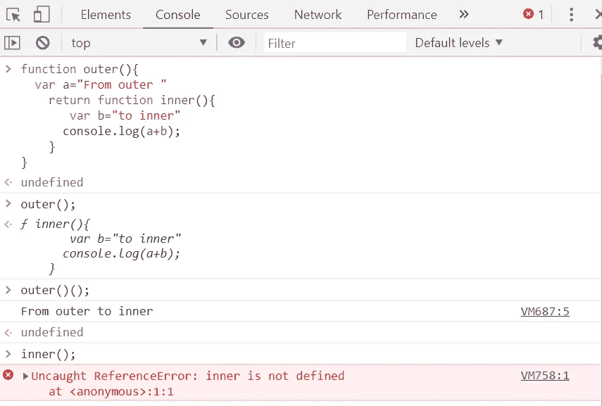

# 面向初学者的 JavaScript 闭包

> 原文：<https://betterprogramming.pub/closures-in-javascript-for-beginners-a61c5162b599>


克里斯汀娜·戈塔迪在 [Unsplash](https://unsplash.com/search/photos/closure?utm_source=unsplash&utm_medium=referral&utm_content=creditCopyText) 上拍摄的照片

当您第一次开始学习 JavaScript 时，闭包看起来相当吓人，这并不奇怪。但是它们实际上非常简单——让我们看看如何实现。

```
function outer(){
  var a="From outer "
    return function inner(){
       var b="to inner"
      console.log(a+b);
    }
}
//outer();
//outer()();
//inner();
```

如果你熟悉函数，闭包只不过是利用先前返回的外部函数中的变量的函数。首先，复制上面的代码，并在控制台中运行它。你认为调用各自的函数调用的结果会是什么？



当我们调用`outer()`、*、*时，我们得到了内部函数。当我们调用`outer()()`，时，我们在控制台上得到两个串接的字符串。当我们调用`inner()`时，我们得到了一个错误。

让我们看另一个例子:

```
function outer(){
 var a=10;
   return function inner(){
     console.log(a*10);
    }
}
outer()();
```

您可能会发现使用`()()` *调用函数很奇怪。但是这是闭包和嵌套函数在语法上的本质区别。*

上面的两个例子展示了两个不同的特征——一个是调用的方式，另一个是*`return`关键字的存在。它真正的意思是，在外部函数返回很久以后，内部函数还可以访问外部函数的变量。*

*假设你想写一个简单的函数来乘两个数。一个显而易见的方法是:*

```
*function multiply(a,b){
    return a*b;
}
multiply(3,5);*
```

*让我们试试另一种方法。*

```
*function multiply(a){
   return function(b){
     return a*b;
   }
}
multiply(3)(5);*
```

*第二种方法利用了闭包，其中我们在封闭范围内引用局部绑定的特定实例，并返回内部函数。*

```
*function add(a){
  function(b){
     return a+b;
  }
}
add(8)(7);*
```

*如果您首先运行上面的代码，您会得到一个错误，说“函数语句需要一个函数名”，随后又是一个错误说“add(…)不是一个函数。”这是因为我们还没有返回内部函数。因此使用`()()`进行调用是没有意义的。如果您删除一对`()`，它将返回“undefined”，这是应该的，因为您实际上并没有返回任何东西。*

*差不多就是这样。它们是嵌套函数，内部函数利用外部函数的变量。并且记得在内部函数之前添加 return 关键字。*

# ***让我们来看看闭包的实际应用***

*闭包可以用来创建私有变量。私有变量是不能从外部修改的变量。*

*让我们看另一个例子来理解这一点。比方说，您想计算用户点击按钮的次数。*

```
*<button onclick="clickCount()">click me!</button>*
```

*你可以使用一个全局变量`(cnt)`来计数。*

```
*var cnt=0;
function clickCount(){
 cnt++;
}*
```

*但是这里有一个小问题:页面上的任何脚本都可以改变我们的变量`cnt` 的值，甚至不用调用函数`clickCount()`。*

*这不是一个真正的问题——让我们在函数内部声明`cnt` 就可以了。*

```
*function clickCount(){
var cnt=0;
cnt++;
}*
```

*但是现在每次调用那个函数，`cnt`总是从 0 开始。所以让我们用嵌套函数来代替。*

```
*function cntWrapper() {
    var cnt = 0;
    function clickCount() {
    cnt++;
    }
    clickCount();    
    return cnt; 
}*
```

*记住嵌套函数可以访问它们上面的作用域。要调用内部函数，你必须调用外部函数，同样，你的计数器变量每次都从 0 开始。看来我们又回到起点了。如果我们能从外部调用内部函数就好了。*

## ***输入结束(双关语)***

```
*var updateCnt=(function() {
    var cnt = 0;
    return function() {
    cnt++;
    return cnt;
}
})();*
```

*我们创建了一个只运行一次的自调用函数，将`cnt`初始化为 0，并返回一个函数表达式。*

*我们的函数绑定可以访问父作用域中的`cnt` 。您会注意到，每次您调用`updateCnt()`时，您的计数器都会将之前的值加 1。如果你在控制台上输入`cnt`，你会得到一个错误，说它没有被定义。因此，我们的`cnt`变量，现在是安全的，本质上是一个私有变量，受匿名函数的保护。*

*这就是你需要知道的关于闭包的一切！*