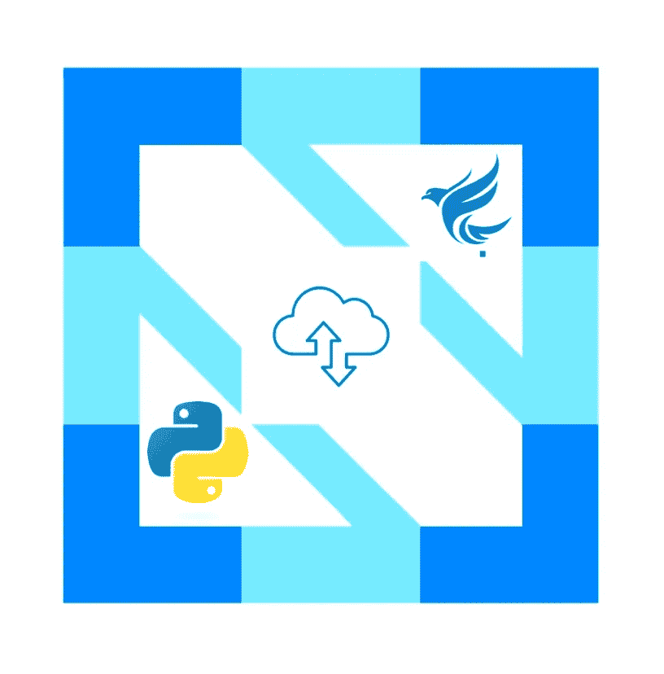
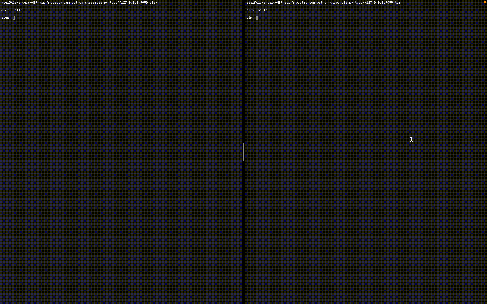

# 使用 Pravega 的云原生事件流

> 原文：<https://betterprogramming.pub/cloud-native-event-streaming-with-pravega-f353cb010c64>

## 构建高效的流媒体系统

作者图片| Python 和 Pravega 的徽标

所以，最近我利用网络套接字建立了一个有趣的小 FastAPI 聊天室，我很喜欢它。然而，我想到了 web sockets，以及在过去几年中有多少研究进入了流媒体服务。web 套接字仍然是未来的发展方向吗？如果没有，有什么新的工具可以帮助促进这一过程？

我以前用过卡夫卡，对 RabitMQ 也隐约熟悉，但还有什么呢？！

所以，我去了 CNCF 沙盒，看看我是否能找到新的东西来玩。一些存储，一个简单的接口，并希望一些 python 绑定，我可以相对容易地挂钩。我在 CNCF 的沙盒中发现了两个非常诱人的流媒体服务，似乎符合这个要求:

*   [普拉威加](https://www.cncf.io/projects/pravega/)
*   [震颤](https://www.cncf.io/projects/tremor/)

我之所以选择 Pravega，是因为它非常容易启动和运行，具有独立和分布式模式，看起来非常高效，并且具有自动伸缩功能(我是 SRE，非常喜欢自动伸缩)。还有很多其他的好特性，我鼓励你去看看。

那么，为什么是聊天室？嗯，只要我发送一条消息，用户就应该被提醒这条消息，然后有能力作出回应。这听起来像是基于事件或流系统的完美用例！那么，我们开始吧。

# 普拉维加

什么是 Pravega？Pravega 是一个开源的流和存储实用程序，承诺无与伦比的性能、长期存储和自动伸缩。这听起来是不是很适合聊天室？

在我们的聊天室中，我们将使用它来代替基本套接字、网络套接字或其他流行的聊天室媒介。

# 运行 Pravega

运行 Pravega 有多种方式，但我只是将它作为一个独立的容器来运行。配置 Pravega 也有很多方法，比如出于可靠性的目的，将单独的部分分布在不同的容器中(这是我在生产系统中推荐的)。但是，为了方便起见，我们将在独立模式下运行它:

就是这样。现在您将看到 Pravega 在终端中运行，准备接受连接！

# StreamCli

我们将把我们的 Python 应用程序称为 StreamCli。这将是一个易于运行的 CLI，它以读写能力连接到一个 Pravega 代理。Slack 还启发我加入了一些“斜杠命令”,以帮助我们最大限度地减少常见任务(问候、笑话等)的输入。).

要实现这一切，我们需要以下条件:

*   从 Pravega 流中读取并对消息进行操作的内容
*   接收用户输入并将其写入 Pravega 流的东西
*   管理读者和作者的东西

这听起来很多，但我保证这很快，很容易，只有 200 行代码。

# 读者

让我们从读者开始，因为它是最复杂的。过了这一关，就全走下坡路了。在实际发送消息之前，我们应该就消息的格式达成一致。这样，无论发送什么，都可以在流的接收端得到正确的处理。为此，我们可以使用 pydantic 模型:

这定义了一个 python 对象，它有两个字符串属性:

*   发送者:发送用户的 ID
*   消息:消息的内容

Pydantic 模型有大量的助手与之相关联，例如:

*   JSON 函数
*   解析函数
*   更加

既然我们已经就消息格式达成一致，我们可以开始编写我们的阅读器了。我们的读者将需要两个属性:

*   一个 ID，这样它就知道它是为谁接收的
*   Pravega 读取器实例，以便它可以附加到流

它的定义和初始化很简单。代码如下:

从逻辑上讲，我们需要一种方法来:

*   从溪流中阅读
*   根据信息采取行动
*   当它完成监听时告诉流(关闭连接)

我们可以通过使用 Pravega 实例从流中读取。Pravega 将消息组织成称为`slices`的东西。切片是段的一部分，段是流的碎片或片段。一旦我们从段中读取了那个片，我们需要通知 Pravega 它已经被处理了，不应该被同一个读取组再次处理。最后，我们需要处理这个切片，做一些可操作的事情。因此，在代码中，我们的`read`函数看起来像这样:

注意，我们首先使用`get_segment_slice_async`从片段中读取一个片段。一旦我们从该段中读取了所有数据，我们就让 Pravega 知道这个读者组已经处理了消息，并且不需要这个读者组用`release_segment`再次处理。最后，我们用`_process_message`处理消息(稍后会有更多介绍)。

既然我们已经阅读了一条信息，我们需要用它做一些可操作的事情。这就是`_process_message`发挥作用的地方。从逻辑上讲，我们的`_process_message`函数必须:

*   将消息从其格式解析为我们的消息格式
*   以某种方式处理它
*   将它显示给接收用户

值得注意的是，我想在我的聊天系统中添加两个特殊的命令:

*   关键字`greet`应该通过说`<Sending User> says hi!`来问候用户。
*   关键字`joke`应该告诉接收用户一个随机的笑话

所以我们的`_process_message`函数变成如下:

注意我们是如何首先从 JSON 格式加载消息的。它将作为(下面讨论的)我们想要的消息格式发送。接下来，因为我们正在读和写一个流，我们想确保我们不是写给自己。最后，我们利用所需的格式处理消息，并将其返回给调用者。为了完整起见，`_tell_joke`和`_greet`功能如下所示:

最后，我们需要一个 close 方法来告诉 Pravega，“这个侦听器完成了，将从聊天室中删除！”：

就是这样！我们现在有了一个对象，它可以从流中读取数据，并根据从流中接收到的消息执行半智能操作。

# 作者

作者比读者简单得多。它需要两条信息:

*   它的 ID
*   Pravega 编写器实例

它的定义和初始化如下:

它只需要一两种方法:

*   一个用来框定信息
*   一个发送消息

让我们来看看如何构建信息。

因此，看看这个，我们创建一个 pydantic 模型(称为`Message`)并输入所需的信息。最后，我们将其作为 JSON 字符串返回，通过流发送。作为旁注，在讨论阅读器时，我们简要地看了一下`Message` pydantic 模型。

最后，我们可以发送消息。看起来是这样的:

我们看到，我们构造消息，然后通过 Pravega writer 实例发送出去。

# 潺潺流水声

所以，我们有我们的读者，我们有我们的作者。为了聊天，我们需要将两者结合成一个干净的对象。我们将称该对象为我们的`Chatter`(参见下面的定义和初始化):

我们的 chatter 对象将维护它的读者和作者，并通知他们使用`running`属性关闭(稍后将详细介绍)。

从概念上讲，我们的 chatter 将需要与其成员相同的功能。即:

*   一个 read 函数来告诉读者做它该做的事情
*   一个写函数，告诉作者做它的事情
*   优雅地终止其片段的 close 函数

我们也不想要一个阻塞系统(在写之前强制读)，所以我们将为读者和作者使用不同的线程。

chatter 对象中的 read 函数比 reader 对象中的函数简单得多，因为它所要做的就是等待`reader.read`方法返回、格式化并打印出来:

您会注意到，当我们完成运行时(`self.running`为假)，我们将自动关闭我们的阅读器。

在这个意义上,`write`方法是相似的。它只需要接受用户输入并将其发送给编写器。看起来是这样的:

然后，我们的 close 方法只需终止这些循环，读取器将被优雅地关闭:

我们可以用线程将所有这些部分捆绑成一个漂亮的并发包:

如果我们对此进行进一步分析，我们可以做到以下几点:

*   创建一个读者线程。因为 read 是一个异步函数(所以它不会阻塞)，我们需要用`asyncio`包装我们的目标。该线程将运行异步回调。
*   创建编写器线程。编写不是异步的，因为我们必须等待用户输入。所以我们可以在这里使用典型的线程目标。
*   开始我们的线程！

# 把这一切联系在一起

最后，我们将它们结合在一起，打包成一个 CLI。有很多很棒的 Python 参数解析工具。这里有三个很棒的:

*   [argparse](https://docs.python.org/3/library/argparse.html)
*   [点击](https://click.palletsprojects.com/en/8.1.x/)
*   [docopt](http://docopt.org/)

今天我选择了`docopt`,因为它易于使用，并且减轻了程序员的负担。`docopt`将解析我们的文档字符串，然后基于它生成参数。我们的 docstring 看起来像这样:

因此`docopt`将解析它，创建一个可能参数的字典，然后我们可以相应地对它们进行操作。

我们的主要功能就是这样做的。`Main`将:

*   解析我们的 docstring 并分析用户提供的参数
*   创建一个 Pravega 流管理器、作用域、流、读取器和写入器
*   创建我们的读者和作者包装
*   创建我们的聊天
*   开始聊天

重要的部分是 Pravega API 调用。我们首先创建一个`StreamManager`，它允许我们为 Pravega 集群运行一些管理任务。然后，我们创建或使用一个类似于名称空间的作用域。然后，我们在该范围内创建一个流，并在该流和范围内创建一个读者组。每个用户都有自己的读者群，这意味着当`userA`从流中读取时，`userB`和`userC`不会受到影响。最后，我们创建单独的读取器和写入器，以便能够显式地从流中读取和写入。

# 运转

我们现在准备运行！

在一个终端中，确保您的 Pravega docker 映像正在运行！如果没有，您可以运行以下命令:

现在，打开另外两个终端。其中一个运行`python streamcli.py tcp://127.0.0.1:9090 alex`，另一个运行`python streamcli.py tcp://127.0.0.1:9090 tim`，开始来回聊天！

看下面的视频！

# 参考

所有代码都可以在我的公开回购中找到，链接[https://github.com/afoley587/cloud-native-streaming](https://github.com/afoley587/cloud-native-streaming)。