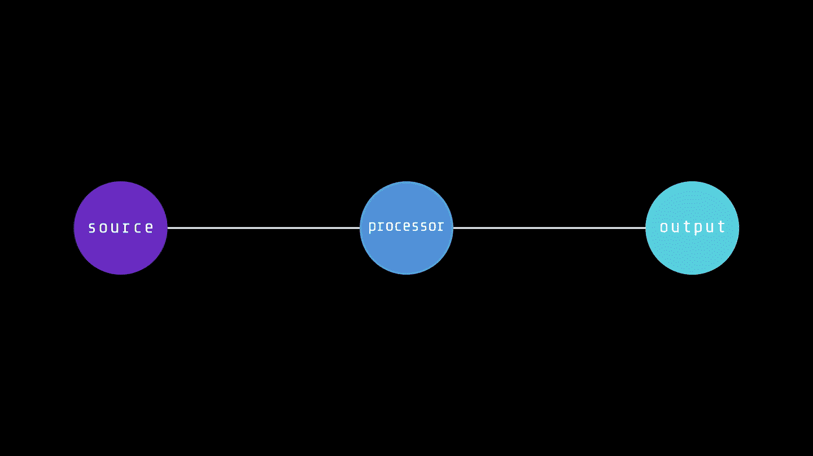
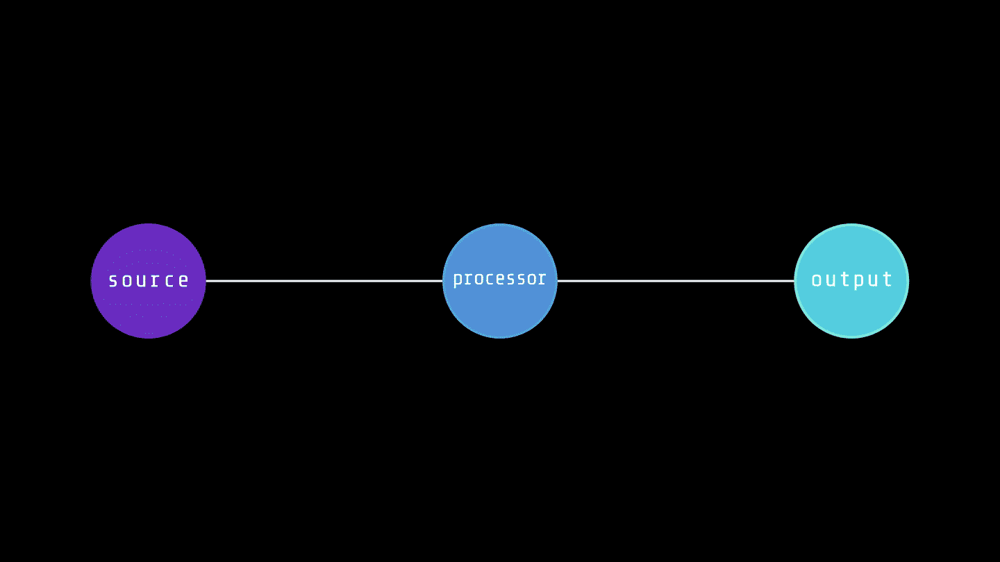
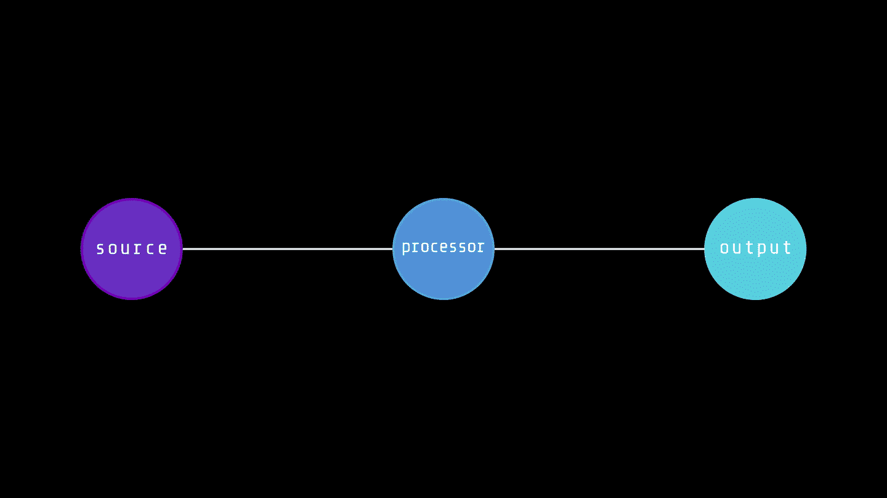

# 图解云本机模式:扇入和扇出

> 原文：<https://betterprogramming.pub/cloud-native-patterns-illustrated-fan-in-and-fan-out-daf77455703c>

## 单处理器的数据管道最终会遇到瓶颈。让我们使用带有扇入/扇出队列的并发处理器！

我从 cs 毕业后开始阅读技术书籍，以拓宽我在许多主题上的知识，如系统设计、低级 CS、云原生等。现在我正在读[云原生 Go](https://www.oreilly.com/library/view/cloud-native-go/9781492076322/) ，它用 Go 的好处流畅地介绍了云原生世界。这本书从 Go 基础知识和云原生模式开始，这就是我认为“我应该写这些模式的地方！”。

在这一系列的博客文章中，我将写下我所学到的云的原生模式——还会用 [Manim](https://www.manim.community/) 来举例说明。

# 问题是

假设我们有一个常量数据源(比如一个 Go [通道](https://go.dev/tour/concurrency/2)，我们需要处理数据，并将处理后的数据放入一个延迟尽可能低的目的通道。

在一般情况下，我们有一个位于源和目的地中间的处理器功能，它一个接一个地处理数据包(为简单起见，这里的数据包是一个抽象)。



单处理器数据流水线动画

然而，每个处理功能都有延迟。这可能是因为网络或 CPU 的使用、阻塞系统调用等。如果我们每秒向处理器函数发送足够多的数据包，瞧！我们现在有一个瓶颈！



具有拥塞的单处理器数据流水线的动画

# 解决办法

这个问题有一个相当简单的解决方案:在数据管道中使用多个处理器。这样，我们可以同时处理数据流，从而降低整体延迟并减少管道拥塞。



多处理器数据流水线动画

# 这就是扇入和扇出的由来…

我们可以通过利用共享内存(比如消息队列)来实现这个解决方案。

通过这种方法，我们将把传入的数据包分成不同的输入队列。然后，每个队列自己的处理器将逐个获取数据包，处理数据，并将处理后的数据放入其相关的输出队列中。最后，目的地(另一个处理器、队列或一些其他系统)将从每个输出队列中获取处理过的数据包，并将它们聚合到单个数据源中。

第一种方法，将数据源(输入)分割成多个数据源(输入队列)，称为`Fan-out`模式。第二种，将多个数据源(输出队列)聚合成一个数据源(目的地)称为`Fan-in`模式。

> *为了简单起见，我们为管道中的每个处理器指定了一个输入队列和一个输出队列。根据整个系统的需求，我们可以在每个处理器上使用多个输入/输出队列，或者在几个处理器之间使用一个共享队列。*


具有输入和输出队列(通道)的多处理器数据流水线的动画

# Go 实现

让我们用一些并行的 Go 弄脏我们的手！首先，让我们定义我们的数据源:

函数`stringGenerator`创建一个只接收字符串的通道，创建一个 [goroutine](https://go.dev/tour/concurrency/1) 将前缀字符串放入通道，并返回通道。我们在后面的扇出代码中读到了这个通道。

我们的处理器功能也相当简单:

在处理器函数内部，我们将随机等待一段时间来模拟处理器延迟。

# 扇出实现

在扇出实现中，我们将采用一个只收通道，并返回一部分只收通道:

在`Splitter`函数中创建的 Goroutines 将处理数据路由逻辑。注意，在 goroutines 中，我们使用了一个单一的`range`语句来从`source`通道接收:

```
for data := range source {
 dest <- data
}
```

这意味着每个 goroutine 将尝试从循环中的通道读取，第一个读取的将接收下一个项目。换句话说，**每个 goroutine 将争夺下一个数据实例**。

我们可以使用一个集中的解决方案来实现扇出，而不是相互竞争的 goroutines。在这种情况下，我们将定义一个`master process`在所有输出通道中分配每个输入数据实例(在我们的例子中是`string`)。

# 扇入实现

在扇入中，我们将基本上执行与扇出相反的操作，有一些不同之处:

`Aggregator`函数获取一部分只接收输入源，并返回一个只接收输出通道。在内部，我们为每个输入源创建了一个 goroutine，它不断地从源读取数据，并用接收到的数据填充输出通道(`destination`)。

注意，我们使用了一个`sync.WaitGroup`来等待聚合器 goroutines 完成。输入源(`channel`)关闭后，各 goroutine 内的 for 循环将结束，并完成其工作。

关闭所有输入源后，我们就完成了聚合，现在可以关闭目标通道了。**这是至关重要的一步**，如果我们不关闭我们创建的通道，Go 运行时将报错一个致命错误:

```
fatal error: all goroutines are asleep - deadlock!
```

# 主()

把我们所有的函数放在一起，我们准备运行我们的代码:

# TL；速度三角形定位法(dead reckoning)

*   单处理器的数据流水线最终会遇到瓶颈
*   将输入源分成几个队列并同时处理是很有帮助的
*   这种拆分-处理-聚合模式称为扇入/扇出

感谢您的阅读。

```
**Want to Connect?**

This story was originally posted at https://www.sazak.io/cloud-native-patterns-illustrated-fan-in-and-fan-out/
```