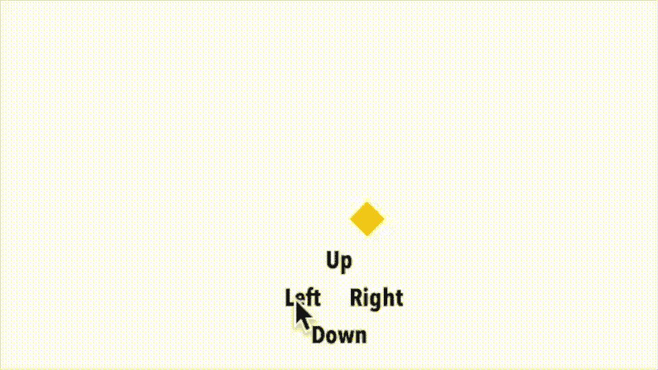

# 使用 SwiftUI 编写一个带有按钮控件的贪吃蛇游戏

> 原文：<https://betterprogramming.pub/code-a-snake-game-with-button-controls-using-swiftui-ee1096f220e0>

## 看看如何建立另一个经典游戏



SwiftUI 中的蛇游戏

前几周，我发表了一篇 [*文章*](/build-a-tetris-game-using-swiftui-c8c9b1722259) ，讲述了我构建俄罗斯方块游戏《挑战》的旅程。你可以在这里读到它。俄罗斯方块之前的另一个类似但不同的游戏；另一个更简单的经典实现是贪吃蛇游戏。和我一起在这篇短文中使用 pure SwiftUI 构建您的贪吃蛇游戏副本。

# 游戏

最直接的说法是，贪吃蛇游戏只不过是一个正方形。你必须浏览屏幕来“吃掉”随机出现在屏幕上的单个方块。当你吃这些单个的时候，蛇会吸收它们，变得稍微长一点。

面临的挑战是，当蛇变长时，它不能撞到身体两侧或自身；随着蛇变得越来越长，游戏变得越来越难，并且这种实现的情况也变得越来越快。

# 组件

首先，我需要一个循环，因为蛇在不断移动，所以像这样的计时器是显而易见的选择。

```
var timer = Timer.publish(every: 0.5, on: .main, in: .common).autoconnect()
```

除此之外，我需要一个代表蛇的每个部分的视图。需要记住其位置的视图。

在游戏的主循环中，我需要在蛇前进的过程中绘制蛇的一部分；只有当你设法吃掉一条蛇的时候，这条蛇本身才会变大。

注意，定义该数组第一个条目的代码与 snake body 结构相同。但是我不能使用这个结构，因为在编译器想要初始化这里的`[@State](http://twitter.com/State)`变量之前，这个结构还没有被初始化。

在同一个循环中，我画了一个不同颜色的方块，代表蛇成长必须吃的食物，有一个我需要注意的重要警告；食物的位置必须存储在一个`[@State](http://twitter.com/State)`变量中，我可以将这个变量与蛇头匹配。

```
ZStack {
  ForEach((snakeStart..<snakeParts.count), id: \.self) {
    snakeParts[$0]
  }
}.id(snakeCount)
```

最后，我需要一组控件，通过它们我可以向蛇发出信号，告诉它们需要改变方向，这里唯一稍微有点不寻常的代码是一个最小时间为零的`longPressGesture`—也就是触摸。类似这样的代码。

```
Text("Up")
  .font(Fonts.avenirNextCondensedBold(size: 24))
  .onLongPressGesture(minimumDuration: 0) {
    snakeDirection = .up
  }.padding()
```

我没有提到，但是你可以在这里看到。我还用我的四个方向创建了一个枚举，使事情更具可读性。

# 玩游戏

现在，随着计时器开始计时，我需要通过创建一个新的线段来移动蛇的头部，其方向与之前命令的方向相同。我用这段代码做的一个任务。

随后，我向数组中添加了一个片段，假设他没有吃掉方块中的食物，将切片向上移动一个。

```
let newPart = SnakeBody(snakeHead: snakeHead)
snakeParts.append(newPart
  .eraseToAnyView())
snakeStart += 1
```

`eraseToAnyView`是我在这篇[论文](/16-useful-extensions-for-swiftui-88aae6ff8909)中谈到的标准扩展之一。bon——现在，当你设法消耗一些蛇食时，我需要做两件事——我需要创建和放置更多的食物，我想让它变得更复杂一点，所以我将计时器缩短了几纳秒。

请注意，我为`rndX`和`rndY`值准备的这些奇怪的神奇公式就是这样，因为我需要确保每一口食物都放在一个 X/Y 位置，这样我就可以与我移动的蛇头相匹配。

所有这一切让我结束了——我想我让它听起来比实际上要简单一点——我不能否认，最终我花了几个小时才把它弄好。

你可以在这里找到完整的代码[](https://gist.github.com/19310c888105e3a53316f4354d1d1812.git)*——如果你想尝试创建自己的贪吃蛇游戏版本。*

# *将来的*

*当然，它还没有完全完成——我留给你们做最后的挑战。*

*   *目前，蛇可以从屏幕上消失；一些边界检查需要添加到代码中，这是一个游戏结束的条件。*
*   *同样的，蛇可以撞上自己而没有后果，这是你需要添加的第二个游戏结束条件。*
*   *最后，当游戏结束时，某种分数和/或消息将是好的，这样玩家可以看到他们是否变得更好。*

# *病菌*

*现在，虽然这个小应用程序在 iPhone 14 和 12.9' iPad Pro 模拟器上运行得很好，但在我的 iPhone 8 上却不能正常运行。它失败是因为寻找蛇捕获食物的 if 语句太精确；读者们，对你们来说，最后一个挑战是添加一个稍微宽容一点的函数，看看坐标是否足够匹配！*