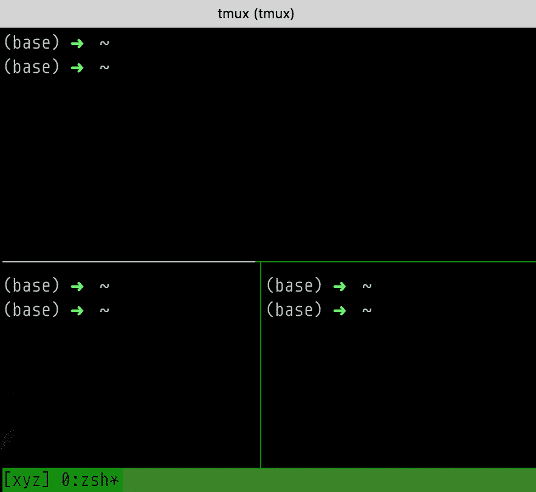
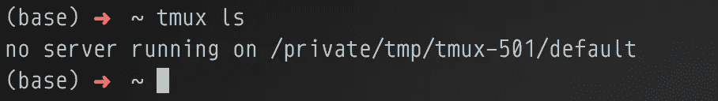
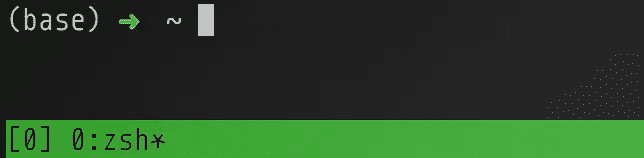
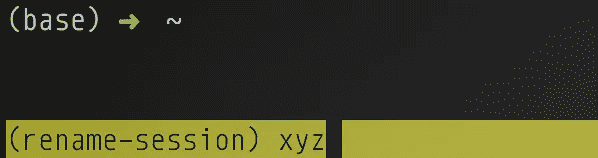
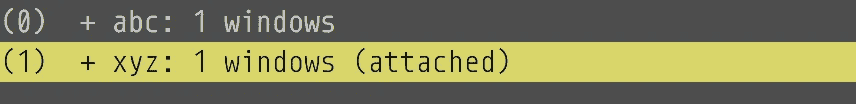
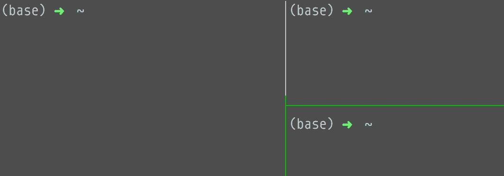

# 使用终端多路复用器 tmux 提高编码和开发效率

> 原文：<https://betterprogramming.pub/code-and-develop-more-productively-with-terminal-multiplexer-tmux-eeac8763d273>

## tmux 教程和基本命令介绍



作者的 iTerm2: tmux 会话的屏幕截图，带有分割窗格。

如果您经常使用命令行并连接到服务器，tmux 将帮助您更高效地编码和开发。它在您的终端中充当窗口管理器，确保您的流程即使在您与服务器断开连接后也能继续运行。

# 为什么要用 tmux？

tmux ( **t** 终端**mu**ple**x**er)让你从一个终端窗口创建和使用多个终端。更多信息请访问 GitHub 上的 [tmux。如果你对具有多路复用功能的笔记应用感兴趣，一定要去看看 Obsidian:](https://github.com/tmux/tmux/wiki)

[](https://medium.com/swlh/take-better-notes-with-this-free-note-taking-app-that-wants-to-be-your-second-brain-1a97909a677b) [## 使用这个免费的笔记应用程序做更好的笔记，它将成为你的第二大脑

### 黑曜石使连接想法变得容易，并帮助你更好地思考和写作

medium.com](https://medium.com/swlh/take-better-notes-with-this-free-note-taking-app-that-wants-to-be-your-second-brain-1a97909a677b) 

tmux 允许您在服务器上持续运行任务，因此您可以安全地断开/分离和重新连接/重新挂接，而不会中断这些正在运行的任务。

例如，如果您突然失去了与服务器的连接，任何在 tmux 会话中运行的进程都将继续运行。您可以通过重新连接到服务器并重新连接/重新附加到会话来恢复工作。没有 tmux 会话，您将丢失所有工作！

通常有多种方式来运行 tmux 命令。我将展示最常见的命令，只是因为人们会使用它们，您不应该认为它们是不同的命令—它们只是别名。如果有多个命令，第一个总是最简洁的**。**

此外，[屏幕](https://www.gnu.org/software/screen/manual/screen.html)是 tmux 的替代产品，但看起来 [tmux 更好，而且被许多](https://superuser.com/questions/236158/tmux-vs-screen)所偏爱。

# tmux 工作流程示例

下面是主要 tmux 命令的一个非常简单的例子。事实上，下面的三个命令可能就是你所需要的全部！如果你不明白发生了什么，就继续读下去。

```
**tmux**       # create new session named 0 (often in a server)
...        # run processes/tasks/programs within tmux session
**Ctrl+b d**   # detach or get out of current tmux session
...        # do other stuff (e.g., disconnect from server, eat/code)
**tmux a**     # reattach to last-used session (e.g., after 10 hours)
```

在我们开始之前，让我们确保您的计算机上安装了 tmux。

# 安装 tmux

要在 macOS 上安装它，[遵循说明](https://github.com/tmux/tmux/wiki)或使用自制软件。如果您在服务器上，很可能已经安装了 tmux。

```
brew install tmux              # Mac OS
sudo apt-get install tmux      # Ubuntu or Debian
```

# 显示正在运行的会话

如果没有任何会话，您应该会看到类似“没有服务器运行”的内容

```
tmux ls
tmux list-sessions  # same as above
```



tmux ls:没有正在运行的 tmux 会话(服务器)。

# 开始新的会话，但不分配会话名称

运行下面的一行后，您将立即附加/连接到一个新会话。默认情况下，如果您在会话底部看到一个菜单栏，您就知道您正在会话中(会话名称是 *0* ，如[0]所示)。此外，默认情况下，会话以数字命名，从 0 开始。

```
tmux
tmux new            # same as above
tmux new-session    # same as above
```

您现在拥有了一个虚拟终端会话！您可以在这个虚拟会话中运行您的任务、命令、程序和代码。如果您在服务器上，并且断开了与服务器的连接(例如，您失去了互联网连接)，您可以稍后恢复此虚拟会话，并且不会丢失任何进度/工作。



tmux 新增:默认会话名称为 0，如[0]所示。

重要提示:避免在 tmux 会话中创建 tmux 会话(除非您完全知道自己在做什么)。如果您已经在一个会话中，并且想要创建一个单独的/新的会话，请确保首先通过同时按 Ctrl 和 B 键，然后按 D 键来从当前会话中分离(继续阅读以了解如何从当前会话中分离)。

# 用名称“xyz”开始一个新会话

如果您要创建多个 tmux 会话，那么在创建会话时命名它们可能是个好主意。切记避免在会话中创建会话。在创建新的会话之前，先从会话中分离出来(见下一节)！

```
tmux new -s xyz
```


tmux new -s xyz:名为 xyz 的新 tmux 会话，如[xyz]中所示。

# 从当前会话中分离

要分离或暂时“退出”当前会话，请同时按 Ctrl 和 B，然后按 D(表示“分离”)。您的会话仍将在后台运行。该会话中的所有进程仍在运行，没有任何丢失！分离后，底部的 tmux 菜单栏会消失，表明您现在回到了默认的终端。

```
Ctrl+b d
```

# 重新附加/重新连接到以前的会话

以下任何命令将重新附加您最近或最后使用的`tmux`会话。这个命令非常方便，我经常使用`tmux a`,远远多于重新连接到一个命名会话(见下一节)。

```
tmux a
tmux at                 # same as above
tmux attach             # same as above 
tmux attach-session     # same as above
```

# 重新附加/重新连接到命名会话

在下面的例子中，我们重新附加了一个命名的会话(我们在上面创建的 *xyz* 会话)。如果有多个会话，就必须使用这个命令。`a`表示“附加会话”，而`-t`参数表示“目标会话”

```
tmux a -t xyz
tmux at -t xyz                  # same as above
tmux attach -t xyz              # same as above
tmux attach-session -t xyz      # same as above
```

# 重命名会话中的会话

同时按 Ctrl 和 B，然后按 Shift 和 4(表示$符号)。系统会提示您重命名会话。相应地重命名它，并按 Enter 键完成。

```
Ctrl+b $
```



Ctrl+b $或 Ctrl+b Shift+4:在会话内重命名会话。

# 在会话间导航

如果您创建了多个会话，您可以在它们之间导航。

```
Ctrl+b (  # previous session
Ctrl+b )  # next session
```

# 当您在会话中时显示所有会话

运行以下命令后，将显示您的会话，并突出显示您激活的会话。如果有多个会话，可以使用箭头键选择要切换到哪个会话(选择后按 Enter)。

```
Ctrl+b s
```



Ctrl+b s:显示所有会话(连接/附加会话突出显示)。

# 从会话内部或外部终止命名会话

`-t`参数表示“目标会话”在下面的例子中，我们删除了名为 *xyz* 的会话。

```
tmux kill-ses -t xyz
tmux kill-session -t xyz   # same as above
```

# 取消所有会话

该命令会终止您的所有会话。对，都是**。**

```
tmux kill-server
```

# 在会话中拆分窗格

我很少分割我的窗格，但是我知道很多人经常使用这个功能。

```
Ctrl+b Shift+%       # vertical split
Ctrl+b Shift+"       # horizontal split
```



Ctrl+b Shift+%，Ctrl+b Shift+":纵横拆分。

# 将焦点更改到另一个窗格

如果你已经分割了你的窗格，你肯定要把你的焦点/光标移到不同的窗格。

```
Ctrl+b left
Ctrl+b right
Ctrl+b up
Ctrl+b down
```

# 删除会话中的活动窗格

```
exit
```

# 列出每个 tmux 命令及其参数

```
tmux list-commands
```

# 更多资源

我在本文中介绍的命令是最常见的，也可能是您最常用的。但是如果您想了解更多关于 tmux 的知识，请参考下面的参考资料。

*   [tmux cheatsheet](https://tmuxcheatsheet.com/) (非常有用)
*   [10 个最重要的 tmux 命令](https://danielmiessler.com/study/tmux/)
*   [快速简易指南](https://www.hamvocke.com/blog/a-quick-and-easy-guide-to-tmux/)
*   [常用 tmux 键盘快捷键](https://defkey.com/tmux-shortcuts)
*   [tmux 速成班](https://thoughtbot.com/blog/a-tmux-crash-course)

如果您对提高数据科学技能和生产力感兴趣，以下文章可能会有所帮助:

[](https://towardsdatascience.com/two-simple-ways-to-loop-more-effectively-in-python-886526008a70) [## 在 Python 中更有效地循环的两种简单方法

### 使用枚举和压缩编写更好的 Python 循环

towardsdatascience.com](https://towardsdatascience.com/two-simple-ways-to-loop-more-effectively-in-python-886526008a70) [](https://towardsdatascience.com/how-i-learned-to-enjoy-vim-e310e53e8d56) [## 我是如何学会享受活力的

### 刻意的练习和环绕。vim 让我爱上了 Vim

towardsdatascience.com](https://towardsdatascience.com/how-i-learned-to-enjoy-vim-e310e53e8d56) [](https://towardsdatascience.com/what-ive-learned-after-using-vim-15-days-straight-ceda7e773a6d) [## 连续 15 天使用 Vim 后，我学到了什么

### 从 Vim noob 到业余爱好者的旅程

towardsdatascience.com](https://towardsdatascience.com/what-ive-learned-after-using-vim-15-days-straight-ceda7e773a6d) 

*更多帖子，* [*订阅我的邮件列表*](https://hauselin.ck.page/587b46fb05) *。*