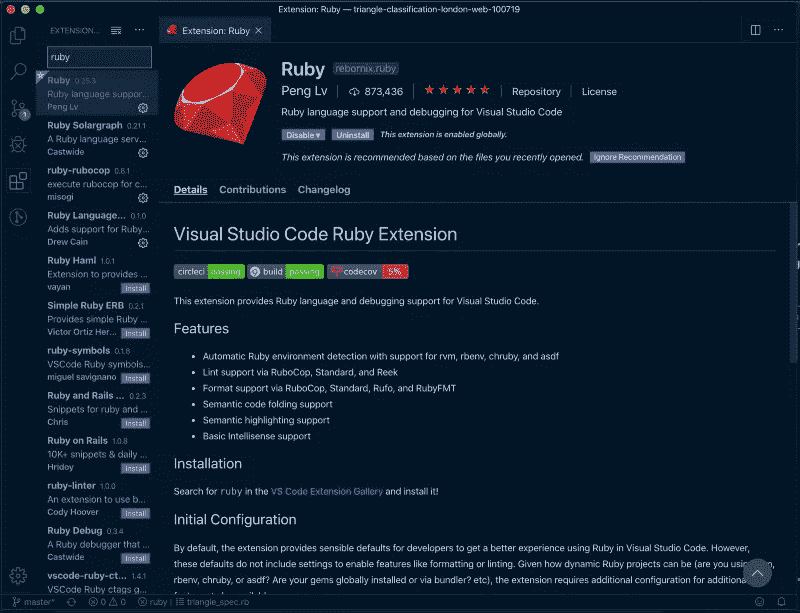
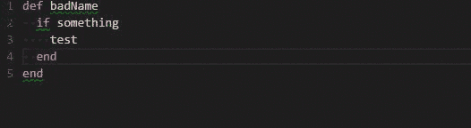

# 对任何使用 Ruby 的人来说最好的 VS 代码扩展

> 原文：<https://betterprogramming.pub/code-like-a-pro-tooling-to-supercharge-vs-code-for-ruby-bf2ae61df5e3>

## 更好的工具，更好的编程



让 VS 代码变得非常出色的一个原因是它能够安装扩展，进一步赋予它更多的功能。所以让我们深入研究一下。我假设你已经有了 VS 代码。如果没有，安装它——它可以在你使用的任何操作系统上运行，所以你会没事的。

出于本教程的目的，我们将使用四个 VS 代码扩展，它们无缝地协同工作来增强您的 IDE 和 Ruby 编码体验。

# **吕鹏的红宝石**

这个扩展为 VS 代码提供了 Ruby 语言和调试支持。

## 特征

*   自动 Ruby 环境检测，支持 RVM、rbenv、chruby 和 asdf
*   通过 RuboCop、Standard 和 Reek 提供 Lint 支持
*   通过 RuboCop、Standard、Rufo 和 RubyFMT 的格式支持
*   语义代码折叠支持
*   语义高亮支持
*   基本智能感知支持

## 装置

在 [VS 代码扩展库](https://code.visualstudio.com/docs/editor/extension-gallery)中搜索`ruby`，并安装。

这个 Ruby 扩展依赖于我们的下一个扩展(你会从特性列表中注意到这一点)。

# 2.**米索吉的 Ruby rubo COP**

这个扩展为 VS 代码提供了到 RuboCop 的接口。RuboCop 是一个针对 ruby 的代码分析器。



[来源](https://marketplace.visualstudio.com/items?itemName=misogi.ruby-rubocop)

在我们配置 RuboCop 之前，最好先了解一下它背后的驱动力。


> “RuboCop 是一个 Ruby 静态代码分析器和代码格式化程序。开箱即用，它将执行社区 [Ruby 风格指南](https://rubystyle.guide/)中概述的许多指导原则。
> 
> — RuboCop 文档

Ruby 风格指南是每个 Ruby 新手都应该看看的文档。这就像十诫一样，会帮助你在学习新语言时像当地人一样说话。它能让你像专家一样编写 Ruby 代码。

RuboCop 帮助你的是从风格指南中获取所有的规则，并使你的代码符合它们，让你专注于最重要的事情:解决问题。

## 装置

需要安装 Ruby 和 RuboCop。

```
gem install rubocop
```

*   键入 F1(或 Command + Shift + P)
*   执行“扩展:安装扩展”
*   键入`rubocop`，执行`ext install ruby-rubocop`

RuboCop 带有一个配置文件，你可以按照下面的解释进行配置。我只是使用这些简单的步骤——你可以选择你想要的任何选项。

1.  将 Rubocop 宝石添加到我的宝石文件中`gem 'rubocop'`
2.  `bundle`
3.  运行`rubocop --auto-gen-config`。这将为我当前的项目自动生成一个配置文件。
4.  为了让 RuboCop 自动格式化我的代码并应用最佳实践，我运行了`rubocop -a`。

## 配置

指定配置(通过导航到文件>首选项>工作区设置)并编辑文件`settings.json):`。

您还可以使用 RuboCop 附带的配置文件来自动化您的配置。它有很好的文档记录，并且易于配置。

```
{
  // If not specified searches for 'rubocop' executable available on PATH (default and recommended)
  "ruby.rubocop.executePath": "",

  // You can use specific path
  // "ruby.rubocop.executePath": "/Users/you/.rbenv/shims/"
  // "ruby.rubocop.executePath": "/Users/you/.rvm/gems/ruby-2.3.2/bin/"
  // "ruby.rubocop.executePath": "D:/bin/Ruby22-x64/bin/"

  // If not specified, it assumes a null value by default.
  "ruby.rubocop.configFilePath": "/path/to/config/.rubocop.yml",

  // default true
  "ruby.rubocop.onSave": true
}
```

# **3。Castwide 的 ruby solar graph**

Solargraph 是一个语言服务器，为 Ruby 提供智能感知、代码完成和内嵌文档。


## 特征

*   Ruby 核心的上下文感知建议和文档
*   检测一些变量类型和方法返回值(例如，`String.new.`返回字符串实例方法)
*   当前范围内局部变量、类变量和实例变量的标识
*   查找参考和重命名符号(从 Solargraph gem v0.22.0 开始实验)
*   对 gems 的支持
*   对 Ruby 内核和 stdlib 的近乎完整的支持
*   对 Ruby on Rails 的部分支持

## 要求

您需要安装 Ruby gem:

```
gem install solargraph
```

安装完 gem 后，进入 VS 代码扩展面板，搜索 Ruby Solargraph。然后安装它，你就可以开始了。

# **奖金**

这些是其他 VS 代码扩展，我认为作为一个 Ruby 开发新手，它们会让你的生活变得更容易。

1.  德鲁·凯恩的红宝石语言着色
2.  简单的红宝石 ERB
3.  [Hridoy 的 Ruby on Rails](https://marketplace.visualstudio.com/items?itemName=hridoy.rails-snippets)

虽然本教程主要关注 VS 代码，但是其他 IDE 也有它们自己的扩展，所以不管你用的是什么 IDE，都要看看它们各自的扩展。

这只是为即将到来的事情做准备。在接下来的文章中，我将会分享一个关于 Ruby 初学者入门的系列教程。我相信它对你或你网络中想开始编码的人会很有用。

黑客快乐！