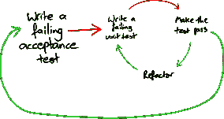

# 像做饭一样编码

> 原文：<https://betterprogramming.pub/code-like-you-cook-fac3ec828e79>

## 我最喜欢的基于食物的软件工程隐喻

詹·西奥多在 [Unsplash](https://unsplash.com?utm_source=medium&utm_medium=referral) 上的照片

# 制造混乱，然后清理干净！

我们在谈论测试。特别是，为什么没有编写测试。签入的代码是干净的，结构良好的，看起来非常适合测试驱动。

但事实并非如此。测试是后来添加的，所以一切都很好，但我想探究一下为什么 TDD 方法在这里似乎行不通。

“我一开始不知道自己在做什么”被作为部分原因给出。“当你不知道发生了什么或者不知道最终代码会是什么样子时，很难进行测试。”

现在，在一般情况下,《测试指导下的面向对象软件 [*》一书很好地解决了这个问题。在这种情况下，相关的原则是从“高层次”的验收测试开始，这反映了特性的预期结果。*](http://www.growing-object-oriented-software.com/)

它可以是用户交互或者 API 调用的预期行为。当您慢慢走向实现时，这个测试可能会失败一段时间。像这样:

出自“[由测试引导的面向对象软件的发展](http://www.growing-object-oriented-software.com/figures.html)

你看这张照片。有帮助吗？过去，我一直在寻找这张照片，并把它展示给人们，期待着一个启示。从来没发生过。

因为，我突然意识到，对我来说，这幅画不是一个图表。这不是一个例证。这是一个图腾。一个符号。这是一个视觉捷径，代表了整本书，其中包含的智慧，以及我自己的经历。

这就是挑战所在。光有图片是没用的。我需要找到一种方法来压缩这本书的主旨以及我在 TDD 方面的经验，包括成功的和…否则。

这就是隐喻的力量。当你找到一个好的比喻，一个能引起个人共鸣的比喻时，它能让我们利用类比的力量。运用平行智慧。

它们扮演着“桥梁”的角色，帮助我们“获得”想法，并以相关的方式重新构建看似不相关的经历。

在这些时刻，在这些关于测试的谈话中，我的脑海中突然出现了一些想法。我有一瞬间感同身受。“现在我知道老婆看我做饭的感受了！”

当我妻子做饭时，她保持东西干净。长凳总是很整洁。地板也是。食材和用具提前准备好，做好了放好。

准备是高效的，一旦配料准备好了，通常会同时烹饪。替换有时会发生，而且经常会成功。饭菜毫不费力地摆在一起。

然后我们吃饭。厨房已经打扫干净了。

这不是我走进厨房时发生的事。我喜欢奉承自己，认为如果我遵循同样的食谱，那么食物的味道也会一样。但相似之处仅此而已。

长凳从不整洁。地板上到处都是面包屑，溅了一地的油，面粉散落在长凳上。牛奶放在外面太久，或者放在一边，几分钟后才发现又需要。

我挑选过大或过小的容器，所以我需要换一个更大的碗，这样会产生更多的洗碗空间。我按部就班地做事，并严格按照指示行事。除非得到直接建议，否则我不会换人。

然后我们吃饭。然后我们清理干净。

两份完整的膳食。两个干净的厨房。但是到达那里的旅程是非常不同的。我可以想象，如果我能在错误发生之前看到并预见到所有的错误，看着自己做饭我会感到多么沮丧。

但我也知道理论对我帮助不大。直到我亲手犯了错误，我似乎才学会如何把事情做得更好。我搞得一团糟。我清理干净。我下次会做得更好。(嗯，我编码的时候。还在厨房工作。)

当我用我知道的语言，用我知道的框架，在我以前做过的工作的变体上工作时——在这种情况下，我像我妻子做饭一样编码。

我走的时候保持一切整洁。首先编写测试，随后是简单的代码，然后我们添加更多的案例并继续发展。服务是按照逻辑顺序构建的。我们白板上的“方框和线条”可以毫不费力地转化为代码和产品。

当我在做一个“尖峰”——用一种新的语言，或者一个新的框架，或者一个完全不同于我们以前做过的任何东西的架构，我会搞得一团糟。

这段代码结构不良，不符合习惯。因为我不了解标准库中的框架特性或方法，所以我做了一些艰苦的工作。或者有用的包。

测试缺失是因为我不知道测试什么，或者即使我知道，我也不知道如何测试。这很折磨人，很痛苦，但我们最终会到达那里。

然后——如果我们幸运的话——我们把它扔掉，重新做一遍。扔掉那块厚煎饼，再试一次。下一个就完美了。或者下一个。如果我们没有那么幸运，至少我们应该自己收拾一下。

我从这个比喻中得到了什么？它提醒我“正确有效地”做事需要了解我们的工具、工作环境和方法。

当所有的星星都排成一行时，我们可以也应该努力保持桌面整洁。首先编写我们的测试。在继续之前，纠正我们的班级结构。

这是迄今为止效率最高的工作方式。但是当这些条件都不具备的时候，就想尽一切办法，制造混乱。那样你会学得更快。一定要考虑到这一点，并在离开前整理好。

# 推着你盘子里的食物

“不要把你盘子里的食物推来推去，”这是我祖母几乎每次和我一起吃饭时都会对我说的话。“吃吧！”

对于那些不熟悉这个短语的人来说，这个比喻是有人在悠闲地或故意地重新摆放他们盘子里的食物。他们将豌豆拌入土豆泥，烟熏蒸胡萝卜，将兔肉切成更小的块。

也许，如果你没有仔细观察，你可能会把这种活动理解为食物被“触摸”过，因此被吃掉的证据。

我祖母使用这个短语的方式，暗示着我故意这样做是为了逃避吃一顿我不喜欢的饭。我既不能证实也不能否认这些指控。

但是我在童年时代已经听过这个短语很多次了，以至于每当某一类工程问题，呃……出现在我的盘子里时，它就会不自觉地跃入脑海。

先说“复杂”。复杂性以多种形式出现在软件工程中，通常是格言“A <thing>应该尽可能简单，但不能再简单了。”</thing>

它适用于方法、类和服务。尤其是服务业。尤其是系统架构。因为[我们不是谷歌](https://blog.bradfieldcs.com/you-are-not-google-84912cf44afb)。所以，我们[不需要它](https://codeahoy.com/2017/08/19/yagni-cargo-cult-and-overengineering-the-planes-wont-land-just-because-you-built-a-runway-in-your-backyard/)。

J.B. Rainsberger 对“意外并发症”和“本质并发症”进行了区分。此外，他区分了“复杂性”和“复杂化”，前者是一个系统的自然属性，后者是我们面前的工作有多困难。

上面剪辑中的大部分内容实际上与前面的部分更相关。事实上，大约四分半钟后，他开始谈论打扫厨房！这是巧合！我去找参考资料的时候并不知道。

我的意图是让读者从这个片段中很好地理解本质的和偶然的复杂性或复杂化之间的区别。

因为，当一个团队开始陷入关于“服务 A”应该负责汇总我们的月度数据还是“服务 B”的讨论时，我们就在把食物推来推去。

当我们讨论是否需要先将服务从共享数据库中分离出来，或者添加健康检查时，我们是在推盘子里的食物。

在这些和类似的案例中，我们谈论的是“本质性”并发症。同样多的事情必须发生。那么，我们真正想从这次谈话中得到什么呢？

我用这个比喻作为一个温和的提醒，将对话提升到一个抽象的层次。通常，围绕职责分配、数据流等问题的技术讨论会变得情绪化。

尤其是在跨越所有权界限的强烈的代码所有权和责任意识的地方。

当我说:“现在我们只是在我们的盘子里推食物”时，我的意思是我们正在讨论的工作是必要的复杂。它必须发生。

因此，我们真正想要集中精力的是避免“意外的复杂化”，或者防止系统内不必要的复杂性的出现。

我们应该把这一目标作为我们的指导原则，防止对话变成个人问题，并努力找到最佳解决办法。

因为这通常很重要。你不能消除“基本的”复杂性，但有时你可以把它隐藏起来，这样不会使系统的其他部分复杂化。

这就是“关注点分离”、“单一责任原则”，以及实现“高内聚”和“松耦合”的本质。更不用说我一直最喜欢的“[受保护的变异](https://martinfowler.com/ieeeSoftware/protectedVariation.pdf)”

真的，当我使用这个短语时，我想到的是多年前我祖父母对我的指责的反面。让我们不要把豌豆塞进土豆泥里，假装我们吃了一些，这样我们就可以拿冰淇淋当甜点了。

更确切地说，我们想把这些堆分开，这样我们在豌豆、胡萝卜和土豆之间就有了清晰的领域界限。你知道，食物不能碰。或许除了通过[兔子](https://www.rabbitmq.com/)？

差不多吧，反正…

# 你不能开着烤箱门烤蛋糕

它是这样工作的:

*产品负责人:*“按时完成项目非常关键，现在只剩下一个月了。我们每天都要报到吗？”

*我*:“周刊怎么样？那样蛋糕会烤得更快。每次打开炉门检查，我们都把热量放出去了。”

*CTO:* “更好的是——如果烤箱门是玻璃做的呢？然后我们只需要打开它，在它看起来快熟的时候插上一串肉扦？”

这个讨论发生在我们团队向“估计”和“#不估计”之间的中间地带发展的“游戏结束”阶段。

例如，可以看到类似[这个](https://medium.com/@agile_ed/estimates-or-no-estimates-e544e5004975)，甚至[这个](https://plan.io/blog/noestimates-6-software-experts-give-their-view/)的帖子(尽管后一个链接是内容营销的一部分，但它仍然提供了各种观点的有用总结)。

如果管理不当，估计可能会导致截止日期。我相信我在过去已经非常清楚地表明了我自己的观点。从那以后，我变得成熟了一些。当我们处理[高度诚信的承诺或评估如何切割一个功能以适应我们的胃口](https://medium.com/better-programming/what-if-we-built-software-with-states-and-not-dates-b334cfe1745)时，我对估计和预测很满意。

在开始的对话中，我们按照我在上面的帖子中描述的方式工作。我们做出了承诺，并正在努力实现。时间很紧，利益相关者很紧张，我开始考虑蛋糕。为什么？

最初，因为[工作就是](https://codahale.com/work-is-work/)工作。如果我们花时间审查我们的估计，我会打断人们带外更新，打断他们的流程，耗尽他们的时间。可能只会被告知，“和昨天一样，谢谢关心。”

此外，我花在重新估算上的时间是从我本可以做的其他工作中抽出来的，将石头搬出场地，这样团队就可以笔直稳定地前进。

工作就是工作。当需要重新评估时，我们会这样做。让我们确保它是有用的，并且工作的成本得到认可。

我担心打开烤箱的第二个原因是，在阅读了 Dan Pink 的[Drive](https://www.amazon.com/Drive-Surprising-Truth-About-Motivates/dp/1594484805)中的“功能固定性”和“蜡烛问题”之后，我想到了“每日估计”的一个更阴险的副作用。

下面的视频解释了“蜡烛问题”，其中我们可以看到，当人们专注于像“速度”这样的横向思维练习的外生因素时，他们的创造性思维能力会受到影响，结果是他们的表现更差。

另一方面，如果工作是直接的，不需要横向或创造性的思考，外部动机，如对速度的奖励，可以显示出短期的利益。

如果我们如此频繁地向 PO 汇报我们的进度，这里会发生这种情况吗？实质上，我们每天都在提醒团队:“还剩 30 天；还剩 29 天；二十八……二十七……”

这会引发功能固定吗？根据我对团队在时间压力下如何反应的观察，我认为是这样的。

也许这样可以？如果我们正在[爬坡](https://basecamp.com/shapeup/3.4-chapter-12#work-is-like-a-hill)，在下坡路上，奔向完成，持续的提醒可能在短期内是激励性的。假设我们在调整自己的节奏，持续工作，抵制“紧缩”的诱惑。可能会有帮助。

另一方面，如果在作品的早期，不断的检查可能弊大于利。无论是高质量的承诺还是真正的期限，也许我们[不知道](https://medium.com/better-programming/write-better-quality-software-without-deadlines-4526dc3edc19) [这件事会更好？](https://ralfw.de/2018/06/steering-software-development-with-priorities-instead-of-deadlines/)

不断提醒时间和完成日期的其他副作用可能包括可怕的“我没有时间编写测试”，以及在一种专注于“不惜一切代价开发功能”的文化中工作的阴险感觉，在这种文化中，良好的工程实践被搁置一旁。

我的经验是反复问:“什么时候能完成？”导致一种我们需要匆忙行事的感觉，*即使这并不是问题的意图。*

反直觉地关注速度会导致一切都慢下来。固着会导致质量下降，因为捷径是以最快的价值路径的名义走的。

但是我们可以从丰田和 NUMMI 的故事中学到，从长远来看，这可能会伤害到你。相反，建立在质量上实际上会让你走得更快。正如 NUMMI 工厂的一名汽车工人后来回忆的那样:

> “让我生气的是，他们有一个十字螺栓，他们停下来修理它。铰孔，把螺栓放回去，而不是把它送上去，把所有其他垃圾放在上面，所以你必须把它拿下来修理。…
> 
> 这让我印象深刻。我说，哎呀，这很有道理，现在就解决它，这样你就不用经历所有这些事情了。那时我突然意识到我们可以做到——一个螺栓。
> 
> 一颗螺栓改变了我的态度。"

另一方面，设定“胃口”或同意“时间盒”可以鼓励积极的范围界定和紧密的焦点。

如果目标是生产一个最小的可行产品，或者仅仅是生产一个用于测试和实验的功能原型，那么关注时间不一定是一个问题，而且可能是有益的。

那么，我们该怎么办呢？有时候固定会有帮助(也许？)，有时还有害。所以，答案当然是:“视情况而定。”答案是*一直:*“看情况。”

重要的是考虑你需要完成什么，并有目的地行动。我们应该预先为每一个计划建立时间框架，把它细分，直到优先级改变，或者我们需要一个实际的承诺。

一旦我们知道了，我们就可以选择合适的工作方式来实现这些目标。即使在同一个团队中，这也会随着任务的不同而不同。

然而，我确实相信一件事，那就是“保持烤箱门透明”是个好主意。“什么时候能做好？”希望是一个良性的问题，出于兴趣或为了协调活动而问。

但是如果我们能够通过主动提供适当粒度的信息来避免这种情况，也许我们可以避免功能固定。

因为如果说我对软件交付有什么了解的话，那就是有了蛋糕一切都会更好。