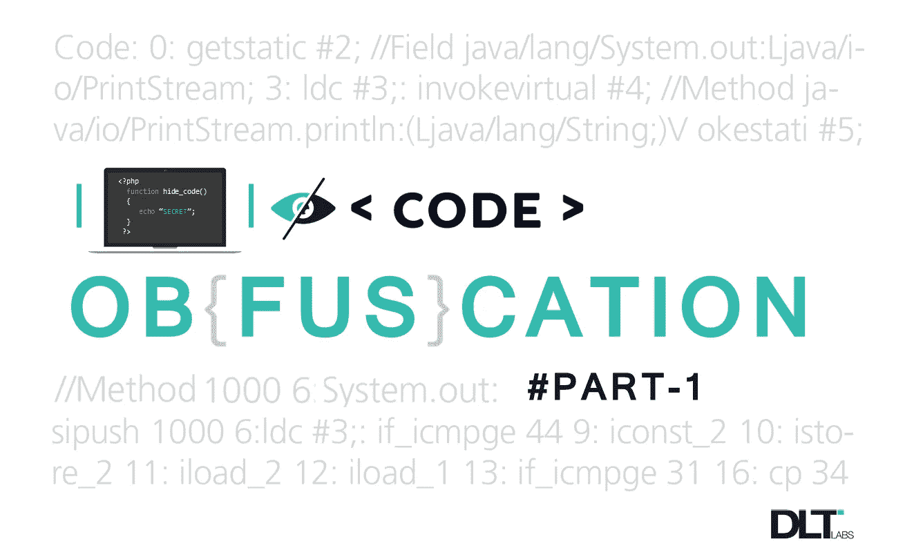
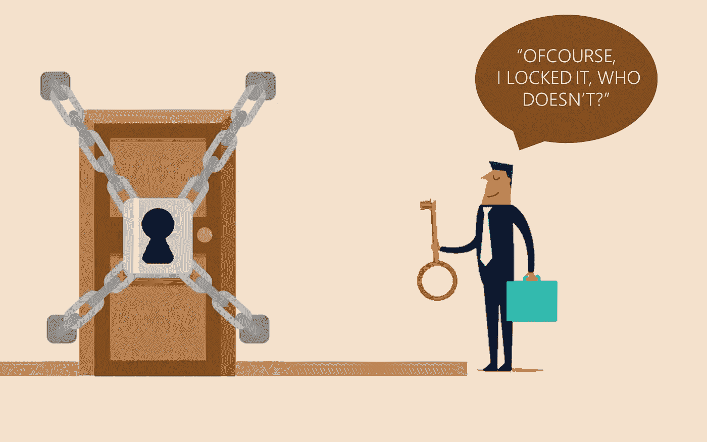
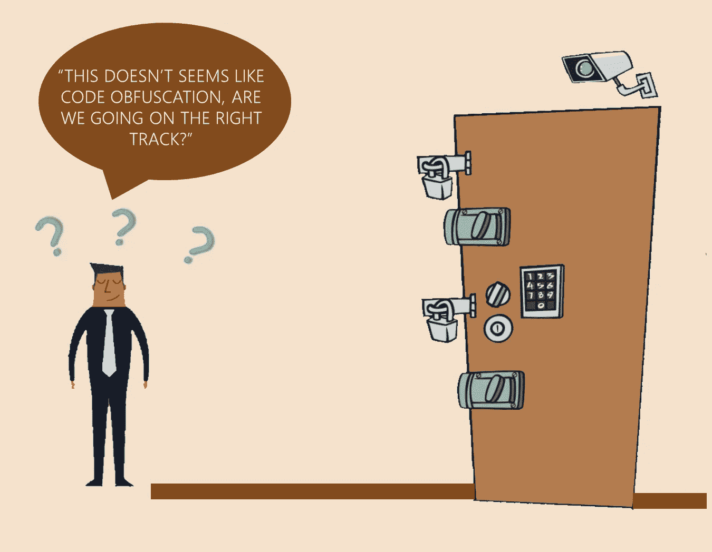
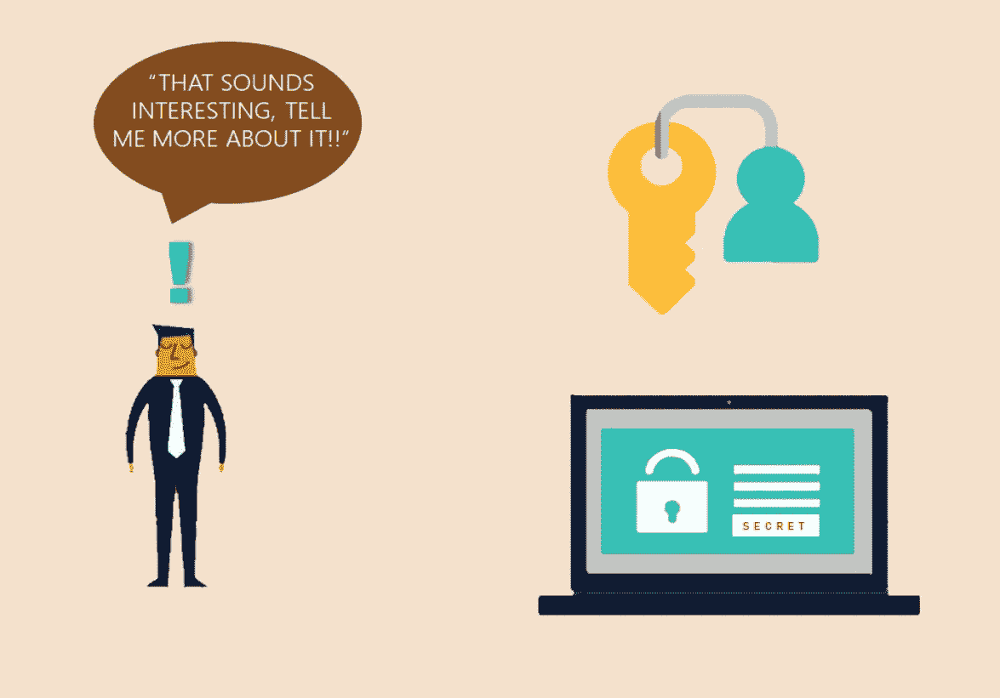
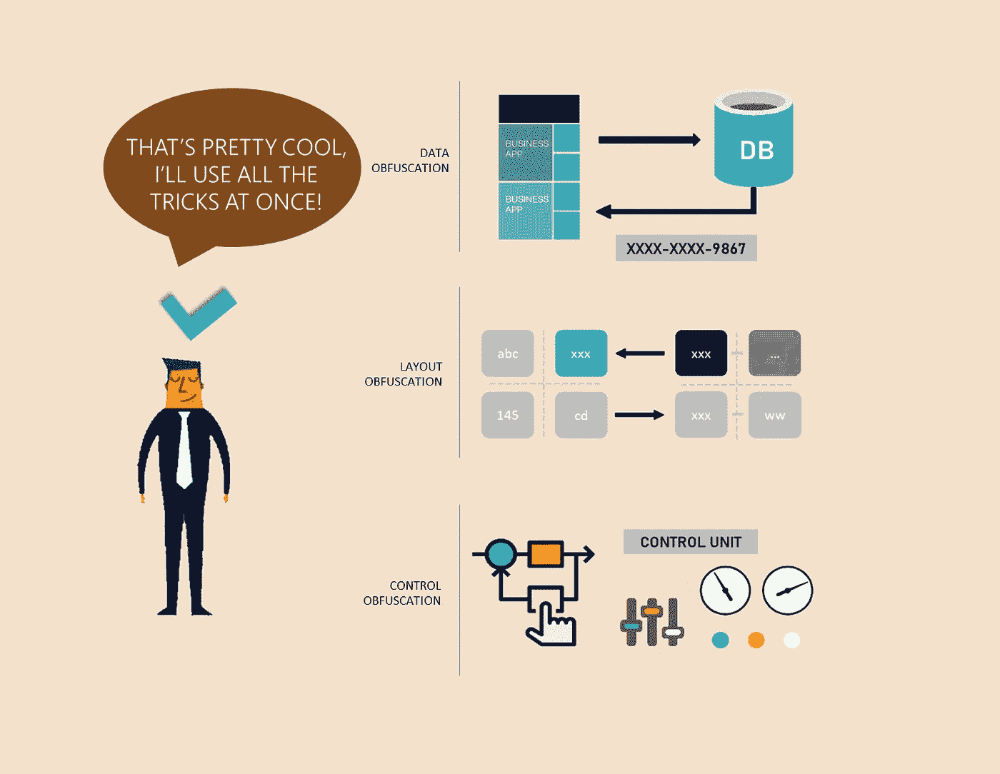

# 代码混淆简介

> 原文：<https://betterprogramming.pub/code-obfuscation-introduction-to-code-obfuscation-part-1-93a6797349b0>

## 第一部分

# 介绍

还记得你最后一次和家人一起度假吗？你打包了你需要的东西然后离开了你的住处，对吗？我确信你没有带走你所有的东西。你把其中一些留在了你的公寓或房子里，不管你住在什么样的地方。但是你能回忆起你是否锁了门吗？

绝对的。现在，开门见山地说，你为什么要那样做？答案是显而易见的:防止任何人在你不在时擅自闯入，并确保你的东西的安全。因此，为此，你可能会安装一些安全设备，如闭路电视摄像头、传感器和最基本的**锁。**

是的，我们是！

为了理解一个技术主题，你不需要知道其中使用的所有术语。有时候最好的方法是把它和我们自己观察到的东西联系起来，可能是好几次。

把代码/源代码想象成你留在家里的东西。现在，当代码部署在互联网上时，您可以公开它。小偷可能试图窃取你的东西，这在代码或软件应用环境中被称为*盗版* 。那么你怎么防止这种偷窃呢？最简单的回答就是**锁定就好**！

没错，你没看错，锁好就行。但是在这里，既然软件不是实物商品，我们就不能像锁房子一样把它锁上。为此，我们有很多技术，其中我最喜欢的是**代码混淆**。

代码混淆是一种保护代码的技术，这样任何未经授权的人都无法看到和理解代码中的逻辑。

代码混淆是一种使应用程序的源代码难以阅读和理解的技术，因此任何未经授权的第三方团体或个人几乎不可能使用任何可用的工具对其进行逆向工程。

我们可以将代码混淆描述为一种以某种形式转换我们的源代码的技术，这样它就可以给出与未混淆或真实代码相同的输出，同时，它也不是人类可读的。

入侵您的地方(这里是代码)的窃贼可能会使用您的东西(代码逻辑)来谋取私利或试图利用它。用专业术语来说，这种做法被称为*缓和许可证*施加的限制。

# 需要代码混淆

如今，各种应用程序(如移动应用程序、web 应用程序等)的大部分代码。)可以在许多开源平台上获得，人们可以查看他们的代码并提出修改建议，以使其更加优化并发现未被注意到的错误。但是，由于这种代码透明性，一些团体或个人试图对代码进行逆向工程，以利用它来谋取私利。他们可能试图篡改应用程序或绕过许可所施加的限制。

因此，为了保护我们的代码免受恶意用户的攻击，有必要为我们的代码增加一些安全性，这最好在代码混淆的保护下提供。

# 方法和技术

模糊方法根据其目标信息进行分类。一些技术以程序的词汇结构为目标，而其他技术则以数据结构或控制流为目标。

就像我们采取的保护我们的东西的安全措施一样，代码混淆提供了防止我们的代码被利用的技术。我们愿意在代码中增加什么样的安全级别取决于我们的需求。一些主要的代码混淆技术有:

**1。数据混淆**:这通过用复杂的表达式(例如 c1*i +c2)替换变量的名称或者操纵数据存储的形式来针对程序的数据结构。

基本上，我们是在试图迷惑窃贼。他们会忙着弄清楚摆在他们面前的是什么。

**2。布局混淆**:这针对的是代码的布局或外观。它可以操作缩进、变量名，或者添加或删除代码中使用的注释。

与之前的技术非常相似。我们正在展示我们的沙发作为我们的床。

**3。控制混淆**:这操纵代码中编写的语句。例如，用函数体替换函数调用，或者包含代码中使用的完整库或模块。它还可能通过添加一些死代码来改变代码流。

在这项技术中，我们简单地改变我们的位置的方向。窃贼可能认为他们要进入卧室，我们珍贵的东西可能会放在那里，但他们最终在浴室。

我不敢说，但这不是一个好主意，原因是，增加代码的安全性也会影响其性能。所以，我们也必须记住这一点。

# 对代码性能的影响

想象一下，你在你那里用过几百个或者几千个锁，但是当你回来的时候，你需要打开它们，对吗？这需要时间。添加的锁越多，解锁它们所花费的时间就越多，或者说，对于代码来说，处理任何数据请求或数据操作所花费的时间就越多。

通常，对性能的影响在 15%到 80%之间，具体取决于用于模糊处理的选项。我们添加的选项越多，代码的执行时间就越慢。

# 在模糊代码中调试

由于在混淆过程中，代码的结构以及一些数据被操纵，所以我们不能直接调试这些混淆的代码。因此，为了执行调试操作，在混淆期间，生成**源映射文件**，该文件被提供给解混淆工具，该解混淆工具给出了所发生的错误的堆栈跟踪以及根据原始源代码生成的错误的行号。

所以，现在很明显我们必须保护好这把钥匙，这样只有我们才能打开我们的房子。很简单，对吧？

我希望您现在已经对代码混淆技术有了很好的了解。这种技术并不是万无一失的，因为即使使用反混淆工具，调试也是一项非常具有挑战性的任务，但它仍然为增强代码安全性提供了一个很好的解决方案。

> 本文的这一部分只是提供了关于代码混淆及其技术的简要介绍。在下一部分中，我们将关注它的实现。因此，要了解更多关于代码混淆的内容，请继续关注。

***既然你已经理解了代码混淆，下一步就是代码混淆的实现(第二部分)，我们在这里讨论:***

 [## 实现代码混淆

### 我们讨论一种实现代码混淆的简单方法

medium.com 的 DLT 实验室](https://medium.com/@dltlabs/implementing-code-obfuscation-5b1fda3ed741)