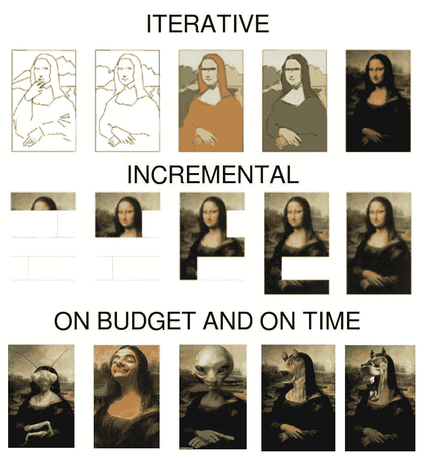
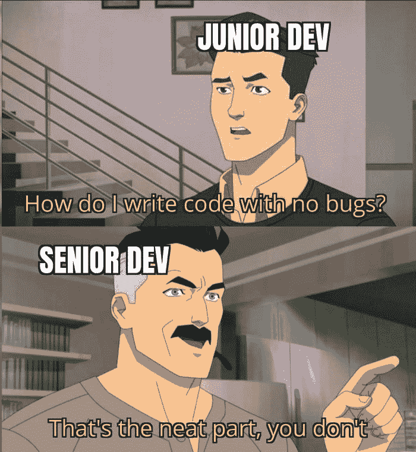

# 后持续部署时代的代码所有权

> 原文：<https://betterprogramming.pub/code-ownership-in-the-post-continuous-deployment-era-411643bf1835>

## 持续部署与持续交付。以下是一些不迷失最终目标的方法:持续改进


作者图片

从加速发布到持续部署，也就是说，更频繁地发布，从来都不是简单的速度或速率的问题。对于不太懂技术或更有商业头脑的利益相关者来说，这些仅仅是证明投资这些现代实践的伟大卖点。

毕竟，上市时间是在技术过程中投资有价值的工程努力的好方法。甚至这种推销也变得越来越不必要了。今天，大多数组织都将投资开发管道的必要性内在化了，并且由于今天的部署工具和更成熟的最佳实践，所需的投资并不是那么大。

能够经常部署有很多好处。留在开发分支中的代码，塞在远离现实、用户和真实世界反馈的抽屉里，将会溃烂。

关于用户想要什么，他们如何使用系统，以及代码将如何执行的假设开始堆积，进行错误的进化转向，并最终导致失望、缺乏牵引力或数月的技术债务。更快地部署代码并不能从本质上解决这些问题。在最坏的情况下，这仅仅意味着你在不断地抛出新特性。

# 两个开发者的故事

Jim 是一名出色的开发人员。事实上，他是现代全才的典范。他能流利地说五种编程/脚本语言；他非常熟悉与 DevOps 以及如何自动化代码部署相关的事务，他也是敏捷、测试等工作的大力倡导者。

他正在使用最新的微服务技术编写代码，并使用大量策略持续部署到 Kubernetes 集群。每当有人脱口而出哪怕是很小的代码更改时，GitHub 就会启动一些操作，APMs 的精华就是用来监控生产环境的。

所有这些都是值得称赞的，表明了我们作为一个行业已经发展和成熟了多少。然而，在 Jim 的另一部杰作《将代码无缝转移到产品的流水线》中，有一样东西没有包括在内:学习。

尽管所有正确的系统都已到位，除非发生灾难性的事情，否则反馈回路是最小的。Jim 和他的团队关注的是沿着管道向下移动下一段代码所需的步骤，以及下一段。他们针对带宽、速度和部署速度进行了优化。他们甚至设法保持管道稳定，并大幅减少停机时间。

他们最大化了他们发布的节奏，并且在每次迭代中推出更多的特性，但是他们没有为持续改进而优化。

人们很容易专注于一个 KPI——速度，并以更高的速度交付错误的代码。反馈最终会到来，伴随着技术债务检查

我们的另一个虚构的开发者是 Jullian。他不如吉姆流利；他试图自动化整个发布管道，但仍然有一些技术障碍需要解决。然而，Jullian 在 Jim 尚未考虑的两个主题上投入了大量时间:当他将某个东西投入生产时，他想度量什么？他是如何在开发过程中包含度量的，这样它就不会隐藏在一个要求人们记得检查它的死仪表盘后面？


作者图片

Jim 和 Jullian 都签入他们的变更，合并他们的 PRs，并在经过各种测试和验证之后将他们的代码部署到生产中。然而，当 Jim 完成合并他的代码时，他会继续处理 backlog 中的下一个特性(他甚至会因此获得分数；[这就是组织正在衡量的](/youre-never-done-by-definition-c04ac77c616b)。除非灾难性的失败已经发生，否则他不会考虑已经犯下的错误。

Jullian 也开始了他的 backlog 中的下一个项目，但是几分钟后，Slack bot 通知他，他的代码第一次被一些 alpha/canary 用户用于生产。随着使用量的增加，他得到了更新:他的新查询影响了整体性能吗？它如何随着并发使用而扩展？他还了解到自从合并他的代码后，死锁的数量有所增加。看着这种趋势，他意识到需要做更多的工作来分离操作的读/写属性并提高查询带宽。

# 流程将完成优化后的目标

我想起了吉尔·特纳最近看的一个[视频](https://www.youtube.com/watch?v=nS0QgxgUYSA&ab_channel=SkillsMatter%28IncorporatingYOW%21Conferences%29)，视频中他讨论了性能测试中“99%的伟大谎言”。基本上，他想知道为什么总是到了第 99 个百分位数，系统的性能或多或少地得到了可预测的扩展，之后性能开始呈指数级下降。数字 9 有什么重要的？

答案是——这正是工程师们优化的目的！他们被要求对第 99 个百分点进行优化，因此，系统可以处理超过该点的任何可能的滞后请求，即使 1%的用户会等待很长时间。

我想起了这个例子，因为在我们的开发过程中，思考我们想要优化什么是很重要的。与上面的例子类似，如果我们优化的只是速度和短期稳定性，我们就不会创建随着时间的推移与使用相一致的系统，并且发现我们自己积累了技术债务，错过了真正享受持续部署的好处的机会。



图片:Reddit

吉姆呢。在这个例子中，他签入的代码从未在现实生活中使用过。没有人注意到任何问题，但是也没有人费心检查生产中是否调用了基础代码更改。其实不是，而且是几个月后才被发现的。

# 你能做些什么来确保持续的反馈和学习？

诚然，这是一个有些人为的例子。Jim 在自动化部署和测试方面的远见将使他从可能降临到 Jullian 身上的麻烦中解脱出来。然而，我们也需要着眼于长期的比赛。这就是优化规模的地方，不仅在复杂性或使用方面，而且在支持开发人员将合作多年的代码库方面，这将不可避免地有我们需要注意的问题、错误和失调。



来源:Reddit

那么，我们如何改进开发过程并确保代码持续改进呢？

1.  **可观察性** —如果你观察不到它，你就无法测量它，你也肯定无法修复它。看看[**open telemetry**](https://opentelemetry.io/)**和不同的生态系统工具，让它与开发相关。我在这里[写了更多，在](/the-observant-developer-part-1-1939d53fd5a4)[后续](/improving-code-design-with-opentelemetry-a-practical-guide-a08e6440c24d)文章中用了一些具体的例子。**
2.  **调整流程以适应**反馈** —开发人员应该在主要功能发布后定期召开会议，讨论和评估反馈。数字可以赢得关于建筑和设计的争论。代码是如何使用的？我们还应该寻找什么来验证它？**
3.  ****小心仪表板**。它可以是你最好的朋友，但也是你最大的偏见。仪表板确切地代表了它要测量的东西，就像一大堆绿色 CI 测试一样，它会导致一种虚假的自信感。我见过一些公司过于强调特定的指标，而完全忽略了其他指标。为什么？因为它们不在仪表板上。**
4.  **分配时间**探索数据。**任何数据科学家都会告诉你，他们需要沙盒中的数据来开始调整他们的见解。就像探索性测试一样，您会对您将发现的洞察力类型感到惊讶。专注于重点领域，如使用、性能或错误。**

**很久以前，神话般的人月提出了这样一个命题:给一个延迟的项目增加人员并不会使一个延迟的项目提前交付。打破多年的管理教条。我要补充的是，“快”或“早发货”只是等式的一部分。**

**即使增加更多的工具、更多的开发人员和更多的技术会使项目更快——最终结果也会更好吗？“快”是一个重要的指标，因为它能让我们更早地获得反馈，但是如果我们不收集反馈呢？如果项目提前两个星期发布，但它没有按预期工作，会发生什么？谁说‘起跑’就是终点线？**

# **未来是什么样子的？**

**可观察性和反馈工具的未来看起来很光明。从技术角度来看，OpenTelemetry 正在为可观测性数据带来民主化，从而允许生态系统和开源工具的出现，满足开发人员在设计中包含此类反馈的需求。**

**开发人员对更多的管道承担了更多的责任，因此愿意接受更多的度量和信息来支持这种所有权并改进他们的代码。**

**连续部署、特性标记工具和从代码到产品的流水线自动化是收集有意义的反馈的第一步。尽管如此，许多组织已经在考虑下一步——自动化相反方向的信息流，从产品到代码。**

```
**Want to Connect?** You can reach me, Roni Dover, on Twitter at @doppleware.Follow my open source project for continuous feedback at [https://github.com/digma-ai/digma](https://github.com/digma-ai/digma).
```