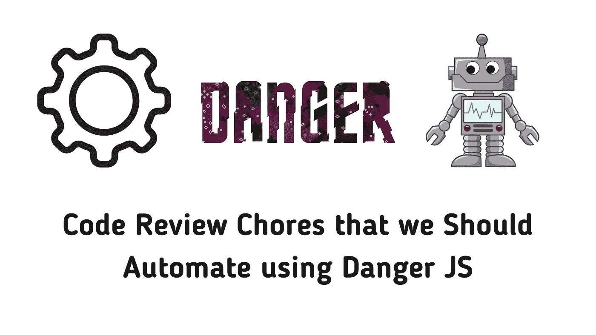
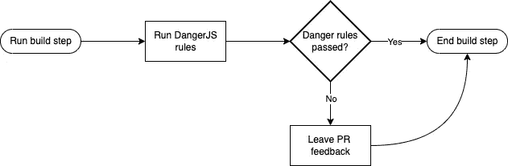

# 使用 Danger.js 自动化代码审查杂务

> 原文：<https://betterprogramming.pub/code-review-chores-that-we-should-automate-using-danger-js-6cf72ff3bf98>

## 花更多的时间审查你的拉动式请求的关键部分



作者图片

我们，软件工程师，花了大量的时间做代码审查。我们应该这样做，因为审查代码是一项重要的活动，它允许我们:

*   在我们发布代码之前检测潜在的错误。
*   检查我们的代码是否在做它应该做的事情。
*   确保我们的代码可维护。
*   维护一致的编码标准，例如代码质量、单元测试等。

然而，如果不是自动化的，代码审查的某些部分会令人感到乏味。我们可以将它们归类为“代码审查杂务”一些例子是:

*   检查作者是否在拉请求中更新了文件。例如`CHANGELOG.md`和`package.json`文件。
*   检查作者是否已经向新创建的函数添加了测试。
*   检查拉动请求(PR)是否过大。
*   检查错别字。

我们不想成为那个不断提醒每个人保持拉请求(PR)较小或者保持`package.json`文件更新的开发者。当我们重复同样的 PR 反馈时，代码审查的杂务变得很明显。

我们应该花更多的时间回顾公关试图解决的实际问题。因此，我们可以最大限度地减少花在代码审查琐事上的时间。

自动化杂务将提高我们代码的质量和团队的效率。我们越少担心杂务，我们就能花越多的时间审查公关的关键部分，如业务逻辑和潜在的错误。

# 危险 JS

幸运的是，有一个叫做 [Danger](https://danger.systems/) 的免费工具可以自动完成代码审查。它有很多版本，比如 Ruby 的[Danger](https://danger.systems/ruby)和 JavaScript 的[Danger(Danger JS)](https://danger.systems/js)。两个版本做同样的事情。这是一个选择你喜欢的编程语言来编写你的危险规则的问题。我打算在这篇文章中使用 Danger JS。

你可以读一下[什么是危险？](/set-up-danger-js-for-unsupported-cis-927a577ad03b#aa9f)”部分，对危险做了一个简短的介绍。

在接下来的章节中，我将分享一些我们可以使用 Danger JS 自动完成的常见杂务的例子。



危险 JS 流程图作者。

# 更新 PR 中的特定文件

例如:确保我们更新了 PR 中的`CHANGELOG.md`和`package.json`文件。如果您有一个共享的 JavaScript 库，跟踪它的变更日志和版本是一个很好的实践。

下面是您在`Danger`函数中可以做的事情。

*   检查您的 PR 是否包含对您的 changelog 文件和`package.json`文件的更改。
*   如果没有变化，请在 PR 中留下评论，说明文件需要更新。

这里有一些来自[danger.systems/js](https://danger.systems/js/)的样本代码:

```
// Add a CHANGELOG entry for app changes
const hasChangelog = danger.git.modified_files.includes("changelog.md")
const isTrivial = (danger.github.pr.body + danger.github.pr.title).includes("#trivial")
```

```
if (!hasChangelog && !isTrivial) {
  warn("Please add a changelog entry for your changes.")
}
```

还有一个用于跟踪变更日志文件的 Danger JS 扩展:[Danger-plugin-keepachangelog](https://github.com/vtex/danger-plugin-keepachangelog)。您可以直接使用该扩展，因此没有必要从头开始编写函数。

## 非预期的打印声明

我们使用 print 语句在本地调试或测试我们的更改。不幸的是，我们有时会无意地将这些提交给我们的分支。

在你的主分支中排除不必要的打印语句是一个很好的做法。运行应用程序或服务时，多余的打印语句会增加噪音，使代码库更难调试。

大多数时候，他们会被作者或评论家发现。然而，不可避免的是，他们中的一些人仍然可以通过。我们应该使用 Danger JS 来自动检查。

下面是伪代码供参考:

```
// Get the modified files using DangerJS
modifiedFiles = getModifiedFiles()
for (modifiedFile in modifiedFiles) {
    // Get the added diff for each file using DangerJS
    diffAddedForFile = getDiffAdded(modifiedFile)
    // Check if the diff's string includes a print statement e.g. fmt.print in Go or console.log in JS.
    if (diffAddedForFile.includes('fmt.print')) {
        warn('fmt.print detected')
    }    
}
```

请注意，如果您使用 JavaScript，也可以使用其他替代解决方案，因此您不必从头开始编写您的危险规则。

*   Danger JS 扩展: [danger-plugin-noconsole](https://danger.systems/js/plugins/danger-plugin-no-console.html) 。
*   [ESLInt 的无控制台](https://eslint.org/docs/latest/rules/no-console)。

## 检查 PR 是否太大

我们希望我们的 PRs 尽可能小。大 PRs 增加认知负荷。较小的 PRs 更易于管理，更易于审查。有时，我们必须提醒公关作者将他们的公关分解成小块。

我们可以写一个危险的 JS 规则来计算一个 PR 中改变的行数。如果这个数字超过了一个指定的“大 PR 阈值”，留下一个注释，将 PR 分解成更小的 PR。

*变更行数=删除数+添加数*

这取决于你的团队是否同意一个可接受的大公关门槛。从一个你的团队认为足够好的门槛开始。以我的经验，我一般都是 500 到 600 的值开始。然后随着时间的推移进行微调。

这里有一个来自[https://danger.systems/js/](https://danger.systems/js/)的示例代码:

```
var bigPRThreshold = 600;
if (danger.github.pr.additions + danger.github.pr.deletions > bigPRThreshold) {
  warn(':exclamation: Big PR (' + ++errorCount + ')');
  markdown('> (' + errorCount + ') : Pull Request size seems relatively large. If Pull Request contains multiple changes, split each into separate PR will helps faster, easier review.');
}
```

你也可以排除那些你不希望被计入你的公关门槛的文件。例如，如果您想要排除模拟文件:

```
const linesCount = await danger.git.linesOfCode("**/*");
// exclude mock files
const excludeLinesCount = await danger.git.linesOfCode("**/*mock*");
const totalLinesCount = linesCount - excludeLinesCount;
```

```
if (totalLinesCount > bigPRThreshold) {
  warn("Big PR, break down into smaller PRs.");
}
```

## 检查降价错别字

我们文档中的错别字会导致代码库中的[【破窗】](https://blog.codinghorror.com/the-broken-window-theory/)。我们不应该忽视他们。好消息是已经有一个检查拼写错误的危险 JS 扩展:[危险插件拼写检查](https://github.com/orta/danger-plugin-spellcheck)。

下面是 GitHub repo 的一个使用示例:

```
// dangerfile.js
import spellcheck from 'danger-plugin-spellcheck'
```

```
spellcheck({
  ignore: ['Nachoz', 'Tacoz'],
  ignoreFiles: ['README.md']
})
```

## 积极的规则，例如，补充公关作者

危险 JS 不仅仅是关于“你忘记做这件事了”的规则。你可以用它来赞美你的队友，在你的危险档案中加入积极的规则。

例如:当作者删除的代码多于添加的代码时，赞美他们。这并不意味着你的团队应该避免添加代码。这是鼓励团队删除冗余代码的一种方式。代码更少，维护更少。

你可以用一个简单的`if`危险 JS 块来完成。

```
if (danger.github.pr.deletions > danger.github.pr.additions) {
  message(`:thumbsup: You removed more code than added!`);
}
```

我们可以在 [Danger JS 的关于积极规则的文档](https://danger.systems/js/usage/culture.html#positive-rules)中参考这些积极规则的更多例子。

## 检查缺失的测试

我们写了多少次，收到多少次公关反馈？

> 我们应该为此增加一项测试吗？

或者

> 请为此添加一个测试。

可能很多。我们不必再这样了。

以下是我们在 PR 中审查测试时涉及的步骤:

1.  检查新的函数或方法是否需要测试。
2.  检查测试是否存在—模式匹配。
3.  确保测试覆盖了我们需要测试的路径。

我们可以使用 Danger JS 来自动化步骤 2。我们甚至不需要自动化第 1 步和第 3 步。自动化步骤 2 更简单，可以节省我们很多时间。

检查缺失的测试不同于计算测试覆盖率，如果 PR 不满足指定的覆盖率阈值，构建就会失败。

当我们在代码评审期间检查测试时，我们不会立即计算测试覆盖率。相反，我们寻找模式。例如:如果您正在审核 Golang 中的 PR:

*   如果有一个新功能`GetUsers()`，是否有一个相关的测试叫做`Test_GetUsers()`？
*   如果`Test_GetUsers()`缺失，留下反馈“添加缺失的测试”

我们可以使用 Danger JS 以编程方式执行上述模式匹配逻辑。这只有在我们遵循命名约定的情况下才会起作用。

在我们的危险 JS 代码中寻找 PR 中的测试所涉及的步骤:

1.  获取 PR 差异。
2.  检查是否添加了新功能。我们可以为此使用正则表达式。
3.  如果有一个新函数，查找是否有该函数的相关测试。例如，如果我们在 PR 中发现新添加的功能— `GetUsers()`。然后，要找测试:`Test_GetUsers()`。
4.  如果`Test_GetUsers()`不存在，请在 PR 上留下评论。

伪代码将如下所示:

```
// Check for missing tests in added functions in a PR:
addedFunctionNames = []
diffs = []
modifiedFiles = getModifiedFiles()
modifiedTestFiles = getModifiedTestFiles()
diffs = modifiedFiles.map(m => getDiffAdded(m))
testDiffs = modifiedTestFiles.map(m => getDiffAdded(m))
for (diff in diffs) {
    parsedFunctionName = parseFunctionNames(diff)
    // check if the pattern matches
    testsFound = testDiffs.filter(diff => diff.includes(`test_${parsedFunctionName}`))
    if (testsFound.length === 0) {
        warn(`tests missing for: ${parsedFunctionName}`)
    }
}
```

在 Google Cloudbuild 中设置 Danger JS 很简单。查看我的[前一篇博文，了解更多](/set-up-danger-js-for-unsupported-cis-927a577ad03b)。

[](https://blog.ardy.me/membership) [## 通过我的推荐链接加入媒体

### 阅读 Ardy Gallego Dedase(以及媒体上成千上万的其他作家)的每一个故事。您的会员费直接…

blog.ardy.me](https://blog.ardy.me/membership)