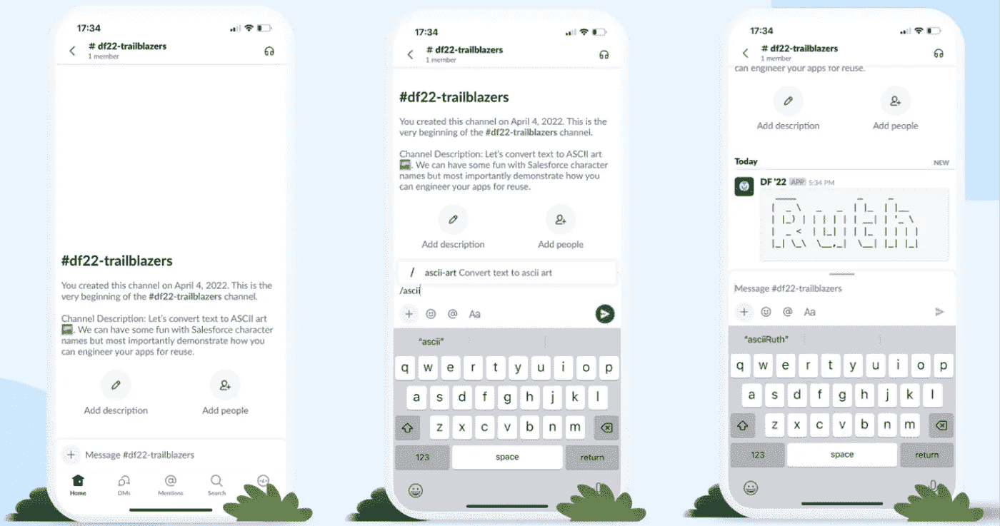

# 代码审查速度、构建可重用的应用程序、SwiftUI 动画

> 原文：<https://betterprogramming.pub/code-review-velocities-building-reusable-apps-swiftui-animations-fffec46126be>

## 咖啡字节第 46 期

图片由[迪昂·阿什利](https://ashleighbonner.medium.com/)拍摄

各位，周五快乐，

今年已经过去 40 周了，我希望你的 9 月充满了深刻而有意义的工作。随着我们进入 10 月，这里有一个有用的列表，列出了我们最近出版的一些最好的故事，还夹杂了一些我最喜欢的读物。

让我们进入本周八大精选！

## [代码评审速度——对速度的需求](https://medium.com/@gunnarku/code-review-velocity-the-need-for-speed-205bd10dd787)

Gunnar Kudrjavets 分享了一些加快代码审查过程的想法。有用的提示不仅仅是你在媒体文章中看到的普通提示。例如，关注*合并时间*，而不是*首次响应时间*或*接受时间*，并建立作者的等级，以最小化接受某些代码更改所需的时间。

## [悄悄辞职:为什么员工会后退，这样他们的雇主就能向前迈一步](/is-quiet-quitting-a-good-idea-1ad5547388e7)

维尼塔本周回来了，她给经理们提供了一些有用的建议，防止员工悄悄离职。如果你正处于工作的那个阶段，工作的要求正悄悄逼近你，她有一些紧迫的问题，你可以问自己，而不是随大流。

## [处理字体自动聚焦问题](https://medium.com/typeforms-engineering-blog/widget-auto-focus-in-embed-sdk-8e0c0584b57)

Typeform 最近推出了自动对焦功能的变化。如果你遇到了页面跳转到嵌入字体的情况，Matej Lednicky 的指南值得保存在你的阅读列表中。他还展示了使用 JavaScript APIs 在 Typeforms 中以编程方式配置焦点的方法。

## [使用效果还是不使用效果？](https://snigo.medium.com/useeffect-or-not-useeffect-35c059b41f84)

自从 React 18 推出以来，由于其令人困惑的行为，钩子一直在新闻中出现。这里的[伊戈尔·斯尼特金](https://snigo.medium.com/)告诉你什么时候应该避免`useEffect`(以及一些不可能避免的场景)，同时也揭穿一些流行的神话。

## [重用工程应用——使用 Slack、MuleSoft 和 Salesforce 的实际例子](/engineering-apps-for-reuse-a-practical-example-using-slack-mulesoft-and-salesforce-855a3116ea66)

想要设计跨应用程序可重用的 API 吗？ [Dave Norris](https://medium.com/u/dc806f9cbaaf?source=post_page-----fffec46126be--------------------------------) 展示了使用 MuleSoft 平台将文本构建为 ASCII art Slack command 并将其重新用作 Salesforce 流的整个方法。

戴夫·诺里斯的图片

## [工程师职业阶梯陷阱](/the-engineering-career-ladder-trap-883f9b695e2b)

Jose Huerta 为目标和期望建立了一个灵活的框架，而不是强迫每个人经历相同的职业阶梯。不管一个梯子的实现有多简单。

## [给予 Firebase 动态链接 macOS 支持](/giving-firebase-dynamic-links-macos-support-fc8e9672180f)

Firebase 动态链接只在 iOS 上有效。为了确保它与 macOS 兼容， [Ben Myers](https://benlmyers.medium.com/?source=post_page-----fc8e9672180f--------------------------------) 对 Firebase iOS SDK 进行了逆向工程，以增加对 macOS 上动态链接的支持。如果您不想了解实施细节，他有一个现成的 Swift 包，您可以在您的代码库中即插即用。

## SwiftUI 中的精彩动画

最后但同样重要的是，我们的 SwiftUI 贡献者在这里为我们提供了更多的动画美食。您可以快速将这些集成到您的应用中:

*   [Sasha Myshkina](https://medium.com/u/b22cc3797b28?source=post_page-----fffec46126be--------------------------------) 有一个简短有用的 SwiftUI 教程——带有 gists——帮助我们在 SwiftUI 中添加一个带有分页的[滚动视图。](/scrollview-with-paging-in-swiftui-5948a9d5875d)
*   [Demirhan M. Atabey](https://medium.com/u/b105671791a4?source=post_page-----fffec46126be--------------------------------) 带我们浏览 [InteractiveMaps](/how-to-create-interactive-maps-using-swiftui-1c49732e2950) ，这是他们的开源项目，在 SwiftUI 中交互式地添加基于 SVG 的地图。
*   我还不能不提[郑君奇](https://aheze.medium.com/)的最新开源项目 [Prism](https://github.com/aheze/Prism) ，这是一个用 100% SwiftUI 制作的 3D 图形动画库。

这就结束了这个问题。直到你下次喝咖啡，

[Anupam](https://anupamchugh.medium.com/) 和更好的编程团队