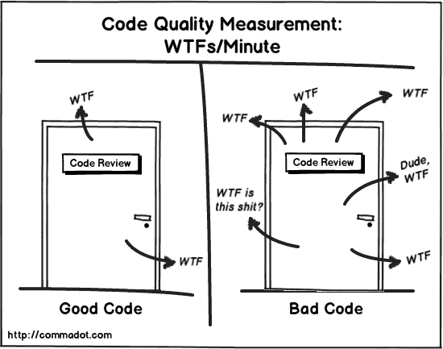
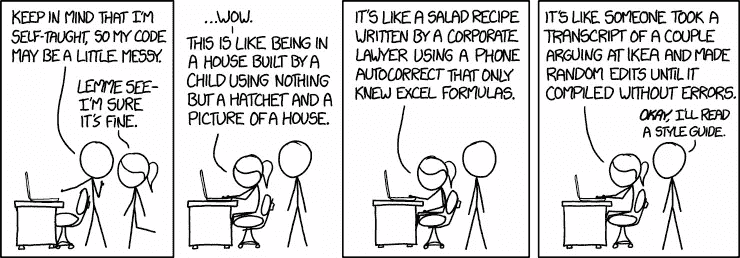
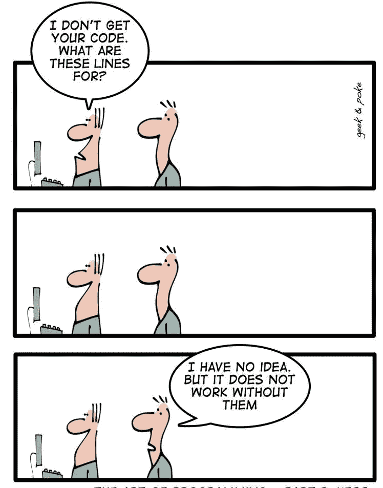
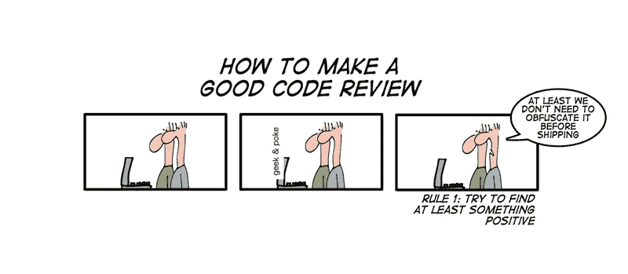

# 代码审查 101

> 原文：<https://betterprogramming.pub/code-reviews-really-503e1ea62f45>

## 如何做好它们

照片由 [I. U](https://unsplash.com/@itsmeeasy?utm_source=unsplash&utm_medium=referral&utm_content=creditCopyText) 在 [Unsplash](https://unsplash.com/s/photos/emily?utm_source=unsplash&utm_medium=referral&utm_content=creditCopyText) 上拍摄

劳斯莱斯是一个我们大多数人都听过的品牌。他们以制造世界上最华丽、最豪华、最昂贵的汽车而闻名，这些汽车的寿命超过人的一生。自 20 世纪以来，他们不仅制造汽车，还主导着高档汽车市场。

很多人不知道的是，他们几乎要花 6 个月的时间来制造一辆汽车。是的，你没听错:只有一个模型。如果我们将其与福特或丰田这样的公司相比，他们几乎不需要 17-18 个小时。劳斯莱斯的人并不慢，也不会手动组装汽车。相信我，他们有最好的工程师，最高科技的机器人，还有巨大的传送带供他们使用。

让这一过程变得漫长的是不断的检查、严格的审查以及对汽车细节的关注。他们有很多汽车制造的流程和规则，有些是自动化的，有些是手动的。他们不会也不可能降低他们汽车的质量，因为他们想以此出名。你不能只是加入劳斯莱斯就开始制造汽车。你接受了如何正确制造汽车的培训。

软件工程或多或少像汽车制造一样是一门艺术。我们学习如何编写漂亮的代码，解决酷的问题，设计复杂的系统，同时分享知识，收集反馈，创造记忆。

我上面说的这几点很常见，几乎每个人都知道。但是，如果你将我的劳斯莱斯的例子考虑在内，即使福特知道如何制造汽车，但劳斯莱斯与福特的区别在于审查过程，不断的检查和质量保证。在软件工程的上下文中，它们被称为*设计和代码评审。*

在当今的高科技世界中，软件工程中几乎所有的事情都是可以实现的，所以这使得公司越来越不耐烦以尽可能快的速度推出具有无数功能的产品。在一片忙乱中，这些审查被忽视了，因为首先它们很耗时，而且不可量化。人们发现很难在正确的方法和最快的方法之间找到平衡。

在这篇文章中，我将讨论代码评审，它们的重要性，它们的目的，以及如何去做。我会根据自己过去的经历，尝试围绕他们建立一个信仰体系。

代码评审是一种提高代码和团队工作质量的方法。这是一个在将团队成员的代码(PR)合并并部署到生产中之前，对其给出反馈和改进建议的过程。

在我们讨论如何进行代码评审的技术细节之前，有一些更重要的东西需要解释。

# 更大的目标

约翰·伍兹有一句名言:

> “总是把维护你代码的人想象成一个知道你住在哪里的暴力精神病患者。”

要理解这句话背后的情绪，人们必须停止认为编码是理所当然的，或者为了职业需求或为了获得报酬而编码。

想象一下，去一家五星级餐厅，等了一个小时后，得到一份半熟的蘑菇馄饨，因为厨师对烹饪不感兴趣。我猜我们中的大多数人会去安东尼·霍普金斯(沉默的羔羊)在厨师精神病。也许我夸张了，但这不是这里的重点。我试图强调厨师的心态。

当我们的代码没有被审查或评判时，这种疏忽的心态在我们工程师中经常出现。当编码员没有动力去寻求建议，或者编码对他们来说不是骄傲的来源，而只是指定的工作时，就会发生这种情况。代码评审不仅仅是为了代码质量。它也有助于一个更大的目的:曝光，激励，学习，或者对评论者和作者的感激。

它有助于改善同事之间的职业关系，同时他们互相帮助和提高，消除人们通常对编码的恐惧。编码是一门艺术，不仅仅是从自我探索中学到的。没有人什么都知道。人们也向他人学习，这就是他们成长的方式。也许你正在审查你队友的代码，他们使用了一种你可以借鉴的技术或算法。

代码评审是无层次的。成为团队中最资深的人并不意味着你的代码不需要审查。不管作者是实习生还是 CTO。作者有三个月或者三十年的经验都没关系。编码是一项微妙的任务，事情很容易从缝隙中溜走，所以有另一双眼睛总是有帮助的。即使在极少数情况下，代码是完美的，评审也提供了一个指导和协作的机会，并最小化了对代码库中代码理解的多样性。

事后看来，还有其他好处。

## 更好的产品质量

不是每个人都听说过这些词，但在足球世界里，这可能是最伟大的战术革命之一，并在过去二十年里帮助巴塞罗那足球俱乐部和西班牙主宰了世界足球。Tiki-taka 在最高标准的足球比赛中展示了卓越的团队合作精神。巴塞罗那足球俱乐部并没有赢得所有这些胜利，只是因为他们有世界级的球员知道如何在球队中踢好球，比如梅西和比利亚。他们赢了，因为每个人都在一起玩，并提高了彼此的发挥。

软件工程不是独角戏。工程师们必须合作并致力于一起交付最好的代码，而代码评审在很大程度上对此做出了贡献。此外，它为作者设定了期望，这样如果他们想有所贡献，他们就能保持代码符合标准。编码最佳实践是有感染力的，代码评审和反馈是与他人分享智慧的最佳方式。

## 代码中的错误更少

根据 Stripe 与 Harris Poll 合作进行的一项研究:

> “开发人员平均每周花费超过 17 个小时来处理调试和重构等维护问题，其中大约四分之一的时间花在修复糟糕的代码上。这相当于每年损失近 3000 亿美元的生产力。”

尽管代码评审并不是真正为了解决 bug 而做的(拜托..我们有测试、风格指南和 CI ),有时它们会有所帮助——例如，评审者有时可能会发现他们编写的一些底层导入函数可能会在生产中出现问题。

此外，同行评审对团队成员也有心理影响:SmartBear 对思科系统公司的一项研究发现，对于实施同行代码评审的公司来说，抽查 20%到 33%的代码可以以最少的时间支出降低缺陷密度，因为这可以防止人们将糟糕的代码推给同行。

## 人际交往技能的提高

我们都知道编码是一项技术技能(或硬技能)。这是可以教授的，也是可以衡量的能力。我们可以通过阅读别人的代码或者只是从网上复制来学习它(我们大多数人都这样做；很简单，对吧？).现在到了困难的部分，说服某人他们写的(或复制的)代码不符合标准或有错误。说服某人将他们的代码变得更好是一件困难的事情，这在代码审查期间经常发生。

这时软技能就发挥作用了。对软件工程师来说，领导能力、接受批评的能力、说服力、适应性和有效的沟通技巧比编码更重要，也更难学，这就是软件工程师与编码员的不同之处！当我们试图沟通并让我们的同事理解我们反馈背后的意图时，进行代码评审通常会磨练我们的软技能。

## 检测意外错误/盲点/错别字

人们在用母语给朋友发短信时犯打字错误是很常见的。编写机器语言代码不应该是一个例外。毕竟，我们人类犯错误是正常的，有另一双眼睛总是有帮助的。研究发现，即使是简短和非正式的阅读也会对减少错别字或盲点产生重大影响。

## 新团队成员/实习生顺利入职

有很多公司组织的入职培训，在这些培训中，新员工会被告知公司的情况、公司的运作方式以及规章制度，而且是在一个放大的层面上。对于那些花更多时间在笔记本电脑和代码上而不是和人一起工作的工程师来说，没有定义很多过程。大多数时候，他们只是被要求去阅读代码或文档。

说实话，挺沮丧的。想象一下和你的梦中情人结婚，但是就在你们结婚后的下一刻，你被要求阅读那个人的博客或传记，而不是和他们直接交谈。令人沮丧，对吗？

代码审查大大简化了技术入职的过程。也许我们可以通过给他们一个在早期进行代码评审时发现的小问题，作为未来代码改进的一部分，来开始新人的入职培训。这给了他们信心，也给了他们机会，让他们立刻产生影响。此外，不同的公司有不同的编码标准和风格是很常见的，所以代码评审也有助于团队中的新成员理解和适应团队的编码风格。

## 在团队中划分代码所有权，而不是一个人的责任

说实话，有多少次我们因为一些超级紧急的工作而想请假，但因为接下来的几天有发布会，我们不能。很常见，对吧？有时候，当你知道你不仅仅被要求编码，而且你还必须一直照看它时，你会感到不知所措。

在评审期间，评审者能够以合理的详细程度向其他开发人员解释变更。这确保了代码库的细节不止一个人知道，导致团队成员之间的积极互动和社会纽带的加强，这有助于打破“我的代码，我的所有权”的思维模式(这是非常有害的！).

安妮·斯普拉特在 [Unsplash](https://unsplash.com/s/photos/business?utm_source=unsplash&utm_medium=referral&utm_content=creditCopyText) 上的照片

# 在评论中检查什么

## 编码标准

代码库通常表现出命名约定、可变性、设计模式、逻辑、数据类型定义、辅助函数等模式。对于每一个新的 PR，通常期望根据现有的模式实现变更。作为一个评审者，你有责任执行编码标准并保持质量标准。函数和类的存在是有原因的。当审查者不清楚原因时，这可能表明代码需要重写，或者应该用注释或测试来支持。编码标准检查非常重要并且具有感染力，因为很多人都是自学成才的编码员。

## 代码复杂性

作为编码人员，我们大部分时间都陷入了重新发明轮子和继承不可靠的库的两难境地。两者各有利弊。作为评审者，在给出反馈之前，我们应该始终考虑现有的库和产品代码**。**

当有人重新实现现有功能时，通常只是因为他们不知道它已经存在。评审者应该经常问自己和作者一些问题，比如“你看到有用的抽象的潜力了吗？”以及“我们在重复我们的代码吗？”

来自函数式编程背景，我能够理解 DRY 的原则(不要重复自己)以及保持代码最少的重要性。评审人员应该尝试就如何维护和实现代码极简主义和抽象与作者交流。毕竟，编码不应该是一场斗争或感觉像在打仗；相反，它应该尽可能的漠不关心。

## 代码可维护性

一个优秀的工程团队最显著也最被低估的能力之一是他们维护代码的能力。评审人员应该问这样的问题，“作者围绕他写的代码添加测试了吗？”"这种改变会破坏向后兼容性吗？"以及“代码库是否可以为将来的用例升级？”他自己和作者。

顺便说一下，有趣的事实是:我们的代码基本上让我们保持可雇佣性，所以你的代码的寿命很重要。

## 代码性能

让我们回到基本原则，好吗？评审人员可以快速检查代码中是否使用了正确的数据结构(因为没有人喜欢延迟)，插件的版本是否随着时间而升级，或者代码中是否处理了安全性。

## 代码可读性

好了，现在我们已经确保了我们的代码具有良好的编码标准、可维护性和性能，最后一个致命的问题是可读性或人们阅读代码的难易程度。马丁·福勒有一句名言:

> “任何傻瓜都能写出计算机能理解的代码。优秀的程序员会写出人类理解的代码。”

根据我的个人经验，代码可读性是最容易做到的事情之一，因为它实际上是编写代码时思想的翻译。然而很多时候，我们往往会忽略它，主要是因为时间的限制。代码级文档或文档串、注释、提交消息、自述文件、wiki，都有助于它。审查者和作者应该确保这个文档也随着代码的变化而更新。(想一想您看到过期的自述文件、错误的提交消息、缺失的代码注释或不完整的 wiki，以及您对此的反应)。

# 如何做评论

## 心态

评论应该是礼貌的，简洁的，用中性的语言交流。应该不惜一切代价避免笑话和讽刺。把它们留到午休闲聊的时候。

“从好的开始，让它变得更好”的心态在进行代码评审时非常重要，因为我们都在一起。

应该记住以下几点:

## 商誉

欣赏，欣赏，欣赏！意识到善良的力量。毕竟我们都是靠抬别人起来的，对吧？代码审查不是贬低或批评某人的手段。试着从积极的方面开始，通过发现作者做对的事情来欣赏他们。

避免所有格代词，尤其是与诸如“你的代码有一个 bug”、“我不喜欢你的命名约定”等评价连用时。避免绝对的精明，比如“这不是我们这里的编码方式”或者“你做的方式不对。”所以不要问，“你做测试了吗？”你可以说，“我发现测试失败了。请修改您的代码以使它们通过。

戴尔·卡耐基在他的书《如何赢得朋友和影响他人》中提到，“人们主要是被情感而不是理性所驱动的。因此，指出错误或更糟的是，批评，对帮助人们学习和改变行为毫无帮助。”

## 1 PR = 1 个问题

避免要求开发人员解决与他们的功能或他们的变更集试图解决的问题不直接相关的问题。即使开发人员正在扩展或修改代码中充满不良实践的混乱部分，也不要仅仅因为他们的更改碰巧触及了混乱的代码，就要求他们在 pull 请求中修复它。相反，立即创建一个 Git 问题，并根据带宽情况，稍后尝试分配它。应该避免大的改变，所以如果可能的话，试着拆分它们。

## 你不是你的代码

评审总是关于代码，而不是人。心态应该是“我们如何改进代码？”而不是“你怎么能改进代码，让它符合我的要求。”

## 亲自进行代码评审

在线评论并不总是足以解释评论者或作者的想法。如果我们不能与我们的评审员就代码现状达成一致，我们应该通过电话、面对面的交流，或者，如果可能的话，甚至寻求第三种意见。此外，应避免群体讨论，因为它们可能会导致利益冲突。

## 不要一次审查太多代码

理想情况下，一次代码评审不应该超过 300 行代码。此外，最好是在一天或一周中设定一个时间来完成所有的代码评审。这使得评论者和作者处于同一空间。

## 使用代码审查清单

为了确保我们在代码审查期间不会遗漏任何东西，最好是制作一份所有事情的清单。类似清单的结构使得代码评审更加容易，并且代码评审质量在整个团队中更加一致。清单可以包括:待办事项、提交消息、文档字符串、命名约定、可读性、模式检查、文档、结构、风格、逻辑、性能、测试覆盖、设计、功能、可维护性等。

大多数人认为做代码评审是昂贵的。这需要时间，尤其是当每个人都在疯狂地赶着完成软件项目并将其投入到演示和生产环境中的时候。它阻碍了其他人做他们自己的工作。它要求没有参与特定代码块的人放下他们正在做的事情，去关注其他人的代码。

但是正如我上面提到的，我们应该试着关注更大的目标。我们应该后退一步，重新思考代码审查。毫无疑问，当你和一个团队一起工作时，你将需要浏览他们的代码，对吗？我们不能假定每个人都是无辜的，并假设每个人都在同一页上——这是不可能的。

代码审查可以对产品的运输质量产生巨大的影响。在代码分析上一起工作使团队更加紧密，并且提供了在公司内部分享知识和经验的机会。最后，这都是关于我们继承的好习惯，无论是在个人生活还是职业生活中。

我同意代码审查可能是一项令人生畏的任务。在有限的时间内可以检查太多的事情，但我上面提到的很多事情都可以很容易地自动化。Codegrip、PMD、FindBugs、Checkstyle 都是著名的代码评审工具。有很多代码覆盖工具(像 Cobertura，Coverage.py，Sbt-scoverage 等。)、样式检查工具(比如 Scala-Style-Guide 和 Google Java Style Guide)，或者构建工具(比如 Jenkins CI/CD 和 GitLab CI/CD)。只需谷歌搜索一下，就有数百种其他工具可以轻松地自动化大部分代码审查过程，并节省您的宝贵时间。

我尽量不把代码审查看得太专业，因为不同的公司用不同的语言以不同的方式进行代码审查。我关注的是围绕他们建立一个信仰体系，并分享我迄今为止在职业生涯中学到的东西。

以书面形式定义你和你的团队的习惯。以这篇文章为起点，定义您的代码评审过程。慢慢开始，渐渐的你就会掌握其中的窍门并爱上它。

非常感谢你的时间。干杯！