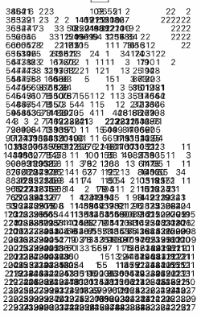
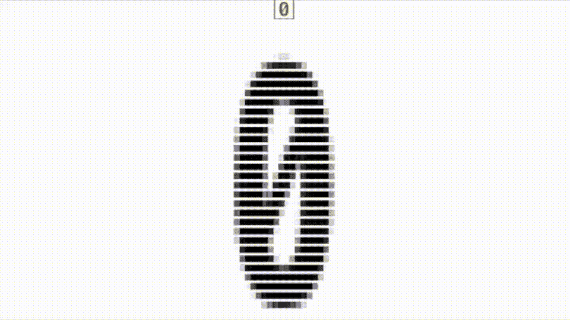
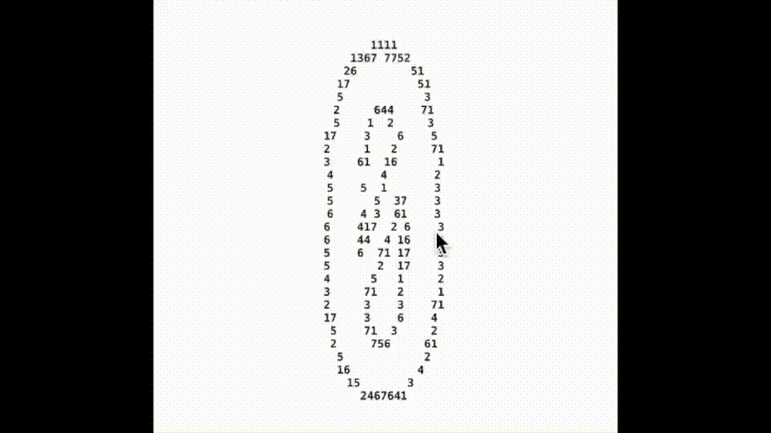
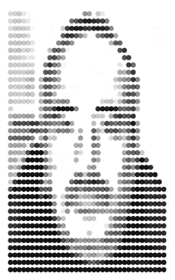

# 用 SwiftUI 编写您自己的 ASCII 艺术代码

> 原文：<https://betterprogramming.pub/code-your-own-ascii-art-with-swiftui-bf76bb8cfe83>

## 看看创建 ASCII 艺术的代码


ASCII 艺术的维基百科示例



你真正的 ASCII 艺术

在计算的早期，它们肯定不支持我们今天所知道的图形，因为内存太贵了。在贝尔工作的艺术家 Kenneth Charles Knowlton 决定尝试通过使用 ASCII 字符创建图片来弥补这一差距。这是他最著名的作品之一。

和我一起阅读这篇文章，看看在 SwiftUI 下创建自己的 ASCII 艺术作品所需的代码。

# 密码

这份简报非常清楚。我需要读入一幅图像，把它分解成像素，然后用不同的字符重建它。我通过参考我写的这篇关于图像的[文章](/handling-core-image-filter-processing-with-concurrency-in-swift-a016396c3a07)开始了这段旅程，这篇文章使用其中的模板代码来获取图像数据。

读入图像像素数据的模板代码

这里的关键部分是代表图像中点值的 32 位无符号整数的像素数组；每个字节由 4 x 8 位的块组成，其中最高的 8 位是 alpha 值，其余 24 位是颜色——蓝色、绿色和红色。

我现在需要做的就是给这个方法一个图像，把它分解成像素值，然后用 SwiftUI 打印出来。



图 0 至图 4 为矩形

这是通过使用以下代码完成的:

它查看 box 数组中的值，box 数组本身是我从图像中提取的像素数组的可迭代副本。

```
struct Boxes {
  var id = UUID()
  var box: UInt32!
}@State var boxes:[Boxes] = []
```

一个更纯形式的 SwiftUI 版本的 ASCII 艺术，这里使用了单倍行距的字体。看起来有点像在填色书上加入数字。



图 0 到图 4 使用字符来表示像素值

该图像背后的代码如下所示:

最后，这是你使用 SwiftUI 形状得到的结果。就是我开始写这篇文章时用的那个。



作为 ASCII 艺术的自画像


我用的原图

**注意**:我使用了我在这篇[论文中提到的 kern 扩展](/16-useful-extensions-for-swiftui-88aae6ff8909)来生成这篇文章的标题图像:

```
extension Text {
  init(_ string: String, configure: ((inout AttributedString) -> Void)) {
  var attributedString = AttributedString(string) /// create an `AttributedString`
  configure(&attributedString)
  self.init(attributedString)
}
}
```

所有这些都让我想到了这个短片的结尾。希望你能像我写这篇文章一样喜欢阅读它。你可以在这个[链接](https://gist.github.com/wizard1066/52d12c1da2e0e289eb82b1d9982fc437)上找到填充代码。