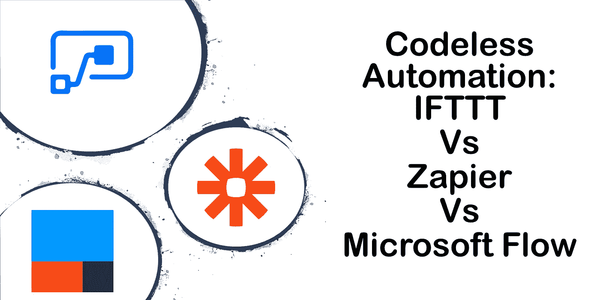

# 无代码自动化:IFTTT vs Zapier vs Microsoft Flow

> 原文：<https://betterprogramming.pub/codeless-automation-ifttt-vs-zapier-vs-microsoft-flow-57d5bc56fc0e>

## 寻找适合您的自动化选项

随着 IFTTT 的总筹款超过 6200 万美元，无代码自动化工作空间已经真正升温。随着 IFTTT、Zapier 和 Microsoft Flow 等产品的上市，日常任务的自动化变得前所未有的简单。这些工具允许您连接您的应用程序并构建自动化工作流，以提高工作效率。但这些应用各有所长，选择正确的应用可能很困难。

从广义上讲，IFTTT、Zapier 和 Microsoft Flow 都执行相同的功能，连接应用程序并自动化工作流。各有各的优缺点。事实证明，选择合适的应用程序非常困难，因为每个应用程序都适合不同的细分市场。乍一看，选择合适的应用程序令人望而生畏。每个应用程序的界面、方法和措辞都不同，但最重要的区别是与第三方应用程序的连接。每个应用程序中的连接器极大地改变了每个应用程序的使用方式和使用者。

# **IFTTT**

三者中最简单的。每个工作流都有一个触发器和一个操作。IFTTT 设计精美，是自动化的良好开端。该应用程序简洁的结构将 IFTTT 列为顶级竞争者。较低的学习曲线和简单的注册使得开始推出自动化工作流变得快速而轻松。然而，这种简单性也有缺点，因为 IFTTT 只有单一动作工作流程。只要您的工作流不需要复杂的计算，它可能就是您需要做的事情的最佳选择。

# **扎皮尔**

通过多步工作流程，Zapier 比 IFTTT 拥有更多的选择。虽然不像 IFTTT 那么简单，但 Zapier 有一个出色的界面，许多人认为简单和强大之间的权衡是值得的。Zapier 将允许您的工作流变得比 IFTTT 更复杂，使其成为一个强有力的竞争对手。Zapier 与第三方应用程序的联系最多。这些联系以及优雅的设计使 Zapier 成为这场激烈战斗中的有力竞争者。

# **微软流程**

三者中最复杂的一个，流程不会随着多步骤工作流而停止。微软已经将`For-Each`和`Do-While`循环直接设计到工具集中。`If-Then-Else`条件也包括在内，使它成为市场上最强大的无代码自动化工具。Flow 的另一个独特方面是它与 Office 365 和 Microsoft Office 产品线的直接集成。这种额外的功能使其比其竞争对手 IFTTT 和 Zapier 更难学习，但直接集成到您的电子邮件、OneDrive 和其他日常使用的产品中使其值得学习。如果您的组织正在使用 Office 365，Microsoft Flow 将为您的工作提供最多的集成。

# 那么哪个适合你呢？

虽然每个应用程序在简单性和功能上有巨大的差异，但最大的差异来自连接器。如果它能很好地与 IOT 和你在家里找到的技术相结合。开灯关灯或提醒每天冥想是一些最常见的工作流程。如果你正在寻找家庭和个人自动化，IFTTT 是完美的选择。 **Zapier 最常见的连接器来自谷歌的 G 套件**。Zapier 是希望在谷歌生产力套件中实现工作自动化的人的不二之选。M **icrosoft Flow 与 Office 365 的直接集成，让它成为那些整天在 Office 365 中工作的人的轻松选择**。此外，微软流程增加的复杂性是硬核自动化者的最爱。

# 结论

总之，这三个都很棒，值得一看。如果你不确定从哪里开始，就用 IFTTT。简单易上手。如果你对自动化你的工作生活感兴趣，你可能想看看 Zapier 和 Microsoft Flow。如果您有任何问题，请不要犹豫，通过以下方式联系我，或者通过 Twitter @gruberjl 或 LinkedIn 联系我。