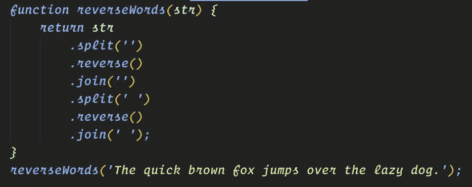

# 代码战争:反向单词挑战

> 原文：<https://betterprogramming.pub/codewars-reverse-word-challenge-394d32461506>

## 打破我们的第一个编码挑战



# 介绍

最近，我一直在 Codewars.com 花时间处理各种代码挑战。最初，我在应对这些挑战时遇到了困难，或者会对如何完成它们感到完全不知所措，但在花了更多时间学习 JavaScript 后，我开始将一些问题整合在一起。在这个系列中，我想分解其中的一些挑战，并讨论我是如何完成的。

# 反向单词挑战

在这篇文章中，我将会介绍逆序词汇挑战。这个挑战的目标是反转字符串中的单词，如果字符串中有多个单词，它们将停留在同一个位置，但单词将是反向的。对于这个挑战，字符串是`“The quick brown fox jumps over the lazy dog.”`，目标是返回`“ehT kciuq nworb xof spmuj revo eht yzal .god”`。我将回顾一下`.split()`、`.reverse()`和`.join()`，并在帖子底部提供了这些网站的链接。

# 让我们开始解决

```
function reverseWords(str) {
*return* str
}
reverseWords(‘The quick brown fox jumps over the lazy dog.’);
```

这就是我们的出发点。我们有一个接受一个字符串参数的函数。最初，您可能会想，我们可以用`str.reverse()`来开始，但不幸的是`.reverse()`只适用于数组。相反，我们需要做的第一件事是使用 `str.split(‘’)`返回一个字符数组。为此，您可以使用`.split(‘’)`或`.split(‘ ‘)`。如果在引号之间没有空格的情况下使用 split，它将在每个字符之后进行拆分。如果在引号之间使用 split，它将在字符串中的每个空格处拆分。对于这个挑战，我选择了使用`.split(‘')`。

```
function reverseWords(str) {
*return* str.split(‘’)
}
reverseWords(‘The quick brown fox jumps over the lazy dog.’);
```

输出:`[‘T’, ‘h’, ‘e’, ‘ ‘, ‘q’, ‘u’, ’i’, ’c’, ’k’,’ ‘, ‘b’, ’r’, ’o’, ’w’, ’n’, ’ ‘, ’f’, ’o’, ’x’, ’ ‘, ’j’, ’u’, ’m’, ’p’, ’s’, ’ ‘, ’o’, ’v’, ’e’, ’r’, ’ , ’t’, ’h’, ’e’, ’ ‘, ’l’, ’a’, ’z’, ’y’, ’ ‘, ’d’, ’o’, ’g’, ’.’]`。

现在我们有了这个在每个字符处都被分割的大规模数组，我们可以添加`.reverse()`并翻转它。当使用`.split()`和`.reverse()`方法时，您不需要创建不同的变量并将它们链接在一起，您可以简单地将它们相加，比如:`str.split(‘’).reverse()`。让我们检查输出，看看我们得到了什么:

```
function reverseWords(str) {
*return* str.split(‘’).reverse()
}
reverseWords(‘The quick brown fox jumps over the lazy dog.’);
```

输出:`[‘.’, ’g’, ’o’, ’d’, ’ ‘, ’y’, ’z’, ’a’, ’l’, ’ ‘, ’e’, ’h’, ’t’, ’ ‘, ’r’, ’e’, ’v’, ’o’, ’ ‘, ’s’, ’p’, ’m’, ’u’, ’j’, ’ ‘, ’x’, ’o’, ’f’, ’ ‘, ’n’, ’w’, ’o’, ’r’, ’b’, ’ ‘, ’k’, ’c’, ’I’, ’u’, ’q’, ’ ‘, ’e’, ’h’, ’T’]`

我们越来越接近我们想要的，但还没有达到。现在我们需要把这个东西放回一起，变成一个字符串，这样我们就可以对它做更多的工作。这就是`.join()`的用武之地。我们使用`.join()`就像我们使用`.split()`一样。为此，我们需要在`.join()`中加入我们在`.split()`中所做的同样的论证:

```
function reverseWords(str) {
*return* str.split(‘’).reverse().join(‘’)
}
reverseWords(‘The quick brown fox jumps over the lazy dog.’);
```

输出:`‘.god yzal eht revo spmuj xof nworb kciuq ehT’`

看起来我们就快到了。单词被翻转，但现在它们在错误的位置。回顾目标，我们需要让“ehT”回到第一位。神”又回到了最后一点。要做到这一点，我们需要将字符串拆分成一个数组，这样我们就可以再次反转它。这次我们用`.split(‘ ‘)`。确保引号之间有一个空格，这让我们可以在空格处而不是在每个字符后分开。

```
function reverseWords(str) {
*return* str.split(‘’).reverse().join(‘’).split(‘ ‘)
}
reverseWords(‘The quick brown fox jumps over the lazy dog.’);
```

输出`[ ‘.god’, ‘yzal’, ‘eht’, ‘revo’, ‘spmuj’, ‘xof’, ‘nworb’, ‘kciuq’, ‘ehT’ ]`

我们越来越接近完成这件事了！现在我们已经将字符串拆分成了一个数组，我们可以颠倒单词的顺序。`.reverse()`的工作原理是颠倒数组中每一项的顺序，所以当我们现在使用它时，它不会改变每个字符串中的字母，它只会翻转数组中每个字符串的索引位置。

```
function reverseWords(str) {
*return* str.split(‘’).reverse().join(‘’).split(‘ ‘).reverse()
}
reverseWords(‘The quick brown fox jumps over the lazy dog.’);
```

输出`[ ‘ehT’, ‘kciuq’, ‘nworb’, ‘xof’, ‘spmuj’, ‘revo’, ‘eht’, ‘yzal’, ‘.god’ ]`

那看起来好多了！要完成这个挑战，我们需要做的最后一件事是将这个数组转换回字符串，我们将再次使用`.join()`来完成。我们使用的最后一个`.split(‘ ‘)`在引号之间有一个空格，当我们使用`.join(‘ ‘)`时，它需要是相同的。

```
function reverseWords(str) {
*return* str.split(‘’).reverse().join(‘’).split(‘ ‘).reverse().join(‘ ‘)
}
reverseWords(‘The quick brown fox jumps over the lazy dog.’);
```

输出`‘ehT kciuq nworb xof spmuj revo eht yzal .god’`

在那里！这是最终的函数，它提供了我们想要的结果:

```
function reverseWords(str) {
*return* str
.split(‘’)
.reverse()
.join(‘’)
.split(‘ ‘)
.reverse()
.join(‘ ‘);
}
reverseWords(‘The quick brown fox jumps over the lazy dog.’);
```

# 结论

当您将这些呼叫连接在一起时，它们不需要都在同一条线路上。一旦我保存，漂亮接管并为我把它们全部隔开，以便于阅读。当事情对我来说像这样被打破时，感觉我的眼睛更容易滑过它们，我能更快地理解发生了什么。

如果您想了解有关拆分、反转或合并的更多信息，请访问以下 MDN 链接:

*   [mdn。split()](https://developer.mozilla.org/en-US/docs/Web/JavaScript/Reference/Global_Objects/String/split)
*   [mdn 反向()](https://developer.mozilla.org/en-US/docs/Web/JavaScript/Reference/Global_Objects/Array/reverse)
*   [mdnjoin()](https://developer.mozilla.org/en-US/docs/Web/JavaScript/Reference/Global_Objects/Array/join)

感谢您花时间阅读本文，我希望它对您有所帮助。这是我第一篇解释代码的博文，所以如果你有任何建议或反馈来帮助我改进，请在这里发表评论。谢谢你的时间，我希望你能来看我的下一篇文章。