# 用 Python 构建一个不和谐机器人

> 原文：<https://betterprogramming.pub/coding-a-discord-bot-with-python-64da9d6cade7>

## 给你的不和谐服务器增加一些特色

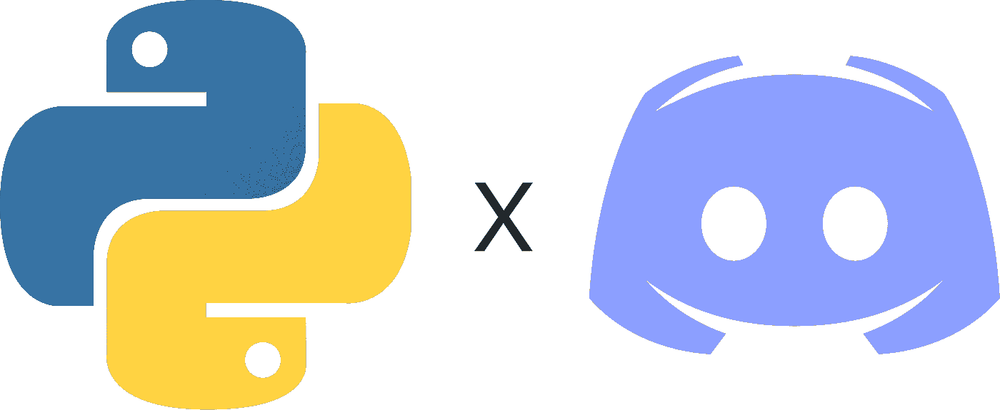

作者照片。

所以你使用 Discord 作为一个消息应用程序，你对自己说，“嘿，也许我应该让我自己成为一个机器人…”希望，这篇教程将让你走上使用 Python 构建自己的 Discord 机器人的正确道路。

# 目录

*   第一步:安装`discord.py`。
*   步骤 2:创建一个 Discord 应用程序和 bot。
*   第三步:创建一个不和谐公会(服务器)。
*   步骤 4:将机器人添加到服务器中。
*   第五步:编写机器人代码。

# 1.安装 discord.py

有几个库可以攻击 Discord 的 API，每个库都有自己的特点，但最终它们都实现了相同的目标。因为我们关注的是 Python，`discord.py`可能是 Python 最流行的包装器。

假设您已经安装了 Python 和`pip`,您会想要运行这个命令:

```
pip install discord.py
```

`discord.py`有一些要求，如果您的计算机还没有这些要求，将自动安装这些要求。一旦运行了这个命令，您应该会看到类似这样的内容:

```
Installing collected packages: discord.py
Successfully installed discord.py-[version-number]
```

成功！你现在可以访问 Discord 的 API 了。在我们开始编写一个不和谐机器人版本的“Hello World”之前，我们需要先设置一些其他的东西。

# 2.创建一个不和谐的应用程序和机器人

在进入代码之前，我们需要创建一个“不和谐的应用程序”这本质上是一个拥有机器人的应用程序。不和谐可以接入[。](https://discordapp.com/developers/applications)

如果你没有不和谐账户，那么你需要创建一个。但是，如果你没有一个不和谐的帐户，我不明白为什么你会看这种类型的教程摆在首位。

页面看起来应该是这样的:

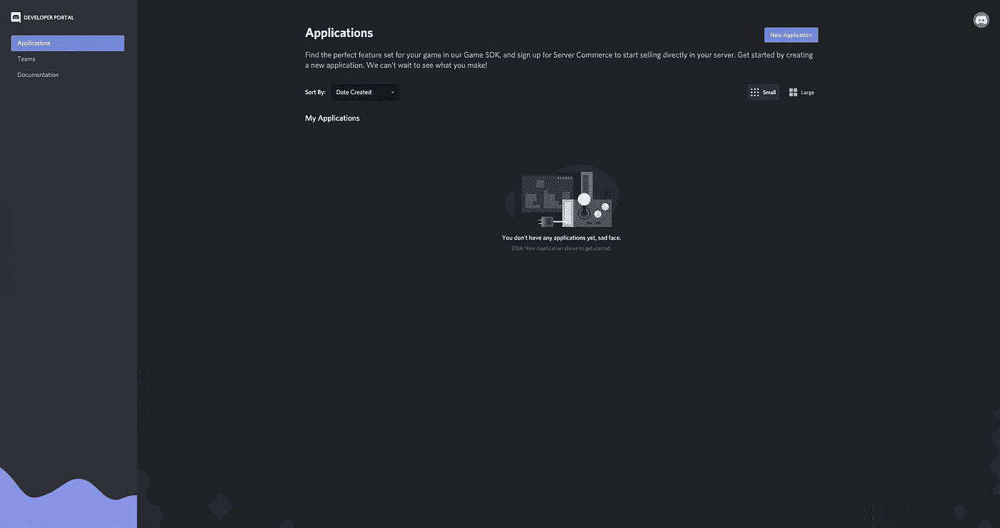

进入此页面后，您需要点击“新申请”按钮:

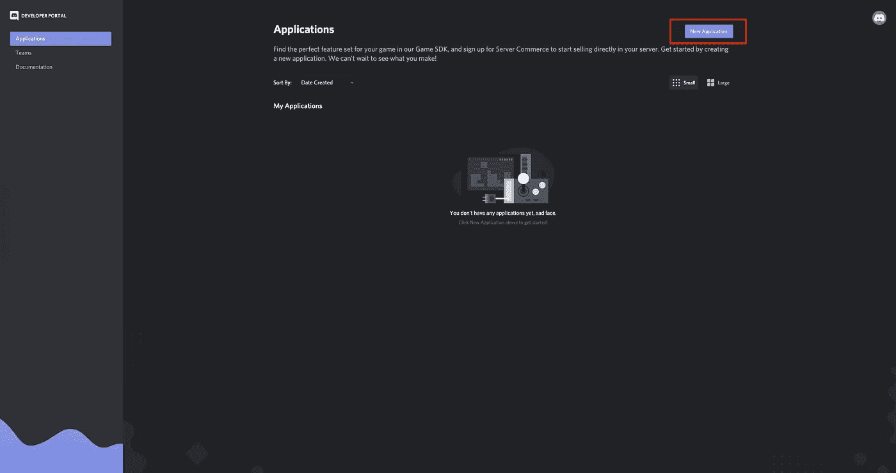

单击该按钮后，系统会提示您命名应用程序:

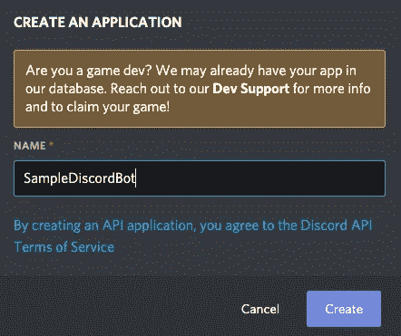

我将把我的命名为“SampleDiscordBot”，但是您可以随意命名。

所以一旦你创建了你的应用程序，你会看到一个如下所示的菜单:

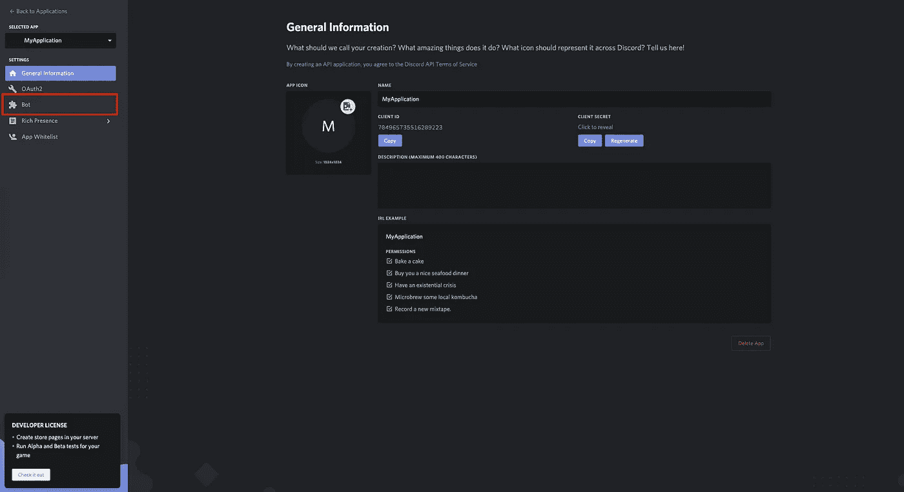

这里有很多信息和设置，但是现在，我们只关心左边的“Bot”设置。让我们继续，点击它进入机器人页面:

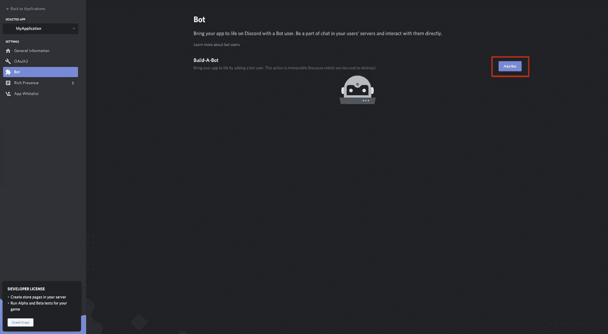

然后我们想点击“添加机器人”按钮。将弹出一个窗口，询问您是否要将一个机器人绑定到您的应用程序。你想打碎那个“是的，做吧！”按钮。

现在已经创建了一个 bot，并将其附加到应用程序中。我们将需要创建一个全新的 Discord 服务器——或者 API 喜欢称之为“公会”——这样我们就可以把机器人放进去乱搞。

# 3.创建一个不和谐公会(服务器)

现在我们已经启动并运行了我们的机器人，我们将需要创建一个新的服务器，以便我们有一个机器人的沙箱。你可以把它添加到一个现有的服务器上来扰乱人们。如果这是你想要的，那就请便。

创建一个不和谐服务器很简单。进入“不和谐”时，只需点击左侧的加号按钮:

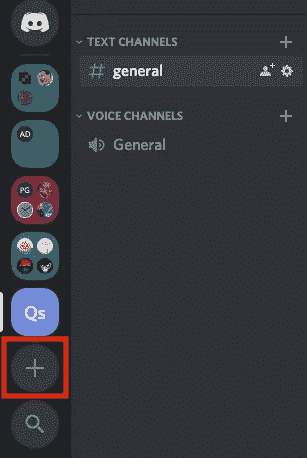

您将得到一个菜单提示来命名您的服务器。您可以将服务器命名为您想要的任何名称，但是我通常会以 bot 命名它，并将其视为一个开发环境。

我们只需要将机器人添加到服务器上，然后我们就可以开始研究代码了。

# 4.将机器人添加到服务器

为了让我们玩这个机器人，我们需要把它添加到一个服务器上。这也是一个非常简单的步骤。我们需要转到 Discord 应用程序中的“OAuth2”部分:

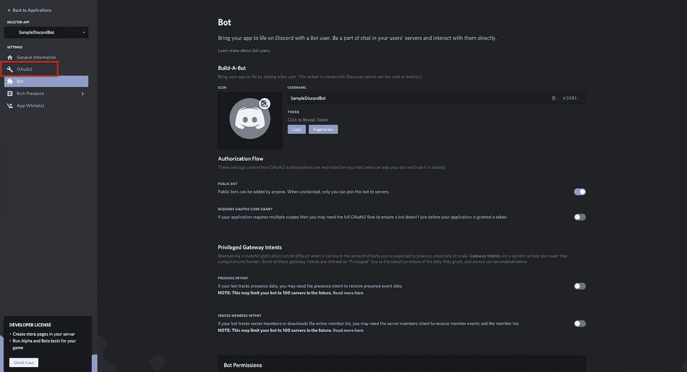

在我们进入 OAuth2 部分后，我们看到一个带有一堆复选框的屏幕。我们要确保我们点击了标有“机器人”的框

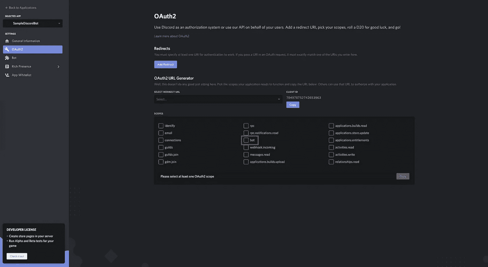

在我们选中该复选框后，一个 URL 应该会出现在它的正下方:

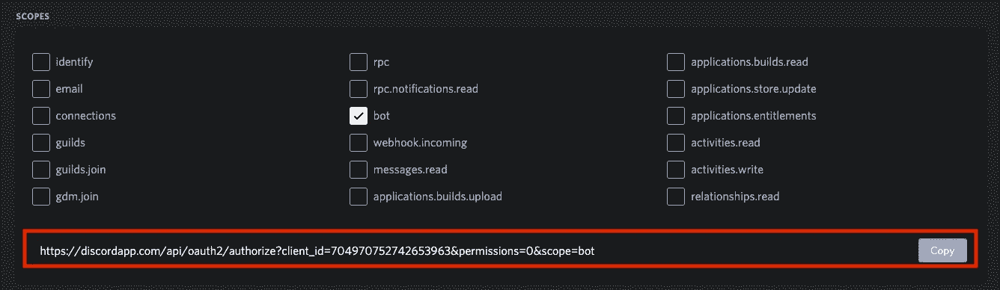

复制 URL 并粘贴到您的浏览器中。此链接允许您的 bot 加入您的用户有权使用 OAuth2 加入的任何服务器。如果你以前在服务器中添加过机器人，这一步应该会很熟悉。如果你还没有，当你点击这个网址时，你会得到一个类似这样的菜单提示:

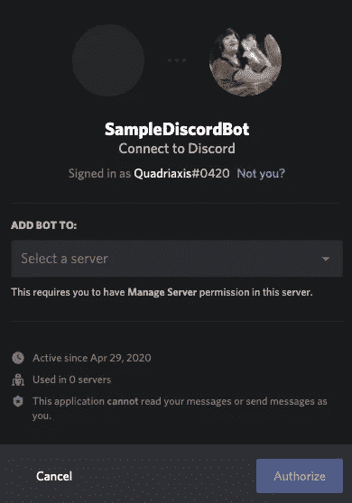

继续从下拉列表中选择您创建的服务器，然后单击“授权”这将把机器人放到你的服务器上！一条消息将出现在您的服务器上，表明机器人已经加入:

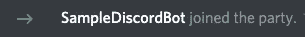

你还会在 Discord 界面右侧的用户列表中看到你的机器人:

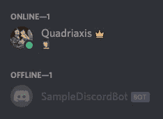

现在，机器人已经进入服务器，我们终于可以开始编码一个基本的机器人。

# 5.编写机器人代码

让我们在您的机器上创建一个新的 Python 文件。我要叫我的`main.py`。该文件的内容将如下所示:

`on_ready()`和`on_message()`函数是与 Discord bot 相关联的事件监听器，正如`@bot.event`注释所指出的。这些相当简单。一种是当`main.py`运行时机器人启动。打印语句将在您的终端中显示:

```
- 704974365309141042 (name: Quadriaxis's server)
SampleDiscordBot is in 1 guilds.
```

您可以将它作为一种工具，在您认为合适的时候记录信息。我只是用它来做一个快速的计数，检查机器人连接了多少个公会/服务器，以及一些关于公会/服务器的数据。

`on_message()`函数监听进入机器人所在的任何通道的任何消息。在 Discord 端发送的每个消息都将触发这个函数，并发送一个`Message`对象，该对象包含许多关于所发送消息的信息。诸如频道、谁发送的消息等等。我使用这个函数来简单地检查发送的消息是否等于“hello”如果是，那么我们的机器人会回复一个非常欢迎的短语。

既然已经讨论了事件侦听器，我将把重点放在这个代码块中发生的一些更重要的部分。

bot 运行所需的三个部分是:

这些代码行导入了 Discord 的 API，创建了允许我们指定机器人能做什么的`Client`对象，最后用我们的令牌运行机器人。说到令牌，要获得您的 bot 令牌，只需进入 Discord 开发者门户中的 Bot 页面，然后单击“复制”按钮。

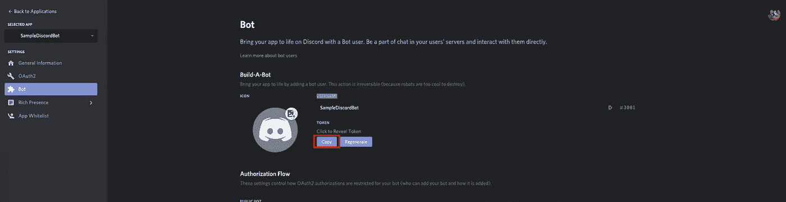

如果您熟悉 API 令牌，那么这就是它。如果你不是，那么这是一个特殊的字符串来识别你的机器人。它允许你从你的程序中访问你的机器人。你可以把它想象成你的机器人的密码。没有这个令牌，你就不能碰你的 bot，所以一定要把它藏起来。不然别人也可以碰你的 bot。你不希望别人碰你的机器人，对吧？

存储这些类型的令牌的常见做法是使用某种隐藏文件，程序从该文件中提取字符串，这样它们就不会被提交给 VCS。`python-dotenv`是一个流行的软件包，它为我们做到了这一点。让我们继续安装这个包，这样我们就可以保护我们的令牌。

在您的终端中运行以下命令:

```
pip install python-dotenv
```

这将在我们的机器上安装`python-dotenv`。这将允许我们使用一个`.env`文件来存储我们的令牌。在与您的`main.py`相同的目录级别中创建一个`.env`文件。`.env`的内容应该是这样的:

```
DISCORD_TOKEN="NzA0OTcwNzUyNzQyNjUzOTYz.Xqk5ww.1U_-WdW4aeGWCNF7bOJkLAu_2TM"
```

现在我们在这个文件中有了 API 令牌，我们可以通过在现有代码中添加以下几行来在`main.py`中检索它:

因为我们有了`DISCORD_TOKEN`，我们可以在程序底部用这个变量替换硬编码的 API 令牌:

```
# Executes the bot with the specified token.
bot.run(DISCORD_TOKEN)
```

最终的`main.py`文件如下所示:

# 结论

恭喜你。你做了你的第一个机器人！到目前为止，我们只是触及了表面，但这是一个很好的起点。像 bot 命令这样的主题甚至没有在本文中涉及。更多的文档和有用的信息可以在官方的 [discord.py API 参考页面](https://discordpy.readthedocs.io/en/latest/api.html)上找到。很好地理解如何阅读 API 不仅会让你成为一名更好的开发人员，还能让你构建你想要的任何类型的不和谐机器人。

源代码也可以在 GitHub 上找到[。](https://github.com/ericjaychi/sample-discord-bot)

下一集再见！