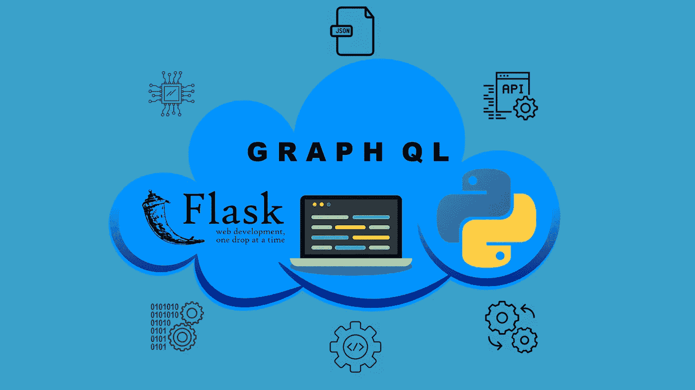
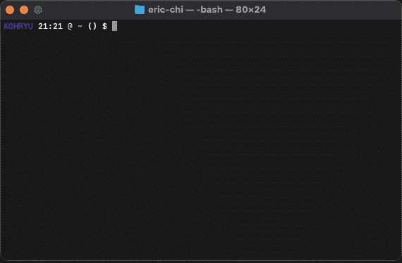
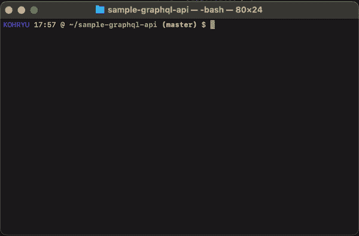
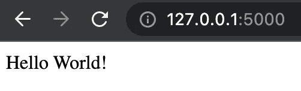
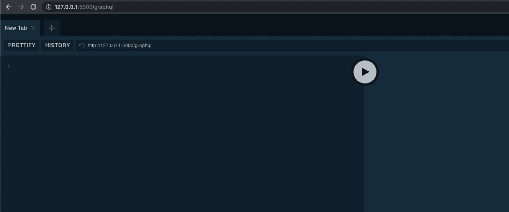
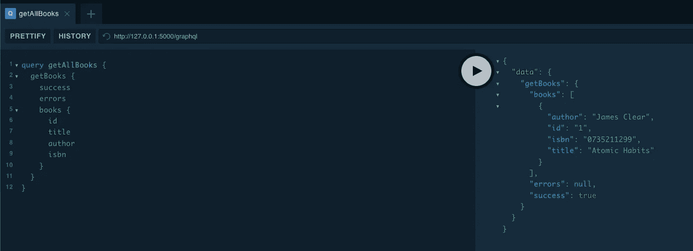

# 用 Python 编写 GraphQL API

> 原文：<https://betterprogramming.pub/coding-a-graphql-api-with-python-af74919e7f90>

## 使用 Flask、Ariadne 和 Flask-SQLAlchemy



作者制作的图像。

> 完整的源代码可以在这里找到:【https://github.com/ericjaychi/sample-graphql 

在我们编写任何代码之前，我们可能应该快速浏览一下 GraphQL 是什么。GraphQL 是一种用于 API 的查询语言。那是什么意思？这意味着与您的 API 进行交互的开发人员可以根据需要请求尽可能多或尽可能少的数据。想想看，给定一个表，您可以在关系数据库中查询任意多或任意少的列。

现在最大的问题是，这与 REST API 有什么不同，为什么要使用它？如果你不知道什么是 REST API，没关系，我有一篇关于如何创建一个的[文章！我建议在开始本教程之前先看看本教程，因为它的复杂性比 GraphQL API 要低一些。](https://medium.com/swlh/coding-a-rest-api-with-python-77384ad60511)

现在，让我试着描述一下。想象一下，你带着预先包装好的三明治走进一家杂货店。这些三明治有面包、生菜、西红柿、奶酪、肉和蛋黄酱。你不能自定义它们；是“拿了就走”现在，让我们说，现在你已经成为素食者，也在低碳水化合物饮食，但仍然想从熟食店买一个三明治。这些预包装的三明治仍然足够了，但是当你打开三明治包装时，你必须去掉一些你不想要的东西，比如肉和面包。

现在，想象一下同样的熟食店，但不是预先包装的三明治，而是包含所有相同成分的自制三明治吧。根据你的饮食限制，你现在可以自由地做任何你想要的三明治。

在这个类比中，REST APIs 是预先打包的三明治，而 GraphQL APIs 是自己构建的三明治。每种熟食店都有利弊，就像从软件和架构的角度来看也有利弊一样。现在舞台已经搭好，让我们继续前进，进入实施阶段！

```
**Table of Contents**

[Step 1: Installing Dependencies](#350d)

[Step 2: Setting Up the Flask Environment](#3472)

[Step 3: Defining the Database and the Models](#dc97)

[Step 4: Populating the Database](#d676)

[Step 5: Defining GraphQL Schemas](#5632)

[Step 6: Creating and Binding Resolvers](#f337)

[Step 7: Executing Our API](#1f75)

[Step 8: Mutating Data](#884c)
```

# **第一步:安装依赖关系**

对于这样的 API，我们需要三个组件:Flask、Ariadne 和 Flask-SQLAlchemy。

*   Flask 是一个允许我们用 Python 构建 web 服务器的框架。
*   Ariadne 是我们利用 GraphQL 的一个库。
*   Flask-SQLAlchemy 是一个库，可以让我们快速建立数据库。可以使用任何其他数据库解决方案，但是对于本教程，我们将使用 Flask-SQLAlchemy 这样简单的解决方案。

所有这三个包都可以在`pip`上获得，这意味着很容易安装到我们的机器上。这假设您的机器上已经安装了`pip`或者正在使用某种形式的虚拟环境。

```
pip install flask ariadne flask-sqlalchemy
```



通过 pip 安装依赖项。忽略警告，家酿是贬低皮普，我已经懒得移动了。

我不会详细介绍这些库是做什么的，如果你好奇的话，可以在网上搜索一下！

# **步骤 2:设置烧瓶环境**

现在我们已经安装了将要使用的工具，让我们在添加任何复杂的 GraphQL 代码之前，首先启动并运行我们的应用程序。

为此，我们需要在目录中创建一个小文件结构。首先，在项目目录中创建一个名为`main.py`的新文件。其次，您想要创建一个`api/`目录，然后在该目录中创建一个名为`__init__.py`的文件。最后，你会得到这个:

```
sample-graphql-api
├── api
│   └── __init__.py
├── book.db
└── main.py
```

在`main.py`文件的内容里面:

main.py

然后里面的`api/__init__.py`文件:

api/__init__。巴拉圭

这基本上只是样板代码，允许我们在本地机器上运行应用程序。我们将很快增加更多的功能。

让我们通过在项目目录中键入以下命令来运行应用程序:

```
python main.py
```



启动 Flask 应用程序的输出。

运行此命令将使本地服务器运行。您现在可以在浏览器中进入`127.0.0.1:5000` ，查看我们可爱的网页！`localhost:5000` 也行。



http://127.0.0.1:5000/

没什么特别的，但是这是我们开始迭代下一步所需要的。

# 步骤 3:定义数据库和模型

下一步我们将编写一些代码来定义本教程的数据库模型。因为我们正在与 Flask-SQLAlchemy 交互，所以我们不需要做任何工作来启动本地数据库，但是，我们仍然需要添加几行代码来将数据库配置到一个文件中，并且我们仍然需要在 Python 端定义我们的数据库模型。

让我们首先定义数据库，并在`__init__.py`文件中将它附加到 Flask 应用程序:

api/__init__。巴拉圭

同样，由于我们使用的是 Flask-SQLAlchemy，与使用数据库解决方案相比，只需要几行代码就可以做到这一点。

*   第 10 行告诉 Flask-SQLAlchemy 数据库的确切位置。
*   第 11 行是一个配置，它跟踪对象的修改，每次数据库发生变化时，它都向应用程序发送一个信号。这对于我们的教程来说是不必要的，所以我们将它设置为`False`。

现在我们已经有了数据库文件，我们可以继续在一个名为`models.py`的新文件中定义我们将在这个例子中使用的数据模型。该文件将在`api`目录下创建。代码如下:

api/models.py

这是相对简单的代码，因为大多数应用程序需要用后端语言表示数据模型。这允许我们在 Python 端表示我们的数据模型，它将与数据库通信。

既然我们的数据库代码已经全部实现，我们现在可以通过 Python 命令行向数据库中添加一些虚拟数据。传统上，您将拥有来自用户的数据，但是由于这是一个关于使用 GraphQL 的教程，我们只需要虚拟数据来处理。

在我们进入下一步之前，我们还想完成我们的包的配置，所以在`main.py`中现有的 import 语句下面添加这个新的 import 语句。在`main.py`中，您的导入语句应该如下所示:

```
from api import app, db
from api import models
```

# 步骤 4:填充数据库

在这一步中，我们将重点关注将一些数据放入本地数据库。通常，我们会从不同的源(如最终用户)填充数据，但由于这是一个教程，我们需要自己添加数据。

为此，我们需要在项目目录中调用终端中的 Python 解释器。只需在您的终端中键入以下行:

```
python
```

这将打开您的 Python 解释器。从这里开始，我们将在数据库中手动创建一条记录，如下所示:

在解释器中键入每个命令(带有>>>的行)。理论上我们可以做一个文件来做这个，但是这样更快。

既然我们运行了这段代码，我们应该在目录中有一个名为`book.db`的新文件。这包含我们刚刚放入的数据，以及数据库正常运行所需的一些其他数据。

# **步骤 5:定义 GraphQL 模式**

现在我们已经正确地创建了数据，是时候最终进入本教程的 GraphQL 部分了。简单总结一下，GraphQL 有自己的语言，SDL，模式定义语言。这定义了我们的 API 必须提供什么。无论是从数据模型的角度还是从端点的角度。

我们需要在这个项目的根目录下创建一个名为`schema.graphql`的新文件，它将提供 CRUD(创建、读取、更新、删除)功能。在本教程中，我们将只讨论创建和读取。

schema.graphql

请记住，这一步可以在定义 API 的开始阶段完成。只要你的服务器端代码尊重`schema.graphql`中的定义，这并不重要，反之亦然。

# 步骤 6:创建和绑定冲突解决程序

在这一步中，我们将创建解析器，然后绑定它们，以便我们可以使用它们来调用我们的 API。解析器是为我们创建的模式中的类型解析值的函数或方法。如果我在这里向你展示我的意思可能会更好。

在`api/`目录中，请创建一个名为`queries.py`的新文件，如下所示:

api/queries.py

这是一个非常简单的函数。在`get_books_resolver()` 函数中，我们查询`Book` 表中的所有条目，并将其序列化到一个字典中，这样我们就可以将它作为响应进行传递。有一个代码片段允许我们在出现错误时捕捉错误，并根据出现的错误设置响应。

`obj`作为父解析器返回的值，对于这个特定的例子，它是根解析器。这在本教程中没有用到。

`info`包含 GraphQL 服务器在解析器执行期间提供的任何上下文。这可以携带广泛的数据，如身份验证详细信息。这在本教程中没有用到。

现在我们已经编写了一个基本的解析器，我们需要让我们的框架 Ariadne 知道如何执行这个函数。在我们的`main.py` 中，我们想要添加以下代码片段:

main.py

我们在这里添加了相当多的代码，所以让我们来看一些重要的部分。

`ObjectType` 被导入来帮助我们定义这个解析器在我们的模式中是什么类型的执行。我们定义了两种类型，`Query`和`Mutation`。在这种情况下，我们将`ObjectType`定义为`Query`类型，它与 REST APIs 中的`GET` 同义。

`set_field` 将`books` 绑定到我们的解析器。那是什么意思？当与我们的 API 对话时，客户端或用户将使用我们在这个`set_field` 函数的第一个参数中定义的内容。这意味着我们的用户必须使用`books` 关键字来调用我们定义的任何函数，在本例中是`get_books_resolver()`。

`load_schema_from_path`读取我们决定输入的模式。在本例中，我们在上一步中制作的`schema.graphql` 文件。

`make_executable_schema`获取我们定义的模式和查询，并允许它们被执行。

`snake_case_fallback_resolvers`允许在返回的对象中查找字段名之前，将字段名转换成大小写。这只是为了保持一致性，因为 Python 使用 snake case，而大多数其他语言如 Javascript 使用 camel case。

# 步骤 7:执行我们的 API

我们正在接近终点线，实际上我们所有的辛勤工作都有一些东西可以展示。我们将利用 Ariadne 的 GraphQL 平台。这是一个用户界面，允许我们玩我们的 API。我们需要添加更多的代码来实现这一点。

在您的`main.py` 文件中，在解析器逻辑之后添加以下代码片段:

main.py 底部

这段代码允许我们在浏览器中使用`/graphql`目的地。这允许我们使用 Ariadne 提供的操场 UI。要理解我说的话，请进入您浏览器内的`http://127.0.0.1:5000/graphql`。通过在您的终端内部执行`python main.py`,确保您正在运行您的 Flask 服务器！



阿里阿德涅游乐场用户界面

现在，在编辑器的左侧，插入以下代码片段:

```
query getAllBooks {
  getBooks {
    success
    errors
    books {
      id
      title
      author
      isbn
    }
  }
}
```

当您通过按下巨大的 play 按钮来执行此操作时，您将在右侧看到我们数据库中所有不同的`Books`的输出:

```
{
  "data": {
    "getBooks": {
      "books": [
        {
          "author": "James Clear",
          "id": "1",
          "isbn": "0735211299",
          "title": "Atomic Habits"
        }
      ],
      "errors": null,
      "success": true
    }
  }
}
```



在执行我们的查询之后。

如你所见，该模型的结构与我们在`schema.graphql`和`models.py`文件中定义的完全一样。

本教程开头提到的 GraphQL 的有趣之处在于，与传统的 REST API 不同，您可以根据需要请求任意多或少的数据。为此，只需修改我们提交的查询，删除任何您不需要的字段！

```
query getAllBooks {
  getBooks {
    success
    books {
      id
      title
      author
    }
  }
}
```

在这个查询中，我们删除了`isbn`字段和`error`字段，当我们执行这个查询时，我们不会在响应中看到这些数据点。因此，这确实给了客户很大的权力来请求他们确切需要的数据，而不是根据 API 合同获取每一条数据。这也是 GraphQL 极其强大的一点。

# 步骤 8:改变数据

这个很长的教程的最后一步，改变数据！因为修改数据和检索数据一样重要。好的方面是它重复了与步骤 6 相同的步骤，除了我们编写逻辑来改变数据而不是检索数据。为了稍微缩短本教程，我们将只添加一个`Book`的创建逻辑。任何其他操作都遵循完全相同的步骤，不同之处在于在响应中填充数据的核心逻辑。

为了创建一个用于修改数据的 GraphQL 词汇表`Mutation`，我们将在我们的`api` 目录中创建一个名为`mutations.py`的新文件。这将是我们的突变的家，就像我们有一个查询的家一样。在这个新创建的文件中，添加以下代码行:

api/mutations.py

我觉得代码在这里是不言自明的，因为我们在步骤 6 中已经这么做了。

现在我们已经将解析器注入到了我们的`mutations.py`文件中，我们需要在我们的`main.py`文件中配置它，这样我们的应用程序就能理解如何调用这段代码。

在我们的`main.py`文件中，我们想要更新我们的代码，如下所示:

main.py

我们添加了几行代码。

*   第 8 行我们正在导入我们在这一步前面定义的新解析器。
*   第 15 行我们正在创建一个新的`ObjectType`,它带有我们在模式中定义的“突变”类型的值。
*   第 20 行的行为与我们的对应查询非常相似，除了我们调用了`create_book_resolver`函数。
*   第 27 行我们需要更新我们的参数列表，以包含我们定义的新的`mutation`变量。

完成这些更改后，让我们快速重启我们的 Flask 服务器。现在，我们可以用下面的语句在 UI 中执行我们的新变化:

```
mutation createBook {
  createBook(title:"Eat That Frog!", author:"Brian Tracy", isbn:"152309513X") {
    success
    errors
    book {
      id
      title
      author
      isbn
    }
  }
}
```

这调用了我们的解析器，我们用在`type Mutation`部分下的`schema.graphql`中定义的匹配函数来定义它。参数列表与我们在`schema.graphql`文件和解析器中定义的完全一样。然后解析器处理我们编码的数据，然后将响应传递回客户端。

一旦在 UI 中执行了这个命令，您应该会得到以下响应:

```
{
  "data": {
    "createBook": {
      "book": {
        "author": "Brian Tracy",
        "id": "2",
        "isbn": "152309513X",
        "title": "Eat That Frog!"
      },
      "errors": null,
      "success": true
    }
  }
}
```

记住，GraphQL 允许我们要求尽可能多或少的数据。在这里，在我们的响应中，我们接收所有的数据，因为这是在请求中定义的，但是如果我们想将它限制在我们的模型中的特定数据点，我们可以在我们的查询中删除字段，类似于我们在上一步中通过`getAllBooks`所做的。

现在如果执行`getAllBooks`，就会看到新添加的书！

```
{
  "data": {
    "getBooks": {
      "books": [
        {
          "author": "James Clear",
          "id": "1",
          "title": "Atomic Habits"
        },
        {
          "author": "Brian Tracy",
          "id": "2",
          "title": "Eat That Frog!"
        }
      ],
      "success": true
    }
  }
}
```

# 结论

我们做到了！恭喜你坚持到最后。这是一个非常长的教程，我们甚至跳过了一些操作，比如更新、删除和通过 ID 获取一本书。这个过程都是一样的，除了您正在更改解析器中的核心逻辑。只要您了解如何绑定解析器，那么理论上您就可以创建任何端点。

我鼓励您尝试自己实现其余的操作。

一如既往，所有的代码都可以在这里找到:[https://github.com/ericjaychi/sample-graphql-api](https://github.com/ericjaychi/sample-graphql-api)

下集再见！