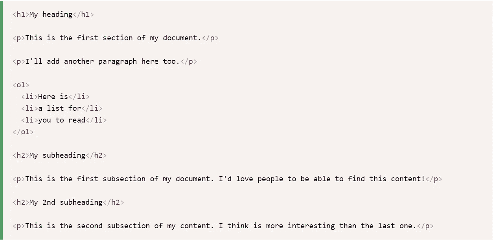
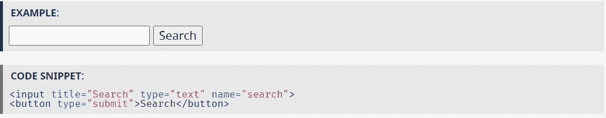
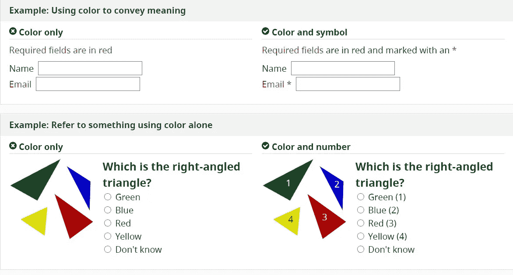
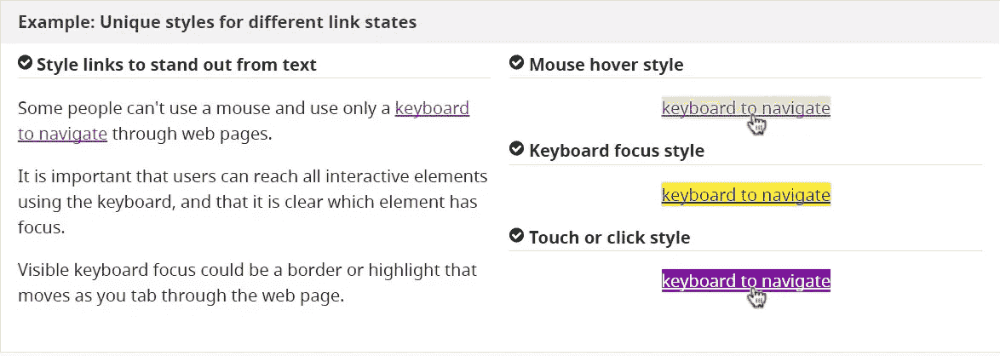
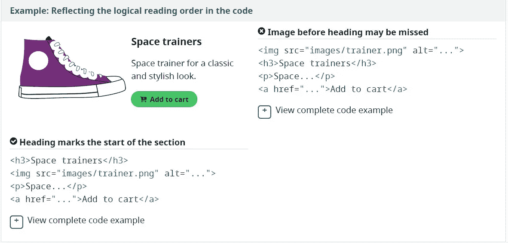
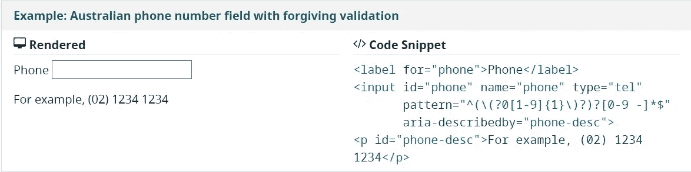

# 如何在 Web 应用程序中编写可访问性代码

> 原文：<https://betterprogramming.pub/coding-for-accessibility-58ec39d005d6>

## 来自一个有视觉障碍的人


由[塔拉斯·切尔纳斯](https://unsplash.com/@chernus_tr?utm_source=medium&utm_medium=referral)在 [Unsplash](https://unsplash.com?utm_source=medium&utm_medium=referral) 上拍摄的照片

当你看它的包容能力时，编码是一个独特的工作。

它不仅有助于使数字世界以及我们与数字世界不断增加的互动对残疾人来说更容易接近和更愉快，而且它还允许患有各种残疾的人成为一种工作和独立的手段。在你自己的编码中，有一些好的实践，你可以建立在这些编码优势的基础上，使你的代码更适合与你的应用/网站/等交互的用户。同时也允许有残疾的编码人员更容易地阅读和使用您的代码。

有许多资源和指南可以让您的代码在这两方面都更容易访问，稍后我将链接到几个较大的资源和指南。但是现在，我将把重点放在一些简单的提示上，这些提示你以前可能没有考虑过。作为一个有视觉障碍但还没有使用屏幕阅读器的人，我缺乏为可访问性编码的意识和实践。所以如果你只是第一次思考这个问题，不要担心！有些小事也能带来很大的不同。

# 形象

当一个图像有任何重要信息时，总是在它的`alt`属性中放置图像的描述。如果图像只是背景或装饰图像，您可以将其留空。如果可以在内容的其他地方找到相关描述，也可以将其留空。

```
img src="cute-puppy-swimming.jpg" alt=""
```

永远不要删除`alt`属性，因为有些屏幕阅读器会大声读出整个文件名，这在许多情况下既不令人愉快也不提供信息。

```
2020-04-2916-4704-1680x1116.jpg
```

# 超文本标记语言

HTML 和可访问性最常见的主题之一是语义 HTML 的重要性。这意味着尽可能地为预期目的使用正确的 HTML 元素。例如，您可以编写一个按钮来播放视频:

```
<div>Play video</div>
```

但是更好的写法是:

```
<button>Play video</button>
```

HTML 按钮不仅应用了一些默认样式，还具有内置的键盘可访问性。这意味着用户可以使用 TAB 键在按钮之间导航，并使用 ENTER 或 RETURN 键提交输入。

# 屏幕阅读器

对于使用屏幕阅读器的用户来说，最有用的帮助之一就是一个清晰的内容结构，其中包含适当的元素和组织。



[https://developer . Mozilla . org/en-US/docs/Learn/Accessibility/HTML](https://developer.mozilla.org/en-US/docs/Learn/Accessibility/HTML)

这样编写您的 HTML 允许使用屏幕阅读器的用户:

*   当你阅读内容时，读出每个标题，告诉你什么是标题，什么是段落，等等。
*   每完成一个动作后停下来，让你以自己觉得舒服的速度前进。
*   在许多屏幕阅读器中跳转到下一个/上一个标题。
*   您还可以在许多屏幕阅读器中调出所有标题的列表，让您可以将它们用作方便的目录来查找特定内容。

# 语言和字体大小

经常被忽略的是，在 HTML 元素的`lang`属性中设置语言可以让屏幕阅读器知道在读回内容时使用哪种语音配置文件。

```
<!DOCTYPE html> <!-- Tell the browser this is a HTML5 document -->
<html lang="en"> <!-- This document's language is set to English -->
```

永远不要在根元素 HTML 上设置绝对的`font-size`。这样做会使用户无法在浏览器设置中调整字体大小，从而可能阻止他们访问您的内容。

**无法接近:**

```
html {
    font-size: 21px;
}
```

**可访问:**

```
html {
    font-size: 100%;
}html {
    font-size: 1em;
}
```

# 形式

与任何应用程序、网站、软件——你能想到的——最常见的交互之一就是表单。创建表单时的小细节可以让表单更容易理解。

当创建一个表单时，总是使用一个标签(不仅仅是一个占位符),并使标签与其对应的输入有一个清晰的连接。要么将标签显式绑定到输入，要么用匹配的标签包装输入。



[https://www.w3.org/WAI/tutorials/forms/labels/](https://www.w3.org/WAI/tutorials/forms/labels/)

## 不要单独使用颜色来传达信息

虽然颜色很有用，但它不应该是传达信息的唯一方式。当使用颜色区分元素时，也要提供额外的标识。例如，除了颜色之外，还使用星号来表示必需的表单字段，并使用标签来区分图形上的区域。



[https://www.w3.org/WAI/tips/designing/](https://www.w3.org/WAI/tips/designing/)

## 确保交互元素易于识别

为交互元素(如链接和按钮)使用不同的样式，使它们易于识别。例如，更改鼠标悬停、键盘聚焦和触摸屏激活时链接的外观。此外，要确保交互式元素的样式和命名在整个网站中使用一致。



[https://www.w3.org/WAI/tips/designing/](https://www.w3.org/WAI/tips/designing/)



[https://www.w3.org/WAI/tips/developing/](https://www.w3.org/WAI/tips/developing/)

## 帮助用户避免和纠正错误

当用户填写表单时，提供清晰的说明、错误消息和通知来帮助他们。帮助用户找到问题所在，提供具体易懂的解释，并提出改正建议。在处理用户输入时，尽可能不要拘泥于格式。例如，接受包含空格的电话号码，并根据需要删除空格。



[https://www.w3.org/WAI/tips/developing/](https://www.w3.org/WAI/tips/developing/)

希望这些技巧能够展示代码中的简单添加和细节是如何让其他人在接触到您编写的代码时体验到更轻松、更有成效的。

以下是一些可供进一步阅读和学习的重要资源:

[](https://www.w3.org/WAI/design-develop/) [## 设计和开发概述

### 摘要有助于改进此页面的写作、设计和开发指南，以提高可访问性。这些页面内容…

www.w3.org](https://www.w3.org/WAI/design-develop/) [](https://developer.mozilla.org/en-US/docs/Learn/Accessibility/HTML) [## HTML:易访问性的良好基础

### 现在，您应该很擅长为大多数场合编写可访问的 HTML。我们的 WAI-ARIA 基础文章将有助于…

developer.mozilla.org](https://developer.mozilla.org/en-US/docs/Learn/Accessibility/HTML) [](https://www.boia.org/blog/what-are-the-four-major-categories-of-accessibility) [## 可访问性的四个主要类别是什么？

### 网站内容可访问性指南(WCAG)由四个主要原则组成，这些原则规定内容必须…

www.boia.org](https://www.boia.org/blog/what-are-the-four-major-categories-of-accessibility)