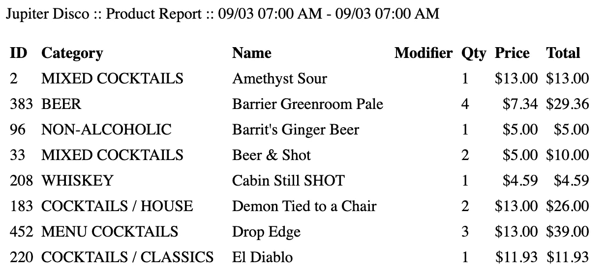
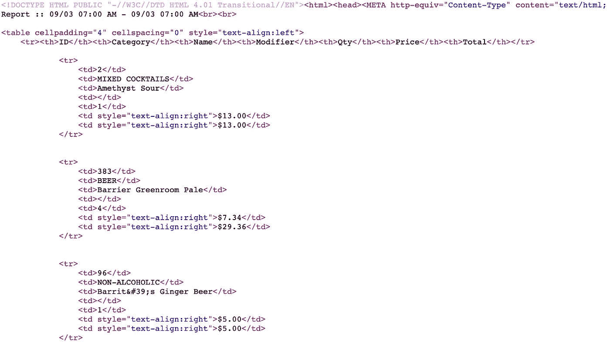
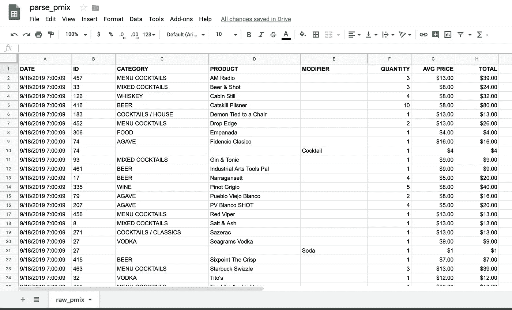

# 应用编码面试问题

> 原文：<https://betterprogramming.pub/coding-interview-questions-applied-14c3a37e58ae>

## 在现实世界中应用解决问题的技巧

照片由 [Unsplash](https://unsplash.com/s/photos/interview?utm_source=unsplash&utm_medium=referral&utm_content=creditCopyText) 上的 [Freshh 连接](https://unsplash.com/@freshhconnection?utm_source=unsplash&utm_medium=referral&utm_content=creditCopyText)拍摄

上周，我使用 Google Apps 脚本来自动化我们在 Jupiter Disco 的部分工作流程，具体来说就是解析我们的销售点系统(POS)每天发送的每日销售报告，并用数据填充我们的主要销售电子表格。

这个脚本运行得很好——不再需要将数据从一个地方复制粘贴到另一个地方——但是它每天也只为我们节省了 5 到 10 分钟的时间，并且没有建立一个新的数据流来帮助我们改进业务。

我真正想探索的是用产品组合(“PMix”)构建一个类似的自动化，该产品组合作为[附在电子邮件中。htm 文件](https://fileinfo.com/extension/htm)。我们目前不每天跟踪我们的 PMix，主要是因为这将是一个超级烦人、耗时且重复的日常任务。

在尝试建立这个自动化流程时，我遇到了一个异常熟悉的挑战。

如果你像我一样，正在寻找一份数据科学家、软件工程师、web 开发人员、数据工程师等工作，你可能已经花了大量时间练习潜在的面试问题，并通常试图在 [HackerRank](https://www.hackerrank.com/) 或类似的网站上提高你的编码技能——Codewars、 [LeetCode](https://leetcode.com/) 、 [Coderbyte](https://www.coderbyte.com/) 、 [Project Euler](https://projecteuler.net/) 等。

这些问题可能会变得抽象，至少对于像我这样的非计算机科学的人来说是这样，并且经常需要[导航或转换一个数组](https://www.hackerrank.com/challenges/minimum-swaps-2/problem)，这就是我今天发现自己的地方。

# 问题

正如我上周所讨论的，我们在 Google Apps 脚本中用于解析 HTML 的库相当有限，所以我拼凑的解决方案是将每行作为一个元素创建一个数组，然后通过索引将适当的值放入 Google Sheet。

这适用于高度结构化的页面，如每日销售报告，但不适用于 PMix 报告，因为客人每天晚上都会点不同的商品，这意味着不同的产品会出现在不同的行上。

使用索引不够动态，我们真正想做的是重新创建提交报告的表格格式。报告作为附件发送，看起来是这样的(这只是一个截图):

同一个附件的 HTML 如下所示:

就像我上周明确指出的那样，在这篇文章中不要太多赘述，将这个 Gmail 附件自动上传到 Google 表单的过程大致如下:

*   从每日销售报告中获取产品组合附件。
*   将 HTML 转换成我们可以解析的字符串。
*   将字符串分割成一个字符串数组——每个元素是 HTML 的一个单独的行——并去掉所有的 HTML 标签。
*   将数组组织成类似于原始文档的表格格式。
*   用结构化数据填充 Google 工作表。

事实证明，到了第四步，HackerRank 上所有关于数组和算法的工作真的很有帮助。我将在一分钟内提供我的代码，但如果你想尝试一下，这个问题可以这样提出:

给定一个遵循一致模式的元素数组(例如，每第三个元素是产品，每第五个元素是数量，每第七个元素是价格，直到第*n*个元素表示观察的最后一个元素)，创建一个新的数组，该数组的排列方式是所有第*n*个元素按列排列，并且可以逐行追加到电子表格中。

更准确地说，您需要创建一个数组的数组，每个嵌套的数组将保存 x 个元素，其中 x 是每个观察的数据点总数。

# 解决办法

在 HackerRank 中，这个问题可能会被归类为*简单*，但它也是一个有趣的、需要使用我们每天都在练习的工具包的真实例子。

在 Jupiter Disco 的 2019–09–18 产品组合报告上，原始数组有 288 个元素，每 9 个元素重复一次(因此最终数组将包含 288 / 9 = 32 个数组)。

你会怎么解决？

我的职责是:

我相信有一个更有效的方法来解决这个问题，如果你有，就在下面分享你的方法吧！

函数的其余部分与上周的类似——我所要做的就是将每个嵌套数组追加到 Google Sheets 电子表格中。结果看起来像这样:

我将能够使用该脚本的扩展版本来自动填充包含我们日常产品组合的数据库，这非常酷。