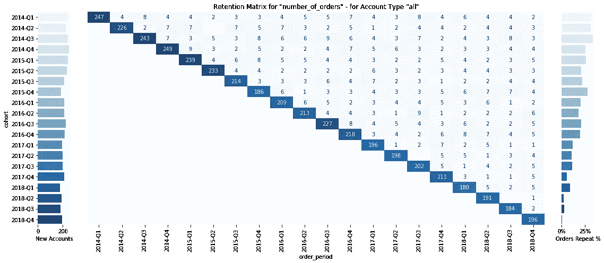
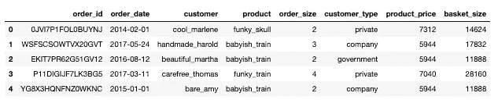
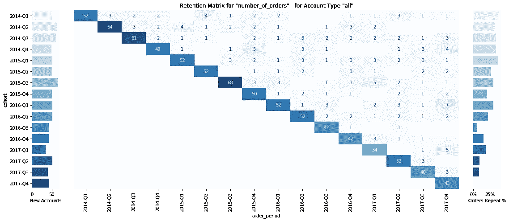
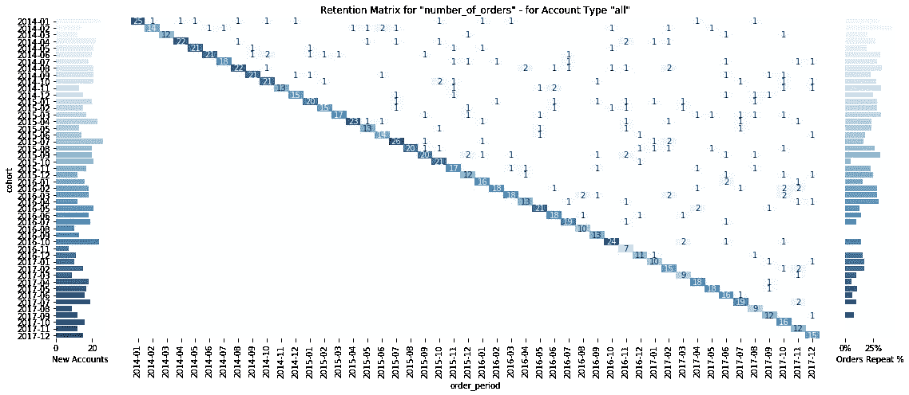
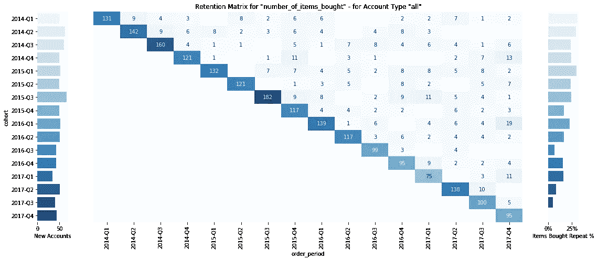
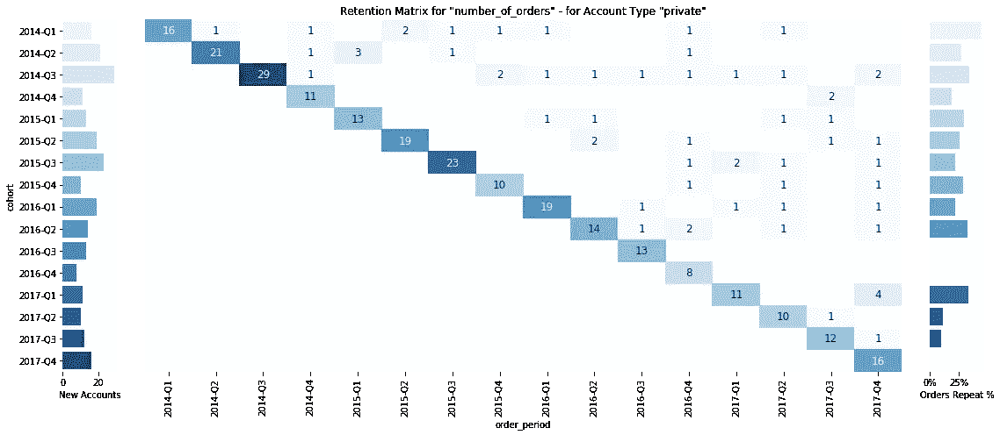

# 使用 Python 进行队列分析

> 原文：<https://betterprogramming.pub/cohort-analysis-with-python-e81d9d740a9b>

## 或者如何可视化您的客户保持——代码指南



样品保留矩阵—跟随并了解如何创建您自己的矩阵

我经常面临的一个问题是，“我们的同伴是什么样子的？”投资者用这个问题的答案来更好地理解他们客户的终身价值。管理层使用它来识别表现良好的群体及其共同特征，以便他们可以专注于这些客户。金融也可以用它，在一定程度上，进行预测。

**你将从这篇文章中学到什么:**

*   什么是群组？
*   队列是什么样子的？
*   如何生成虚拟数据？
*   如何构建将生成群组的函数？
*   一些值得注意的 Python 技术

**先决条件:**

本文旨在作为一篇代码文章，因此您应该拥有:

*   对 Python 的基本理解
*   开发环境(我推荐 Jupyter 笔记本/实验室)

# **什么是群组？**

在谈论它们看起来如何之前，我们应该花一些时间来了解什么是群组。

> [在统计学、市场营销和人口统计学中，群组是具有共同定义特征的一组受试者(通常是在选定时间段内经历了共同事件的受试者，如出生或毕业)。](https://en.wikipedia.org/wiki/Cohort_(statistics))

在商业环境中，群组通常是在给定时间间隔内(通常是几个月，但这取决于你的商业模式)第一次购买的一组客户。

群组有助于理解特定客户群在其生命周期中是如何发展的。群组可能回答的问题有:

*   是否存在高流失率？(后续预订/购买的数量较低就表明了这一点。)
*   随着时间的推移，客户会变得更加投入吗？(这可能表现在客户与您在一起的时间越长，预订/购买就越频繁。)

# **队列是什么样子的？**

我喜欢用保留矩阵来表示团队的发展。左侧显示了该群组中新客户的数量，右侧显示了该群组中重复订单的百分比，在中间，我们找到了所选指标的保留矩阵。请注意，有多种可视化群组发展的方式，但这种方式对我很有效。


样品保留矩阵(使用 python 函数生成，样品数据)

# **如何生成** **虚拟数据**？

1.  让我们从 Python 导入开始。这些是我们稍后将使用的包。

你很可能必须通过运行[来安装](https://pypi.org/project/names/)和 [seaborn](https://seaborn.pydata.org/installing.html) (在你的笔记本上)。

```
!pip install seaborn
!pip install names
```

2.设置一些种子数据。

`ADJECTIVES`、`PEOPLE`、`PRODUCTS`都是大写的。在 Python 中，这种符号通常用于静态变量和/或模块设置。

注意对于`PEOPLE`，我们使用了所谓的[列表理解](https://medium.com/better-programming/list-comprehension-in-python-8895a785550b)，这是 Python 中一个非常强大的概念。在我们的例子中，我们调用函数`names.get_first_name()` 10，000 次，并将唯一的结果放入`PEOPLE`列表中。

3.构建一些辅助函数。

4.构建虚拟数据函数。

5.生成虚拟数据帧。

该函数基于`dummy_products`和`dummy_customers`生成一个样本熊猫数据帧。还有一些额外的参数可以设置，但不是必须设置(比如`data_points`，它指定了结果数据帧中的行数)。同样，我们利用列表理解。

让我们创建虚拟数据帧:

我们的虚拟数据具有以下形式:



由“generate_dummy_data”生成的 DF 的前几行的屏幕截图

6.用订单类型和首次订单的时间充实虚拟数据

我们现在已经完成了样本数据的生成。通过更改参数并再次运行数据，您可以随意使用这些函数。

# **如何构建将生成群组的函数**

我们确实需要一些辅助函数来进行群组分析；以下两个函数以下划线为前缀。在 Python 中，这意味着该函数供内部使用。在我们的例子中，这些函数被我们的实际函数`generate_cohort_analysis`调用，以使所述函数更具可读性。

现在，将下面的代码块复制粘贴到 Jupyter 笔记本中，并运行该单元。这些功能变得可用，但暂时忽略它们。

以下函数生成群组可视化:

你可以用不同的参数运行它(见下面的例子)。我会在示例后解释参数。要创建群组分析，您只需运行:



generate_cohort_analysis(df=df，metric= '订单数量')



generate_cohort_analysis(df=df，metric= '订单数量'，period_agg= '每月')



generate_cohort_analysis(df=df，metric = ' number _ of _ items _ built ')



generate_cohort_analysis(df=df，metric = ' number _ of _ items _ buyed '，
record_type='private ')

为了理解细节，让我们稍微分解一下。

## generate_ `cohort_anlysis`是如何工作的？

它使用:

*   一个`**df**` 参数(这只是我们之前创建的哑数据)，
*   一个`**metric**` 参数(表示您感兴趣的度量，在我们的例子中:`number_of_orders`、`number_of_items_bought`或`total_order_value`)
*   一个(可选的)`record_type`参数，default= `all`(它允许您细分我们的样本数据，并且只查看特定的组，在我们的示例中是:`all`、`private`、`company`或`government`)
*   an(可选)`period_agg parameter`，default= `quarterly`(让您选择`monthly`或`quarterly`作为群组)
*   一个(可选)`fig`参数，默认= `True`(定义是否应该产生一个图形或实际数据)
*   一个(可选)`save_fig`参数，默认= `True`(定义结果图是否应该保存在磁盘上)
*   `size`参数(可选)，默认= `10` (该参数定义了标注的大小)

您可以使用丰富的样本数据运行该函数，并选择一个可用的指标，您将看到新客户的可视化效果、该指标的保留矩阵以及每个群组的返回率。

如果你想在交互式笔记本中测试代码，点击[这里](https://mybinder.org/v2/gh/FBosler/Cohorts/master)。