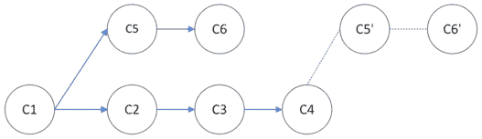
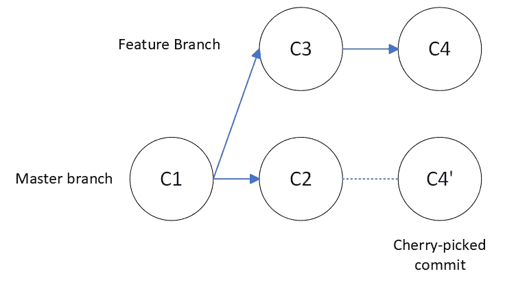

# 5 个 Git 命令将帮助你在团队中工作

> 原文：<https://betterprogramming.pub/collaborate-more-productively-with-these-5-git-commands-80dd0ccf8443>

## 学习 5 个 git 命令，这些命令在与其他开发人员一起开发 Git 项目时会非常有用


由 [Marvin Meyer](https://unsplash.com/@marvelous?utm_source=unsplash&utm_medium=referral&utm_content=creditCopyText) 在 [Unsplash](https://unsplash.com/s/photos/software-team?utm_source=unsplash&utm_medium=referral&utm_content=creditCopyText) 上拍摄的照片

通常，只有一个人的 Git 存储库中的开发工作流是简单的。首先，编写一些新功能，然后我们使用常见的添加、提交和推送命令:

```
## Usual Workflow
git add changed_file
⁠git commit -m "Commit Message"
⁠git push
```

有时，我们可能会做一些事情，比如创建一个新的分支，然后在以后合并它。但是基本上，这就是我们用一个开发人员管理 git 库所需要的全部内容。

然而，由多人开发项目的过程可能需要使用其他工具。为了更有效地协作，了解和理解一些关键命令是很重要的，这些命令将帮助我们在团队工作时避免问题。在这篇文章中，我分离了其中的五个，它们是:

1.  git 提交修改
2.  Git 贮藏
3.  Git rebase
4.  Git 参考日志
5.  Git 精选

让我们直入主题:

# 1.提交修改

通常，我们可能会意识到我们的最后一次提交包含一个打字错误或任何其他愚蠢的错误。

而不是在新提交中添加此修复，并显示如下消息:

```
git commit -m "Fix 1"
git commit -m "Fix typo"
```

您可以使用修改选项:

```
git commit --amend
```

上面的这个命令将用一个新的 commit 替换以前的 commit(hash 也将被替换),它包含我们可能想要添加的任何更改，而不需要创建另一个 commit。

此外，它将打开编辑器，以便我们可以在必要时更改提交消息。

`— amend`选项允许我们更改提交消息和/或内容。它可以帮助我们保持一个分支机构的干净的历史。没有任何意外。

此外，如果我们打算只更改提交内容并保留其原始消息，我们可以添加标志`— no-edit`。

```
git commit --amend --no-edit
```

需要注意的重要一点是，如果您已经提交了最后一次提交，那么将强制使用 `— force` 标志来将更改发送到远程存储库，因为本地分支与它有分歧。

# 2.Git 贮藏

有时候，在一个分支上工作时，我们可能想要在另一个分支中检查一些东西。如果我们的工作没有完成，或者没有准备好提交，在这种情况下，stash 命令可以节省我们一些时间。

该命令将获取工作分支的当前状态并保存。因此，完成一半的修改将被存储在 stash stack 中，工作目录将被恢复。

假设我们在`change-robots`分支的修改了`robots.txt`文件*。*

```
git status
⁠
On branch change-robots
Changes not staged for commit:
  (use "git add <file>..." to update what will be committed)
  (use "git restore <file>..." to discard changes in working directory)
        modified:   robots.txt

no changes added to commit (use "git add" and/or "git commit -a")
```

如果我们需要在`master`分支检查一些东西，我们还不能切换分支，因为我们有一个未分级的文件。stash 命令将保存我们已经完成一半的更改:

```
git stash
⁠
Saved working directory and index state WIP on change-robots: 1c37707 About page
```

在来回切换到`master`分支后，我们可以继续我们的工作:

```
git stash pop
⁠
On branch change-robots
Changes not staged for commit:
  (use "git add <file>..." to update what will be committed)
  (use "git restore <file>..." to discard changes in working directory)
        modified:   robots.txt

no changes added to commit (use "git add" and/or "git commit -a")
```

有趣的是，stash 命令并不局限于我们进行修改的分支。我们可以在任何其他分支应用隐藏的更改。

# 3.重定…的基准

与 merge 命令一起，rebase 合并了不同分支中完成的工作。它采用了不同的方法。rebase 命令将在正在使用的分支中重新创建整个修改历史，而不是创建包含来自两个分支的更改的新提交:



Git rebase 示例。作者图片

在`master` 分支中考虑 C1、C2、C3 和 C4 的承诺，在单独的分支中考虑 C5 和 C6 的承诺。

rebase 命令背后的思想可以被认为是:改变历史分支的基础。

起初，历史基地在 C1 委员会，后来我们把它改成了 C4。

```
git rebase master other-branch
```

当我们在一个单独的分支中处理一个特性时，我们可能希望用一个参考分支来保持它的最新状态，比如`master` 或者`dev` *。rebase 命令允许我们包含新的修改，而不会因合并提交而污染特征分支记录。*

## 交互式 Rebase

除了正常的 rebase 命令，我们还可以添加 **-i** 选项，它代表交互式。它给了我们完全的控制权来重写我们想要的分支历史。我们可以从工作分支中删除、编辑、压缩或更改任何提交的顺序。在我们的 rebase 示例中，假设我们想在 rebase 之后删除 C5 提交，我们可以运行:⁠

```
git rebase master other-branch -i
```

这将打开一个编辑器，我们可以在其中修改我们的分支历史:

```
pick f9914a6 C5 (Changed README.md)
pick 4faa953 C6 (Removed HTML About Page)Commands:
# p, pick <commit> = use commit
# r, reword <commit> = use commit, but edit the commit message
# e, edit <commit> = use commit, but stop for amending
# s, squash <commit> = use commit, but meld into previous commit
...
```

我们能够擦除 C5 提交，只需将它前面的`pick`字替换为`drop` **。**

```
drop f9914a6 C5 (Changed README.md)
pick 4faa953 C6 (Removed HTML About Page)Commands:
# p, pick <commit> = use commit
# r, reword <commit> = use commit, but edit the commit message
...
```

因此，在我们返工的分支中，C5 提交已被删除。我们只保留了 rebase 命令后的 C6。


Git rebase 交互示例。作者图片

为了将我们的 rebased 分支推到 remote，我们必须在 push 命令中包含 `— force`标志。你们中的一些人可能想知道:强制将提交推送到远程难道不是一种不好的做法吗？

嗯，对于工程领域的几乎所有问题，答案都是:视情况而定！

在 [git 书](https://git-scm.com/book/en/v2/Git-Branching-Rebasing)中，有一整章都在讨论这个问题。

总的来说，如果您决定对一个包含没有被其他人使用过的提交的分支进行重定基准，这不是问题。换句话说，如果没有人把它的工作建立在要重定基础的分支的提交上，它将会很好。然而，如果是这种情况，并且你的提交已经被其他人用来在它们的基础上构建一些东西，那么这将是一个坏主意！

实际上，在一些团队中，使用 rebase 而不是 merge 来保持他们的分支与`master`或任何其他引用保持同步可能是一个偏好问题。它们都是为了通过不同的手段达到相似的结果。请记住`git rebase`的这个特别之处。

# 4.参考日志

关于重定基的一个重要细节，我在上一节中没有提到，那就是它肯定会涉及到管理分支之间的冲突。如果目标分支包含许多新的提交，就很容易出错。在某些情况下，reflog 命令可以帮助我们回滚到之前一切正常的状态。这可能是有用的，尤其是在我们推动了变革之后。

```
git reflog81da6f0 HEAD@{0}: rebase -i (finish): returning to refs/heads/dev
859e694 HEAD@{1}: rebase -i (start): checkout HEAD~3
9a37wee HEAD@{2}: commit: Add Feature3
121e0f8 HEAD@{3}: commit: Add Feature2
859e694 HEAD@{4}: commit: Add Feature1
e3fxf10 HEAD@{5}: checkout: moving from master to dev
```

然后，我们可以运行一个`git checkout` 或`git reset` 使用提交散列存储。reflog 存储本地项目中更新的所有引用，来自我们可能访问过的任何分支。这是 git 提供的另一个资源，这样我们可以在出现问题时恢复我们的工作。

# 5.樱桃采摘

正如 rebase 和 merge 一样，Cherry-picking 是一种将代码中不同分支的工作结合起来的方法。精选背后的思想是包含从一个分支到另一个分支的单个提交



Git 精选示例。作者图片

在上图中，我们在主分支中创建了一个与特征分支中的 C4 提交相同的提交 C4。当我们需要从一个分支到另一个分支包含一个修补程序或一个小的修改时，以及从一个废弃的分支中检索一些工作时，它可以派上用场。

请记住，不应该使用 cherry-pick 命令代替 merge 或 rebase 命令，因为它会将提交复制到另一个分支中。根据我的经验，这应该只用于包含来自您的存储库中其他地方的小的修复或更改。

# 结论

在这篇文章中，我展示了一些帮助我在使用 git 的团队中更有效地协作的工具。如果使用得当，所有这些方法都会有很大的帮助。但是即使我们发现自己已经把事情搞砸了。幸运的是，git 提供了许多允许我们回滚的工具。

感谢阅读！