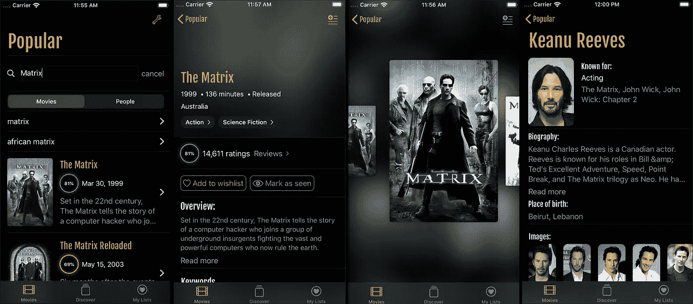
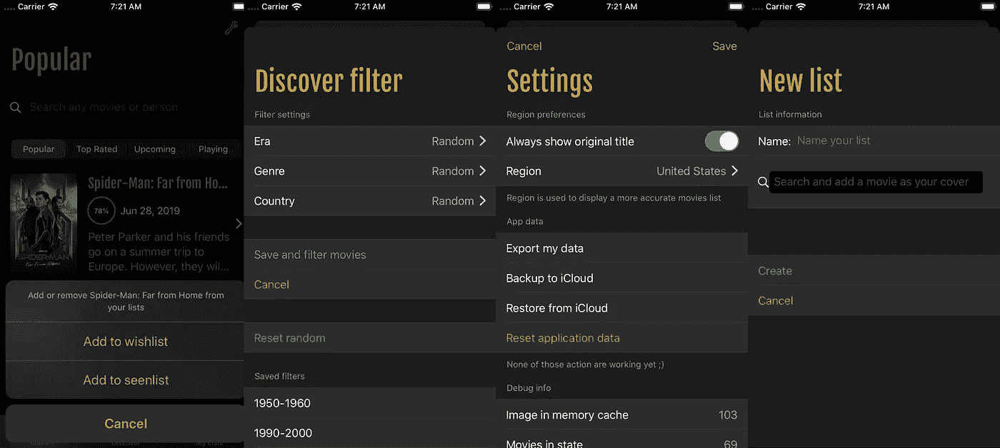
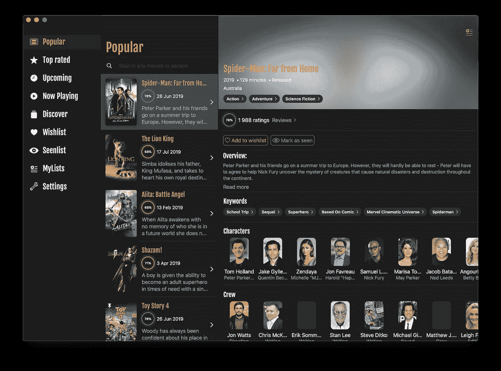
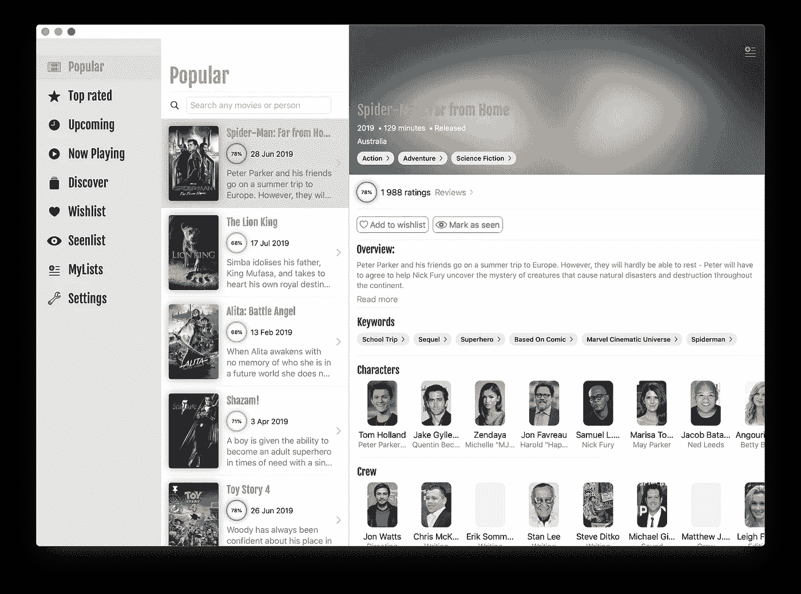

# 收藏:使用 SwiftUI 制作真实世界的应用程序

> 原文：<https://betterprogramming.pub/collection-making-a-real-world-application-with-swiftui-4f9bc8c7fb71>

## 一系列关于如何专门使用 SwiftUI 开发全功能 iOS、iPadOS 和 macOS 应用程序的文章

阿尔瓦罗·雷耶斯在 [Unsplash](https://unsplash.com/photos/3iTRMP8Uq2k) 上拍摄的照片

由于我现在已经部分完成了关于如何制作 100% SwiftUI 应用程序的多部分故事，我认为有一篇参考文章会很好，您可以轻松地将它添加到书签中，并通过各个部分的链接进行共享。随着我向这个集合添加更多的文章，它将保持更新。

# 制作 SwiftUI 应用程序

 [## 使用 SwiftUI 制作真实世界的应用程序

### 第一部分:数据流和冗余

medium.com](https://medium.com/better-programming/making-a-real-world-application-with-swiftui-cb40884c1056)  [## 使用 SwiftUI 制作真实世界的应用程序

### 第二部分:异步数据和远程映像

medium.com](https://medium.com/better-programming/making-a-real-world-application-with-swiftui-ba9e9682889c)  [## 使用 SwiftUI 制作真实世界的应用程序

### 第三部分:导航和演示

medium.com](https://medium.com/@dimillian/making-a-real-world-application-with-swiftui-3b643ddfae22)  [## 使用 SwiftUI 制作真实世界的应用程序

### 第四部分:动画、过渡和手势

medium.com](https://medium.com/@dimillian/making-a-real-world-application-with-swiftui-63a198fc23c9)  [## 使用 SwiftUI 制作真实世界的应用程序

### 第五部分:提示和技巧，剖析，以及我所学到的

medium.com](https://medium.com/better-programming/making-a-real-world-application-with-swiftui-54e71d9e6042) 

# Redux 架构

 [## SwiftUI 和 Redux——干净的代码和独立的小组件

### 如何使用 Redux 库并将其集成到您的 SwiftUI 应用程序中

medium.com](https://medium.com/better-programming/swiftui-and-redux-clean-code-and-small-independent-components-6f46a5eb46b3) 

# 奖金

 [## SwiftUI 中 macOS 上的侧栏和导航视图

### 在通用 iOS/iPadOS/macOS 目标中

medium.com](https://medium.com/better-programming/sidebar-and-navigationview-on-macos-in-swiftui-a8b4a074a651)  [## 了解 SwiftUI 数据流

### 一些关键协议和包装器的初级读本

medium.com](https://medium.com/better-programming/understanding-swiftui-data-flow-79429a49ae35) 

# 应用图像

