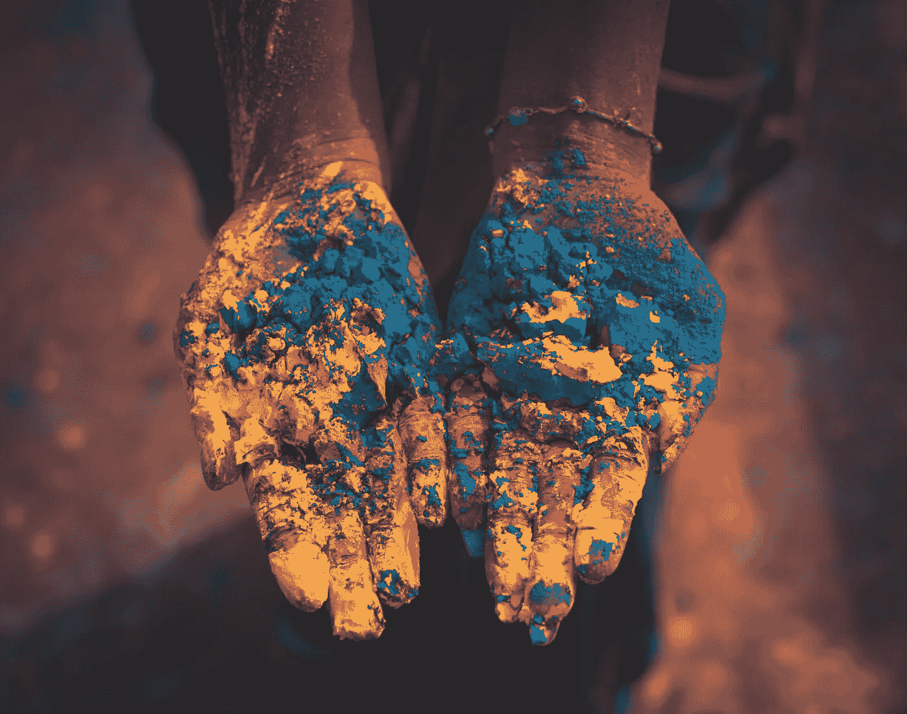
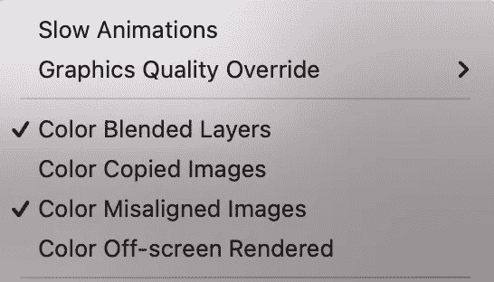
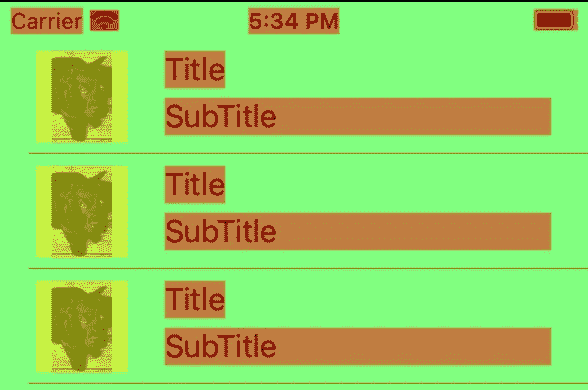
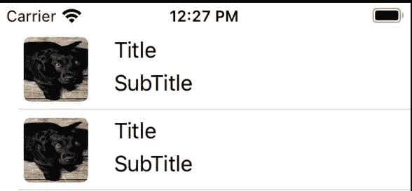

# Swift 中的颜色混合和屏幕外渲染

> 原文：<https://betterprogramming.pub/color-blending-off-screen-rendering-in-swift-2ea2a88f6923>

## 提高旧款 iPhones 的性能

照片由[德巴斯 RC Biswas](https://unsplash.com/@rcsalbum?utm_source=unsplash&utm_medium=referral&utm_content=creditCopyText) 在 [Unsplash](https://unsplash.com/?utm_source=unsplash&utm_medium=referral&utm_content=creditCopyText) 拍摄

由于 iPhones 的强大功能，颜色混合和屏幕外渲染对于 iOS 开发来说都是一个不受重视的话题。

另一方面，它不仅是 iOS 采访的热门话题，而且如果你在旧 iOS 版本的列表中处理大量高分辨率图像，它可以提高滚动动画的速度，以在缓存任何项目之前最大限度地减少滚动期间的冻结，并在需要时显示它。我们来讨论一下这些话题是什么。

## 颜色混合和屏幕外渲染

当我们在 iOS 中创建新的 UI 元素如`UIView`、`UIImageView`时，它是通过 CPU 渲染的。作为 iOS 开发者，我们经常会遇到复杂的 UI 挑战。像改变阿尔法，阴影，预期元素的圆角半径。

在类似的情况下，它是通过当前设备的 GPU 而不是其 CPU 渲染的——取决于设备的功能，fps(每秒帧数)会下降。这就是 iOS 里的离屏渲染，混色。

要在模拟器上启用混合层和屏幕外渲染，从菜单顶部选择`Debug`，选择颜色混合层和颜色错位图像。让我们回到我们的例子。

在我们的示例中，我们有一个表视图来显示 1000 个项目及其在表视图的`datasource`函数中的配置。

分别设置当前图像视图的圆角半径和更改背景颜色以清除触发器的屏幕外渲染和颜色混合。

因为，在后台，我们设备的 GPU 负责绘制，当任何阴影落下时，设置现有 UI 元素的圆角半径。

在模拟器中，输出是这样的。黄色代表离屏渲染，绿色和红色代表颜色混合。

为了解决这些问题，让我们改变标签的背景颜色，通过改变为白色来防止标签的颜色混合**。**我们可以关闭颜色混合层选项，以便只在图像上进行屏幕外渲染。

为了防止在我们的图像视图上进行离屏渲染，让我们创建一个贝塞尔路径来绘制它，而不是设置图层拐角。

现在，我们需要像这样更新舍入实现:

最后，屏幕外渲染黄色消失了。

对于圆角半径的实现，我们使用 bezier 路径来圆化现有的图像视图，以防止屏幕外渲染，并且我们防止使用 alpha 0 来设置标签的背景颜色。这两个实现都提高了我们的应用程序 UI 性能。

您可以在仪器或其他工具中检查它。

感谢阅读。