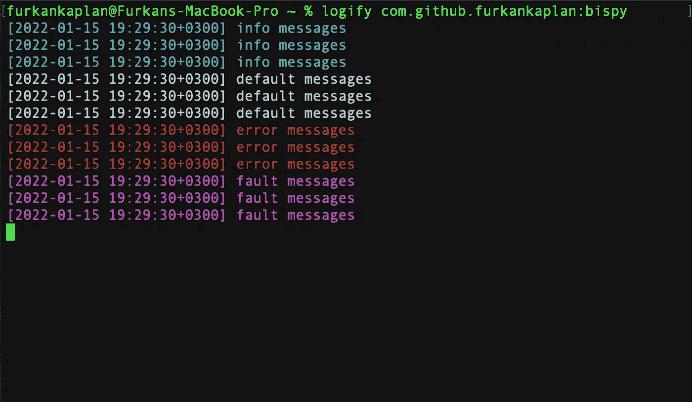
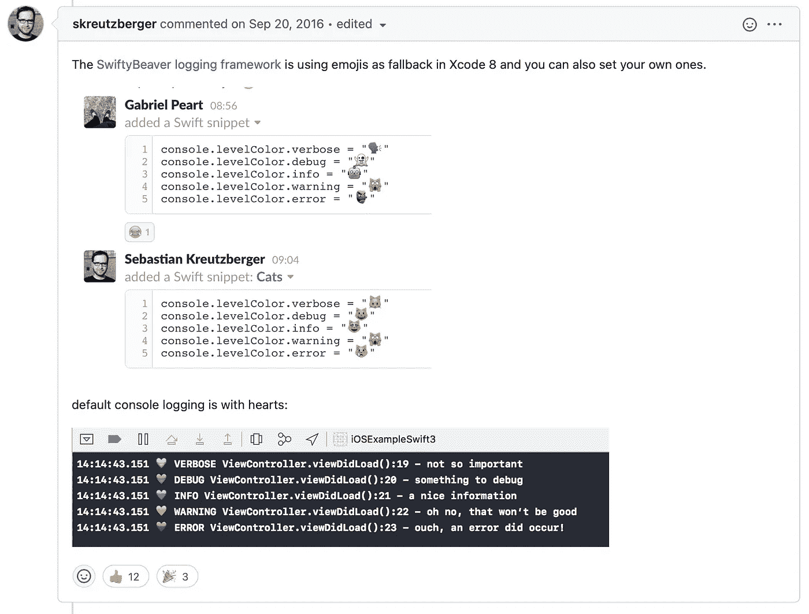
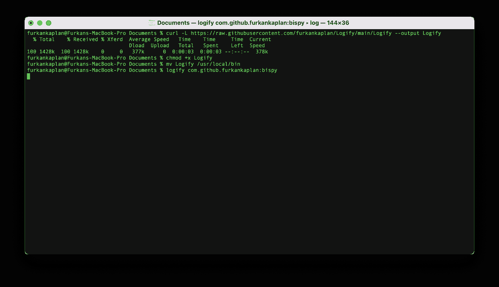

# 为 Xcode 日志着色以改进日志跟踪

> 原文：<https://betterprogramming.pub/colorizing-xcode-logs-to-improve-log-tracing-e67fbc727fd6>

## 我制作了有史以来最丰富多彩的 Xcode 日志工具



从 MacOS 终端 Logify 使用截图。

正如之前在很多开发者论坛上讨论的，Xcode 从 Xcode 8 开始就不支持控制台着色了。因为苹果已经从 Xcode 中移除了插件——原因是苹果非常在意的安全性——并引入了 Xcode 扩展。Xcode 扩展没有提供任何给终端着色的解决方案。简而言之，目前没有内置的支持来实现这一点。

在我的职业生涯中，我有一个 Android 开发人员的经历，我使用了很多 Android Studio，并且仍然钦佩 IntelliJ 为开发人员所做的事情。当我作为一名 iOS 开发人员在日常生活中跟踪日志时，我确实怀念 IntelliJ 的一些伟大特性。其中之一就是高级日志记录。

幸运的是，苹果在 Swift 中支持 Unicode 字符。所以你可以用几个与日志类型相关的表情符号来区分你的日志。我是按照这种方式，但解决方案不是可读性最好的。



[https://github.com/robbiehanson/XcodeColors/issues/88](https://github.com/robbiehanson/XcodeColors/issues/88)

因此，我想建立一个解决方案，读取系统日志，过滤相关的应用程序，并立即显示它们。

# 满足逻辑化

Logify 是一个易于使用和实现的 CLI 工具。最重要的是，如果您使用`print(_:)`方法收集日志，Logify 不起作用。你必须用苹果提供的`OSLog`框架登录。

有两种类型的日志记录。如果你的应用支持下面的 iOS 14 并且很可能支持，你应该使用`os_log`

## 使用导入 os.log 或 OSLog

如果你在包标识符方面遵循最佳实践，你的标识符就像那个`com.company.product`或`com.company.subdomain.product`。

在我的例子 *:* `com.github.furkankaplan.bispy` *。*您可以将它分为两部分，因为子系统和类别如上所示。只需用您的包标识符替换它。

## 使用记录器 API

如果你的最低 SDK 是 iOS 14 及以上，有一个更现代的方式有利于苹果在 OSLog 上的 API 改进，`Logger` *。*

您可能想知道为什么在两个例子中使用了`encode`扩展？现在，可能希望在日志中看到请求和响应 JSON 输出，以便进行错误跟踪。例如，您的日志可能有换行符。系统日志不是逐行读取的。有时，几个日志消息被组合在一行中读取。所以解析算法应该知道这个问题的答案:

> 是日志消息中出现了“\n”字符还是拆分了几条日志消息？

这就是为什么您必须为这两个解决方案添加下面的扩展。

共有 4 种类型的消息:`.default` *、* `.info` *、* `.error`和`.fault`。您可以通过分叉存储库来更改每种类型消息的颜色。

这些都不是改变字体颜色内置解决方案。

这里是给 Xcode 日志着色的 [Logify Github 库](https://github.com/furkankaplan/Logify) 。

# 如何使用 Logify cli？

设置好应用后，打开终端 app。运行以下命令:

```
curl -L [https://raw.githubusercontent.com/furkankaplan/Logify/main/Logify](https://raw.githubusercontent.com/furkankaplan/Logify/main/Logify) --output Logify
```

下载完成后，运行以下命令:

```
chmod +x Logify
```

作为最后一步，将文件移动到`/usr/local/bin`

```
mv Logify /usr/local/bin
```

开始了。



您也可以使用`log stream` shell 命令来查看即时日志，但是 Logify 是为了给 Xcode 日志着色和提高可读性而创建的。

感谢阅读。

```
**Want to Connect?**Feel free to contact with me at Twitter [@kaplan_dev](https://twitter.com/kaplan_dev).
```