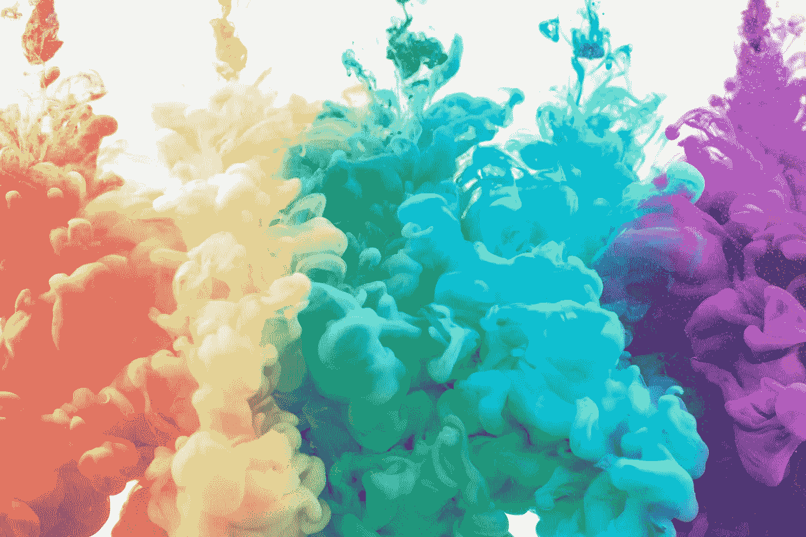
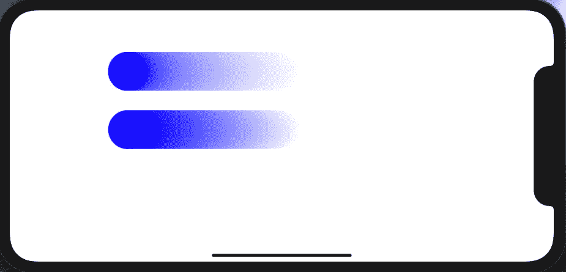
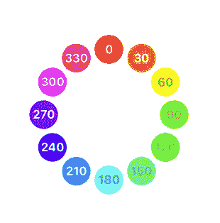
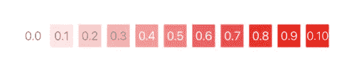
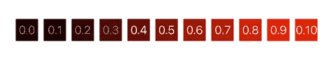
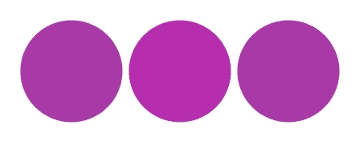
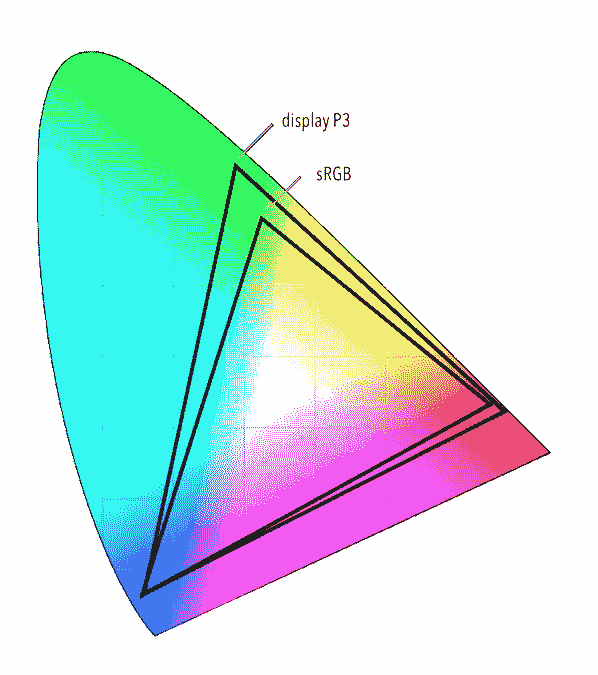
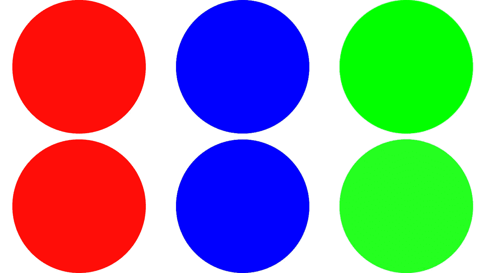
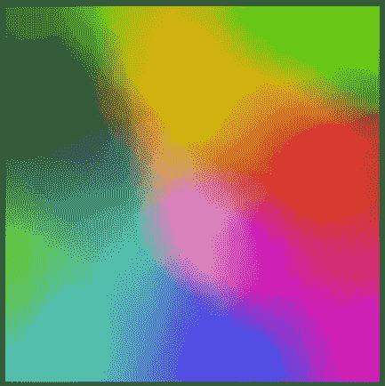

# 颜色、色调、饱和度和亮度

> 原文：<https://betterprogramming.pub/colour-hue-saturation-and-brightness-24661bb809a3>

## 在 SwiftUI 中使用颜色



由[paweczerwi ski](https://unsplash.com/@pawel_czerwinski?utm_source=unsplash&utm_medium=referral&utm_content=creditCopyText)在 [Unsplash](https://unsplash.com/?utm_source=unsplash&utm_medium=referral&utm_content=creditCopyText) 上拍摄的照片

你知道吗，1977 年推出的 Apple II 是第一台彩色个人电脑。这是一个领先的苹果不知何故下降了一个不可思议的 20 年的差距之前，似乎没有人得到他们的行动在一起。微软/惠普领先于苹果的一项举措成为了我们今天大多数人使用的事实上的标准。是的，令人难以置信的是，这是一个在过去 25 年中几乎没有改变的标准。

苹果最终在这一点上走到了谈判桌前，并带回了一个新的标准，即在 2016 年展示 P3——不只是说说而已，还要做做样子。他们推出了使用它的产品，比如 iPhone 7 和其他产品，包括 iPad Pro 和 iMac。

事实上，今天的色彩是一个比以往任何时候都更具挑战性的问题，越来越多采用不同技术、具有截然不同特性的设备进入市场。

总之，要编码，我们从哪里开始。让我们做事实上的。不出所料，您可能会从 1996 年开发的标准中期待 sRGB 不是很直观。

我们需要做的第一件事是理解色彩空间。你可以把色彩空间想象成一个测量单位/查找表。iOS 的默认色彩空间也被称为 sRGB[当然]。但是等等——这个球体中有两个 RGB 颜色空间，都显示在这里。



上面的是`.sRGBLinear`，下面的是`.sRGB`。你能看出区别吗？sRGB 是一种针对人眼进行了调整的标准，而 sRGBLinear 则是一种更加数学化的模型。人类在较暗的阴影中比在较亮的阴影中更善于区分差异，这就是为什么当你比较 sRGB 和 sRGBLinear 时，你会在较低的线条中看到更多的蓝色。

正如已经提到的，苹果在 2016 年提出了一个新标准。它有比 sRGB 调色板更大的色域。大多少？维基百科告诉我们是 25%。这是一个进步，不用说，照片在那些新手机上看起来更好的原因，但是—

我们大多数人仍然在使用 sRGB，所以让我们暂时留在那里。好的，要使用 sRGB 色彩空间定义一种颜色，你可以用这样一条线:

```
let color = Color(.sRGB, red: 1.0, green: 0.0, blue: 0.0, opacity: 1.0)
```

第一个参数是颜色空间。后面的数字是十进制数字，表示你想要多少颜色，换句话说，就是饱和度。*红色为红色可*为红色通道上的 1.0。少红色是，嗯…少于 1.0…低至 0，当然，根本不是红色。现在，如果你想，比如说洋红色—

这就是事情开始看起来有点像物理课的地方。洋红色是红色、蓝色和绿色的混合物；要获得 magenta，您需要使用这样的代码行。

```
let magenta = Color(.sRGB, red: 168/255, green: 57/255, blue: 168/255, opacity: 1.0)
```

我在这里使用了稍微不同的语法，只是为了说明。你可以用这样的组合得到大约 1600 万种颜色。

不用说，要使用 sRGB，你需要花大量的时间来查找值，以获得你想要的颜色。为了简化这个过程，我在本文的最后整理了一些代码；一会儿再说。

但是等等——如果查找 RGB 值听起来太困难，不要担心，iOS 还有另一个锦囊妙计。使用色调、饱和度和亮度(或简称 HSB)来指定颜色有一个更好的/替代的方法。它并不比新展出的 P3 更好——只是不同而已。不同，而且我认为，对设计界面的人来说更好，因为这更有意义。例如，要获得品红色，我们可以使用这样的线条。

```
let color = Color.init(hue: 300/255, saturation: 0.66, brightness: 0.66, opacity: 1.0)
```

HSB 方案的美妙之处在于，你对想要的颜色的描述是由一个单一的值命名的，即色调。色调的配色方案本质上是一个颜色轮，这些颜色像彩虹一样组合在一起，以不同的程度标出。所以红色，在这种情况下，是 0/360，洋红色是 300/360。这与红、绿、蓝的混合相差甚远。



度除以 360，得到 HSB 值。

对于 HSB 代码中的饱和数，看起来是这样的:



用于颜色中 HSB 饱和度的值

和 HSB 代码的亮度值。看起来是这样的:



好吧，我们有两个方案，都很好，但是你如何在它们之间选择呢？如果你把 HSB 值作为描述打印出来，它会给出十六进制的 RGB。那就是 RGB -> HSB。

```
**let** colour2 = Color.init(hue: 300/360, saturation: 0.66, brightness: 0.66, opacity: 1.0)....**onAppear** {
   **print**("colour2 ",colour2.description)
}
```

然后，我们可以使用类似这样的函数将十六进制值拆分为红色、绿色和蓝色的分量值，尽管我们确实遗漏了饱和度和亮度值。理论上，当选择 RGB 值时，已经考虑了这些。

```
**func** returnComponents(colorToSplit: Color) -> (red: Double, green: Double, blue:Double) {
  **let** hexNumbers = **Array**(colorToSplit.description)
  **let** redColorInHex = **Double**("0x\(hexNumbers[1])\(hexNumbers[2])")!
  **let** greenColorInHex = **Double**("0x\(hexNumbers[3])\(hexNumbers[4])")!
  **let** blueColorInHex = **Double**("0x\(hexNumbers[5])\(hexNumbers[6])")!
  **return** ((red:redColorInHex,green: greenColorInHex,blue: blueColorInHex))
}
```

要从 HSV-> RGB 开始，你可以使用这个扩展，假设你已经使用上面的函数将你的 RGB 值分解成它的分量。

```
extension Color {
  static func hexColour(hexValue:UInt32)->Color
  {
    let red = Double((hexValue & 0xFF0000) >> 16) / 255.0
    let green = Double((hexValue & 0xFF00) >> 8) / 255.0
    let blue = Double(hexValue & 0xFF) / 255.0
    return Color(.displayP3, red:red, green:green, blue:blue)
  }
}
```

我不能保证它会完美地工作。当我写这篇文章时，我不确定这是否是 Xcode 12 beta 的一个特性；只有时间能证明一切。左边的圆圈已经用 HSB 着色；中心的圆圈用 RGB 着色，十六进制扩展在这里给出；右边的圆圈已经使用标准 RGB 进行了着色。



RGB/HSB 转换

当你开始欣赏时，你的眼睛和大脑在这方面比你意识到的要好得多。但是等等 RGB 值和颜色查找表发生了什么变化？

这就是——嗯，我之前展示的色轮的改进版本。你点击圆圈，它会打印出找到的 RGB 值。

在该表扬的地方给点额外的奖励:我用这篇优秀的[文章](https://medium.com/dwarves-foundation/draw-watch-face-using-swiftui-a863ad347b2c)来帮助我完成最后一点代码。

但是等等，我们还没完。那些在字里行间读到这句话的人肯定会有更多的问题，心中有一些疑惑。iOS 颜色命令的色调、饱和度和亮度比标准的 RGB 颜色命令好吗？如何显示 P3 有更多的颜色，但相同的代码参数？什么是扩展的 RGB 色彩空间，它适合什么？

让我们再深入一点。

你看它是这样工作的。显示器 P3 是标准 RGB 颜色的超集。它在可见色域中具有与标准 RGB 相同的定位点，但是具有扩展的值范围；这是扩展的 RGB 色彩空间。下图显示了额外的 25%在哪里。



一张取自 2016 年 WWDC 奥运会的图片，运用了色彩。

但是好吧——我仍然没有回答这个问题:*我如何在同样的三个参数中加入更多的颜色？*答案很简单:当您想要标准 RGB 范围之外的颜色时，您不使用 8 位，而是使用每通道 16 位，并且在 1.0 以上和 0.0 以下。

这不是一个容易找到或最终说明的答案，因为您的显示器需要能够支持显示器 P3 色域。如果是这样的话，那么这里显示的图像中的圆圈应该看起来不同。



上面的圆圈使用标准的 RGB 颜色；较低的那些相同，但是在显示器 P3 色域中。

构建这些颜色的代码是什么样的？如果上面的图片不适合您，您可以在自己的应用程序中尝试使用这些代码。

```
let rgbRedColor = Color(.sRGB, red: 1.0, green: 0.0, blue: 0.0)
let p3RedColor = Color(.displayP3, red: 1.22486, green: -0.0420312, blue: -0.01964301)let rgbGreenColor = Color(.sRGB, red: 0.0, green: 1.0, blue: 0.0)
let p3GreenColor = Color(.displayP3, red: -0.0420, green: 1.0419, blue: 0.0)let rgbBlueColor = Color(.sRGB, red: 0.0, green: 0, blue: 1)
let p3BlueColor = Color(.displayP3, red: -0.0197, green: -0.0786, blue: 1.0979)
```

我从这篇优秀的 [SO](https://stackoverflow.com/questions/45295689/mtkview-displaying-wide-gamut-p3-colorspace/49578887#49578887) 帖子中提取的数据详细说明了如何计算，并且这篇[页面](http://endavid.com/index.php?entry=79)也是一篇优秀的参考。这里有一个应用程序向您展示更多的显示 p3 颜色， [palettist](https://apps.apple.com/us/app/palettist/id1366574054) 。这是一张包含 8036951 种颜色的图像，几乎占 RGB 色域的 48%。



我希望你喜欢读这篇文章，就像我喜欢写它一样

保持冷静，继续编码。