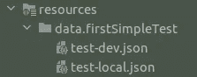

# 如何使用放心和 Spring Boot 测试进行 API 测试

> 原文：<https://betterprogramming.pub/combination-of-rest-assured-and-spring-boot-tests-a005788dd32b>

## 结合使用放心测试和 Spring Boot 测试

安妮·斯普拉特在 [Unsplash](https://unsplash.com?utm_source=medium&utm_medium=referral) 上的照片

REST API 开发是一项常见的任务。开发人员要编写许多端点代码，并遵循一系列标准操作:开发一个端点，在本地机器上运行他们的应用程序并测试它，创建单元测试并运行它们，将端点发布到开发环境并测试它，将端点发布到预运行环境并测试它。端点真的有很多工作要做。

我们可以用 Swagger 或者 Postman 来简化工作。但是许多开发人员更喜欢用 Java 的方式自动化检查过程。

为此，我们必须选择合适的技术并创建必要的测试。这种技术的一个很好的例子是放心测试和 Spring Boot 测试的结合。在这篇文章中，我们将演示如何为一个 API 快速创建有用的测试。我们将使用放心测试我们的 API 和 Spring Boot 测试来为任何环境设置放心。

首先，我们必须了解我们想要测试什么样的环境，以及我们的应用程序具有什么类型的认证。让我们将一台本地机器和一个 dev env 作为我们的环境，并将基本身份验证作为一种身份验证。

首先，我们必须使用属性文件创建一个环境配置。

我们可以使用 spring profiles 来区分不同的环境:

并为这些属性添加配置类:

第二步，用`RestAssured`设置主抽象测试类。

我们可以利用 Spring Boot 测试的强大功能来提高配置的灵活性:

我们还可以将主逻辑与认证和规范的逻辑分开:

最后，我们可以创建第一个单元测试类并检查我们的端点:

单元测试可以帮助我们检查端点`/api/endpoint`并验证`HttpStatus.OK`响应。我们已经测试了端点，但是我们可以看到一个问题。我们希望检查特定的 JSON 数据，不同的环境可以提供不同的数据。

为了解决这种情况，我们可以添加一个解析器来将 JSON 数据转换到同一个视图中:

为了灵活起见，我们增加了几个变量。

第一个是`activeProfile`，用于为弹簧轮廓选择正确的文件。

第二个是`caseName`，用于选择相应测试所需的文件。最后一步是使用文件结构创建文件:

现在，我们可以回到我们的单元测试，并添加一些更改:

仅此而已。现在，我们可以使用示例添加所有必需的单元测试。

# **总结**

我们开发了一个演示应用程序，用于在不同的服务器上测试相同的 REST API。我们创建了两个抽象的配置类，将特定的设置转移到它们中，并使单元测试更加简单和清晰。我们还学习了一种验证 JSON 对象的方法。

应用程序只是分离环境测试逻辑的一个想法，我们可以扩展项目或实现类似的东西。主要的想法是证明我们的代码可以在任何可能的时候重用，这当然简化了我们的工作！