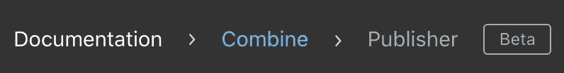

# 组合框架:第一印象

> 原文：<https://betterprogramming.pub/combine-framework-first-impression-2a4115ae5482>

## 我们作为开发人员将如何处理 SwiftUI 框架


*这不是用 Combine 框架编码的教程。这是一个 iOS 开发者对我们将如何处理它的第一印象。*

不久前，我发表了一篇关于我对 SwiftUI 框架的第一印象的文章。在文章中，我提到 SwiftUI 不仅仅是我们项目的 UI 处理器。在稍微深入 SwiftUI(和 Swift 5.1)之后，我认识到*状态*和*绑定*(显然)非常好。通过使用一些提供的[属性包装器](https://github.com/DougGregor/swift-evolution/blob/property-wrappers/proposals/0258-property-wrappers.md)，比如`@State`、`@Binding`或`@ObjectBinding`，我们可以更容易、更有表现力地将我们的视图与我们的数据模型连接起来。

我注意到的一个新话题是，为了声明自定义视图模型类型的`@ObjectBinding`变量，你应该让它符合`[BindableObject](https://developer.apple.com/documentation/swiftui/bindableobject)`协议。之后，您必须实现类型为`[PassthroughSubject](https://developer.apple.com/documentation/combine/passthroughsubject)`的`didChange`属性。如果我们追踪`PassthroughSubject`层次，我们会发现它是一个类，是`[Subject](https://developer.apple.com/documentation/combine/subject)`协议的具体类型，符合`[Publisher](https://developer.apple.com/documentation/combine/publisher)`协议——基本上，它是一个`Publisher`。那么，这是怎么回事？

# 我们离斯威夫特 UI 很远吗？

答案是肯定的。当你回顾`Publisher`文档时，如果你有敏锐的眼光(虽然，这已经足够清楚了)你会注意到它涉及到家族的 [*结合*](https://developer.apple.com/documentation/combine) 框架:



## 你好，联合收割机！

苹果公司简单地将联合收割机描述为:

> 通过组合事件处理运算符来自定义异步事件的处理。

老实说，当我开始阅读框架文档中使用的“技术术语”时，我的第一印象是——`*Publisher*`、`*Just*`、`*Subscriber*`、`*Subscription*`、`*Operators*`、`*Cancellable*`、`*Scheduler*`、*——*我的大脑自动将它们作为关键词与 FRP 的世界联系起来！

所以，*是的*，如果你熟悉其中一个 FRP 框架，比如 [RxSwift](https://github.com/ReactiveX/RxSwift) 或[reactive cocoa](https://github.com/ReactiveCocoa/ReactiveCocoa)——恭喜你，你现在知道联合收割机框架存在的主要原因了！目前，我们可以说苹果确实支持 FRP 范式，而不需要处理第三方框架来构建我们的项目！


最后是苹果！

## 但是等等…如果我不知道玻璃钢是什么呢？

嗯，我要说这是一个发现真相的好机会！

基本上，处理[功能反应式编程(FRP)](https://en.wikipedia.org/wiki/Functional_reactive_programming) 让你更少地担心管理数据，并让你专注于你的应用程序应该如何工作。以下几点描述了“更少地担心管理数据”的含义:

*   你的应用的某些部分可能会受到影响。
*   您可能需要实现的样板代码的数量(在某些情况下是“冗长的”)(Hello `Delegates`、`Targets-Actions`、`KVOs`...！).
*   关心同步/异步变化，以及如何将它们的影响与默认应用程序的数据流联系起来。

此外，值得一提的是，当将 FRP 与通常的标准方法进行比较时，大多数时候你需要编写更少的代码来获得相同的结果。它是关于以声明的方式来做事情。

## **少码？！**

为了澄清这一点，让我们看看我们的应用程序中最常见的一种情况，即处理多个异步调用。显然，我们应该考虑一种并发技术，其中一个合适的选择是[GCD dispatch group](https://developer.apple.com/documentation/dispatch/dispatchgroup)。无论任务是在同一个队列上还是在不同的队列上，我们仍然能够观察它们在组中的执行和完成。示例:

```
let queue = DispatchQueue(label: "reverseDomain", attributes: .concurrent)
let group = DispatchGroup()

queue.async (group: group) {
    performAsync01()
}

queue.async (group: group) {
    performAsync02()
}

queue.async (group: group) {
    performAsync03()
}

group.notify(queue: DispatchQueue.main) {
    // tasks executions are finished
}
```

请记住，异步任务的输出可能是一个返回值。这意味着除了上面的代码之外，我们可能需要声明一个实例变量来设置返回值，以便访问它。

那么，Combine 呢？

```
let myPublisher = Publishers.Zip3(photoSubject, stringSubject, voidSubject)
myPublisher.sink { (asset, string, _) in
    // tasks executions are finished
    // additionally, we can directly access the tasks (subjects) outputs
}
```

注意，`photoSubject`、`stringSubject`、`voidSubject`是预定义的[主题](https://developer.apple.com/documentation/combine/subject)(基本都是发布者)。我们只是通过使用 [Zip3](https://developer.apple.com/documentation/combine/publishers/zip3) 为上游发行商应用了 Zip，仅此而已！它的美妙之处不仅在于已经编写的代码数量，还在于完成这样一项任务所使用的范例。

此外，当你与出版商合作时，你会发现有许多有用的*操作符*来处理从出版商那里收到的值并重新发布它们——这太棒了！

# 作为一名开发人员，这对我意味着什么？

我们可以看到，我们将有机会(这可能是未来唯一需要的方式)通过使用这些提供的框架来改变开发我们的 iOS 应用程序的方法。一些开发人员热衷于学习它，一些人厌倦了必须不断处理所有这些新东西，而其余的人只是说，“是的，不管怎样…”。

我不会说学习和使用 Combine 是必须的(至少现在是)，但是不管我们喜欢与否，请记住它是存在的。也许在不久的将来，我们会看到新一代的 iOS 开发者，他们只知道如何用 Combine 解决问题，除此之外别无其他！这可能吗？


我们，老一代。

也许你听过这个观点:

> 为了应用一个替代的架构设计模式，比如 MVVM，我必须知道“反应式编程”这个东西。

不一定完全正确，但是有道理！这是因为适当地应用诸如 MVVM 的模式需要*双向* [*数据绑定*](https://en.wikipedia.org/wiki/Data_binding) *，*这是一种痛苦，没有遵循反应式编程方法来实现它。

## **顺便问一下**，我可以不使用 SwiftUI 而使用 Combine 吗？

是的，您不仅限于将 Combine 与 SwiftUI 一起使用。您可以将 Combine framework 与 UIKit 一起使用，这意味着您可以像平时一样利用 Combine 构建应用程序的 UI 部分。欢呼吧！

此外，好消息是 Foundation 框架和 Combine 框架之间存在兼容性。引用联合收割机文档:

> 一些基金会类型通过发布者公开他们的功能，包括`[Timer](https://developer.apple.com/documentation/foundation/timer)`、`[NotificationCenter](https://developer.apple.com/documentation/foundation/notificationcenter)`和`[URLSession](https://developer.apple.com/documentation/foundation/urlsession)`。Combine 还为任何符合键值观察的属性提供了一个内置的发布器。
> 
> 您可以组合多个发布者的输出，并协调它们的交互。例如，您可以从文本字段的发布者订阅更新，并使用文本来执行 URL 请求。然后，您可以使用另一个发布者来处理响应，并使用它们来更新您的应用程序。

这将使我们在使用 Combine 处理一些基础类型时更加轻松。我希望我们将来能看到更多这样的例子。

# 最后

正如我在 SwiftUI p 中提到的，声明性范式已经很流行了。即使它对您来说是新的，使用它不仅会反映在您的 iOS 开发知识上，而且会扩展您的一般编程技能，以及您的解决问题的技能。说到 iOS 开发，它的美妙之处在于我们有更多的动态工具来实现我们想要的模式和方法。更像是“学一次，用在哪里”。

*感谢阅读！*