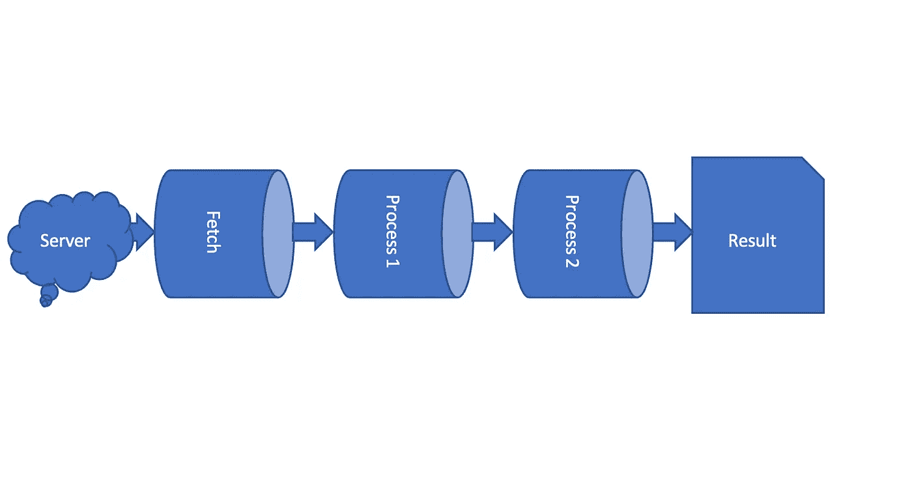

# iOS 中结合管道和回调模式

> 原文：<https://betterprogramming.pub/combine-pipeline-vs-callback-pattern-an-example-bf2ba1f8bf37>

## 举例说明



管道

在本文中，我们将尝试理解合并管道是什么样子，以及它与传统回调方法有何不同。

自从几年前苹果从 iOS 13 开始引入 Combine 框架以来，许多开发人员已经采用了它，他们的应用程序被其以所谓的管道形式简化复杂处理步骤的能力所吸引。

我们将学习一组非常简单的例子(你甚至可以在 Xcode 操场上运行它们！)中，我们尝试使用回调和合并方法来完成相同的任务。

# 问题是

我们将尝试实现一组处理步骤，在这些步骤中，我们将获取一些员工数据，根据员工所在的部门为他们申请加薪&最后生成一个邮件程序，打印处理的最终结果。

我们将使用回调模式和 Combine 方法来实现这一点，以可视化这种差异。

```
Fetch Employees -> Apply salary raise -> Generate Mailer -> Print result
```

# 数据结构

我们将使用下面的数据结构，这些数据结构将代表我们试图使用和努力的各种数据模型。

我们有`Employee`、`Department`、`EmployeeAddress`、&、`Mailer`数据结构

# 抽样资料

为了保持简单，我们将在代码中创建一组数据，这将有助于我们保持实现的简单性，并更加关注概念(实际上，数据可能来自远程 ReST API 等)。

下面是一个`Employee` & `EmployeeAddress`的数据结构。

## 获取员工

在上面的例子中，我们将`fetchEmployees`实现为一个“*回调*”&**组合**函数。

在第一种方法中，被调用的函数接收一个回调函数作为参数，该参数将由一组雇员调用。第二个函数使用一个内置的便利发布器`Just`来帮助包装任何数据并返回一个发布器。

`eraseToAnyPublisher`函数有助于删除发布者的输出，以便于客户端处理输出，并允许我们更改发布者输出的底层实现。

这个发布者从不返回错误，所以将`<[Employee], Never>`作为返回类型。

## 申请加薪

在上面的函数中，我们循环遍历`Employee`数组并申请加薪。我们像以前一样调用`callback`或返回类型`AnyPublisher<[Employee], Never>`的发布者。

## 生成邮件程序

作为我们处理的最后一步，我们需要生成一个`Mailer`,这样它们就可以被发送到下一个处理步骤(或者只是打印在控制台上，我们很快就会看到)

上述函数接受一组`Employee`，然后用一组`Mailer`对象调用回调，或者返回一个发布者。

# 把所有的放在一起

我们现在将把上面的单个实现放在一起，以体会其中的区别！

如你所见，在*回调*方法中，我们需要嵌套回调。你可以想象，如果将来处理步骤增多，代码将开始变得复杂，难以理解和维护。

在组合方法中，您可以立即看到处理步骤“链接”在一起形成一个管道，并且很容易推理和理解。

将来，如果您需要一个新的处理步骤(例如:发送电子邮件),您可以很容易地引入这个步骤，而不必增加代码复杂性或需要重构。

`[flatMap](https://developer.apple.com/documentation/combine/publisher/flatmap(maxpublishers:_:)-3k7z5)`是一个组合操作符，将上游发布者的元素转换成新的发布者。

`[sink](https://developer.apple.com/documentation/combine/publisher/sink(receivevalue:))`是一个内置的订阅者，它将发布者的输出连接到一个闭包(它通常结束一个管道)。

注意:*应该注意的是，为了形成流水线，第一个发布者的输出应该与流水线中下一个发布者所期望的输入相匹配。所以在我们的例子中* `*fetchEmployee*` *返回一个类型为*`*AnyPublisher<[Employee], Never*`*&*`*applyRaise*`*的发布者期望一个数组或者* `*Employee*` *。*

完整的例子可以在[这里](https://gist.github.com/mvemjsun/2c07b95fcdce147cd604499839bcb365)找到。

# 参考

对于那些想要理解这些概念的人来说，来自苹果的 [Combine](https://developer.apple.com/documentation/combine) docs 是一个极好的文档来源。首先掌握一些关键概念是有用的，例如`Publishers`、`Subject`、&、`Subscriber`，然后是内置发布者(例如`Just`、&、`Empty`等等)，订阅者(例如`sink`，最后是组合操作符(例如`flatMap`、`tryMap`、`zip`、`collect`、**、**等等)