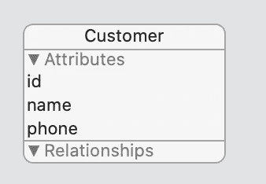

# 联合收割机、出版商和核心数据

> 原文：<https://betterprogramming.pub/combine-publishers-and-core-data-424b68fe9473>

## 创建从核心数据到用户界面的连续信息流


在我的上一篇文章 [RxSwift、Observables 和核心数据](https://medium.com/better-programming/rxswift-observable-and-core-data-55ab87fc02ea)中，我介绍了一种直接从核心数据缓存中获取可观察数据的方法。但是有些已经在用苹果的 [Combine 框架](https://developer.apple.com/documentation/combine)，所以我为 Combine 准备了完全一样的解决方案。

总体思路是以发布者的形式获取核心数据实体的流，并在每次更新、插入或删除给定 FetchRequest 的核心数据实体时发送新值。

我不会详细讨论如何使用这个流。更多信息可以在我之前的文章中找到。

我们将需要`NSFetchRequest`和一个`NSManagedObjectContext`来初始化下面的发布者:

CDPublisher.swift

每次核心数据更新时，`CDPublisher`都会向其订户发送新值。

我建议不要直接使用核心数据实体，而是将其转换成域结构并使用。

下面是客户实体的一个示例:



我将创建以下结构:

```
struct DCustomer {
  let id: Int
  let name: String
  let phone: String
}
```

并将`CDPublisher`的结果映射到:

```
CDPublisher(request: Customer.fetchRequest(), context: database.viewContext)
.map { $0.map { DCustomer(id: $0.id, name: $0.name, phone $0.phone) } }
```

# 从这里做什么

如果你使用 SwiftUI，你可以更新你的视图模型的`Published`属性。

请记住以下几点:

*   当分配给一个`Published`属性时，接收主线程中的值。
*   不要使用`.assign(to: \.customers, on: **self**)`,因为它会导致对 self 的自引用，并且 MyViewModel 永远不会被释放。
*   在`.sink`闭合中使用`[weak self]`。
*   更好的解决方案存在，可以取代这个丑陋的`.map().recieve().sink().store()`，但这将是另一篇文章的主题。

一如既往，快乐编码。