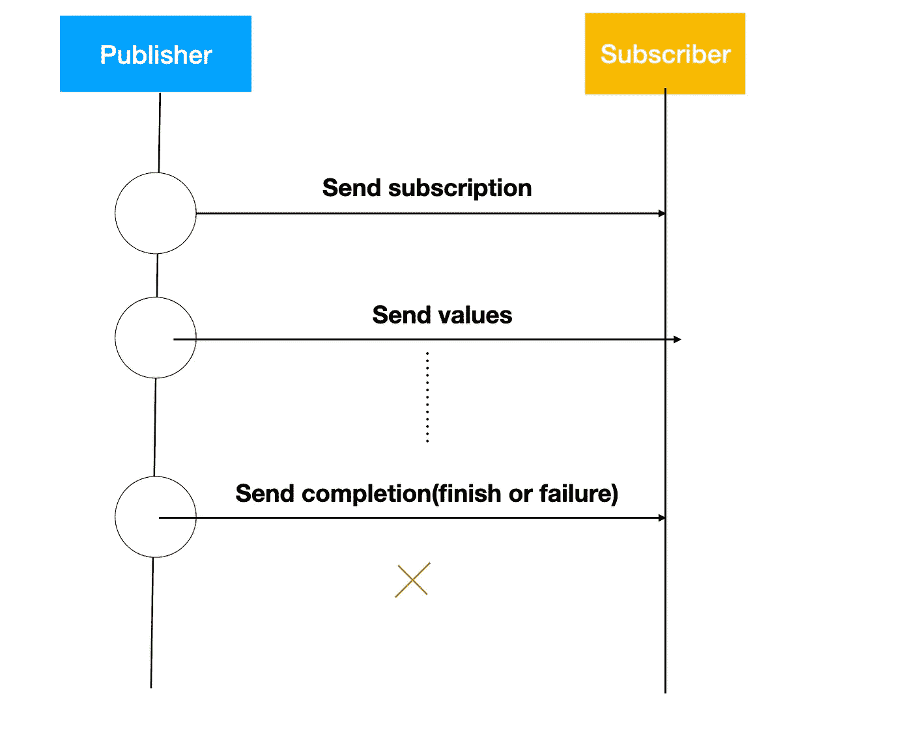
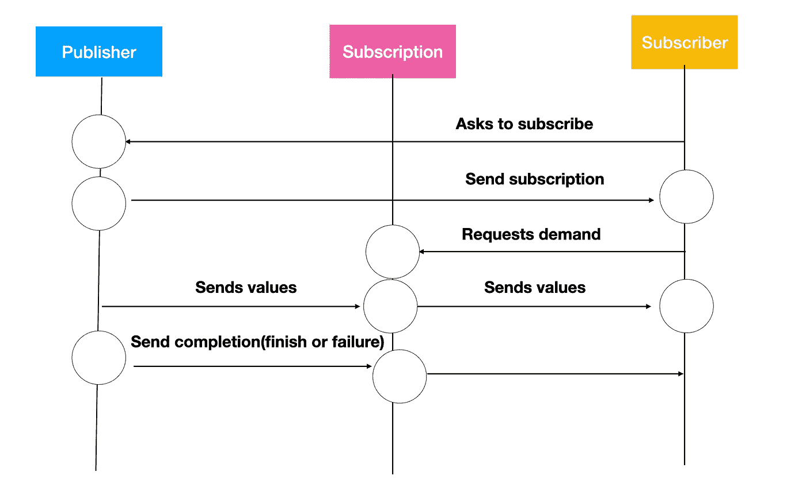

# 将发布者、订阅者和订阅者结合在一起

> 原文：<https://betterprogramming.pub/combine-publishers-subscriptions-and-subscribers-implementations-under-the-hood-fe308fb9f7f6>

## 带有实现示例

图片来自[http://www . maestro . ind . br/a-importancia-das-engrenagens-em-sistemas-industriais/](http://www.maestro.ind.br/a-importancia-das-engrenagens-em-sistemas-industriais/)

也许你已经研究过苹果在 WWDC19 上发布的 Combine native framework，并记住了如此庞大的出版商、订户和运营商名单。

也许您只知道第一个负责生成新的异步值，这些值应该更新第二个。好了，这就是它的组成！但是通常我们很多人都没有深入了解这些协议之间是如何通信的，有些人可能不知道它们是协议(啊哈！).

因此，在本文中，我们将讨论如何通过实现这些协议来创建您的自定义发布者、订阅和订阅者，当发布者发出一些新值时，它的所有订阅都可以告诉订阅者，以便进行适当的处理(而不是，`sink`和`assign`根本不是唯一可用的订阅者)。

# 了解他们每个人

首先，有必要了解这三个实体:`Publisher`、`Subscription`和`Subscriber`之间的真实关系，以及主要是它们的接口契约由什么组成。

Apple 不建议您实现一个`Publisher`类型，因为所有的本机和预定义类型都已经完成了正确的任务，以保持它们和它们的订户之间的完美同步，但是这篇文章旨在理解同步实际上是如何工作的，所以让我们继续！

# 1.出版者

publisher 是一种符合`Publisher`协议的类型，正如其名称所示，它的意思是发布值。它有两个泛型类型:一个是`Output`，这是它应该向其`subscribers`发出的值类型；另一个是`Failure`类型，它从 Swift `Error`继承而来，旨在向订阅者传递订阅期间发生的一些错误。

如您所见，`Publisher`由两个关联的类型和一个接收`subscriber`作为参数的方法组成。当这个方法被调用时，自定义`Publisher`必须创建一个`Subscription`对象并将其发送给`Subscriber`。

简单描述一下`Publisher`的生命周期，它首先调用这个`receive`方法，然后向`subscriber`发送一个`subscription`。`publisher`保持异步发送值，然后它以两种排他的方式停止:结束或失败，这对应于`Failure`泛型类型。

# 2.签署

组合开发人员对订阅对象了解并不多。关于这个协议，重要的是实现它的对象负责将一个`subscriber`链接到`publisher`。只要在内存中，`subscriber`就会一直接收值。它只包含一种方法:

一旦`subscriber`从`publisher`接收到`subscription`，就会调用`request`方法，它负责确定`subscriber`从`publisher`请求多少个值，这由`Demand`枚举定义。

它可以是对应于没有值要接收的`none`，定义订户请求`value`次的`max(value)`，或者是对应于只要`subscription`存在就接收无穷大值的`unlimited`(不从`publisher`接收完成)。

需要提醒您的是，真正链接`publisher`和`subscriber`的是`Subscription`对象——它包含一个对`subscriber`的引用以保持其最新，以及一个对与`publisher`相关的对象的引用以通知它发送了一个新的输出值。

尽管`Subscription`在谈论合并时并不总是被提及，但我认为这是反应式编程中关于这个概念的最重要的实体。

由于`Subscription`协议继承自`Cancellable`，默认情况下它有一个`cancel`方法，负责取消到订户的链接。通常，它只是将订户属性设置为`nil`。

另一件要说的重要事情是，从发布者接收值的方式确实取决于自定义`subscription`，但是我们将在稍后实现时更深入地讨论这一点。

## 3.订户

最后，我们有了`Subscriber`，它是与`publisher`生命周期保持同步的对象，并通过`Subscription`请求对这些值的需求。真正处理来自`publisher`的事件的是`subscriber`，它有三种方法:

第一个`receive`方法由`Publisher`本身发送，包含一个`Subscription`作为参数。幕后的想法是`Subscriber`调用`Subscription`上的`request`方法，以便告诉它准备从`Publisher`接收多少个值。在实现内部，`subscriber`可以做任何其他额外的动作。

第二个`receive`方法用于接收来自`Publisher`的值并进行适当的处理。如您所见，它将一个`Demand`类型返回给调用它的订阅，并且它将调整它实际需要的值的数量。值得一提的是，它并没有完全更新保持在`Subscription`中的需求，而只是在现有需求的基础上增加了更多。

最后一个`receive`方法用于接收来自`publisher`的完成事件，并处理完成事件或可能的输入故障。

请注意，为了使该过程有效，来自`Subscriber`和`Publisher`的通用类型`Input`和`Output`必须是相同的，即在收到的同一中发布的类型。

# 订阅生命周期

通过满足这些协议，现在我们可以安全地理解`publisher`和`subscriber`之间的关系是如何建立的:

1.  一个新的订阅者通过调用发布者的`receive`方法，将订阅者作为一个参数传递，从而向发布者请求订阅
2.  发布者创建一个定制订阅，一个负责让订阅者与发布者保持同步的对象，并通过`receive(Subscription)`方法将其发送给订阅者。
3.  在`receive(Subscription)`方法中，订阅者调用刚刚收到的`Subscription`对象上的`request`方法，建立它从发布者那里需要的真实需求。
4.  当接收到`request`方法时，`Subscription`对象拥有订阅者需要的`Demand`，并且知道它必须从发布者那里接收多少个值
5.  由于`Subscription`有一些跟踪发布者发出的值的机制，它只需要通过`receive(Input)`方法将它们发送给订阅者。
6.  当某个事件需要订阅完成时，`Subscription`调用`Subscriber`上的`receive(Completion)`方法，流程结束。

# 创建我们自己的发布者、订阅者和订户

为了理解这个强大的框架是如何工作的，我们将为一个类实现一个 publisher，它只保存一个整数值，当它被改变时，我们告诉它的订阅者以便处理。说够了，我们开始吧。

这是我们的`HoldValue`自定义类，正如你所看到的，它仅仅意味着保存一个可能改变的整数值。现在我们需要一个`publisher`来跟踪一些实例值的变化，并通过一个`subscriber`来处理它。简单，不是吗？它甚至类似于在声明某个`ObservableObject`类时由`Published`属性包装器生成的`publisher`。我们正在实现一个非常相似的案例。

## 实现我们的发布者

当我们的`HoldValue`实例改变其内部属性时，我们需要一个`publisher`来接收值，所以让我们用一个新的类来实现 Combine 的`Publisher`协议:

现在我们有了一个新的`Publisher`类来定义我们需要的两个关联类型:一个`Int`作为`Output`，我们的发布者将把它发送给订阅者，一个`Never`作为`Failure`，因为我们的类永远不会以错误结束。如您所见，我们也在我们的`publisher`中声明了一个`HoldValue`实例作为属性。我们需要这个实例来跟踪发送给我们的`subscriber`的事件。

由于我们需要某种机制来监听我们的`HoldValue`对象，并且我们希望我们的发布者可供多个订阅者连接，我们将定义一组将更新多个监听器的完成:

现在我们有了一组闭包来处理值的变化，每一个都对应于一个`subscription`。注意，每次我们的值改变时，一个观察者遍历所有的处理程序并用我们的新值执行它们。这将很快变得非常重要。

## 创建我们的订阅

正如我们之前谈到的，`Subscription`是关于 Combine 的最重要的实体，因为它在我们的发布者和订阅者之间保持联系。

当`Subscription`作为中介时，订阅者保持更新。我们将创建一个定制的`Subscription`类型，它将实现一些逻辑来满足订户的需求。为此，它必须有办法监听`publisher`并将新的输出值发送到它负责的`subscriber`以进行同步。

这是我们`HoldValuePublisher`的`Subscription`型号。它接收一个负责发送值的`**subscriber**`和一个必须监听的`HoldValue`类的实例。

因为它是一个`Cancellable`类型，所以它实现了`cancel`方法，该方法将切断订阅和订阅者之间的链接(然后是发布者)。它只是将订户分配给`nil`。

因为我们想要跟踪`HoldValue`的值，我们现在必须做的是给它添加一个新的闭包，它将处理我们之前看到的值的变化:

因此，我们的逻辑以如下方式工作:我们在我们的`subscription`中设置我们的`subscriber`引用，并且也设置对`HoldValue`的引用。然后，我们向我们的`HoldValue`实例添加一个新的闭包，它将通过`receive(Input)`方法向订户发送一个新值。很简单，对吧？

现在`subscription`充当我们的`publisher`和`subscriber`之间的中介。但这并没有停止。我们仍然需要展示当一个新的订阅者连接到它时，发布者是如何建立`subscription`的。

还记得`Publisher`协议中的`receive(Subscriber)`方法吗？这是我们合并管道的第一步，它实际上负责实例化`Subscription`并发送给`Subscriber`，因此创建了两个实体之间的链接:

当`Publisher`收到一个新的`subscriber`时，创建一个新的`subscription`并发送给`subscriber`处理。`Subscription`接收`Subscriber`本身和一个对`Publisher`发布其值的类的引用(很抱歉这是多余的！).现在是`subscriber`向`subscription`提出要求的时候了。

# 处理需求

正如我们之前看到的，`Subscription`有一个名为`request`的方法接收一个`Subscribers.Demand`，但我们还没有实现它。该方法负责接收`Demand`对象，该对象内部包含我们的订阅者实际希望接收值的次数，我们的订阅据此做出一些逻辑来传递我们的订阅者所期望的内容。

在实施之前，关于需求和我们的出版商生命周期，你必须知道一件事。需求完全与订阅者相关，而生命周期属于发布者，这意味着如果我们的订阅者由于缺乏需求而停止接收新的输入，它不一定会从订阅接收到完成事件。我们将进一步了解这一点，现在只需遵循代码:

向我们的订阅类添加两个新属性，一个是`counter`，它将记录我们的订户到目前为止已经收到了多少值，另一个是`maximum`，它对应于我们的需求。

在我们的`request`方法中，只需将我们输入的需求中的`max`属性分配给`HoldValue`订阅中的`maximum`属性。

## 实施需求逻辑

既然我们已经保存了想要发送给`subscriber`的最大值，我们需要在`subscription`中实现一些逻辑来满足这个需求。在初始化器内部，向`HoldValue`实例添加一个新的处理程序。

现在我们实现这个魔术:在我们新的`holdValue`闭包内，检查`maximum`值是否存在(不是`nil`)，如果存在，检查我们的`counter` 是否小于`maximum`。如果是，意味着我们给定的订户仍然能够接收新的输入，所以我们只需用来自`HoldValue`的新整数调用`receive(Input)`方法，自然地，递增`counter`来更新我们的逻辑。如果`counter`达到了我们的`maximum`需求，在这种情况下，我们向我们的订户发送一个`finished`完成事件并取消`subscription`。

如果我们甚至没有一个`maximum`，由于一个`unlimited`需求，我们只是让我们的订户无限期地接收价值。请注意，我们触发完成事件只是因为没有更多的值要发出，但是在其他发布器中，比如用`Published`属性包装器创建的发布器，这根本不会发生。

太棒了，现在我们的`subscriber`可以接收需求，并在需要时向我们的订户发送值。到目前为止，我们实现了一个`publisher`，它创建了一个`subscription`，将其发送给订阅者，订阅者根据自己的需求请求新的值。

# 实现我们的订户

最后但同样重要的是，我们将实现我们的订户类。正如我们之前所说的，`subscriber`只负责处理新的输入值，完成事件，并请求它应该接收多少个事件。

让我们创建一个新的自定义类:

我们做了什么？

我们创建了一个新的`HoldValueSubscriber`类型，将它的相关值定义为与发布者相同:一个`Int`作为输入，一个`Never`作为失败，因为它不期望任何错误。

让我们来看看接口方法:

1.  `.receive(Subscription)`:正如我们之前看到的，它是从发布者端调用的，并通过传递一个需求对象向`Subscription`发送一个新请求。因为它只需要三个值，所以我们在需求中最多设置三个值。最后，为了保持我们的订阅有效，它被保存在`cancellables`集合中。
2.  `receive(Input)`:这个方法是从订阅方调用的，它只是向订阅方发送一个新的输入值。我们通过打印值来处理这个问题。返回的需求是一个值，它增加了订阅类中的需求。由于我们不希望它增加，我们返回一个`none`，它与`max(0)`相同
3.  `receive(Completion)`:这个方法也是从订阅方调用的，它发送一个完成对象，通知我们的订阅方，订阅已经结束，我们的订阅已经完成。它只是打印完成事件

# 使发布者可以通过其原始类进行访问

我们创建了一个服务于`HoldValue`类的发布者。这是我们真正想听的课。

为了像大多数联合发行商那样从`HoldValue` origin 类访问它，实现这个 Swift 扩展:

现在，如果您想进行订阅，只需从`HoldValue`实例访问`publisher`即可。

# 测试我们的订阅

现在我们已经创建了三个组合定制类型，让我们测试这个订阅:

我们在做什么？我们为`HoldValue`创建了一个新的实例，一个新的`HoldValue` `subscriber`，并让它订阅我们的实例`publisher`。这建立了我们之前看到的管道:`publisher`在内部创建一个新的`subscription`，将其发送给订户，订户向订阅请求一个需求，现在它准备好接收新的输入(来自`publisher`的输出)。

我们现在遍历从 0 到 9 的整数，并将我们的`holdValue`值更新到每个数字。当我们在订户中打印每个输入值时，请看一下控制台:

它按照要求接收三个值，之后，`subscription`向`subscriber`发送一个完成事件，该事件也被打印出来。

# 结论

现在，您完全理解了联合订阅的管道。您知道我们的`**publisher**`负责在被请求时向`**subscriber**`发送新的订阅，您知道我们的`**subscriber**`实际上定义了自己的需求，并且`**subscription**`实现了使`**subscriber**`接收完成的逻辑。

正如我们之前谈到的，Apple 不建议我们实现发布者和订阅，因为逻辑错误可能会破坏发布者和订阅者之间的所有连接，这可能会导致意想不到的结果。

但是理解 Combine 框架如何工作是很重要的，我真的希望你喜欢这篇文章；)