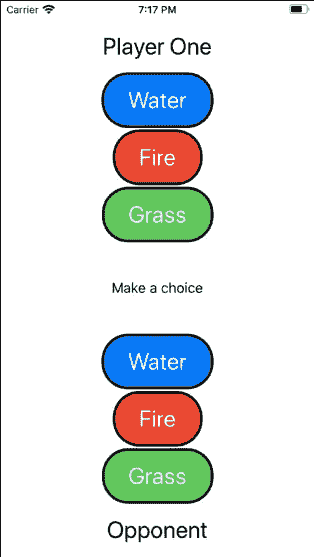
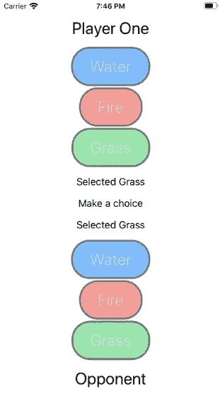
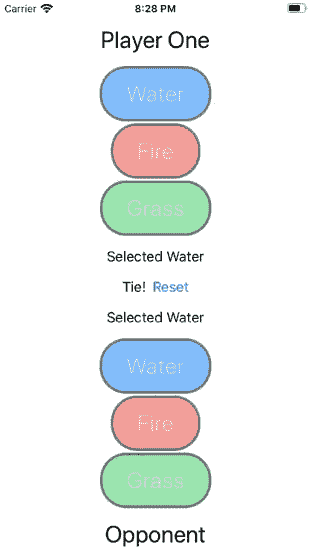

# 用 SwiftUI 和 Combine 构建一个石头、布、剪刀游戏

> 原文：<https://betterprogramming.pub/combine-roshambo-a3ea27784e4e>

## 反应式游戏编程


作者恩佐克洛普——自己的作品，CC BY-SA 3.0，[https://commons.wikimedia.org/w/index.php?curid=27958688](https://commons.wikimedia.org/w/index.php?curid=27958688)

# 介绍

[Combine](https://developer.apple.com/documentation/combine) 是苹果版的函数式反应式编程。据苹果公司称，这是一个声明性的 Swift API，用于处理随时间变化的值。函数式反应范式是函数式编程与反应式编程的结合。

在函数式编程中，一切都被建模为函数。当使用范例时，程序避免改变程序的状态或改变数据。这种范式与反应范式相结合。反应式编程支持异步数据流和事件流的处理。由于这个原因，当使用 UI 时，例如键盘输入或按钮点击，它工作得非常好。

将这两者结合起来创建了一种编程范式，在这种范式中，事件或异步调用用函数来处理。这是我第一次尝试使用 Combine 或任何类型的函数式反应式编程。我会做一个基本的 Roshambo(石头，剪子，布)游戏。

# 出版者

发布者是数据的提供者。在这个迷你应用程序中，第一个发布者将成为用户选择的输入。我将发布来自用户的事件。当用户打开应用程序时，我们将为他们提供三个选项:水，火和草。火战胜草。草战胜水。水战胜火。



内容视图. swift

Roshambo 的迷你应用程序的所有代码都可以在我的 [GitHub repo](https://github.com/thenerdassassin/CombineTutorial-Roshambo) 中找到。`ContentView`类有一个叫做`App`的`EnvironmentObject`，我用它来管理合并逻辑。当我完成本教程时，`ContentView`将会是:

`App`对象在`SceneDelegate`内的场景函数中实例化，并设置为环境对象。当使用`ObservableObject`协议时，创建一个发布者再容易不过了。唯一需要添加的是一个简单的注释，`[@Published](https://developer.apple.com/documentation/combine/published).`下面是第一个发布者:

```
**class** App: ObservableObject {
  @Published **var** user: Player
}
```

现在，每当`Player`对象`user`改变时，它将提供更新的数据。`ChooseElementView`为用户提供能够选择选项的按钮。

当按下其中一个 Roshambo 按钮时，它将更新`Player`对象中的元素。这是因为在创建元素视图时实例化的`ChooseElementView`中的`selectedElement`与`ChooseElementView(selectedElement: $app.user.element`之间存在绑定

`Player`对象是另一个简单的`ObservableObject`，它有一个发布的变量。

```
**class** Player: ObservableObject {
  @Published **var** element = Element.none
}
```

在 SwiftUI 中，`[ObservableObject](https://developer.apple.com/documentation/combine/observableobject)`协议是一个非常强大的概念。它使得创建发布者变得容易。`[@Published annotation](https://developer.apple.com/documentation/combine/published)`内置于联合收割机中。发布者将在属性更改时触发。发行者的输出类型是从属性的类型推断出来的。在这种情况下，发布者类型是`<Element, Never>`，这意味着数据类型是`Element`，没有失败。

# 订户

没有订阅者的发布者没有多大价值。订阅方从发布方请求并接收数据。在发布服务器收到订阅请求之前，它不会发送任何数据。为了让订阅服务器从发布服务器请求数据，订阅服务器的输入类型必须与发布服务器的输出类型相匹配。

在我的 Roshambo 迷你 app 里，对手，`CopyCatPlayer`，跟他对战真的很烦。她总是等着看我们怎么做，做出同样的选择！所以比赛结果总是平局。

这将由订阅发布者的`CopyCatPlayer`实现。当发布者发送一个新值时，另一个玩家会监听，等待一小段时间，然后做出相同的选择。



抄袭者

`CopyCatPlayer`将由发布者初始化。当用户做出选择时，这将导致`CopyCatPlayer`更新所选的`Element`。

`[Assign](https://developer.apple.com/documentation/combine/currentvaluesubject/3235789-assign)`是订户。它使用 publisher，一旦对手做出选择，就将发布的值设置为自己的元素变量。参考存储在`cancellableSet`中，因此用户将在`CopyCatPlayer`的整个生命周期内操作。

然后将对手加入`App.swift`类。对手也发表了所以`ContentView`可以更新。

当`CopyCatPlayer`被实例化时，发布者使用`[eraseToAnyPublisher](https://developer.apple.com/documentation/combine/publisher/3241548-erasetoanypublisher)`函数来提供一个更干净的类型。这可以在任何发布者上完成。它允许订户维护底层实现的抽象。

现在有一个`CopyCatPlaye` r 将模仿用户的选择，这是使用`[assign](https://developer.apple.com/documentation/combine/currentvaluesubject/3235789-assign)` s[subscriber](https://developer.apple.com/documentation/combine/currentvaluesubject/3235789-assign)完成的。为了让对手在复制之前有一个延迟，我需要引入一个新的概念:操作符。

# 操作员

操作符可以说是 Combine 最重要的元素之一。他们是出版商和订户之间的中介。操作符可以用于许多目的，包括但不限于改变事件的时间、转换数据、过滤，甚至将多个发布者组合成一个数据源。

我要看的第一个操作符将改变`CopyCatPlayer`的定时。这将使`CopyCatPlayer`的选择延迟 200 毫秒。为了实现这一点，需要两个操作符:`[debounce](https://developer.apple.com/documentation/combine/passthroughsubject/3204599-debounce)`和`[receive](https://developer.apple.com/documentation/combine/publisher/3204743-receive)`。

`debounce`操作符用于延迟事件。它需要两个参数:等待的时间和操作员交付事件的调度程序。`receive`操作符用于接收指定调度程序上的事件。很容易想象这两个运算符是如何经常一起使用的。

为了展示使用操作符的更强大的方法，我们将创建一个新的对象`Game`，来订阅我们玩家的元素，以便计算 Roshambo 游戏的结果。



`Winner`枚举有三个选项。赢家可能是玩家一(我们的用户)，玩家二(对手)，或者都不是(平局)。

```
**enum** Winner {
  **case** one, two, neither
}
```

`Game`对象将发布`Winner`，这样我们的`ContentView`就可以告诉用户谁赢了游戏。为了计算`Winner`，它将由两个发布者初始化，每个发布者对应一个玩家。

使用名为`[CombineLatest](https://developer.apple.com/documentation/combine/publishers/combinelatest)`的操作符将两个发布者组合在一起，该操作符将从每个发布者处获取最新的两个元素。因此输入是两个`Element`对象，但是操作符将数据类型转换为一个元素元组— `(Element, Element)`。然后使用一个大多数人都熟悉的新运算符，`[map](https://developer.apple.com/documentation/combine/publisher/3204718-map)`。`map`操作符使用闭包将数据类型从`(Element, Element)`转换为`Winner?`。这是闭包中使用的函数:

来自`map`操作符的返回类型被分配给获胜者变量。获胜者变量随后被发布，因此`ContentView`可以基于获胜者进行更新。`App`对象已更新，添加了`Game`类:

我们的游戏还有一部分我需要添加。如果用户只能玩一次就不好玩了。我需要重新开始比赛。为了实现这个目标，我需要教授科目，一个新的联合课题。

# 科目

Combine 有一个特殊类型的发布者，`[Subject](https://developer.apple.com/documentation/combine/subject)`。这是一个发布者可以遵守的协议，它将添加一个方法:`send()`。使用此发布程序是为了将项目注入到流中，并将值广播给订阅者。

联合收割机内置的`Subject`有两种:`PassthroughSubject`和`CurrentValueSubject`。两者唯一不同的是`CurrentValueSubject`需要一个初始值。两者都将发送更新的值。

我准备加一个`Subject`重置。当复位按钮被按下时，我会发出一个`Bool`。创建`PassthroughSubject`几乎和任何其他发行商一样简单。所以`App`对象的最终结果是:

新的发布者将被添加到`Player`类，这样用户和对手都可以处理重置。这将引入一个新订户`[sink](https://developer.apple.com/documentation/combine/publisher/3343978-sink)`。它将简单地接收值并执行闭包。在这种情况下，将`Player`的元素设置回`none`。

这使得重置具有极大的可扩展性。如果添加了新的 UI 元素，它只需要订阅 reset 主题。如果没有发布者，reset 函数将必须包含要更新的对象或 UI 的所有逻辑。这个函数会变得非常脆弱。现在，如何重置的逻辑包含在需要更新的元素或类中。

# 结论

Combine 非常强大，可以在整个 Swift 中使用。它是 SwiftUI 的核心特性，但也可以用于许多其他用例，包括网络请求、错误处理和异步操作。本教程通过介绍基本术语和概念仅仅触及了皮毛。我将继续探索用 Combine 还能做什么，以及如何开始用函数式反应式编程范式思考。

如果这个话题让你感兴趣，这里有优秀的免费信息，包括模式和食谱，由 [Joseph Heck](https://heckj.github.io/swiftui-notes/) 和 [Apple 的文档](https://developer.apple.com/documentation/combine/receiving_and_handling_events_with_combine)撰写。