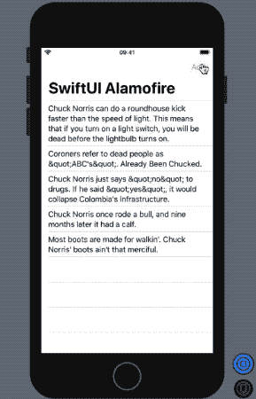
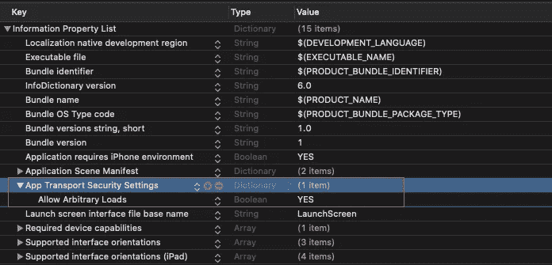
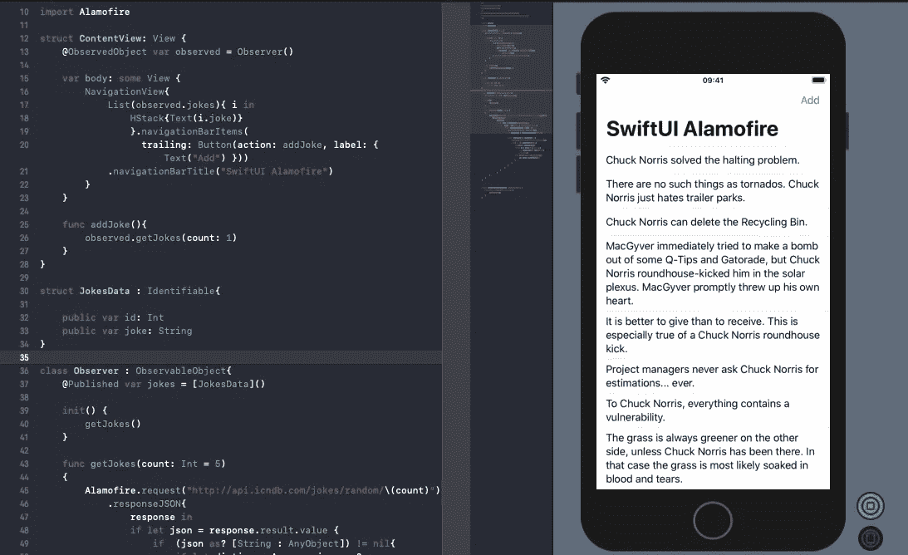

# 结合 SwiftUI 和 Alamofire

> 原文：<https://betterprogramming.pub/combine-swiftui-with-alamofire-abb4cd4a0aca>

## 用声明式和反应式框架联网


图片来自 [Pixabay](https://pixabay.com/?utm_source=link-attribution&utm_medium=referral&utm_campaign=image&utm_content=3228704) 的 [Sumanley xulx](https://pixabay.com/users/sumanley-2265479/?utm_source=link-attribution&utm_medium=referral&utm_campaign=image&utm_content=3228704)

在 WWDC 2019 期间，除了 SwiftUI，苹果还推出了自己的反应式编程框架 Combine。它是在 RxSwift 框架已经成熟的时候出现的。尽管在 Combine 中有一点很突出，那就是对背压的支持。

本文的目标是将 Alamofire 与 SwiftUI 连接起来，同时利用 Combine 框架。

在我们混合这三个要素来构建一个完美的配方之前，让我们快速浏览一下[联合收割机框架](https://developer.apple.com/documentation/combine)。

# 什么是联合？

Combine Framework 将功能性、反应性和声明性的编程范式引入了苹果的生态系统。概括地说，它由三个核心组件组成:

*   **出版商** —他们发布数据(比如说，媒体作者)。
*   **订阅者** —他们收听数据(假设是中等读者)。
*   **操作符** —这些操作符处理发出的数据(我们称之为媒体编辑器。)

## 可观察对象和被观察对象

协议是联合框架的一部分。具有需要 SwiftUI 观察的属性的类必须符合`ObservableObject`协议。

属性需要标记为`@Published`，基本上是一个属性包装器，用于根据值的变化更新 SwiftUI 中的视图。

`ObservedObject`用于将`ObservableObject`实例绑定到视图。

总而言之:

*   `ObservedObjects`是`Publishers`。
*   SwiftUI 视图是`Subscribers`。

现在我们已经对 Combine 框架的组成有了一个概念，让我们将 Alamofire 引入其中，并构建我们酷的 iOS 应用程序。

# 最终目的地

我们将开发一个基于 SwiftUI 的应用程序，使用著名的 [Chuck Norris API](http://www.icndb.com/api/) 显示笑话列表。以下是我们计划实现的目标:



最终目标

# 将 Alamofire 添加到我们的项目中

启动一个新的基于 Xcode、SwiftUI 的项目，并添加 [Alamofire](https://github.com/Alamofire/Alamofire) 依赖项。你可以使用 Cocoapods，Swift Package Manager 或者 Carthage，哪个最适合你。

完成后，只需将 Alamofire 导入到您的 Swift 类中。

# 隐私权限

确保您已经在`info.plist`文件中添加了 App Transport Security，如下所示，因为我们正在处理一个 HTTP 网络请求。



`Info.plist`文件

# 设置我们的模型结构

我们的模型需要为列表实现`Identifable`协议，以将每一行标识为唯一的一行。在下面的代码中，我们只存储字符串消息和 id:

```
struct JokesData : Identifiable{public var id: Int
public var joke: String}
```

# 设置我们的观察者类

如前所述，我们需要符合我们类中的`ObservableObject`，并将属性设置为`Published`，用于通知 SwiftUI 视图的更新。下面的代码实现了这一点，并将 API 响应添加到模型结构中。

# 构建我们的内容视图

最后，我们将`ObservedObject`中的 published 属性设置到列表中，如下面的代码所示:

```
struct ContentView: View {
    @ObservedObject var observed = Observer()

    var body: some View {
        NavigationView{
            List(observed.jokes){ i in
                HStack{Text(i.joke)}
                }.navigationBarItems(
                  trailing: Button(action: addJoke, label: { Text("Add") }))
            .navigationBarTitle("SwiftUI Alamofire")
        }
    }

    func addJoke(){
        observed.getJokes(count: 1)
    }
}
```

在上面的代码中，我们还添加了一个导航栏按钮，为从 API 响应收到的每个新笑话更新 SwiftUI 列表。



API 响应的实时预览。

# 结论

由于 SwiftUI 预览，我们不再需要依赖模拟器来模拟 API 请求和响应。这一切都发生在预览本身。完整的源代码可以在这个 [Github 库](https://github.com/anupamchugh/iowncode/tree/master/SwiftUIAlamofire)中找到。

这就结束了。我希望你喜欢阅读，也能开怀大笑。