# 组合 JavaScript 对象的 3 种方法

> 原文：<https://betterprogramming.pub/combining-javascript-objects-e293bc4a48a6>

## 使用赋值方法、循环和扩展运算符

卢卡·布拉沃在 [Unsplash](https://unsplash.com?utm_source=medium&utm_medium=referral) 上的照片。

对象是 JavaScript 的一个强大部分。它们是 JSON (JavaScript 对象符号)的灵感来源。作为应用程序开发的基础组件，有许多方法可以使用它们。

这篇简短的指南提供了对 JavaScript 对象以及如何使用普通 JavaScript 组合它们的见解。这些例子或演示的概念都不需要特殊的库、框架或其他代码。这些技术将在标准的 JavaScript 运行时环境中工作。还描述了每种技术的优点。

完成后，读者应该很好地理解哪些技术是可用的，以及如何为任何给定的用例选择最合适的技术。

*注意:本指南中的例子可以在你阅读时直接在你的浏览器中运行。使用 DevTools 控制台运行示例。有关打开 DevTools 的帮助，请参见指南中的* [*Chrome*](https://developers.google.com/web/tools/chrome-devtools/open) *，*[*Edge*](https://docs.microsoft.com/en-us/microsoft-edge/devtools-guide-chromium/open/?tabs=cmd-Windows)*，*[*Firefox*](https://developer.mozilla.org/en-US/docs/Tools)*，或*[*Safari*](https://support.apple.com/guide/safari/use-the-developer-tools-in-the-develop-menu-sfri20948/mac)*。*

# JavaScript 对象

首先，JavaScript 对象是键值对的集合。值本身可以是 JavaScript 原语(字符串/文本、数字、布尔值等。)或其他对象。因为对象可以无限嵌套在对象中，所以可以创建重要的数据结构。

JavaScript 对象的示例

语法很重要。这是在 JavaScript 代码中使用的 JavaScript 对象。它不是 JSON，JSON 需要用引号将键括起来。

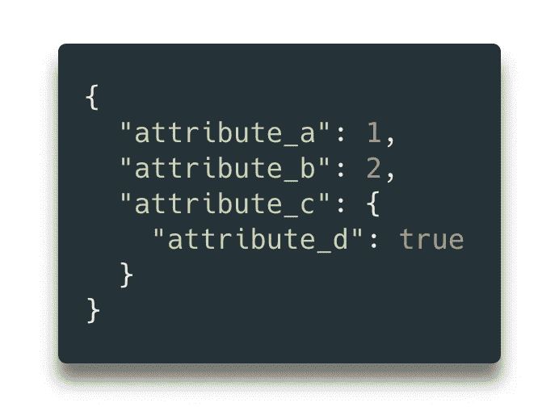

JSON 的例子

## 关于 ECMAScript 的一个注释

ECMAScript (ES)是 JavaScript 的规范(即蓝图)。它由 ECMA International 通过一个名为 TC39 的管理机构进行维护。多年来，该规范一直保持相对不变。2015 年，随着 ECMAScript 6 (ES6)的发布，新一波 JavaScript 出现了变化。

ES6 的主要成果之一是设计了新的原生函数来处理 JavaScript 对象。本指南涵盖了其中的几个功能，以及前几代 ECMA 规范中使用的实践。

# **用 Object.assign()组合对象**

`[Object.assign()](https://developer.mozilla.org/en-US/docs/web/javascript/reference/global_objects/object/assign)`在 ES2015 中首次发布，所以它不会出现在遗留代码库中，但它在现代 JavaScript 运行时中很常见。

代码很简单:

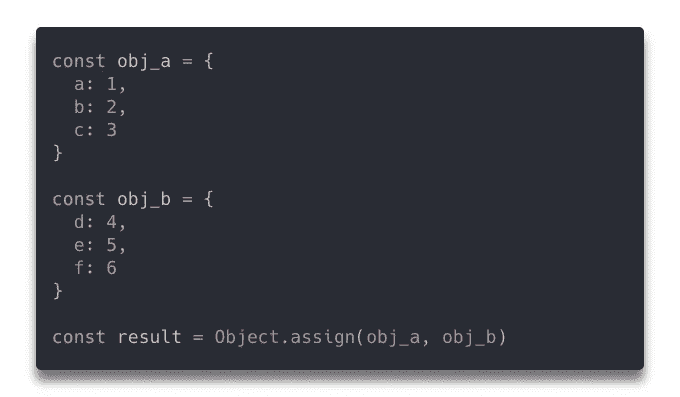

基本 Object.assign()

结果如下:

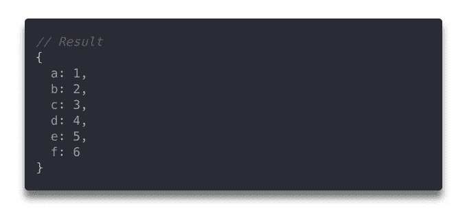

基本 Object.assign()结果

`Object.assign()`支持任意数量的对象参数，因此可以一次组合多个对象，比如`Object.assign(obj_a, obj_b, obj_c)`。这是一种组合对象的简单方法，但是也有一些意想不到的行为。

## **警告:覆盖属性**

有时不同的对象共享键名，这就产生了潜在的冲突。哪个键值应该兑现？

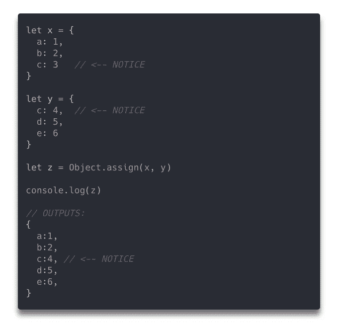

Object.assign()具有冲突的键名

## **什么时候应该使用 Object.assign()？**

这种方法在键名已知不会冲突或者首选覆盖值的情况下是最好的。

首选覆盖冲突值的常见用例是使用默认值。考虑创建一个车辆类，其中默认车辆有四个轮子和四个门。默认设置可能适用于大多数轿车，但轿跑只有两个门。在这种情况下，最好覆盖默认的“四门”值。

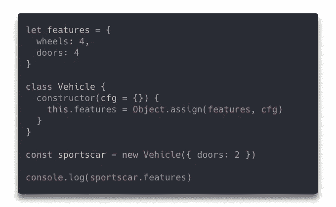

密码

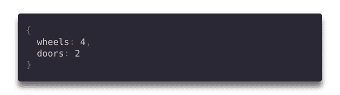

结果

# 用循环组合对象

对象也可以与循环结合。这是一个更加手动的过程，可以更好地控制对象的组合方式。

考虑在`Object.assign()`例子中使用的相同对象，但是注意一个简单的`for`循环被用来将对象从一个追加到另一个。

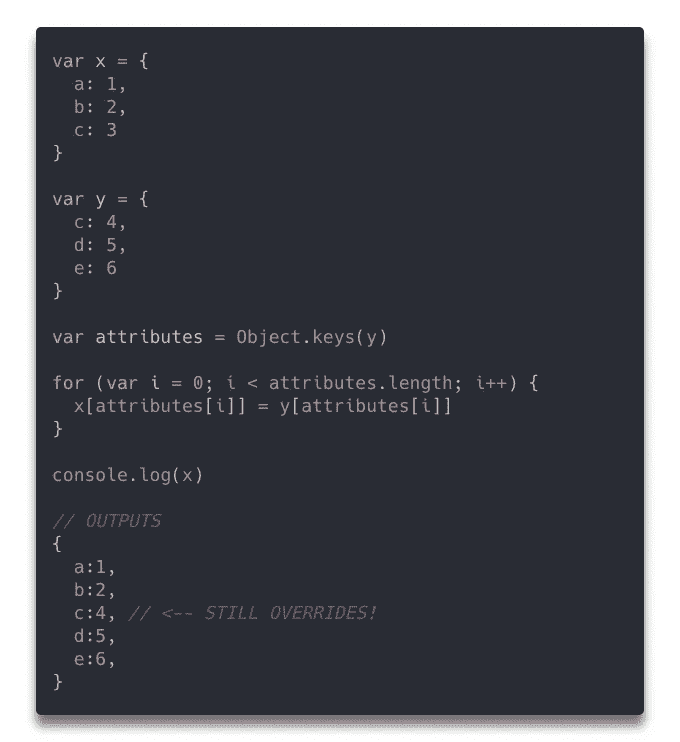

用 for 循环组合对象

这样的结果和`Object.assign()`的结果一模一样。这两种方法的主要区别在于对合并如何发生的控制(第 16-18 行)。

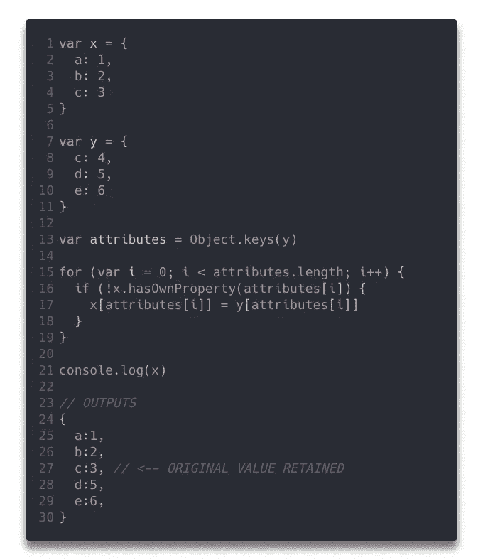

## 什么时候应该使用 for 循环来组合对象？

每当需要对合并过程进行更好的控制时，这种方法都是有效的。

## 定制加工

除了防止相互冲突的名称相互覆盖之外，还可以进行许多其他的数据修改。例如，数据可以被替换或替代。

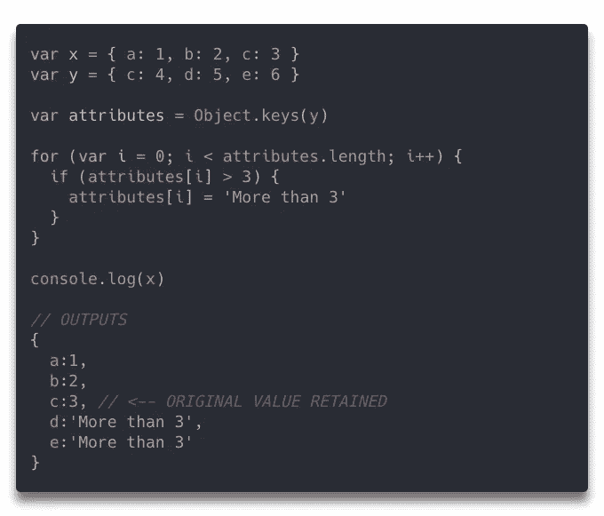

替换值

由于 JavaScript 对象的灵活性，在合并过程中还可以实现许多其他的数据操作。

## *遗留*代码

如果您使用较旧的代码，例如必须在 Internet Explorer 和其他较旧的浏览器中运行的代码，这种方法是较好的选择之一。这些浏览器使用 ECMAScript 5，这是一个较老的标准。`Object.assign`在 ECMAScript 5 中不可用。

## 可枚举性(隐藏属性)

JavaScript 对象的每个属性都定义了四个底层配置属性:`enumerable`、`writable`、`configurable`和`value`(详见`[Object.defineProperty()](https://developer.mozilla.org/en-US/docs/web/javascript/reference/global_objects/object/defineproperty)`)。对象*的可枚举性不严格地说*翻译成“隐藏属性”不可枚举的对象属性不会在`Object.keys()`、`Object.assign()`或其他类似的函数中返回。这意味着属性仍然存在，但是不容易看到或使用。

如果您需要将不可枚举的属性合并到不同的 JavaScript 对象中，那么有必要使用定制的合并操作来完成。此类操作的代码可能如下所示:

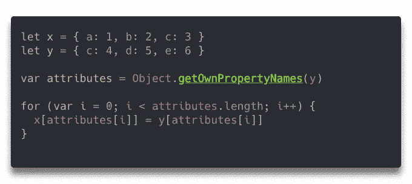

Object.getOwnPropertyNames()而不是 Object.keys()

# 使用扩展运算符组合对象

ECMAScript 6 (ES6)中发布了[扩展语法](https://developer.mozilla.org/en-US/docs/Web/JavaScript/Reference/Operators/Spread_syntax)。它并不是专门为合并对象而设计的，但是它允许一种类似于`Object.assign()`的独特技术。

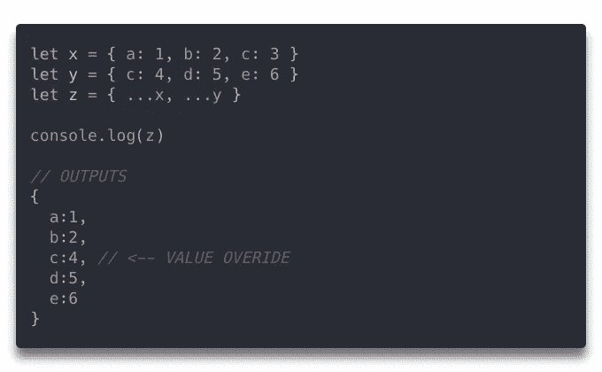

使用扩展运算符组合对象

这种方法和`Object.assign()`的结果没有区别。

## 什么时候应该使用扩展运算符来合并对象？

使用 spread 操作符通常不是组合数据对象的首选，但是如果合适的话，可以在边缘情况下使用。

尽量不要仅仅因为语法可能更讨人喜欢就使用它。这是可行的，但是这种方法并不常见。即使是一些不每天使用 JavaScript 的有经验的开发人员，也可能不熟悉 spread 语法。一些有经验的开发人员如果不是每天都使用 JavaScript，可能甚至不熟悉`Object.assign()`，但是辨别它是一个方法要容易得多。问问你自己谷歌三个点(`…`)及其含义有多容易——尤其是如果你不知道 JavaScript 已经传播了运算符。

## 深度融合

`Object.assign()`和 spread 算子都是浅层合并技术。浅层合并仅在对象的第一级组合属性。深度合并在第一级合并对象，但也合并嵌套的属性和对象。

没有一种便捷的方法可以用普通 JavaScript 执行深度合并。有实现深度合并的库。根据作者的经验，深度合并的需求并不常见。通常，当更简单的技术能够提供足够的能力时，就没有必要在代码库中包含深度合并库。

# 结论

本指南介绍了组合 JavaScript 对象的基本方法。在 JavaScript 对象中处理数据可能很简单。对于高级数据结构，它也可能很复杂。这两种任务都有工具。

组合 JavaScript 数据对象非常简单。不过，数据对象并不是 JavaScript 中唯一的对象类型。

JavaScript 语言本身使用[原型继承](https://javascript.info/prototype-inheritance)。用非常简单/粗糙的术语来说，这意味着一切都是对象。每个对象都有一个不可枚举的`[[Prototype]]` ( `__proto__`)属性，暴露了 JavaScript 对象的许多内部工作方式。描述原型继承超出了本文的范围，但是值得一试。为什么？这些技术可以用来合并任何 JavaScript 对象——不仅仅是数据。

*本文基于一个原创* [*Quora 答案*](https://www.quora.com/How-can-I-add-two-JSON-objects-into-one-object-JavaScript/answer/Corey-Butler?ch=10&share=17fbc95f&srid=u6k0) *。*