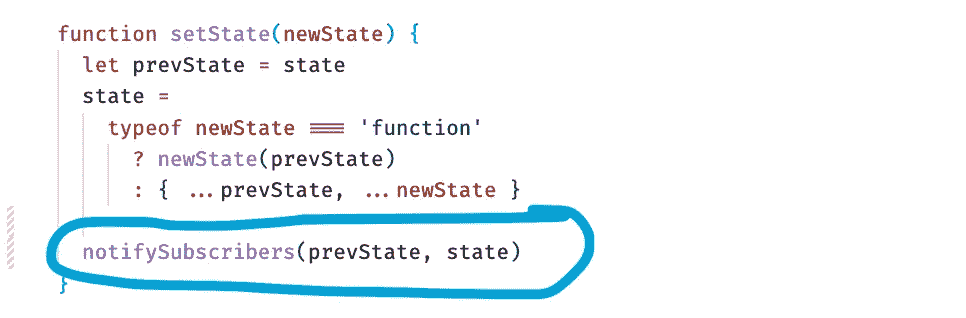
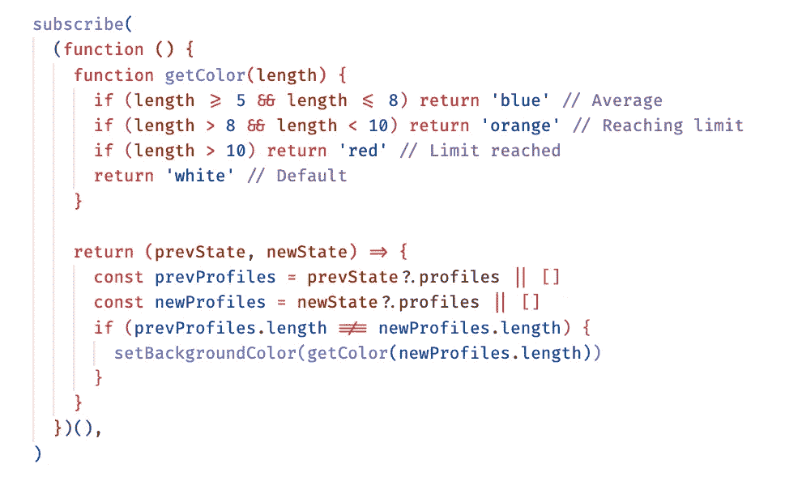
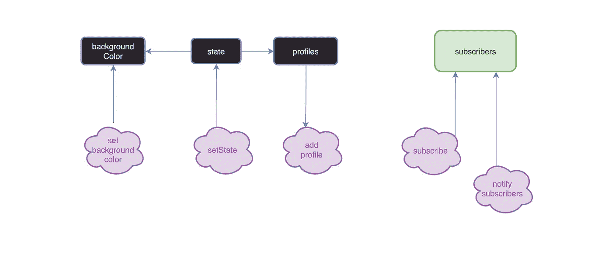
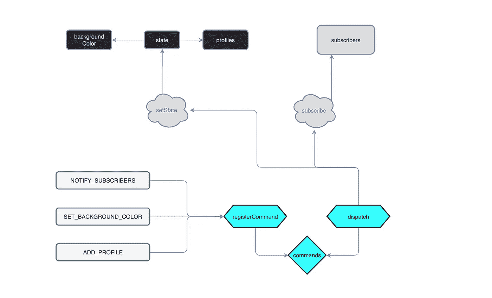
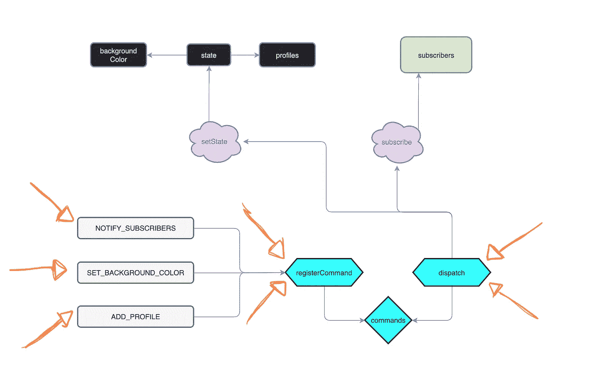

# JavaScript 中命令模式和状态模式的结合

> 原文：<https://betterprogramming.pub/combining-the-command-pattern-with-state-pattern-in-javascript-3cccde7869e3>

## 命令化


*米哈伊尔·尼洛夫拍摄的照片*

JavaScript 是一种以灵活性著称的流行语言。由于这一点，它使得像命令模式这样的模式更容易在我们的应用程序中实现。

当设计模式与状态模式很好地结合在一起时，它可以说是命令模式。

如果你读过我以前的一篇关于状态模式的博文，你可能会记得这句话:“状态模式确保一个对象根据应用程序的当前“状态”以一种可预测的、协调的方式运行。”

在命令模式中，主要目标是分离两个重要参与者之间的通信:

1.  发起者(也称为调用者)
2.  负责人

在这篇文章中，我们将结合命令模式和状态模式。如果您正在学习这两种模式中的任何一种，我对您的最佳建议是，在继续学习命令模式实现之前，确保您理解了状态模式的流程，以便更好地了解代码行为如何在功能保持不变的情况下发生巨大变化。

让我们从一个使用状态模式的例子开始，以便更清楚地了解这一点。代码如下:

在上面的例子中，我们有一个`state`和`subscribers`对象。`subscribers`对象保存了一个回调函数的集合。每当调用`setState`函数时，就会调用这些回调函数。看起来是这样的:



每次状态更新时，所有注册的回调都使用参数中的前一状态(`prevState`)和新状态(`newState`)来调用。

我们注册了一个回调监听器，这样每当概要文件的数量达到某个特定值`length`时，我们就可以观察状态的更新并更新背景颜色。下表显示了用相关颜色排列配置文件计数的清晰图片:

`Minimum ThresholdBackground Color0white5blue9orange10red`



*注意:这里的代码取自前面的代码块*

```
subscribe(
  (function () {
    function getColor(length) {
      if (length >= 5 && length <= 8) return 'blue' // Average
      if (length > 8 && length < 10) return 'orange' // Reaching limit
      if (length > 10) return 'red' // Limit reached
      return 'white' // Default
    }

    return (prevState, newState) => {
      const prevProfiles = prevState?.profiles || []
      const newProfiles = newState?.profiles || []
      if (prevProfiles.length !== newProfiles.length) {
        setBackgroundColor(getColor(newProfiles.length))
      }
    }
  })(),
)
```

那么，命令模式如何适应这种情况呢？如果我们回头看看我们的代码，我们可以看到我们定义了一些负责调用和处理这个逻辑的函数。看起来是这样的:

我们可以将这些抽象成命令。接下来的代码示例将展示相同的代码，其中命令模式与状态模式协调实现。当我们这样做时，只有两个函数没有被修改:`setState`和`subscribe`。

让我们继续介绍命令模式，并将我们的抽象函数命令化如下:

现在更清楚地确定我们需要哪些函数来更新状态。我们可以将所有其他内容分离到它们单独的命令处理程序中。这样，我们可以将它们隔离在单独的文件或位置中，以便更容易地使用它们。

下面是我们的更新示例中演示的实现这一点的步骤:

1.  创建`commands`变量。这将存储已注册的命令及其回调处理程序。
2.  定义`registerCommand`。这将向`commands`对象注册新命令及其回调处理程序。
3.  定义`dispatch`。这负责调用与其命令相关联的回调处理程序。

通过这三个步骤，我们完美地设置了要由客户端代码注册的命令，允许它们实现自己的命令和逻辑。注意我们的`registerCommand`和`dispatch`函数不需要知道任何与我们的状态对象相关的事情。

我们可以很容易地利用这一点，继续将它们隔离到一个单独的文件中:

`commands.js`

至于这些行中写的实际逻辑，看起来是这样的:

通常，这将全部留给客户端代码来决定(从技术上讲，我们的最后一个代码片段代表客户端代码)。一些库作者也定义了他们自己的命令处理程序供内部使用，但是同样的概念也适用。

我经常看到的一种做法是将它们的内部逻辑放在一个单独的文件中，文件名以`"internal"`为前缀(例如:`internalCommands.ts`)。值得注意的是，在 99%的情况下，这些文件中的函数永远不会导出给用户。这就是为什么他们被标记为内部。

下图是我们的代码在实现命令设计模式之前的样子:



紫色的泡泡代表函数。其中包括两个功能`setBackgroundColor`和`addProfile`。然而，特别是对于这两个，直接调用`setState`来促进状态的改变。换句话说，他们调用并处理他们感兴趣的特定状态片段的状态更新逻辑。

现在看看下面的图表。这幅图展示了我们的代码在实现模式后的样子:



功能`notifySubscribers`、`addProfile`和`setBackgroundColor`消失了，但是它们的所有逻辑都保留了下来。它们现在被写成命令处理程序:



命令处理程序单独定义它们的逻辑并被注册。一旦它们被注册，它们就被“搁置”，直到被`dispatch`函数调用。

最终，代码功能保持不变，只有行为发生了变化。

# 谁使用这种方法？

我脑海中立即浮现的一个例子是脸书[的](https://github.com/facebook/lexical/blob/main/packages/lexical/src/LexicalCommands.ts)[词汇](https://github.com/facebook/lexical)包。Lexical 是一个“强调可靠性、可访问性和性能的可扩展 JavaScript web 文本编辑器框架。”

在词法上，编辑器的命令可以[注册](https://github.com/facebook/lexical/blob/main/packages/lexical/src/LexicalEditor.ts#L584)并可供使用。处理逻辑是在它们被注册时定义的，因此它们可以被识别用于`dispatch`调用。

# 结论

我希望你觉得这很有价值。以后多多关照！