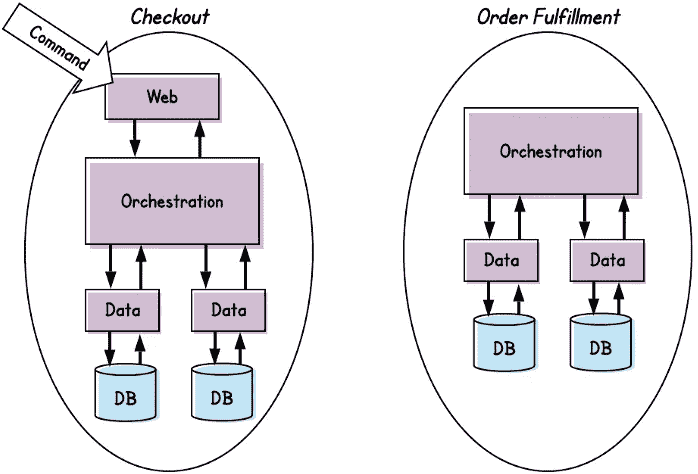
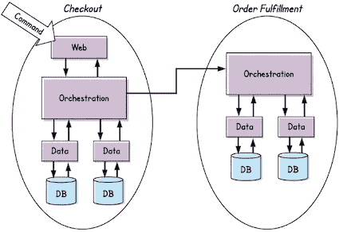
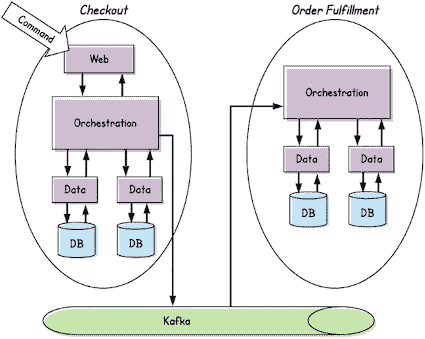
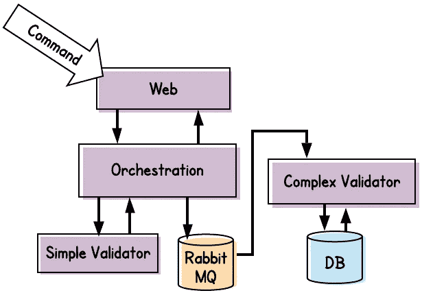
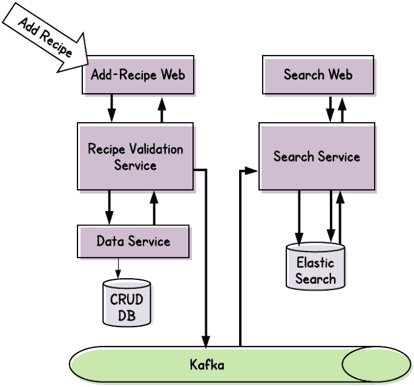

# 分布式系统中的命令和事件

> 原文：<https://betterprogramming.pub/commands-and-events-in-a-distributed-system-282ea5918c49>

## 了解这两者之间的区别会使微服务的设计变得更加容易

在 [Unsplash](https://unsplash.com?utm_source=medium&utm_medium=referral) 上由 [Bankim Desai](https://unsplash.com/@rochangraphics?utm_source=medium&utm_medium=referral) 拍摄的照片

当我们在分布式系统中构建组件时，我们会发现自己被看似独特的用例轰炸。每个问题看起来都像是一个新问题，需要单独分析和讨论才能解决。

实际上，我们将遇到的大多数用例都属于一些常见的模式。我们不应该一遍又一遍地发明轮子，而应该努力制定指导方针或[经验法则](https://en.wikipedia.org/wiki/Rule_of_thumb)，帮助我们做出快速、一致的决定。

事实上，尽管分布式系统设计可能很复杂，但它们可以归结为一些基本概念。一个重要的概念是*命令*和*事件*之间的区别。几乎所有单个微服务之间的交互都涉及其中一个。如果我们能够认识到一个给定的用例是涉及命令处理还是事件处理，我们就已经在通往一个与我们系统的其余部分一致的可靠设计的路上了。

说完了，我们再来看看两者的区别。

# 命令

照片由[西达尔特·辛格](https://unsplash.com/@spsneo?utm_source=medium&utm_medium=referral)在 [Unsplash](https://unsplash.com?utm_source=medium&utm_medium=referral) 上拍摄

命令是我们作为软件工程师首先要处理的事情。从我们的第一个 *Hello World* 例子到我们的第一个由单一数据库支持的单一网站，我们一直在不知不觉中处理命令。

但是它们是什么呢？

**命令**是个人或其他实体希望执行的动作。重要的是，这个动作*还没有发生*。未来可能会发生，也可能根本不会发生。

我们来看几个例子。事实上，暂时忘掉编程吧。相反，我将描述一个在我家的典型互动。该吃晚饭了，但是我的儿子正在和他的朋友玩在线电子游戏。所以我发出一个命令:“关掉视频游戏，这样你就可以来吃晚饭了。”

一般来说，会发生两件事:

*   我的命令可能会成功。我儿子和他的朋友们道别，退出游戏，和我们一起吃饭。
*   我的命令可能会失败。我儿子假装没听见我说话，拒绝离开游戏。

现在让我们考虑一个典型的软件例子。一位客户访问了一个在线购物网站，并选择了一些要购买的商品。为了完成购买，他们在网站的结帐表单中输入一些信息，然后单击“完成购买”按钮。

同样，可能会发生两件事:

*   **指挥可能成功。**购买数据被提交到数据库，客户收到一个响应，表明他们的订单正在发送中。
*   **命令可能会失败。**这可能是由多种原因造成的。帐单信息可能不正确，送货地址可能不完整，购物车中的商品可能缺货，或者后端可能出现技术问题。

当然，为了到达结帐页面，许多其他命令已经成功了。甚至像点击链接查看产品细节这样简单的事情也代表一个命令。

# 事件

塞缪尔·佩雷拉在 [Unsplash](https://unsplash.com?utm_source=medium&utm_medium=referral) 上的照片

正如我们刚刚讨论过的，命令代表一个人或代理人*希望执行的动作*。 ***事件*** 是*已经成功完成*的动作。

通常，当一个命令成功时，结果是在某个持久数据存储中写入一条记录。通常，这意味着提交了一个数据库事务，或者仅仅意味着将一个文件保存到文件系统中。

以我们规范的 *Hello World* web 应用程序为例，我们用一个简单的 HTTP 响应来响应浏览器请求。在这种情况下，我们可能专注于命令——接收 GET 请求——并执行它。但是一旦请求被满足，它就成了一个事件。此外，该事件可能被记录在 web 服务器的日志中。

因此，您可以将事件视为命令的镜像。或者你可以把命令想象成毛虫，把事件想象成蝴蝶。底线是一个动作开始是一个命令。一旦成功，就成了事件。

# 命令和事件之间的区别

所以，我们收到的请求开始是命令，然后变成事件。有什么大不了的？

事实证明，这对于我们应该如何处理每一个问题都有很多影响。

## 命令可以改变，但事件不会改变

正如我们已经讨论过的，命令可能会失败。

这可能是由于技术问题导致的，在这种情况下，重新提交相同的命令可能会成功。

或者，它可能会因为数据验证错误而失败。在这种情况下，重新提交相同的命令将继续失败。但是，用户代理可以修改命令并重试。如果我们客户的订单因为信用卡号过期而被拒绝，客户可以输入一个不同的有效信用卡号并重新提交订单。

然而，一旦命令成功，就没有回头路了。结果事件已经发生，并且无法撤消。

再者，事件*是不可变的*。无论提交命令时命令处于什么状态，它都是事件的永久状态。

一旦网上顾客完成了购买，那么这个购买就变成了一个事件。从概念上讲，没有回到过去并否定它。当然，利用软件工程，任何事情都是可能的——我们可以简单地删除我们的事件记录。但是有很多原因让我们不应该这样做:

*   无论我们是否删除自己的记录，该事件仍将在现实中发生。我们的记录应该代表现实。
*   其他实体很可能会有相同事件的记录。当然，顾客会知道他们刚刚买了东西。此外，我们可能已经联系了客户的信用卡公司，或运输公司，或我们的仓库…所有这些现在都有事件的记录。

这并不是说购买不能取消。我们的客户可能会在别处找到更好的价格，或者决定不再需要该产品。这很好，但是取消需要一个单独的后续命令。一旦该命令成功，它也将成为一个单独的后续事件。

## 命令是无序的，事件是有序的

上面，我们注意到取消事件将是购买事件的之后的*。这很重要。我们的系统可以以任意顺序发出和处理命令。但是一旦它们成功了——一旦它们变成了事件——那么它们的顺序是不可改变的。*

维护这种顺序与维护每个事件本身的不变性一样重要。否则，我们的事件处理服务可能会以不正确或损坏的数据告终。想象一下，例如，一个服务试图在能够处理最初的*下单*事件之前处理一个*订单取消*事件。

## 可以拒绝命令，但不能拒绝事件

如果命令包含坏的或无效的数据，处理命令的服务通常会决定拒绝这些命令。此外，虽然不理想，但如果由于技术故障导致命令失败，也不是世界末日。

然而，事件处理服务*必须*处理发生的每个事件。它不能以任何理由拒绝或放弃这些事件。

这是为什么呢？回想一下，命令代表尚未发生的事情。如果某个命令由于某种原因失败了，那么所有相关的方面——我们的客户、我们自己的系统、任何下游系统——都会同意，嗯，什么也没发生。由于我们的用户代理将被告知失败，他们可以决定如何继续(例如，放弃，再试一次，等等)。

另一方面，事件代表已经发生的事情。就我们的用户代理而言，他们的请求是成功的。因此，如果我们是一个处理事件的服务，我们不能简单地决定拒绝一些事件。否则，我们的数据将在整个组织中处于永久不一致的状态。

或者举一个具体的例子，想象一下我们那些不开心的顾客成功地进行了网上购物…但是从来没有收到他们的货物。

这意味着数据验证是命令处理程序而不是事件处理程序的工作。此外，虽然我们可以容忍由于技术问题而偶尔失去指挥，但我们的事件处理服务能够承受中断以确保没有事件丢失是至关重要的。

## 现在命令，以后事件

所以，我们处理命令的方式和处理事件的方式是完全不同的。事实上，如果你没有从这篇文章中学到任何东西，请遵循下面的经验法则:

*   我们负责的*我们*流程*命令*；此外，我们立即处理它们*，直到它们成功或失败。*
*   **其他人*稍后处理由我们的命令产生的*事件*；此外，他们应该确保每个事件最终都得到处理，不管需要多长时间。*

# *分布式系统中的命令和事件*

*接下来，让我们探索一下在分布式系统中处理命令和事件是什么样子的。为了理解，让我们简要讨论一个重要的设计模式，[有界上下文](https://medium.com/datadriveninvestor/if-youre-building-microservices-you-need-to-understand-what-a-bounded-context-is-30cbe51d5085)。*

## *有界上下文*

*[有界上下文](https://medium.com/datadriveninvestor/if-youre-building-microservices-you-need-to-understand-what-a-bounded-context-is-30cbe51d5085)是一种源自 Eric Evans 的“[域驱动设计](https://domainlanguage.com/ddd/)的模式，通过使用这种模式，我们可以更加智能地设计我们的微服务以及拥有它们的各个团队。*

*假设我们运行一个典型的零售网站。毫无疑问，我们需要一些方便网上购物的服务。为此，我们可以形成一个`Checkout`有界上下文，包括:*

*   *一个**团队**——前端和后端工程师、设计师、产品经理、数据库管理员等——他们将负责构建和维护结账体验*
*   *团队将构建的**服务**、**应用**和**基础设施***

*最有可能的是，一旦订单成功下达，这个团队对实际履行订单一无所知。为此，我们将有一个`Order Fulfillment`有界的上下文，它本身将由它自己的团队，加上服务/应用/基础设施组成。*

**

*在这里，每个有界上下文中到底发生了什么并不重要。我们关心的是**订单执行**如何了解**收银台**内发生的事情。*

## *命令和事件如何与有界上下文相关联？*

*我们的`Checkout`有界上下文负责验证和处理在线订单命令。一旦一个命令完成，`Checkout`的工作也就完成了。当然，任何成功的订单都必须完成，但这不是`Checkout`的责任。*

*相反，我们的`Order Fulfillment`有界上下文将负责完成订单。但是，首先如何让它知道顺序呢？*

*我们第一个天真的答案可能是，`Checkout`将调用一个端点——比方说，通过发送到托管在`Order Fulfillment`中的 ReST URL。*

*实际上，这种方法存在一些不同的问题:*

*   *它将结账流程与订单执行流程结合起来。 `Checkout`的工作是处理和提交订单。但是，在要求它进行 POST 调用时，它现在还负责启动履行过程。调用`Order Fulfillment`失败怎么办？之前被认为成功的`order`命令现在突然失败了吗？实际上，我们将把由`Checkout`处理的命令与由`Checkout`启动的第二个命令链接起来。*
*   ***它要求** `Checkout` **知道所有其他对检验事件感兴趣的有界上下文**。团队需要编写和维护调用`Order Fulfillment`的代码。每当一个新的有界上下文(比如，`Inventory`或`Analytics`)对顺序事件感兴趣时，它们也需要这样做。*
*   *它可能是**性能瓶颈和级联故障**的开始。作为处理在线订单的一部分，`Checkout`将对其他有边界的上下文进行同步调用，而这些上下文又可能调用额外的资源。即使在最好的情况下，这种激增的呼叫也会消耗响应时间。任何失败都会对`Checkout`过程造成严重破坏。*

**

*不是最好的方法*

*嗯，也许`Checkout`可以通过异步调用`Order Fulfillment`来缓解这些问题，也许引入一个重试机制以防第一次调用`Order Fulfillment`失败。*

*这实际上让我们朝着正确的方向前进。但是还有更好的方法。`Checkout`只需要使命令的结果——结果事件——对任何其他感兴趣的有界上下文可用。*

*换句话说，`Checkout`应该简单地将每个成功的命令发布为一个事件。*

*然后，`Order Fulfillment`——以及任何其他需要响应已完成订单的有界上下文——可以订阅这些事件，并在它们到达时使用它们。*

## *事件是如何发布和消费的？*

*如今，我们一般会将事件发布到所谓的事件总线，如[卡夫卡](https://levelup.gitconnected.com/kafka-for-engineers-975feaea6067)。*

**

*较好的*

*还有很多其他的[文章探索卡夫卡的细节](https://levelup.gitconnected.com/kafka-for-engineers-975feaea6067)——我们在这里不做了。但从本质上来说，Kafka 是一个数据存储库，它可以分为*个主题*(在我们的例子中，`online-orders`可能被认为是一个主题)。单个服务(发布者)将发布事件(表示为 Kafka 主题上的消息)到单个主题。消息只是一个自包含的数据结构，它符合预定义的模式(可能是通过 JSON 定义的，或者更好的是像 [Avro](https://www.confluent.io/blog/avro-kafka-data/) 这样的二进制格式)，并提供事件的相关细节。*

*然后，任意数量的其他服务(`consumers`)可以订阅该主题来消费这些消息。*

*此外，通过使用像 Kafka 这样的事件总线，我们可以确定:*

*   *每个订阅者将按照消息产生的顺序消费消息(假设我们对设计进行了深思熟虑，并且配置正确)。这是至关重要的——记住——我们不想在处理原始的`order-placed`事件之前处理一个`order-canceled`事件！*
*   *每个消费者都将收到发布到该主题的所有消息*
*   *如果使用者暂时停机，或者在处理消息时遇到临时问题，那么将重试向该服务传递消息。事实上，每个消费者管理自己的偏移量，该偏移量跟踪它成功消费的最后一条消息。与同步调用(需要在很短的时间内放弃重试)不同，如果需要，消息传递可以重试几个小时或几天。*
*   *我们可以安全地扩展每个消费者的实例数量。*

*最重要的是，它确保一个有界上下文可以专注于处理它所负责的命令，然后快速将相应的事件交给其他感兴趣的有界上下文。*

# *命令、事件、耦合和(A)同步性*

*这让我们想到了一个在构建微服务时经常被问到的问题:我们的服务何时应该同步*通信*以及何时应该异步*通信*？*

*为了回答这个问题，让我们重温一下我们之前提到的经验法则。我们想立即处理我们负责的*命令*，直到它们完成(或失败)。*在*之后的某个时候，其他人会处理由此产生的*事件*。*

*所以我们问自己:我们的用例是用来处理一个*命令*，还是用来通知其他服务一个*事件*已经发生？很有可能，**如果我们正在处理一个命令，我们希望同步进行**。代理可以发出请求并等待响应；当它被返回时，命令将已经完成(或者它将已经失败)。*

*然而，如果我们正在处理一个事件，一般不会有人等着我们完成。此外，我们不希望任何人来服侍我们。相反，我们希望按照自己的步调处理事件，必要时重试。所以通常**我们会异步发布和处理事件**。*

*因此，根据经验，我们可以说:*

*   **命令*和*同步*通信，以及*
*   **事件*和*异步*通信*

*这条规则有例外吗？当然可以。*

*例如，我们有时需要做很多工作才能提交命令。通常，我们需要验证命令的一部分，反过来，这可能意味着对其他系统的昂贵调用——有时是我们组织内部的系统，有时是第三方系统。*

*现在，大多数用户习惯于在网上购物时等待一段时间。但是在某些情况下，预期的等待可能会长得不合理。*

*在这些情况下，我们可以异步地将请求的一部分交给另一个组件。例如，我们可以提前进行快速检查，这将捕捉到一定比例的可能失败。然后，我们将消息发送到消息队列，比如 RabbitMQ。一旦我们发布了消息，我们将能够立即向用户代理返回响应。*

*与此同时，我们的另一个组件——它将订阅 rabbit MQ——将从我们停止的地方继续，并完成命令的处理。*

**

***注意**:我们应该谨慎使用这种技术，因为它打破了用户代理获得订单即时反馈的观念。我们需要决定——从 UI 的角度来看——如何让客户知道他们订单的状态。*

*在这个场景中，我们将以异步方式处理命令。所以我们可能会问:异步处理一个命令和发布一个事件一样吗？*

*其实两者是有本质区别的。这与耦合有关。*

## *命令涉及耦合组件*

*处理命令所涉及的组件都是紧密耦合的。当我们同步处理所有事情时是这样，当我们添加异步消息传递时也是这样。当我们将消息发布到 RabbitMQ 时，我们期望它被另一端的*确切地说是一个*组件消费和处理。事实上，十有八九，我们已经自己编写并维护了那个组件。*

*事实上，这就是为什么我们通常使用 RabbitMQ 这样的消息队列——它更适合点对点通信——来异步处理命令。*

*相比之下，当我们发布一个事件时，我们(理论上)不知道谁会消费这个消息。也许只有一个消费者订阅。也许不会有。也许会有一百个。关键是，我们的生产者和任何潜在的消费者是分离的。*

*所以我们可以这样修改我们的经验法则:*

*   *处理命令是在耦合的组件之间执行的，理想地但不总是通过同步通信。*
*   *发布和消费事件是跨解耦的组件执行的，几乎总是通过异步通信。*

# *事件问题*

*我们之前提到过，我们可能习惯于处理命令，但可能不太习惯于处理事件。因此，我们将以开始产生和处理事件时出现的一些常见问题来结束本文。*

## *我们应该什么时候发出事件？*

*此时，我们可能会想:我们应该何时发布事件？我们已经说过，事件是某些任务完成的结果。那意味着任何任务吗？无论我们的服务做了什么，它都应该发布一个相应的事件？*

*我们可以从商业角度来回答这个问题。我们是否刚刚执行了一项具有某些*商业重要性*的任务？如果是这样的话，那么很有可能有其他系统想要了解它。在这种情况下，我们应该发布一个事件。否则，我们可能不需要麻烦。*

*我之前工作过的一家公司将发布的事件称为“BizOps”(商业运作的简称)。这个名字意在巩固我们希望发布对业务有一定意义的事件的想法。*

*请注意，一些组织可能也对失败的命令感兴趣。例如，这对于分析或审计目的可能很重要。所以我们将命令*失败*作为事件发布是很合理的。*

*还要注意，一个事件的处理可能会引入另一个具有业务重要性的事件。所以事件*消费者*通常会以*产生自己的*事件而告终。在我们之前的例子中，我们的*订单执行*有界上下文仅基于事件消费进行操作——它从不接收要处理的命令。然而，我们可以相当肯定的是，我们组织的其他部分可能希望在订单完成时得到通知。*

## *我们能消费自己的事件吗？*

*之前，我们说过我们为其他人消费*产生事件。但是我们也可以消费*自己的*事件。**

*我们为什么要这么做？让我们举一个新的例子来说明。想象一下，我们公司提供一个网站，允许用户发布他们最喜欢的食谱，和/或浏览要制作的食谱。处理这些活动的服务归我们的*配方清单*有界上下文所有。*

*在*食谱清单*中，我们有一个数据微服务，由 CRUD 数据库支持，允许用户提交他们的食谱。然而，为了支持浏览食谱，我们将在更优化的搜索基础上构建一个服务(比如弹性搜索)。*

*当顾客添加新的食谱时，他们显然是在发出命令。我们希望验证他们的提交并将其保存到 CRUD 数据库中。*

*我们还希望我们的搜索服务知道新的食谱。但是怎么做呢？*

*由于我们拥有这两个服务，我们的第一个想法可能是从数据微服务向搜索服务发布一个帖子。然而，出于我们已经讨论过的所有原因，我们最好发布“add-recipe”事件，然后订阅我们的搜索服务来使用这些事件，以便将新的食谱添加到搜索索引中。*

**

*消费我们自己的活动*

*当然，新配方不会立即出现在搜索索引中(这一特性被称为[最终一致性](https://en.wikipedia.org/wiki/Eventual_consistency))。然而实际上，用户几乎不会注意到延迟。此外，延迟通常以秒计，如果不是毫秒的话。*

## *我们如何处理来自第三方的事件？*

*在本文中，我们讨论了我们自己系统中的事件处理。然而，我们有时需要使用由不属于我们组织的第三方发布的事件。这可能会变得棘手，原因如下:*

*   *通常，我们不能简单地订阅第三方的 Kafka 集群，并像在内部那样使用消息。虽然出现了一些新兴的云解决方案，如 [Google Pub/Sub](https://cloud.google.com/pubsub/docs/overview) ，但这些解决方案并不适用于每一个用例。*
*   *我们希望验证从外部来源进入我们系统的任何数据。这可能与我们在自己的系统中处理事件的方式不一致。*

*跨组织发布事件的一个通用技术是 Webhooks。如果你不熟悉 Webhooks 的概念，这其实很简单。我们没有订阅 Kafka 主题，而是实现了一个 HTTP 端点。通常这只是意味着实现一个 POST 请求处理程序。端点将期待由第三方定义的格式的有效载荷。*

*一旦实现了端点，我们就向第三方注册端点的 URL(通常通过一些带外机制，比如安全合作伙伴门户中的一个表单)。现在，每当第三方内部发生事件时，就会向我们的端点发出相应的 POST 请求。*

*这个管用。但是我们倾向于像对待任何其他 HTTP POST 一样对待 Webhook 请求；也就是随着*命令*。实际上，第三方最有可能通知我们已经发生了一个*事件*，因此，我们会想尽一切办法对该事件做出响应。*

*除了……这与我们验证系统输入的需求相冲突。此外，这与一个简单的事实不一致，即 HTTP 请求处理程序的暂时中断意味着我们有错过事件的风险。*

*为了正确实施这样的解决方案，我们必须确保以下几点:*

*   *如果我们的端点不可用——或者如果它返回一个 *5xx* 响应——第三方有一个健壮的重试机制来确保我们的系统将最终消费该事件。*
*   *我们会尽快进行数据验证。这样，我们可以立即返回一个 *4xx* ( *错误请求*)响应，或者将消息保存在我们的系统中(可能保存在我们自己的 Kafka 主题中)以确保我们不会丢失它。*
*   *我们的第三方有一个机制来处理我们返回的任何 *4xx* ( *错误请求*)响应，这样消息可以被修复并重新发布，供我们以后使用。*

# *摘要*

*几乎我们在微服务架构中构建的每个服务都将涉及处理*命令*或*事件*。这两个概念有根本的区别。*

*理解这些差异将有助于我们在常见用例出现时识别它们，这反过来将使我们更容易设计更一致、功能更强的系统。*

*觉得这个故事有用？想多读点？只需[在这里订阅](https://dt-23597.medium.com/subscribe)就可以将我的最新故事直接发送到你的收件箱。*

*你也可以支持我和我的写作——并获得无限数量的故事——通过今天成为媒体会员。*