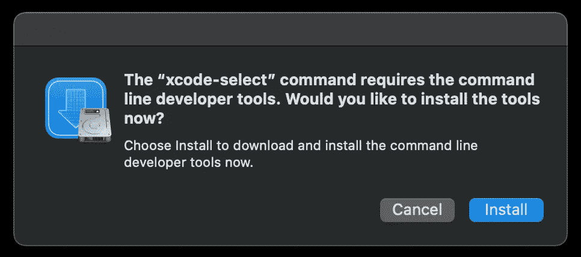

# 6 个常见的 Git 错误以及如何避免它们

> 原文：<https://betterprogramming.pub/common-git-errors-2e379516dc65>

## 探究 Git 中一些最常见的错误


照片由 [Cookie 在](https://unsplash.com/@cookiethepom?utm_source=medium&utm_medium=referral) [Unsplash](https://unsplash.com?utm_source=medium&utm_medium=referral) 上的 Pom 拍摄

版本控制系统(VCS)是几乎所有需要跟踪源代码变更的开发团队的基本工具。

Git 早在 2005 年就被开发出来了，现在是最常用的 VCS，几乎所有需要对源代码进行版本化和归档的开发团队都在使用它。在今天的文章中，我们将介绍一些最常见的 Git 错误，并讨论如何避免或修复它们。

# 致命错误:不是 git 存储库(或任何父目录)

这是最常见的错误之一，尤其是对于 Git 新手来说。让我们假设您想要在一个特定的目录中运行`git status`:

```
$ git status
fatal: not a git repository (or any of the parent directories): .git
```

该错误表明该命令无法执行，因为当前目录**不是 Git 目录**。通常，有两个主要原因会导致您出现错误。

*   您可能忘记使用`[git init](https://git-scm.com/docs/git-init)`将存储库初始化为 Git 存储库
*   或者你可能在错误的目录。您可以使用`pwd`查看您当前的工作目录。人们在克隆 Git 存储库时忘记更改目录是很常见的。

# 致命:拒绝合并不相关的历史

在`git pull`或`git merge`之后的另一个非常常见的错误如下所示:

```
fatal: refusing to merge unrelated histories
```

这通常主要有两个原因:

*   `.git`目录损坏。这个隐藏的目录包含了与您的项目相关的信息，这些项目是受版本控制的(例如，关于提交、远程存储库等的信息。).如果目录被破坏，git 不知道本地历史，因此当尝试向/从远程存储库推送或提取时，将会报告错误。
*   您正在尝试从已经提交的远程存储库中进行拉取，同时您还在本地创建了一个新的存储库并添加了提交。在这种情况下，将会报告错误，因为 Git 不知道这两个项目是如何关联的(它们被解释为两个不同的项目)。

如果是这种情况，那么您需要提供`[--allow-unrelated-histories](https://github.com/git/git/blob/master/Documentation/RelNotes/2.9.0.txt#L58-L68)`标志。举个例子，

```
$ git pull origin master --allow-unrelated-histories
```

当试图`rebase`时也有可能得到这个错误，并且需要不同的处理。

```
$ git rebase origin/development
fatal: refusing to merge unrelated histories
Error redoing merge 1234deadbeef1234deadbeef
```

将提交组合成新的基础提交的过程被称为[](https://www.atlassian.com/git/tutorials/rewriting-history/git-rebase#:~:text=What%20is%20git%20rebase%3F,of%20a%20feature%20branching%20workflow.)**。换句话说，重定基础只是将分支的基础更改为一个不同的提交，这样看起来好像是从那个特定的提交创建的分支。下图准确地说明了在 Git 中重置基础的工作方式。**

****

**来源:[亚特兰蒂斯文件](https://www.atlassian.com/git/tutorials/rewriting-history/git-rebase#:~:text=What%20is%20git%20rebase%3F,of%20a%20feature%20branching%20workflow.)**

**当`git rebase`因该错误而失败时**重置基础不会中止，但仍在进行中。**相反，你其实可以手动干预。**

```
$ git status
interactive rebase in progress; onto 4321beefdead
Last command done (1 command done):
   pick 1234deadbeef1234deadbeef test merge commit
```

**要解决这个问题，你首先需要`merge`和`commit`，最后迫使`rebase`继续:**

```
$ git merge --allow-unrelated ORIGINAL_BRANCH_THAT_WAS_MERGED --no-commit
$ git commit -C ORIGINAL_MERGE_COMMIT
$ git rebase --continue
```

# **xcrun:错误:无效的活动开发者路径**

**这是 OSX 用户的一个常见错误，当一个新的主要 OSX 版本发布时，这个错误会更加频繁。当您尝试运行任何 git 命令时，都会报告该错误。举个例子，**

```
$ git status
xcrun: error: invalid active developer path (/Library/Developer/CommandLineTools), missing xcrun at: /Library/Developer/CommandLineTools/usr/bin/xcrun
```

**该问题与需要更新的 [Xcode 命令行工具](https://developer.apple.com/xcode/features/)版本有关，以便解决该错误。为此，请打开终端并运行**

```
$ xcode-select --install
```

**对此的回应应该是**

```
xcode-select: note: install requested for command line developer tools
```

**同时屏幕上会出现一个弹出窗口，要求您确认是否要安装命令行开发工具。**

****

**只需点击安装，等待安装完成，并打开一个新的终端会话。Git 命令现在应该可以正常工作了。**

# **致命错误:无法创建。' git/index.lock ':文件存在**

**当 git 进程在您的一个 git 存储库中崩溃时，您可能会在尝试运行 Git 命令时看到如下所示的错误:**

```
fatal: Unable to create '/path/to/.git/index.lock': File exists.

If no other git process is currently running, this probably means a git process crashed in this repository earlier. 
```

**如果没有其他 git 进程正在运行，您可以通过手动删除该文件来快速修复这个问题:**

```
$ rm -f .git/index.lock
```

# **错误:pathspec 不匹配 git 已知的任何文件**

**通常，当您使用 GitHub 的 web UI 创建一个新分支，并返回到您的本地终端，使用**

```
$ git checkout mybranch
```

**您可能会得到这个错误**

```
error: pathspec 'mybranch' did not match any file(s) known to git.
```

**这通常意味着您的本地存储库没有更新远程 Git 存储库的最新信息。要解决这个问题，您只需获取新创建的分支的信息:**

```
$ git fetch
```

**现在`git checkout`应该工作正常。**

# **权限被拒绝(公钥)**

**为了将远程存储库克隆到您的本地机器，您需要确保您已经正确配置了身份验证。**

**如果您尝试克隆一个回购，而响应是**

```
$ git clone git@github.com/username:test.git
Initialized empty Git repository in `/path/to/test/.git/`
Permission denied (publickey).
fatal: The remote end hung up unexpectedly
```

**现在可能有几种方法可以解决这个问题。最简单的方法可能是使用`HTTPS`将存储库克隆到您的本地机器上，这不需要公钥验证:**

```
$ https://github.com/username/test.git
```

**或者，如果您仍然需要使用 SSH 来克隆存储库，那么您必须生成 SSH 公钥和私钥，以便配置正确的身份验证。为此，请确保遵循以下步骤。**

*   **导航到您本地的`.ssh`目录并运行`ssh-keygen`来生成密钥**

```
$ cd ~/.ssh && ssh-keygen
```

*   **现在你需要复制生成的`id_rsa.pub`文件的内容**

```
# OSX
$ cat id_rsa.pub | pbcopy# Linux
$ cat id_rsa.pub | xclip# Windows
$ cat id_rsa.pub | clip
```

*   **[将密钥添加到 GitHub 网站的相应部分](https://docs.github.com/en/github/authenticating-to-github/connecting-to-github-with-ssh/adding-a-new-ssh-key-to-your-github-account)**
*   **确保您的 git 配置是正确的**

```
$ git config --global user.name "your-user-name"
$ git config --glocabl user.email your@email.com
```

**现在，您应该能够使用 SSH 克隆远程存储库了。更多细节可以参考 [GitHub 文档](https://docs.github.com/en/github/authenticating-to-github/connecting-to-github-with-ssh)。**

# **最后的想法**

**在今天的文章中，我们探讨了 Git 中一些最常见的错误。对于其中的每一个，我们讨论了可能触发这些错误的潜在原因以及如何修复它们。**

**Git 绝对是一个非常强大的工具，并且比它有时看起来要复杂得多。这个社区很棒，互联网上有很多资源可以帮助你解决任何关于 Git 的问题。**

**您可能还喜欢:**

**[](https://towardsdatascience.com/undo-last-local-commit-git-5410a18f527) [## 如何撤销 Git 中的最后一次本地提交

### 了解如何在 Git 中撤销最近的本地提交

towardsdatascience.com](https://towardsdatascience.com/undo-last-local-commit-git-5410a18f527)**